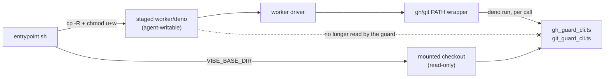

## Summary

The `gh` and `git` PATH wrappers spawn a fresh guard child on every call, so the
guard entry point is **re-read from disk each time**. It was resolved against
`import.meta.url` — the staged worker copy `container/entrypoint.sh` marks
writable so the next launch's `rm -rf` can replace it (Issue #514) — and that
write bit belongs to `vibe`, the uid the coding agent runs as with unrestricted
Bash. The write-repo allowlist, the reserved-label denylist, the issue-lifecycle
refusal, the credential-disclosure guard and body redaction all re-enter through
that module, so the constrained party could rewrite its own boundary mid-launch.

Both entry points now resolve through `worker/deno/lib/guard_module_path.ts`,
which names the checkout the launcher mounted read-only (`VIBE_BASE_DIR`) — the
same precedent `PROMPTS_DIR` already sets in that block of the entrypoint. The
driver keeps the fast staged copy; the guard does not. `chmod -R u+w` on the
staged tree is untouched, so #514 still holds.

It fails closed rather than degrading: a named checkout that does not carry the
module, or a `VIBE_BASE_DIR` that cannot be read, makes `installGhGuardShim`
return the same `blocked` verdict every other uninstallable-shim fault takes,
warned and journalled. With `VIBE_BASE_DIR` unset nothing was staged and the
running copy _is_ the checkout copy, so host runs are unaffected.

Closes #1444.



## Evidence

Backend/CLI only — no web interface to screenshot. The evidence is the test run:
the regression tests below plant a distinct, always-refusing guard module in a
fake read-only checkout and assert the wrapper executes **that** module (its
marker on stderr, non-zero exit, the real `gh`/`git` never invoked). They fail
against the unfixed resolution, which executed the running copy and let the
command through.

```
$ deno test --allow-all tests/guard_module_path_test.ts
gh-guard-shim - executes the checkout guard, not the writable staged copy ... FAILED
git-guard-shim - executes the checkout guard, not the writable staged copy ... FAILED   # before the fix
...
ok | 12 passed | 0 failed   # after the fix
```

`./quality.sh` passed in full after the final edit (18 checks;
`config
integration` skipped by the gate itself, as it is on every run without a
deployed config).

**Original trigger closed, no trivial bypass.** The trigger was: write to
`${LOCAL_SRC}/worker/deno/lib/gh_guard_cli.ts` (or `git_guard_cli.ts`) as
`vibe`, and the next `gh`/`git` call executes the rewritten module. The path
baked into the wrapper is now `${VIBE_BASE_DIR}/worker/deno/lib/<module>` on the
read-only mount, so that write no longer changes what runs. The nearby bypasses
are closed too: the path is resolved once in the worker process and written into
the wrapper as a shell-quoted literal, so the agent cannot steer it at call
time; `VIBE_BASE_DIR` is read in the worker, not by the wrapper, so exporting it
in the agent's shell changes nothing; and making the checkout copy unreachable
does not silently fall back to the writable one — the install is refused. The
module name is validated as a bare `*.ts` file name, so no traversal can reach
outside `worker/deno/lib`. What remains is the residual risk already recorded in
SECURITY.md §6a: an agent that invokes the real binary by absolute path or edits
`PATH` bypasses the wrapper entirely — this change does not widen or narrow
that.

A further bypass is closed since the first review: `VIBE_BASE_DIR` must now be
an **absolute** path. The resolved path is baked into the wrapper verbatim and
the wrapper runs from the _agent's_ working directory, so a relative base dir
produced a guard path resolved against a directory the agent chooses and can
write to. The internal file name was validated against traversal; the one
externally-supplied input was not. It is now.

## Acceptance Criteria

<!-- vibe-spec-review inputs="diff+issue-body" -->

- **met** — the module the `gh`/`git` guard wrapper executes is not writable by
  the uid the coding agent runs as — evidence:
  `worker/deno/lib/guard_module_path.ts:111-167`, wired at
  `worker/deno/lib/gh_guard_shim.ts:485-501`; `container/entrypoint.sh:427`
  exports `VIBE_BASE_DIR`, and `worker/deno/lib/container_launch.ts:975` mounts
  that path `readOnly: true` — reviewer: met — reason: the reviewer confirmed
  the premise on a live container (`/proc/mounts` shows the checkout
  `virtiofs … ro`) but noted the code infers non-writability from the mount
  rather than probing it; see the `unrequested` note below on why a probe is not
  added here
- **met** — verified in the first direction: the wrapper still guards correctly
  — evidence:
  `worker/deno/tests/guard_module_path_test.ts::gh-guard-shim - the real guard still refuses an off-allowlist write from another checkout root`,
  plus the 28 `gh_guard_shim_test.ts` and 26 `git_guard_shim_test.ts` cases,
  which now pass under a deliberately hostile ambient `VIBE_BASE_DIR` —
  reviewer: met
- **met** — verified in the second direction: a write to the staged copy does
  not change what the guard executes — evidence:
  `worker/deno/tests/guard_module_path_test.ts::gh-guard-shim - executes the checkout guard, not the writable staged copy`
  and its `git` twin — reviewer: met — reason: the reviewer noted the converse
  form is tested (the checkout copy is proven to be the one executed) rather
  than mutating the running copy; the two are equivalent and nothing in the diff
  writes to the running copy
- **met** — the #514 property is kept: the staged tree stays writable so the
  next launch's `rm -rf` succeeds — evidence: `container/entrypoint.sh:412`
  `chmod -R u+w` untouched; the only entrypoint change is the added export —
  reviewer: met
- **met** — suggested direction 1, resolve
  `defaultGuardModulePath()`/`defaultGitGuardModulePath()` against `BASE_DIR` —
  evidence: `worker/deno/lib/gh_guard_shim.ts:248` and
  `worker/deno/lib/git_guard_shim.ts:78` both delegate to
  `resolveGuardModulePath` — reviewer: met
- **met** — the guard's import graph resolves cleanly from the mount — evidence:
  `worker/deno/tests/guard_module_path_test.ts::gh-guard-shim - the real guard still refuses an off-allowlist write from another checkout root`
  runs the real `gh_guard_cli.ts` through a different checkout root — reviewer:
  partial — reason: the reviewer observed that root is a symlink to the same
  physical tree, so it does not prove resolution from an independent _copy_; it
  also confirmed the import graph is entirely relative (`gh_guard_cli.ts:34-43`,
  `git_guard_cli.ts:26-28`), which is what makes the question moot
- **missing** — suggested direction 2, "stage read-only and widen only at
  cleanup" — reviewer: missing — reason: the issue offered directions 1–3 as
  alternatives and named direction 1 cheapest; this is the road not taken
- **missing** — suggested direction 3, "verify before execution — drop
  `--no-lock`, or check the guard module against a digest" — reviewer: missing —
  reason: also an alternative, not taken. The answer here is by location, not by
  verification: nothing ties the checkout's guard to the running worker's
  _version_, so a stale tree at `VIBE_BASE_DIR` would supply a
  differently-versioned guard. Out of scope for this issue's acceptance, which
  is about writability
- **unrequested** — an unusable checkout copy becomes a hard launch refusal
  (`gh_guard_shim.ts:487-501`) — reviewer: unrequested — reason: it is the
  fail-loud standard applied to a containment boundary — a guard the agent could
  rewrite must not be spawned behind — and it lands on the existing `blocked`
  path with the existing `VIBE_ALLOW_UNGUARDED_AGENT_GH` operator override, so
  it adds no new escape hatch
- **unrequested** — no runtime probe that the resolved guard directory is
  genuinely unwritable — reviewer: unrequested — reason: recorded as a
  deliberate non-change. `prompt_immutability.ts` (Issue #1445, already merged)
  is exactly that probe for `prompts/`, and extending it to the guard tree is
  that mechanism's own follow-on, not this issue's acceptance, which is
  satisfied by location. Adding it here would also mean refusing every host run,
  where the checkout is legitimately writable
- **unrequested** — `GUARD_MODULE_NAME` validation that throws
  (`guard_module_path.ts:53,115-119`) — reviewer: unrequested — reason: both
  callers pass literals today, but the function builds a filesystem path from
  the argument, so validating it is the repo's secure-coding default; one line
  and one test. The reviewers' fair counterpoint — that the
  _externally_-supplied input went unvalidated — is now fixed by the
  absolute-path check
- **unrequested** — `docs/audits/lib-sweep-coverage.json` gains the new module —
  reviewer: unrequested — reason: forced by repo convention;
  `lib_sweep_coverage_test.ts` fails on any unclaimed `lib/` module. Filed in
  slice 12e ("the remainder"), not 12b, because the module uses no
  filesystem-writing API
- **unrequested** — `SECURITY.md` §6a, the `docs/THREAT-MODEL.md` C13 row and
  the `docs/CONTAINER.md` staging bullet — reviewer: unrequested — reason: "a
  code change owes a docs change"; these are the operator-facing descriptions of
  exactly this control and this entrypoint block
- **unrequested** — `script?:` on `EntrypointOpts` and the shared
  `checkoutEnv`/`CHECKOUT_ROOT` seam in `tests/support/env_lookup.ts` —
  reviewer: unrequested — reason: test infrastructure the new cases need; the
  shim suites would otherwise inherit the _host's_ `VIBE_BASE_DIR` and silently
  exercise the mounted checkout's guard instead of the branch's

## Standards Review

<!-- vibe-standards-review inputs="diff+CODING-STANDARDS.md" -->

- **violation** — two installs in the concurrent-slots case still read the
  ambient `VIBE_BASE_DIR`, so on a fleet host they resolved the guard out of a
  different checkout and stayed green — evidence:
  `worker/deno/tests/gh_guard_shim_test.ts:882,895` — reason: fixed here; both
  now pass `checkoutEnv`, and the three suites were re-run under
  `VIBE_BASE_DIR=/tmp/notacheckout` (54 passed) to prove no site inherits it
- **violation** — `CHECKOUT_ROOT` was left percent-encoded while the production
  path it is compared against is `decodeURIComponent`-ed, so on any checkout
  whose path contains a space every seeded install resolved to a non-existent
  path — evidence: `worker/deno/tests/support/env_lookup.ts:40` — reason: fixed
  here; the test constant now decodes the same way, with a comment saying why
  the two must agree
- **violation** — the git-guard refusal branch had no test; `deno coverage`
  reported `gh_guard_shim.ts:513-515` uncovered — evidence:
  `worker/deno/lib/gh_guard_shim.ts:511-515` — reason: fixed here two ways. Both
  guards now resolve _before_ the wrapper directory exists, which deletes the
  branch's `Deno.remove(dir).catch(() => {})` unwind entirely, and
  `guard_module_path_test.ts::gh-guard-shim - blocks the run when the checkout carries the gh guard but not the git one`
  covers the refusal. The git resolution stays conditional on a git wrapper
  actually being installed, so no behaviour changed
- **violation** — a test that exercises no code: it `statSync`s two paths built
  from a constant instead of calling the function under test — evidence:
  `worker/deno/tests/guard_module_path_test.ts:182-189` — reason: fixed here;
  renamed to
  `guard-module-path - resolves both real guards against the real checkout` and
  now calls `resolveGuardModulePath` with the real probe, asserting the layout
  through the code under test
- **violation** — `fileExists` collapsed every stat fault into "absent", so a
  denied read or a broken mount was reported as a missing module — evidence:
  `worker/deno/lib/guard_module_path.ts:76-81` — reason: fixed here; only
  `Deno.errors.NotFound` answers "absent", every other fault is re-raised with
  the path and surfaced in the degraded reason. Covered by a test that drives
  the _real_ probe (a base dir that is a regular file → `ENOTDIR`), taking the
  module to 100% line coverage
- **violation** — validation aimed at the internal file name while the
  externally-supplied `VIBE_BASE_DIR` was accepted unchecked, contradicting the
  "absolute path" the return type documents — evidence:
  `worker/deno/lib/guard_module_path.ts:65` — reason: fixed here; a relative
  base dir is now degraded before any probe runs
- **violation** — `SECURITY.md`'s "the implementation lives in … with tests in
  …" index for that section named neither the new module nor its test, though
  the C13 threat-model row was updated — evidence: `SECURITY.md:1452` — reason:
  fixed here
- **violation** — the module was filed in sweep slice 12b, whose machine
  definition greps for filesystem-_writing_ APIs it does not use — evidence:
  `docs/audits/lib-sweep-coverage.json:109` — reason: fixed here; moved to 12e,
  "every lib/ module not claimed by 12a–12d"
- **violation** — a dangling `{@link GhGuardShimOutcome}` naming a symbol
  neither imported nor declared in that module — evidence:
  `worker/deno/lib/guard_module_path.ts:33` — reason: fixed here; the sentence
  names the behaviour instead
- **violation** — DRY: `VIBE_BASE_DIR`-then-module-relative is a shape
  `callback_failure_streak.ts:145`, `idle_task_body_preview.ts:81` and
  `prompt_manager.ts:369` already implement — evidence:
  `worker/deno/lib/guard_module_path.ts:133-167` — reason: it stands. All three
  swallow a refused env read into the module-relative path, which is precisely
  the silent degradation this control must not take, and a security boundary
  should not import its resolution from a failure-reporting module
- **violation** — the guard child now reads its entry point across the virtiofs
  mount that #514 staged the worker off, and `docs/CONTAINER.md:775` states the
  staging goal as "module reads stop crossing virtiofs" — evidence:
  `docs/CONTAINER.md:775-781` — reason: it stands, and is recorded here rather
  than fixed. It is the direct cost of the issue's chosen direction; the
  per-call cost is dominated by the `deno run` start-up the wrapper already
  pays, and the alternative (staging the guard writable) is the vulnerability.
  The CONTAINER.md bullet added by this diff states the exception immediately
  below that sentence
- **clean** — `deno fmt`/`deno lint` pass on every changed file; Australian
  English throughout the added lines with no American forms; no test greps
  source or asserts call relationships; no existing test deleted or disabled;
  the whole new suite runs in 61 ms with no sleep, poll loop or wall-clock
  assertion; no `Deno.env.set`/`Deno.chdir` added, so
  `PARALLEL_UNSAFE_TEST_FILES` is correctly untouched;
  `container_entrypoint_test.ts` is already in `INTEGRATION_TEST_FILES` and
  `guard_module_path_test.ts` correctly stays a unit test; module↔test pairing
  satisfied; no hidden path staged and no `git add -f`; every commit carries the
  issue reference and the `Vibe-Coder-Run-Id` trailer; the fail-loud path is
  warned and journalled through the existing `unavailable()` chokepoint

## Test Plan

Added `worker/deno/tests/guard_module_path_test.ts` (15 cases, 61 ms):

- `guard-module-path - prefers the checkout copy over the running one`
- `guard-module-path - trailing separators on the base dir are ignored`
- `guard-module-path - without VIBE_BASE_DIR the running copy is the checkout copy`
- `guard-module-path - the named checkout that carries no guard is degraded`
- `guard-module-path - an unreadable VIBE_BASE_DIR is degraded, not swallowed`
- `guard-module-path - the running copy inside the named checkout needs no probe`
- `guard-module-path - resolves both real guards against the real checkout`
- `guard-module-path - a relative VIBE_BASE_DIR is degraded, never resolved`
- `guard-module-path - the real probe reports a non-absence fault rather than calling it absent`
- `guard-module-path - a probe that fails for a reason other than absence keeps the cause`
- `guard-module-path - refuses a traversing module name`
- `worker/deno/tests/guard_module_path_test.ts::gh-guard-shim - executes the checkout guard, not the writable staged copy`
  — **the regression test**: it plants a distinct, always-refusing guard in a
  fake read-only checkout and asserts the wrapper executed _that_ module (its
  marker on stderr, non-zero exit, the real `gh` never invoked). Observed
  **failing against the unfixed code** —
  `AssertionError: Expected actual: "" to contain: "[SECURITY] [STUB_CHECKOUT_GUARD]"`,
  because the `import.meta.url` resolution ran the running copy's guard and let
  the command through — and **passing after the fix**
- `git-guard-shim - executes the checkout guard, not the writable staged copy` —
  the same for the `git` wrapper; also observed red before the fix and green
  after
- `gh-guard-shim - the real guard still refuses an off-allowlist write from another checkout root`
  — the whole guard, not a stub, reached through a foreign checkout root
- `gh-guard-shim - blocks the run when the named checkout carries no guard module`
  — the fail-closed verdict
- `gh-guard-shim - blocks the run when the checkout carries the gh guard but not the git one`
  — the same verdict when only the `git` half is unavailable

Added to `worker/deno/tests/container_entrypoint_test.ts`:

- `entrypoint - names the checkout for the gh/git guards when it staged the source (Issue #1444)`
  — runs a fixture copy of the real entrypoint with `VIBE_BASE_DIR` unset and
  asserts the driver was handed `VIBE_BASE_DIR` (and `PROMPTS_DIR`) naming the
  derived checkout. Confirmed red with the export removed, green with it.

Modified: `worker/deno/tests/gh_guard_shim_test.ts` and
`worker/deno/tests/git_guard_shim_test.ts` — every install now names the
checkout under test through the shared `checkoutEnv` seam, so the suites
exercise this branch's guard rather than the host's mounted one. No assertion
was weakened; the `defaultGitGuardModulePath` case was tightened.

`deno coverage` over the three suites: `guard_module_path.ts` 100% of lines
(94.1% of branches), `git_guard_shim.ts` 100%, `gh_guard_shim.ts` 90.4%.
`./quality.sh` passed in full after the final edit (18 checks;
`config
integration` skipped by the gate itself, as it is on every run without a
deployed config).
