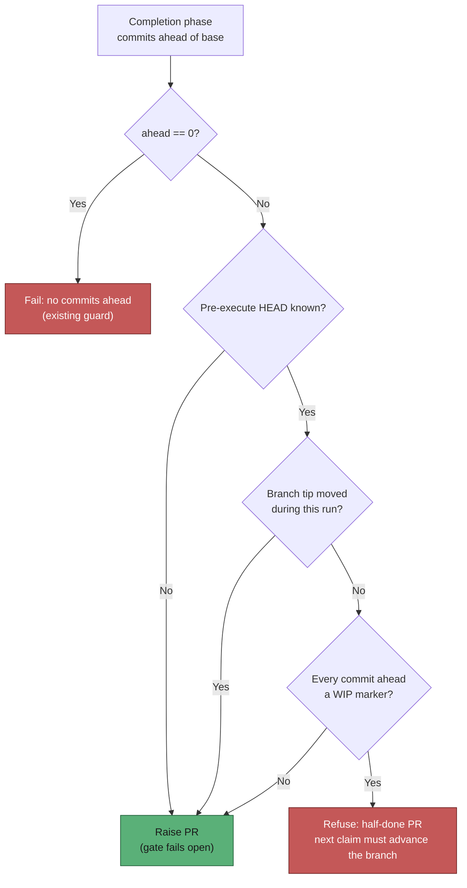

## Summary

Closes #148.

Both numbered halves this issue tracked already shipped in PR #158 (Issue #47):

- **Preserve the work** — `worker/deno/lib/wip_checkpoint.ts:195`
  (`preserveTimedOutWip`), called from
  `worker/deno/lib/phases/execute_phase.ts:429`, commits a timed-out run's
  dirty tree to the claim-locked issue branch and pushes it through
  `commitAndPushPending` (the arg-injection-safe chokepoint), refreshes the
  resume-state store, and names the branch in the release comment. It is
  best-effort: a failed push leaves the WIP committed locally and logs it.
- **Size the claim to the budget** — `worker/deno/lib/claim_runway.ts:60`
  (`resolveClaimRunwayFloor`), applied at both claim gates in
  `worker/deno/lib/run_core.ts:1296` and `:1636`, refuses a new claim once the
  deadline-bound runway can no longer fit the configured `claudeTimeout`, with
  the short-cycle host logged once as a documented exception.

What had **not** landed is the design-care item the issue calls
**"No half-done PR"**, and that is what this PR implements. The preserved
`wip:` commit makes the issue branch *ahead of base*, so the completion
phase's ahead-of-base guard (which only knows the commit *count*) waved
through a later claim that added nothing and raised a PR from an abandoned
tree.

Completion now refuses when **both** hold:

1. every commit ahead of base is a worker-authored WIP marker
   (`wip: …` from #47, `WIP checkpoint: …` from #4170), and
2. the branch tip is exactly where it stood before this run's agent started
   (`state.executeStartHeadSha`, captured in the execute phase).

Condition 2 is what keeps a genuine run safe: an agent that finished its work
and left the phase-end checkpoint to commit it *did* move the tip, so its PR
is raised as normal. Anything the guard cannot determine — no captured SHA
(Claude never ran), an unreadable commit log — fails open and logs, because
this guard refuses a PR and must never act on a guess.

`buildTimedOutWipCommitMessage` was extracted from the execute phase so the
subject the worker writes and the matcher that recognises it cannot drift
apart.

## Evidence

Backend/CLI change with no web interface to screenshot — the evidence is the
test suite below plus the quality gate.

Quality gate: `./quality.sh` passes every check except `deno tests`, which
reports 10 failures that are **pre-existing on a clean tree** in this
container (`setup_workdir_reminder_test.ts`, `fleet_health_test.ts`,
`host_workdir_guard_test.ts`, `optional_feature_env_test.ts` — host work-dir
assumptions). Verified by stashing this branch's changes and re-running those
four files: the same 10 failures, unchanged. Everything else passes —
14 621 tests, including the 7 added here.

## Test Plan

Added `worker/deno/tests/completion_wip_only_gate_test.ts` — drives the real
`workOnIssueCompletion` with a mocked git/gh layer:

- refuses the PR (and never invokes `gh pr create`) when the branch holds only
  a `wip:` commit and the tip has not moved — the regression this issue is
  about;
- raises the PR when the tip moved during this run, even if every commit ahead
  is a checkpoint;
- raises the PR when a pre-existing commit is real work an earlier run left
  behind;
- raises the PR when `executeStartHeadSha` is absent (gate fails open).

Added `worker/deno/tests/wip_commit_marker_test.ts` — unit tests for
`isWipCommitSubject` / `isWipOnlyCommitLog`: both worker-authored subjects are
recognised (built via the shared builders, so the test fails if either drifts),
real work and near-misses (`Wipe out the stale cache`) are not, and an empty
log is not "WIP-only" (that is the zero-commits-ahead guard's case).
