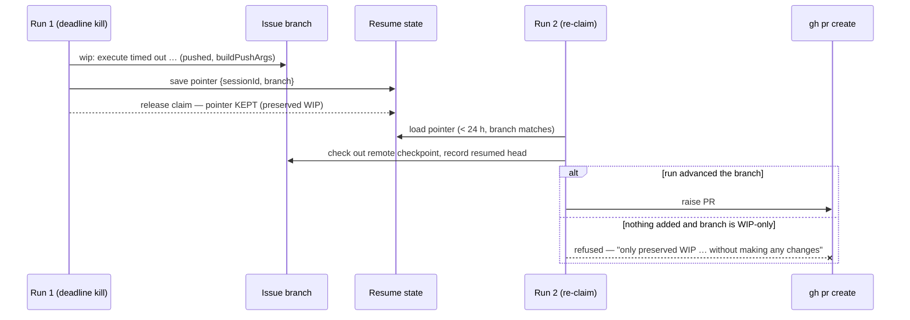

# PR Summary — Issue #148

## Summary

Issue #47 landed WIP preservation itself (a deadline timeout with a dirty tree
commits and pushes its work to the issue branch) and the claim-runway floor.
This PR delivers the three design-care halves that issue left open, so the
preserved work is actually resumable and never masquerades as a finished
change. Closes #148.

**1. The resume pointer survives a WIP-preserving release.** Preservation wrote
the resume state and the very next step — `releaseClaim` — deleted it (#4170's
"a released claim ends the attempt deliberately"), so the WIP commit was
stranded: the next claim found no pointer, recreated the branch from base, and
the preserved work was resumable in name only. `resumeStateSurvivesRelease()`
carves out the one release that did **not** end deliberately — a `no_pr`
outcome whose reason names preserved WIP. Every other release still clears the
pointer.

**2. No half-done PR.** A `wip:` commit makes the branch "ahead of base", so
the existing ahead-of-base guard waved through a later claim that added
nothing, and `gh pr create` presented parked work as a completed change. The
completion phase now refuses when **both** hold: the run resumed a checkpoint
and never moved the branch (`rev-list --count <resumed-head>..<branch>` is 0),
**and** every commit ahead of base is a WIP marker. Both conditions are
required because either alone has a legitimate shape — a run whose own work
landed in periodic checkpoint commits *did* advance the branch and still raises
its PR. The refusal reason is worded so `detectFailureCategory` diagnoses it as
`no_changes` (an agent outcome, never auto-filed as a worker fault), and a
guard that cannot run warns and lets the PR through: this must not become a new
way to lose work.

**3. Arg-injection-safe branch push.** `pushUnpushedCommits` — the push behind
`commitAndPushPending`, and therefore behind WIP preservation, checkpoints and
completion — passed the branch as a bare positional (`["push","-u","origin",
branchName]`). It now goes through a new `buildPushArgs()` in `git_ref_args.ts`,
which rejects an empty or dash-leading name and inserts `--end-of-options`
(CWE-88, same shape as the existing fetch/pull/checkout builders). A refused
ref returns a loud error `Result`; it is never a silent skip.

A shared `wip_markers.ts` holds the vocabulary all three need (the two commit
subject prefixes and the release marker), so no call site carries its own copy
of the string.

**Claim sizing (issue part 2) is already implemented and verified**, not
re-done here: `worker/deno/lib/claim_runway.ts:60` raises the floor to the
configured execute budget whenever the cycle can offer one, wired into the scan
loop and slot pool, with the short-cycle documented exception. Tests:
`claim_runway_test.ts` (5 cases) and the two `run_core_spend_guards_3648_test.ts`
cases (refusal at a partial budget; the full-budget claim proceeding).

## Evidence

Backend/CLI change — no web interface to screenshot. Verified by tests and the
quality gate.

`./quality.sh` (host): **14637 passed, 10 failed** — the 10 are pre-existing
and unrelated (`fleet_health_test.ts`, `host_workdir_guard_test.ts`,
`optional_feature_env_test.ts`, `setup_workdir_reminder_test.ts` assert on
host work-dir contents). Confirmed by stashing this branch's changes and
re-running those four files on a clean tree: the same 10 fail. Every other
gate — lint, type check, fmt, git-ref chokepoint, mermaid, markdownlint,
docs prompt versions — **PASSED** (config integration and pages-liquid
SKIPPED as usual on host).

## Test Plan

Added:

- `worker/deno/tests/wip_markers_test.ts` (8) — WIP subject classification
  (both prefixes, casing, whitespace, `wip` as a substring), WIP-only vs mixed
  vs empty ranges, and preserved-WIP vs failed-preservation reasons.
- `worker/deno/tests/completion_phase_wip_gate_test.ts` (5) — a resumed run
  that added nothing to a WIP-only branch fails and never reaches
  `gh pr create`; the refusal diagnoses as `no_changes`; a run that advanced
  the branch (even by checkpoint commits) still raises its PR; a branch with
  one real commit is never refused; a run that never resumed skips the guard.
- `worker/deno/tests/wip_resume_handoff_test.ts` (4) — the release keeps the
  pointer only for a preserved-WIP `no_pr` outcome (failed preservation, a
  quality failure, a PR outcome and `no_pr_expected` all still clear it); the
  setup phase records the resumed branch head, and records none when the run
  starts clean.
- `worker/deno/tests/git_ref_args_test.ts` (+4) — `buildPushArgs` separator
  placement with and without `-u`, and refusal of dash-leading/empty refs.
- `worker/deno/tests/git_push_test.ts` (+1) — `pushUnpushedCommits` refuses a
  dash-leading branch name with a named error and executes nothing (real git
  fixture). The existing first-push integration test covers the happy path
  against the new argv.
- `worker/deno/tests/issue_worker_test.ts` (+1) — the issue's clean-tree case:
  a timeout with no dirty files produces neither a WIP commit nor a push, and
  claims no preservation in its failure reason.

Modified: none of the existing tests changed behaviour or assertions.

## Security self-check

- Input validation: `buildPushArgs` validates the remote and branch before any
  git invocation; `isWipCommitSubject` / `isWipOnlyRange` are pure string
  predicates over `git log` output with no interpolation back into a command.
- Injection surface: the new git calls interpolate only worker-derived values
  (a sha recorded from `rev-parse HEAD`, the worker's own branch name) into
  range arguments, and the one attacker-influenceable positional (the pushed
  branch) is now guarded by `--end-of-options`.
- Secrets: none staged; the push still runs through `commitAndPushPending`, so
  the pre-commit secret/hidden-file gate, default-branch guard and run-id
  trailer all continue to apply.
- Error handling: the push builder's refusal surfaces as an error `Result`, and
  both new guards fail loud (a refusal reason or a warning) rather than
  swallowing a fault.
