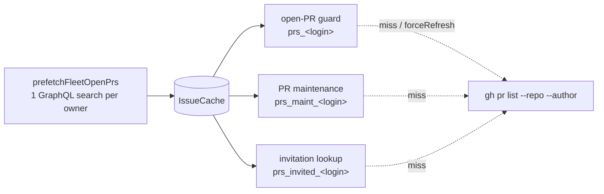

# Collapse the per-repo per-author open-PR listings into one cross-repo search

## Summary

Three passes asked GitHub the same question once per repo **and** once per
author — the open-PR duplicate guard (`prs_<login>`), the PR-maintenance
listing (`prs_maint_<login>`) and the human-invitation listing
(`prs_invited_<login>`). At 19 repos with 2 fleet authors and 3 authorised
commenters that is ~130 GraphQL-backed `gh pr list` calls on a cold cycle.

One `gh api graphql` search per repository **owner** now answers all of them:
GitHub's search takes a whole owner and ORs repeated `author:` qualifiers.
`worker/deno/lib/fleet_pr_search.ts` runs and pages that search;
`worker/deno/lib/fleet_pr_prefetch.ts` writes the answer into the very cache
entries those listings already read, so **no call site changed** and every
fallback stayed where it was. `run_core` calls it once per iteration, after
the trusted-author refresh that decides which logins to search for.

The latent `issues_all` hazard the issue names is fixed in the same change:
the entry now records the `--limit` it was fetched with, so a caller asking
for 200 is no longer served a cached 100.

Closes #1486.

## Evidence

Backend/CLI change — no web interface to screenshot. The evidence is the
measured call volume and the test suite.

**Measured, on the three-repo / two-author fixture in
`worker/deno/tests/iteration_call_budget_test.ts`** (one cold
`findOldestIssue` iteration, counted through the real `gh_call_metrics`
telemetry):

| | `pr list` calls | `api graphql` search |
| --- | --- | --- |
| before | 12 | 0 |
| after | 6 | 1 |

The 6 that remain are the closed/merged half, which deliberately keeps its
per-repo listing (see below). Scaled to the production fleet the open half is
19 × (2 + 2 + 3) ≈ 133 listings replaced by one search per owner, and a warm
cycle inside the cache TTL now issues **no** search at all.

**Why the closed/merged half is not collapsed.**
`fetchRecentlyClosedPRsForFleet` treats a merged PR as a *permanent* skip
regardless of age, and the search API caps a result set at 1,000 matches
while this fleet has **8,524** closed PRs (1,242 in the last 30 days, 408 in
the last 7 — measured against the live API during this run). A windowed
cross-repo search would silently drop older merged PRs and weaken the
duplicate-PR guard, so that half keeps its per-repo listing. This is recorded
as a deliberate decision in `docs/GH-API-OPTIMISATION.md`.

## Acceptance Criteria

<!-- vibe-spec-review inputs="diff+issue-body" -->

- **met** — collapse `fetchOpenPRsForFleet` → `fetchOpenPRsByUser` (repos ×
  fleet authors) — evidence:
  `worker/deno/tests/fleet_pr_prefetch_test.ts::prefetch - one search per owner serves every repo and author`
  — reviewer: met
- **met** — collapse `pr_maintenance.ts` `listOpenPrs` — evidence:
  `worker/deno/tests/fleet_pr_prefetch_test.ts::prefetch - the maintenance listing keeps its field set`
  — reviewer: met
- **met** — collapse `pr_invitation_lookup.ts` `listInvitedHumanPrs` —
  evidence:
  `worker/deno/tests/fleet_pr_prefetch_test.ts::prefetch - an invited human PR is admitted from the prefetch`
  — reviewer: met
- **missing** — collapse `fetchRecentlyClosedPRsForFleet` →
  `fetchClosedPRsByUser` ("a second [query] covers closed/merged") —
  reviewer: missing — reason: not implemented, deliberately: a merged PR
  blocks permanently regardless of age, and 8,524 closed PRs against
  search's 1,000-result cap means any cross-repo form of this query would
  drop older merged PRs and weaken the duplicate-PR guard. The reasoning and
  the measurements are recorded in `docs/GH-API-OPTIMISATION.md`.
- **partial** — "~150–170 calls → ~4"; O(1) cross-repo queries per cycle —
  evidence: `worker/deno/tests/iteration_call_budget_test.ts::iteration call
  budget - the cross-repo prefetch removes the per-repo open-PR listings` —
  reviewer: partial — reason: the open half is now O(owners) — one search,
  zero on a warm cycle — but the closed half stays O(repos × authors) for
  the reason above, so ~133 of the ~170 collapse rather than all of them.
- **met** — field parity, proven by test — evidence:
  `worker/deno/tests/fleet_pr_search_test.ts::searchOpenFleetPrs - returns the fields gh pr list gave consumers`
  plus the three real consumers reading the prefetched entries — reviewer:
  met — reason: the reviewer's caveat about single-page labels/comments/
  reviews is fixed in this diff — the search reads each connection's
  `totalCount` and a PR that did not fit one page is left to the per-repo
  listing (`worker/deno/lib/fleet_pr_prefetch.ts`).
- **met** — page correctly rather than silently truncating — evidence:
  `worker/deno/tests/fleet_pr_search_test.ts::searchOpenFleetPrs - pages through every result`
  and `… - refuses to serve a truncated result set` — reviewer: partial —
  reason: the reviewer marked it partial only for the nested connections,
  which this diff now detects and falls back on; the search connection
  itself was already exhaustive-or-fail.
- **met** — keep the per-repo path for callers needing read-after-write —
  evidence:
  `worker/deno/tests/fleet_pr_prefetch_test.ts::prefetch - forceRefresh still bypasses the prefetched entry`
  and `… - a failed search leaves the per-repo path in place` — reviewer: met
- **met** — eventual consistency accepted as a deliberate decision —
  evidence: `docs/GH-API-OPTIMISATION.md` "Cross-repo prefetch" section and
  the `fleet_pr_prefetch.ts` header — reviewer: met
- **met** — `fetchAllIssues` shared `issues_all` key across differing limits
  — evidence:
  `worker/deno/tests/issue_query_test.ts::issue_query - a 100-limit cache entry does not serve a 200-limit caller`
  — reviewer: met — reason: the reviewer's follow-up (a truncated listing
  that lost a malformed row could still look complete) is fixed here —
  exhaustion is judged on the rows GitHub returned, covered by
  `… - a truncated listing with a dropped row is refetched`.
- **partial** — "verified by the corrected metric from #1485 showing the
  drop" — evidence: the before/after `gh_call_metrics` counts pinned in
  `worker/deno/tests/iteration_call_budget_test.ts` — reviewer: partial —
  reason: #1485's corrected metric is a separate issue and is not touched
  here; the drop is demonstrated with the existing per-iteration telemetry
  instead.
- **unrequested** — `docs/GH-API-OPTIMISATION.md` section + README index row
  — reviewer: unrequested — reason: the repo's standards require a docs
  change alongside a behaviour change; this is where the cache layers are
  documented.
- **unrequested** — `fleetPrefetchGhCommandFn` option on
  `ProductionDepsOptions` — reviewer: unrequested — reason: the test seam
  that lets the wiring test prove the factory hands over the right author
  sets without a network call, mirroring the existing
  `idleDetectGhCommandFn`.
- **unrequested** — `listingsAvoided` / the `[fleet-pr-prefetch] …` log line
  — reviewer: unrequested — reason: one line per cycle naming what the
  prefetch served or skipped; a skip that produced no evidence would be the
  silent failure the standards forbid.
- **unrequested** — `worker/deno/tests/support/github_graphql_fake.ts` gains
  a search fake — reviewer: unrequested — reason: required by
  CODING-STANDARDS ("Fake the external service, do not assert the request")
  for the tests this change needs.

## Standards Review

<!-- vibe-standards-review inputs="diff+CODING-STANDARDS.md" -->

- **violation** — tests asserted the *text* of the search query instead of
  faking the API — evidence:
  `worker/deno/tests/fleet_pr_search_test.ts:72` (as reviewed) — reason:
  fixed here — `fakeGithubPrSearch` in
  `worker/deno/tests/support/github_graphql_fake.ts` parses the `q`
  variable, the selection set and the paging variables, so a query naming
  the wrong owner, dropping an author or dropping a field now returns a
  truthfully wrong answer; the query-text assertions are gone.
- **violation** — the same pattern in the wiring test — evidence:
  `worker/deno/tests/fleet_pr_prefetch_wiring_test.ts:184` (as reviewed) —
  reason: fixed here — the wiring assertion is now that all three logins'
  PRs come back through the real consumers.
- **violation** — DRY: a third copy of the login-normalisation loop —
  evidence: `worker/deno/lib/fleet_pr_prefetch.ts:94` (as reviewed) —
  reason: fixed here — `normaliseLogins` is exported once from
  `fleet_pr_search.ts` and used by both modules.
- **violation** — the new `run_core` call site and its error path had no
  test — evidence: `worker/deno/lib/run_core.ts:4722` — reason: fixed here —
  `worker/deno/tests/run_core_fleet_prefetch_test.ts` asserts one prefetch
  per cycle after the trust refresh, and that a throw is logged without
  stopping the cycle.
- **violation** — inferred absence: an empty listing is written for every
  monitored repo the search did not mention — evidence:
  `worker/deno/lib/fleet_pr_prefetch.ts:229` — reason: stands, documented.
  Learning that a quiet repo is quiet without a call *is* the saving. It is
  not left carrying the duplicate-PR guard: `claimIssue` re-checks the repo
  it is about to claim live with `forceRefresh`, bypassing this cache
  entirely (Issue #3150), and that reasoning is now in both the module
  header and `docs/GH-API-OPTIMISATION.md`.
- **violation** — a doc comment named `resolveFleetAuthors` where production
  uses `resolveFleetPrAuthorSet` — evidence:
  `worker/deno/lib/fleet_pr_prefetch.ts:51` — reason: fixed here.
- **violation** — `forbiddenGh`'s comment described behaviour it did not
  have — evidence: `worker/deno/tests/fleet_pr_prefetch_test.ts:82` —
  reason: fixed here — renamed `recordingGh`, with the assertion that
  records the calls left to the caller.
- **violation** — no `docs/archive/pr-summaries/pr-summary-1486.md` in the
  reviewed diff — evidence: the diff at review time — reason: fixed here —
  this file.
- **clean** — Australian English throughout; Deno-native tooling only
  (`deno fmt`/`lint`/`check`/`test`); no hidden or credential paths staged;
  fail-loud error handling in the search (thrown call, unparseable output,
  GraphQL errors, missing cursor and an exhausted page budget are each a
  reported failure with a test); no test removed or silenced — the two
  `issue_query_test.ts` edits adapt to the deliberate cache-payload change
  and are annotated; tests call real code rather than grepping source.

## Test Plan

Added:

- `worker/deno/tests/fleet_pr_search_test.ts` — 14 cases: the cross-repo
  search against the API fake (owner, author union, `is:open`, field
  selection, cursor paging, conversation truncation) and every failure mode.
- `worker/deno/tests/fleet_pr_prefetch_test.ts` — 11 cases driving the real
  `fetchOpenPRsForFleet`, `listOpenPrs` and `listInvitedHumanPrs` against
  the prefetched cache with zero `gh pr list` calls, plus the fallbacks:
  failed search, truncated conversation, `forceRefresh`, warm-cycle marker.
- `worker/deno/tests/fleet_pr_prefetch_wiring_test.ts` — 5 cases driving the
  real `createProductionRunCoreDeps` so the factory's author sets are
  proven, not assumed.
- `worker/deno/tests/run_core_fleet_prefetch_test.ts` — 2 cases on the main
  loop: one prefetch per cycle after the trust refresh; a throw is logged
  and the cycle continues.
- `worker/deno/tests/support/github_graphql_fake.ts` — `fakeGithubPrSearch`,
  a search endpoint that models GitHub's own rules.
- `worker/deno/tests/iteration_call_budget_test.ts` — one case pinning the
  measured before/after `pr list` volume.
- `worker/deno/tests/issue_query_test.ts` — three cases for the `issues_all`
  limit: a narrower entry is refetched, a short listing serves any limit, a
  truncated listing that lost a row is refetched; plus a legacy bare-array
  entry still reads.

Modified: two existing `issue_query_test.ts` assertions on the raw
`issues_all` cache payload, which now carries `{ limit, issues, rawCount }`.
Both are annotated with the issue number.

`./quality.sh` passes (semgrep, markdownlint, mermaid, the full Deno suite,
lint, type check and fmt).
