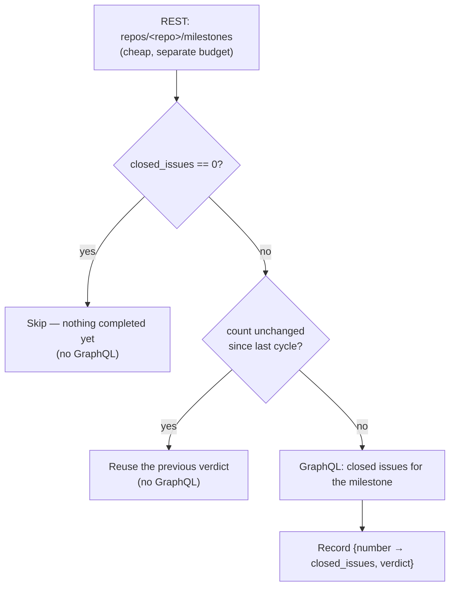

# Gate the milestone closed-issue query on a cheap REST signal

## Summary

The milestone branch sync spent a GraphQL `gh issue list --state closed` per
milestone per cycle purely to answer "has anything been completed in this
milestone yet?". The REST `repos/<repo>/milestones` listing it already makes —
cheap, and billed against a **separate** budget — carries `closed_issues` per
milestone, which is that same answer. That cheap call now decides whether the
expensive one is worth making. Closes #1488.

The rule, implemented in the new
`worker/deno/lib/milestone_activity_gate.ts`:

| REST `closed_issues` | Decision |
| --- | --- |
| Milestone list empty | Nothing to sync — no GraphQL |
| `0` | Nothing completed, so not active by the pass's own definition — no GraphQL |
| Unchanged since the last observation | The closed set cannot have moved — reuse the recorded verdict, no GraphQL |
| Moved, in either direction | Spend the query and record the new verdict |

This is invalidation **by change, not by clock**: the gate derives from the
same authority the answer does, so a skipped cycle cannot act on a stale view.
Observations are keyed by milestone **number** (a rename keeps the number) and
persist in `milestone_activity.json` in the work dir, beside
`milestone_sync_failures.json`. The first observation after a restart has no
baseline and queries once.

## Evidence

Backend/CLI change with no web interface to screenshot — the evidence is the
tests below and the full quality gate (`./quality.sh`), which passed after the
final edit: `deno tests`, `deno lint`, `deno check`, `deno fmt`, mermaid,
markdownlint, semgrep and the completeness checks all PASSED (`config
integration` SKIPPED, as it is in this environment by default).

No before/after benchmark is quoted because the saving is a **count of API
calls**, not wall-clock time, and it is asserted directly:
`syncMilestoneBranches - a second cycle with unchanged milestones issues no
closed-issue query` drives two full sync cycles through the real persisted
file and asserts the closed-issue query count stays at 1 while the branch
still syncs on both.

## Acceptance Criteria

<!-- vibe-spec-review inputs="diff+issue-body" -->

- **met** — No open milestone → nothing to sync, no GraphQL — evidence: `worker/deno/lib/milestone_branch_sync.ts` (the loop over an empty listing is the only query site) — reviewer: met
- **met** — Open milestone with `closed_issues == 0` → skip, no GraphQL — evidence: `worker/deno/tests/milestone_branch_sync_test.ts::findActiveMilestoneBranches - zero REST closed_issues skips the query (Issue #1488)` — reviewer: met
- **met** — `closed_issues` unchanged → the previous result stands, no GraphQL — evidence: `worker/deno/tests/milestone_branch_sync_test.ts::findActiveMilestoneBranches - unchanged closed_issues reuses the verdict (Issue #1488)` — reviewer: met
- **met** — Otherwise do the query — evidence: `worker/deno/tests/milestone_branch_sync_test.ts::findActiveMilestoneBranches - first observation queries and records (Issue #1488)` — reviewer: met
- **met** — Any change invalidates, in either direction — evidence: `worker/deno/tests/milestone_activity_gate_test.ts::decideMilestoneQuery - any change invalidates, in either direction` — reviewer: met
- **met** — Key on milestone number, not title — evidence: `milestoneActivityKey` in `worker/deno/lib/milestone_activity_gate.ts` — reviewer: met
- **met** — Store last-seen `{number → closed_issues}` per repo beside the existing sync state — evidence: `milestoneActivityPath` → `<workDir>/milestone_activity.json`, wired at `worker/deno/lib/run_core_production_deps.ts` and `worker/deno/commands/milestone_branch_sync.ts` — reviewer: met
- **met** — First observation after a restart queries once — evidence: `worker/deno/tests/milestone_activity_gate_test.ts::loadMilestoneActivity - a missing file reads as empty` plus the first-observation test above — reviewer: met
- **met** — Acceptance: an unchanged repo issues no GraphQL call from the milestone pass — evidence: `worker/deno/tests/milestone_branch_sync_test.ts::syncMilestoneBranches - a second cycle with unchanged milestones issues no closed-issue query (Issue #1488)` — reviewer: met
- **met** — Acceptance: a milestone that gains **or loses** a closed issue still syncs correctly next cycle, both directions covered by test — evidence: `syncMilestoneBranches - a milestone that gains a closed issue syncs on the next cycle (Issue #1488)` and `syncMilestoneBranches - a milestone that loses its last closed issue stops syncing on the next cycle (Issue #1488)` — reviewer: partial — reason: the reviewer saw only the gaining direction end-to-end; the losing direction was in-memory only. A second end-to-end test driving the loss through the persisted file was added in response, so the gap it named is closed.
- **unrequested** — The observation stores the `active` verdict, not only `{number → closed_issues}` as the issue's wording specifies — reviewer: unrequested — reason: the "unchanged count → previous result stands" rule needs the previous result; the REST count includes closed **PRs** while the pass counts closed **issues**, so the count alone cannot reconstruct the verdict.
- **unrequested** — `docs/GH-API-OPTIMISATION.md`, `docs/INTERNALS.md` (section + module-table row) and `docs/workflows/milestones.md` updates, and the `docs/audits/lib-sweep-coverage.json` claim for the new module — reviewer: unrequested — reason: repo convention requires each new `lib/` module to be claimed by a sweep slice (the completeness gate fails otherwise) and documented where the subsystem is described.

Two findings the Spec reviewer raised were **fixed rather than accepted**, and
are the second commit on this branch:

- **Pruning treated a possibly truncated listing as authoritative.** The
  milestone listing has no `--paginate`, so a repo with more than 30 open
  milestones would have every off-page observation evicted and re-queried each
  cycle. `pruneMilestoneActivity` was removed outright — a milestone number is
  never reused, so a stale entry can never produce a wrong answer.
- **Strict `closed_issues` validation failed closed.**
  `findActiveMilestoneBranches` turns a validation failure into an empty list,
  so one wrong-typed field would have silently disabled the sweep for the whole
  repo. The strict check was reverted; the gate itself fails **open** (spends
  the query) on anything that is not a number.

One finding stands as designed: the REST count includes closed PRs, so a
simultaneous compensating change (a PR closed as an issue is reopened) leaves
the count still and the cached verdict stale until the count next moves. That
is the exact trade-off the issue's own rule specifies, and it is documented at
`MilestoneActivityObservation.active`.

## Standards Review

<!-- vibe-standards-review inputs="diff+CODING-STANDARDS.md" -->

- **violation** — The new `lib/` module was claimed by no sweep slice, so `check:manifests` failed — evidence: `docs/audits/lib-sweep-coverage.json` — reason: fixed here; the module is now claimed, and the full gate's completeness check passes.
- **violation** — `loadMilestoneActivity` swallowed read and parse failures identically, making a corrupt state file indistinguishable from a first run — evidence: `worker/deno/lib/milestone_activity_gate.ts` (load path) — reason: fixed here; it now reports through the repo's own `reportStateLoadFailure`, which stays quiet for a missing file and is loud for corruption, and malformed entries are dropped rather than clamped into plausible-looking values.
- **violation** — The observation save used an empty `catch` with a `log` sink in scope — evidence: `worker/deno/lib/milestone_branch_sync.ts` (save path) — reason: fixed here; a failed save now logs a warning. The adjacent streak save keeps its pre-existing swallow, which is out of scope for this issue.
- **violation** — `docs/GH-API-OPTIMISATION.md`, the canonical reference for this milestone's work, gained no entry for the new invalidation rule or the new work-dir state file — evidence: `docs/GH-API-OPTIMISATION.md` — reason: fixed here; a section on the REST-gates-GraphQL pattern and a row in the invalidation table were added.
- **clean** — Australian English throughout the added lines; tests call real exported functions with gh stubs and temp dirs (no source-grepping, no line-count assertions, no sleeps or wall-clock budgets); unit-shaped and parallel-safe; Deno-native tooling only; no hidden or credential-shaped paths staged; commit messages carry the issue reference and the `Vibe-Coder-Run-Id` trailer; `deno fmt --check`, `deno lint` and `deno check` clean on every touched file.

The reviewer also noted, without counting it a breach, that
`loadMilestoneActivity` / `saveMilestoneActivity` closely mirror
`loadSyncStreaks` / `saveSyncStreaks`. That duplication is deliberate: the
standards prefer a few similar lines to a premature abstraction, and the two
state files validate different shapes.

## Test Plan

New — `worker/deno/tests/milestone_activity_gate_test.ts` (13 tests):

- `decideMilestoneQuery` — zero count, first observation, unchanged count in
  both verdicts, movement up **and** down, and an absent count (fails open).
- `recordMilestoneActivity` — records and marks dirty; an unchanged
  observation leaves the state clean; an absent count records nothing.
- Persistence — path, round-trip, missing file, corrupt entries dropped rather
  than repaired, a corrupt file reported loudly, a missing file **not**
  reported as a fault.

New in `worker/deno/tests/milestone_branch_sync_test.ts` (8 tests):

- `findActiveMilestoneBranches` — zero REST count skips the query; an
  unchanged count reuses the verdict; a gained and a lost closed issue each
  re-query; the first observation queries and records; a payload with no
  counts still queries and records nothing.
- `syncMilestoneBranches` — a second cycle with unchanged milestones issues no
  closed-issue query and still syncs; a milestone that gains a closed issue
  syncs on the next cycle; a milestone that loses its last closed issue stops
  syncing, then resumes when it is closed again under a different count. All
  three drive the real persisted `milestone_activity.json`.

Existing tests were neither modified nor removed; the pre-existing
`findActiveMilestoneBranches` suite (whose stubs carry no `closed_issues`)
still passes unchanged, which is the fail-open path.

Full gate: `./quality.sh` → `Result: PASSED (with skipped checks)`.
