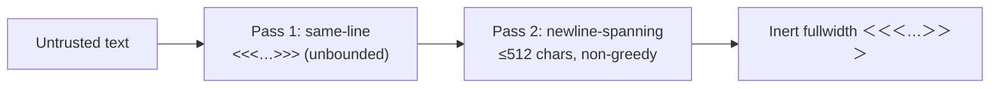

# Angle-bracket delimiter scrub now neutralises newline-split markers

## Summary

`sanitiseDelimiterPatterns()` scrubbed `<<<…>>>`-shaped markers only when the
whole marker sat on one line — its inner character class excluded newlines — so
a boundary-shaped token split across a line break (`<<<ISSUE_BODY_END\n_id>>>`)
reached the model unmodified. The sibling triple-dash rule had already been
widened to span newlines for exactly this gap (Issue #3201); the angle-bracket
rule never received the equivalent fix.

The scrub now runs two passes over the angle-bracket shape:

1. the existing **same-line** pass, left unbounded so no long single-line marker
   can slip through;
2. a **newline-spanning** pass, non-greedy and capped at 512 characters of inner
   content, which defangs whatever the first pass could not reach.

The cap keeps a stray `<<` from pairing with a `>>` far down the body and
mangling every line between them — a genuine marker is roughly 45 characters.
The inner class excludes both angle brackets, so the closing `>{2,}` group has
nothing to compete with and there is no ambiguity for the engine to backtrack
over (the backtracking-safety care the issue asked for).

Closes #15.



## Evidence

Backend/CLI change with no web interface, so there is no screenshot to capture;
the evidence is the regression test.

**Regression test linkage.** Added
`worker/deno/tests/prompt_delimiter_test.ts::prompt delimiter - sanitises angle delimiters split across a newline (Issue #15)`,
which reproduces the flaw. Verified it **fails against the unfixed code** and
**passes after the fix** — with `worker/deno/lib/prompt_delimiter.ts` stashed
back to its pre-fix state:

```text
prompt delimiter - sanitises angle delimiters split across a newline (Issue #15) ... FAILED (10ms)
FAILED | 40 passed | 1 failed (18ms)
```

and with the fix applied:

```text
ok | 41 passed | 0 failed (7ms)
```

**Original trigger closed, no trivial bypass.** The trigger — an issue or
comment body carrying an angle-bracket boundary-shaped token split across a
newline — is now rewritten to inert fullwidth brackets by the second pass, whose
inner class `[^<>]` admits newlines and every other character except the
brackets themselves. Static reasoning over the changed code path: after pass 1
removes every same-line marker, any surviving `<{2,} … >{2,}` pair differs from
the trigger only by which non-bracket characters sit between the brackets, and
all of those are inside the class — so there is no character-level variant that
evades it. The remaining bound is length, not shape: a pair separated by more
than 512 characters of inner content is left alone, which is not a
boundary-marker shape (the genuine markers are ~45 characters) and is asserted
as deliberate behaviour by the third new test. Long **same-line** markers are
still caught unbounded by pass 1, so this change strictly widens coverage and
weakens nothing.

**Quality gate.** `./quality.sh < /dev/null` reports `deno tests FAILED` with 7
failures in `fleet_health_test.ts`, `optional_feature_env_test.ts` and
`setup_workdir_reminder_test.ts`. These are **pre-existing and unrelated** —
re-running those three files with all changes from this branch stashed gives the
identical `FAILED | 52 passed | 7 failed`. Every other check passes (lint, type
check, fmt, markdownlint, mermaid, prompt immutability, chokepoint gates), and
all 41 tests in `prompt_delimiter_test.ts` pass.

## Test Plan

Added to `worker/deno/tests/prompt_delimiter_test.ts`:

- `prompt delimiter - sanitises angle delimiters split across a newline (Issue #15)`
  — the regression test: four newline-split shapes (break inside the marker
  name, before the closing angles, after the opening angles, and multiple
  breaks) must all be neutralised while the surrounding benign text survives.
- `prompt delimiter - still neutralises a long same-line angle marker (Issue #15)`
  — a 2000-character same-line marker is still scrubbed, guarding against the
  new length cap being applied to the single-line path.
- `prompt delimiter - leaves distant angle pairs across a document alone (Issue #15)`
  — a `<<` and a `>>` separated by ~960 characters of unrelated lines are left
  byte-identical, documenting the bounded blast radius.

Existing angle-bracket, triple-dash, boundary-id and trust-header tests are
unchanged and still pass.
