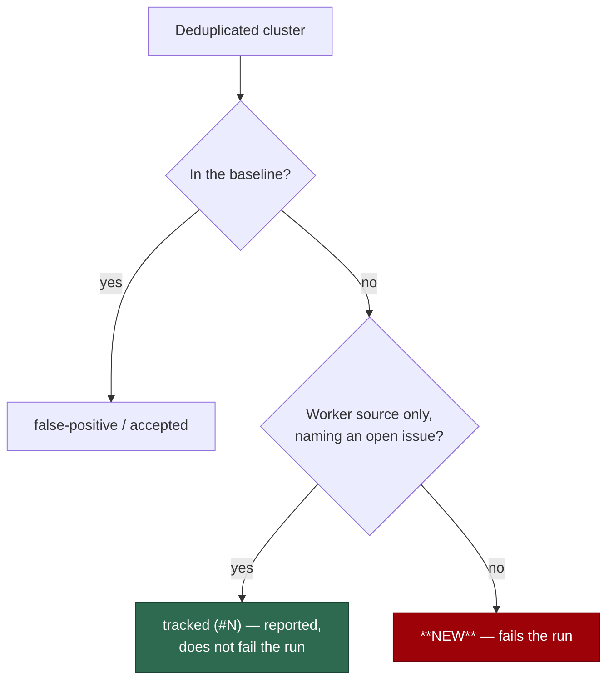

## Summary

The `Security Tree Sweep` gate had been red on every run since 2026-09-06, so
it reported nothing anybody could read: a new finding was indistinguishable
from the standing backlog. Closes #1518.

The thirteen unbaselined findings of the 2026-09-07 run were triaged
individually, and the class that made the gate *structurally* unable to go
green was given its own status.

- **`tracked` (new status).** The worker source harvests **open** `security`
  issues, so a cluster only that source reported exists precisely because a
  tracking issue is open — already triaged, already owned, and gone the moment
  the issue closes. It is now classified `tracked`, listed under *Tracked by an
  open issue* with its issue number, and excluded from the failure count. A
  site semgrep or CodeQL independently flagged stays `new`.
- **Two located CodeQL results fixed in code.** `normalisePageText` did not
  close on `</script >` or `</script foo>` (js/bad-tag-filter), so a page using
  either form kept its whole script body in the text the fingerprint is meant
  to ignore; and a no-op `.replace(":", ":")` in the defensive-labels test
  (js/identity-replacement).
- **Eight baselined individually**, seven as false positives and one as
  accepted, each with its own reason. Ten stale `unsafe-regex` entries that
  matched nothing were removed.
- **`sweep` is not made a required check.** That is a maintainer decision and
  it follows a green gate; the cleanup is its precondition, not its argument.

### Why the mechanism, when the issue asked for triage

Triage alone could not have worked. Class (b) is not a backlog that drains —
it refills: two further `security` issues (#1548, #1549) arrived while this
was being fixed, and each would have reddened the gate again. The sweep failed
on "an open security issue exists", which is the normal state of the
repository.



## Evidence

Backend/CLI change — no web interface to screenshot. Verified by replaying the
failing CI run's own scanner output (artefact of run `34125953004`) through the
sweep locally.

Before, on `main`:

```text
❌ 13 unbaselined finding(s).
```

After, against the same semgrep JSON and a SARIF adjusted only where this
branch changed the tree (the two alerts fixed in code removed; the one
baselined alert in `security_tree_sweep.ts` re-pointed to the line this branch
moved it to):

```text
✅ Whole-tree security sweep clean: 53 deduplicated finding(s) across 3006
   tracked file(s), all baselined or tracked (4 tracked by an open issue).
Tracked: SWEEP-ad3688b54407 medium suspicious-image-… (#1385)
Tracked: SWEEP-5c61bbe0e6b4 medium hardcoded-secret (#1424)
Tracked: SWEEP-46e0c0f1d209 medium unclassified (#1549)
Tracked: SWEEP-553a05041a09 low unclassified (#1548)
```

Run unmodified against the original SARIF, the only findings left are the two
sites this branch fixed in code (which CodeQL re-analyses on the next run) and
the baselined `security_tree_sweep.ts` alert whose line this branch moved.

`./quality.sh` passed in full (2m33s): semgrep, markdownlint, mermaid,
the Deno test suite, lint, type check and fmt.

### Security-fix contract

- **Regression test** — `worker/deno/tests/security_tree_sweep_test.ts::classifyClusters - an open security issue is tracked, never unbaselined (Issue #1518)`
  reproduces the fault: against the unfixed code it fails, because three
  clusters harvested from open `security` issues classify as `new` and fail
  the sweep; after the fix they classify as `tracked` with their issue numbers
  and `newRows` is empty.
- **Second regression test** —
  `worker/deno/tests/references_source_probe_test.ts::normalisePageText - a spaced or attributed end tag still closes the block (Issue #1518)`
  was observed failing against the unfixed regex (actual
  `a{colour:red} var nonce='abc123' Rule 2`) and passing after it.
- **Original trigger closed, no trivial bypass.** The gate failed because
  every open `security` issue counted as an unbaselined finding; those
  clusters are now `tracked`, and the boundary is narrow by construction —
  `trackingIssue` returns non-null only when **every** source in the cluster is
  `worker-scan` and one names an open issue, so adding a semgrep or CodeQL
  finding at the same fingerprint puts the cluster straight back to `new`
  (asserted by `classifyClusters - a scanner that saw the same site keeps it
  new (Issue #1518)`). Nothing an issue body can carry reaches the decision:
  the issue number is matched with `/^#(\d+)$/` against a ref the parser built
  from the GitHub `number` field, never from text.

## Acceptance Criteria

<!-- vibe-spec-review inputs="diff+issue-body" -->

- **met** — Separate the classes: (a) located CodeQL results, (b) worker-scan findings mirroring open issues, (c) anything already fixed whose finding is stale — evidence: `docs/SECURITY-TREE-SWEEP.md` triage table, and `worker/deno/lib/security_tree_sweep.ts:trackingIssue` for (b) — reviewer: partial — reason: the reviewer saw class (c) unreported and the 14 → 13 drift unexplained; both were added after its verdict — (c) was the #1463 mirror, which cleared when that issue closed
- **met** — Fix or accept each of (a) individually, with the reasoning recorded — evidence: two fixed in `worker/deno/lib/references_source_probe.ts` and `worker/deno/tests/security_scan_defensive_labels_test.ts`, eight entries with per-site reasons in `.github/security-tree-sweep-baseline.json` — reviewer: partial — reason: the reviewer required a threat-model entry for the one accepted item; it is recorded in the baseline against Issue #1518 and justified in `docs/SECURITY-TREE-SWEEP.md` instead, because an unread assignment carries no exposure for a residual-risk table to state
- **met** — Then decide whether `sweep` should become a required check, as a maintainer decision following the cleanup — evidence: `docs/SECURITY-TREE-SWEEP.md`, "Is `sweep` a required status check?" — reviewer: partial — reason: the reviewer read the recorded "not yet" as making the call in-branch; no branch protection is changed here, which is exactly the deferral the issue asked for
- **unrequested** — the `tracked` cluster status and its report/CLI surfaces — reviewer: unrequested — reason: the issue asked for "triage, not more mechanism", but triage alone cannot make this gate green — class (b) refilled with #1548 and #1549 during the fix, and the sweep fails on "an open security issue exists", which is the repository's normal state
- **unrequested** — removing ten stale `unsafe-regex` baseline entries — reviewer: unrequested — reason: the sweep's own report asks for it every run ("a stale entry suppresses nothing and should be removed"); the reasons are recoverable from this commit if `p/default` ever re-emits `detect-non-literal-regexp`
- **unrequested** — the Issue #1473 test now asserts its property against `trackedRows` instead of `newRows` — reviewer: unrequested — reason: worker-scan-only clusters can no longer be `new`, so the property #1473 protects (baselining one unlocated finding must not silence its family) is asserted on the rows they now land in, with the change documented inline

## Standards Review

<!-- vibe-standards-review inputs="diff+CODING-STANDARDS.md" -->

- **violation** — PR summary file absent, with it the regression-test linkage — evidence: `docs/archive/pr-summaries/pr-summary-1518.md` — reason: fixed here; the reviewer read the branch before this file was written
- **violation** — test name claimed an attributed end tag it neither asserted nor handled — evidence: `worker/deno/tests/references_source_probe_test.ts:128` — reason: fixed in this diff — the regex now closes on `</script foo>` and the test asserts that shape
- **violation** — clean summary said "all baselined" while part of the tree was tracked — evidence: `worker/deno/lib/security_tree_sweep.ts:2321` — reason: fixed in this diff; it now reads "all baselined or tracked (N tracked by an open issue)"
- **violation** — the tracked count vanished from the CLI on a failing run — evidence: `worker/deno/commands/security_tree_sweep.ts:208` — reason: fixed in this diff; every tracked row is now named on a red run and a green one alike
- **violation** — the accepted baseline entry carried no tracking `issue`, which the file's own note asks for — evidence: `.github/security-tree-sweep-baseline.json` (`run_core.ts`, `useless-assignment-to-local`) — reason: fixed in this diff — `"issue": 1518`
- **violation** — unreachable fallbacks: a `tracked` row always carries an issue, so `"tracked (open issue)"` cannot be reached — evidence: `worker/deno/lib/security_tree_sweep.ts:1653` — reason: stands. It mirrors the adjacent `accepted` cell and stops `#undefined` reaching a published report if the invariant is ever loosened; the type says `issue?`, so the branch is what the type demands
- **clean** — Australian English throughout the added prose and comments; no hidden path staged outside the `.github/` allowlist; every new test calls a real function and asserts on its return value; no test removed or commented out; new tests are parallel-safe unit tests with no clock, sleep or spawn; the module, `ClusterStatus`, `SweepRunResult` and `RenderSweepReportOptions` docs were updated alongside the fields; `deno fmt`, `deno lint`, `deno check` and markdownlint all pass

## Test Plan

Added:

- `worker/deno/tests/security_tree_sweep_test.ts::classifyClusters - an open security issue is tracked, never unbaselined (Issue #1518)`
- `worker/deno/tests/security_tree_sweep_test.ts::classifyClusters - a scanner that saw the same site keeps it new (Issue #1518)`
- `worker/deno/tests/security_tree_sweep_test.ts::renderSweepReport - tracked findings are reported and the verdict stays green (Issue #1518)`
- `worker/deno/tests/references_source_probe_test.ts::normalisePageText - a spaced or attributed end tag still closes the block (Issue #1518)`

Modified, and why:

- `worker/deno/tests/security_tree_sweep_test.ts::baselining one unlocated finding leaves the others reported (Issue #1473)` — business logic changed: an open `security` issue is now `tracked`, not `new`. The property the test protects is unchanged and still asserted (baselining one unlocated finding must not silence the rest of its family); it now reads `trackedRows` and additionally checks each row names the issue that keeps it alive.
- `worker/deno/tests/security_tree_sweep_test.ts::renderSweepReport snapshot for an empty, clean sweep` — the Summary table gained a `Tracked` column.
- `worker/deno/tests/security_scan_defensive_labels_test.ts` — the no-op `.replace(":", ":")` the CodeQL finding named was removed; the test's assertions are unchanged.

Whole gate: `./quality.sh` — PASSED (Deno test suite, semgrep, markdownlint,
mermaid, lint, type check, fmt).
