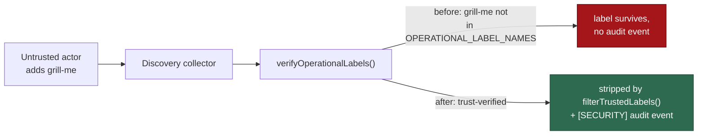

## Summary

`grill-me` is an operational **dispatch** label — `operationalDispatchLabels()`
(`worker/deno/lib/operational_dispatch_labels.ts:39`) puts `config.grillMeLabel`
in the AND-gated privileged set — but it was missing from
`OPERATIONAL_LABEL_NAMES` in `worker/deno/lib/label_security.ts`. The two lists
had drifted, so `verifyOperationalLabels()` / `filterTrustedLabels()` never
authorship-checked `grill-me`: an untrusted actor's add survived on the
in-memory issue record the discovery collectors carry forward, and no
`[SECURITY] [UNTRUSTED_LABEL_CHANGE]` audit event recorded the attempt.

This adds `grill-me` to the static list (permissive, so an unverifiable adder
fails closed), documents how the two lists relate, and adds a drift test that
fails CI if a future dispatch label is added to `operational_dispatch_labels.ts`
without being trust-verified here. Closes #1521.

## Evidence

Backend/CLI change with no web interface, so no screenshot applies. Evidence is
the test suite: the new cases fail against the unfixed code and pass after the
fix (verified by removing `"grill-me"` from `OPERATIONAL_LABEL_NAMES` and
re-running — 5 label_security cases and the collector case go red), and the full
`./quality.sh` gate passes (`deno tests`, `deno lint`, `deno type check`,
`deno fmt`, `semgrep`, `markdownlint` all PASSED; `config integration` SKIPPED
as it is on this host).

**Regression test linkage (security-fix contract).** Added
`worker/deno/tests/label_security_test.ts::label_security - an untrusted grill-me is stripped and audited (Issue #1521)`,
which reproduces the flaw: it drives an untrusted `mallory` add of `grill-me`
through `verifyOperationalLabels()` and asserts the label lands in
`untrustedLabels`, is removed by `filterTrustedLabels()`, and produces a
`[SECURITY] [UNTRUSTED_LABEL_CHANGE]` line. Against the unfixed code it fails
(the label is not operational, so nothing is checked, stripped or logged); it
passes after the fix.

**Original trigger closed, no trivial bypass.** The trigger is an untrusted
actor applying `grill-me` to a discovered issue. `isOperationalLabel()` is the
single membership test all four collectors reach through
`verifyOperationalLabels()`, it lower-cases both sides, and `grill-me` is now in
the lower-cased set — so `Grill-Me`, `GRILL-ME` and any other casing are caught
by the same check (asserted by the `added by an allowed human is kept` case,
which uses `Grill-Me`). The label is deliberately **not** in
`BLOCKING_ONLY_LABELS`, so the null-actor / unreadable-timeline paths strip it
rather than keeping it — the fail-closed direction, so an attacker cannot evade
the check by making authorship unverifiable. The only remaining uncovered input
is an operator-**renamed** `grill_me_label`, which is not a bypass of this
trigger: it is still refused at dispatch by `requiresLabelAdderTrust()`, and the
limitation is stated in the doc comment rather than left implicit.

## Acceptance Criteria

<!-- vibe-spec-review inputs="diff+issue-body" -->

- **met** — an untrusted `grill-me` add is authorship-checked, stripped in every discovery collector, and emits the same `[SECURITY]` audit event as `planning` — evidence: `worker/deno/lib/label_security.ts:88` plus `worker/deno/tests/label_security_test.ts::label_security - an untrusted grill-me is stripped and audited (Issue #1521)` and `worker/deno/tests/collect_label_candidates_test.ts::collect_label_candidates - strips a grill-me label added by an untrusted actor (Issue #1521)` — reviewer: met
- **met** — `grill-me` is permissive, not blocking-only: not in `BLOCKING_ONLY_LABELS` / `keepWhenUnverifiable()`, so an unverifiable adder fails closed — evidence: `worker/deno/tests/label_security_test.ts::label_security - grill-me with no verifiable adder fails closed (Issue #1521)` — reviewer: met
- **met** — the two lists can no longer drift apart silently — evidence: `worker/deno/tests/label_security_test.ts::label_security - every operational dispatch label is trust-verified (Issue #1521)` — reviewer: met — reason: implemented via the issue's explicitly-permitted **Alternative** (static constant + drift test), not the Preferred `extraOperationalLabels` wiring; the collectors would then have to pass `operationalDispatchLabels(config)`, which also changes the fail-closed direction for an operator-renamed `refine-issue` (a blocking-only label whose renamed form `keepWhenUnverifiable()` cannot recognise), so the renamed-label gap is documented in the constant's doc comment and left to the dispatch gate that already covers it
- **met** — regression test asserting the set relationship, so a future dispatch label fails CI unless trust-verified — evidence: same drift test, which iterates `operationalDispatchLabels(buildDefaultWorkerConfig())` — reviewer: met — reason: the reviewer noted the assertion is one-directional containment (dispatch ⊆ operational) rather than strict equivalence; that is the direction the criterion needs (the constant legitimately holds non-dispatch labels such as `failed`), and the wording was corrected from "set-equivalence" to "containment" in the doc comment and test comment
- **met** — worker-applied label bookkeeping preserved — evidence: `worker/deno/tests/label_security_test.ts::label_security - worker failure bookkeeping survives beside an untrusted grill-me (Issue #1521)`; `WORKER_FAILURE_LABELS` untouched — reviewer: met — reason: the issue suggested trusting `grill-me` applied by `workerUser`; the worker never *adds* `grill-me` (it is absent from `WORKER_APPLIABLE_LABEL_LITERALS` and `grill_me_processor.ts:973,1580` only ever removes it), so a worker-applied `grill-me` is a self-dispatch and is stripped per the fleet-worker exclusion of #3225 — the test pins that, and pins `failed-once` staying trusted
- **met** — doc comment on `OPERATIONAL_LABEL_NAMES` explains the relationship to `operationalDispatchLabels()` — evidence: `worker/deno/lib/label_security.ts:22-49` — reviewer: met
- **unrequested** — `SECURITY.md` §5 label list updated (the enumerated set was stale — it omitted `needs-human`, `refine-issue`, `failed`, `failed-once`, `quorum` and duplicated `needs-revision`) plus a paragraph recording this fix — reviewer: unrequested — reason: "A Code Change Owes a Docs Change" — that sentence enumerates exactly the constant this diff changes, so leaving it stale would have shipped documentation contradicting the code

## Standards Review

<!-- vibe-standards-review inputs="diff+CODING-STANDARDS.md" -->

- **violation** — unfalsifiable test: `isOperationalLabel(label, dispatchLabels)` was called with an extras array containing the label under test, so it could never go red — evidence: `worker/deno/tests/label_security_test.ts` (the "operator-renamed dispatch labels are covered via extraOperationalLabels" case) — reason: fixed here, the test was deleted rather than reworded; no production caller passes dispatch labels as extras, so it documented a capability the diff does not build
- **violation** — doc comment asserted coverage no caller provides ("a caller that supports renames passes the resolved names through `extraOperationalLabels`") — evidence: `worker/deno/lib/label_security.ts:40` — reason: fixed here; the comment now states plainly that no caller supplies them today and that a renamed `grill_me_label` is gated only at dispatch
- **violation** — "set-equivalence" overstated a one-directional containment assertion — evidence: `worker/deno/lib/label_security.ts:35` and the drift test's comment — reason: fixed here, both reworded to "containment"/"drift guard"
- **violation** — DRY: the new collector case was a 74-line verbatim copy of the Issue #847 case — evidence: `worker/deno/tests/collect_label_candidates_test.ts:542` — reason: fixed here; both cases now call one `assertUntrustedLabelStripped()` helper with the same assertions as before
- **violation** — DRY: `captureErrors` is a fifth copy of the same console-capture helper across the test suite — evidence: `worker/deno/tests/label_security_test.ts:1064` — reason: stands; hoisting it into `tests/support/` would rewrite four unrelated test suites, which is outside this issue's scope
- **violation** — `SECURITY.md:1132` enumerated the verified labels and was not updated — evidence: `SECURITY.md:1132` — reason: fixed here (see the `unrequested` entry above)
- **clean** — Australian English throughout the added prose; fail-loud behaviour (the audit event is asserted, and the unverifiable-adder path is proved to fail closed); every test calls real functions (`isOperationalLabel`, `verifyOperationalLabels`, `filterTrustedLabels`, `collectLabelCandidates`) with no source-grepping; no sleeps, polling or wall-clock thresholds (57 cases in ~100 ms); `console.error` restored in a `finally`; no hidden paths staged; `deno fmt` / `deno lint` clean

## Test Plan

Added to `worker/deno/tests/label_security_test.ts`:

- `label_security - OPERATIONAL_LABEL_NAMES includes grill-me (Issue #1521)`
- `label_security - every operational dispatch label is trust-verified (Issue #1521)` — the drift guard over `operationalDispatchLabels(buildDefaultWorkerConfig())`
- `label_security - an untrusted grill-me is stripped and audited (Issue #1521)` — the regression test for the flaw
- `label_security - grill-me with no verifiable adder fails closed (Issue #1521)`
- `label_security - grill-me added by an allowed human is kept (Issue #1521)` — also covers case-insensitivity (`Grill-Me` / `Alice`)
- `label_security - worker failure bookkeeping survives beside an untrusted grill-me (Issue #1521)`

Added to `worker/deno/tests/collect_label_candidates_test.ts`:

- `collect_label_candidates - strips a grill-me label added by an untrusted actor (Issue #1521)` — end-to-end through the collector
- the existing Issue #847 case is preserved unchanged in behaviour; both now share the `assertUntrustedLabelStripped()` helper

Commands run: `deno test --allow-all tests/label_security_test.ts tests/collect_label_candidates_test.ts < /dev/null` (56 + 8 passing) and `./quality.sh < /dev/null` (PASSED).
