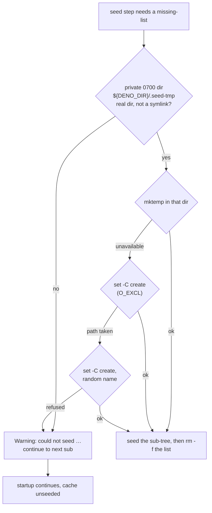

## Summary

`container/entrypoint.sh` built the deno-seed missing-file list in a
predictable, PID-based path in world-writable `/tmp`
(`/tmp/vibe-deno-seed-$$.<sub>`) whenever `mktemp` failed, opened with a plain
`>` redirect — no `O_EXCL`, no symlink guard (CWE-367). A symlink pre-placed
there by another local process would have redirected the write, and a file
swapped between the write and the `tar -T` read would have controlled what was
extracted into the Deno cache.

The list now comes from `vibe_private_temp_file`, which creates it inside a
0700 directory the container owns (`${DENO_DIR}/.seed-tmp`) on the durable
cache volume. `mktemp` is still the normal path; when it is unavailable the
fallback creates the file under `set -C`, whose `O_EXCL` open fails on an
existing file or symlink instead of following it, and retries once under a
random name so a leftover from a killed launch cannot strand the fallback
permanently. A path that cannot be created safely is reported, not written
through: the seed step emits the existing `Warning: could not seed …` line and
container startup continues unseeded.

Closes #1522.

## Evidence

Backend/CLI change with no web interface, so no screenshot applies. The
evidence is the test suite, run against both the unfixed and the fixed script.

Against the **unfixed** `entrypoint.sh` the regression case named the
vulnerable path directly:

```
AssertionError: the seed list must live under the private cache:
  /tmp/vibe-deno-seed-18162.npm
FAILED | 0 passed | 2 failed
```

After the fix:

```
entrypoint - deno-seed keeps its missing-list out of shared /tmp when mktemp fails (Issue #1522) ... ok
entrypoint - deno-seed refuses to write through a symlink at its temp path (Issue #1522) ... ok
entrypoint - deno-seed degrades to a warning when no private temp file can be created (Issue #1522) ... ok
ok | 41 passed | 0 failed   (whole tests/container_entrypoint_test.ts)
```

The symlink guard was confirmed load-bearing by removing `set -C` from the
fallback and re-running: the canary case fails, so the assertion is testing the
guard rather than passing by accident.

`bash -n`, `shellcheck container/entrypoint.sh` and `./quality.sh` all pass
(`Result: PASSED (with skipped checks)` — `config integration` is skipped on
this host as it always is).

**Original trigger closed, no trivial bypass.** The `/tmp/vibe-deno-seed-$$.…`
path no longer exists anywhere in the script — the seed block's only temp path
comes from `vibe_private_temp_file`, which is given `${DENO_CACHE_DIR}/.seed-tmp`
and never a caller-influenced or environment-influenced directory. Inside that
helper every route to a filename ends at a create the attacker cannot win:
`mktemp` (O_EXCL by definition) or a `set -C` redirect (O_EXCL, which fails on a
symlink whether or not its target exists). The directory itself is verified to
be a real directory, not a symlink (`[[ -d && ! -L ]]`), and its mode is forced
to 0700 with the `chmod` failure treated as a failure — so a permissive or
attacker-substituted directory ends the seed step rather than being written in.
Both remaining bypass shapes are closed by construction: pre-placing a file at
the deterministic fallback name only makes the create fail (the run moves to a
random name, and the planted file is neither followed nor truncated), and
winning the race on the random name likewise fails the O_EXCL open, which
degrades to the warning.



## Acceptance Criteria

<!-- vibe-spec-review inputs="diff+issue-body" -->

- **met** — the fallback path is no longer both predictable and unguarded —
  evidence: `container/entrypoint.sh:81-112` (`vibe_private_temp_file`: a 0700
  container-owned directory, `mktemp` first, `set -C` O_EXCL fallback, random
  retry) and `container/entrypoint.sh:406` (`DENO_SEED_TMP_DIR`) —
  reviewer: met
- **met** — an unsafe temp file degrades gracefully with the existing warning
  and never aborts startup — evidence:
  `worker/deno/tests/container_entrypoint_test.ts::entrypoint - deno-seed degrades to a warning when no private temp file can be created (Issue #1522)`
  — reviewer: met
- **met** — `rm -f "${missing_list}"` still runs on every path and the loop
  still processes the remaining `sub` — evidence: the degradation test asserts
  both the `npm` and the `remote` warning, and the fallback test asserts an
  empty `.seed-tmp` after the run — reviewer: partial — reason: the reviewer
  read the bail-out `continue` as skipping `rm -f`; on that path no file was
  created, so there is nothing to remove — the helper returns non-zero only
  when every create failed
- **met** — both `sub` iterations unchanged on the normal `mktemp` path —
  evidence: the pre-existing seed cases in
  `worker/deno/tests/container_entrypoint_test.ts` pass untouched (41 passed,
  0 failed) — reviewer: met
- **met** — verification that startup still seeds the cache correctly —
  evidence:
  `worker/deno/tests/container_entrypoint_test.ts::entrypoint - deno-seed keeps its missing-list out of shared /tmp when mktemp fails (Issue #1522)`
  asserts `seeded the Deno cache` and both sub-trees present with `mktemp`
  stubbed to fail — reviewer: met — reason: the reviewer noted this is scripted
  rather than a live container run against an empty volume; the in-image
  re-run of these tests in `container-build.yml` covers the image's own
  `mktemp`/`tar`
- **unrequested** — `docs/CONTAINER-IMAGE.md` gains a sentence on the private
  `.seed-tmp` list and the degraded-startup behaviour — reviewer: unrequested —
  reason: the repo standard requires a docs change for a documented behaviour
  change; that section already describes what the entrypoint copies at start

## Standards Review

<!-- vibe-standards-review inputs="diff+CODING-STANDARDS.md" -->

- **violation** — a discarded `chmod` failure (`chmod 700 … || true`) breached
  the never-fail-silently rule: an existing permissive directory would have
  been used with exit 0 — evidence: `container/entrypoint.sh:89` — reason:
  fixed in this diff — the chmod failure now returns 1, and the directory is
  additionally checked to be a real directory rather than a symlink
- **violation** — the security-critical `set -C` branch had no test, breaching
  the error-path coverage rule — evidence:
  `worker/deno/tests/container_entrypoint_test.ts:1183` — reason: fixed in this
  diff — the new symlink case plants a symlink at the fallback path and asserts
  its target is untouched; removing `set -C` makes that case fail
- **violation** — a 121-column line in a paragraph wrapped at ~76 —
  evidence: `docs/CONTAINER-IMAGE.md:221` — reason: fixed in this diff (rewrapped)
- **violation** — new decision logic in shell rather than Deno TypeScript —
  evidence: `container/entrypoint.sh:81-112` — reason: it stands. The
  entrypoint is process 1 before any Deno process exists, so this branch cannot
  live in `worker/deno/`; it mirrors the file's existing `vibe_first_writable_dir`
  helper and is covered by real spawned-script tests
- **clean** — Australian English throughout ("optimisation", no American
  spellings introduced); docs updated in the same change; commit messages carry
  the issue reference and the `Vibe-Coder-Run-Id` trailer; no hidden paths
  staged; tests spawn the real `entrypoint.sh` and assert on `tar` argv,
  filesystem state, directory mode and stderr rather than grepping source; no
  sleeps, retry loops or wall-clock thresholds; `@std/assert` only; no existing
  test removed or commented out

## Test Plan

Added to `worker/deno/tests/container_entrypoint_test.ts`:

- `entrypoint - deno-seed keeps its missing-list out of shared /tmp when mktemp fails (Issue #1522)`
  — the regression test. With `mktemp` shimmed to fail and `tar` shimmed to log
  its argv, it asserts the `-T` list handed to `tar` for both `npm` and
  `remote` lives under the private cache directory (0700, no group/other bits)
  and not in the `/tmp` root, that both sub-trees are still seeded, and that no
  list is left behind. It **fails against the unfixed code** with
  `the seed list must live under the private cache: /tmp/vibe-deno-seed-18162.npm`
  and passes after the fix.
- `entrypoint - deno-seed refuses to write through a symlink at its temp path (Issue #1522)`
  — plants a symlink at the fallback path aimed at a canary file, asserts the
  canary is never written and the link never followed or removed, and that
  seeding still completes around it. Fails if `set -C` is removed.
- `entrypoint - deno-seed degrades to a warning when no private temp file can be created (Issue #1522)`
  — a plain file where the private directory belongs; asserts exit 0, the
  driver still exec'd, both sub warnings emitted, and nothing copied.

Unchanged and still passing: the four pre-existing Issue #4392 seed cases and
the rest of the file (41 passed, 0 failed), plus `./quality.sh`.
