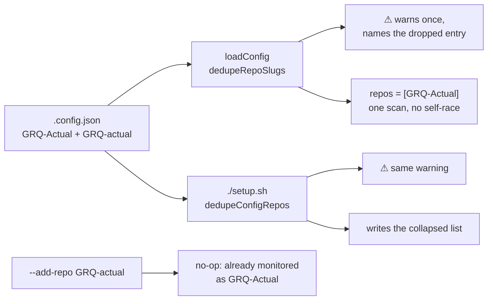

## Summary

`repos` accepted one repository under two casings, so the worker scanned it
twice and its own two slots raced each other for its issues. GitHub repository
names are case-insensitive; nothing in the worker knew that.

`lib/repo_slug.ts` gains `dedupeRepoSlugs` — first spelling wins, every drop
returned rather than swallowed — and `duplicateRepoSlugWarnings`, which turns
those drops into operator-facing sentences. `loadConfig` and the setup config
writer both use it, so the collapse happens once and is reported the same way
in both places. `addRepoToMonitoredList` now compares case-insensitively and
hands back the spelling already in the list. Closes #1546.

## Evidence

Backend/CLI change with no web interface, so no screenshot applies. The
evidence is the test run: `./quality.sh` passes end to end (deno tests, lint,
type check, fmt, semgrep, markdownlint, completeness checks), and the
reproduction below was driven red-then-green by hand.

## Reproduction

- **symptom** — a `.config.json` listing `stSoftwareAU/GRQ-Actual` and
  `stSoftwareAU/GRQ-actual` loaded as two repositories, so every per-repo scan
  ran twice and the worker's two slots raced each other for the same issue
- **status** — `verified` — a scratch test asserting `config.repos` collapses to
  one entry was run against `HEAD~1:worker/deno/lib/config.ts` (the unfixed
  loader) and failed with `AssertionError`, then passed unchanged against the
  fixed loader. The scratch file was deleted; the same behaviour is covered
  permanently by the regression test below.
- **regression test** —
  `worker/deno/tests/config_test.ts::config - loadConfig collapses a case-variant repos entry, keeping the first spelling`

## Acceptance Criteria

<!-- vibe-spec-review inputs="diff+issue-body" -->

- **met** — a `.config.json` with `GRQ-Actual` and `GRQ-actual` loads as one
  repository, and the log says which entry was dropped and why, once —
  evidence: `worker/deno/lib/config.ts:410` and
  `worker/deno/tests/config_test.ts::config - loadConfig warns about the duplicate once per process (Issue #1546)`
  — reviewer: met
- **met** — `./setup.sh` on such a file prints the same warning before writing
  configuration — evidence: `worker/deno/setup/config_writer.ts:127` (the
  collapse and its warnings precede `writeConfigFile`) and
  `worker/deno/tests/setup_config_writer_test.ts::runConfigSetup - warns about a case-variant repos entry and writes one`
  — reviewer: met — reason: the reviewer's first pass returned `partial`,
  because interactive `setup.sh`/`setup.ps1` merged the operator's raw answer
  back over the de-duplicated list; that is fixed in `c61d8838` (the answer now
  reaches the writer through `VIBE_REPOS`) and the re-review returned `met`. It
  kept one nit — the warning is *printed* after the write, since
  `runConfigSetup` returns warnings and the CLI prints them, which is the
  repo's established pattern for the `repo_config` prune warnings; the operator
  sees both in the same run.
- **met** — `add-repo` for a case-variant of an existing repository is a no-op
  with a message, not a second entry — evidence:
  `worker/deno/lib/add_repo.ts:283` and
  `worker/deno/tests/add_repo_test.ts::addRepoToMonitoredList - refuses a case-variant of a monitored repo`
  — reviewer: met — reason: the reviewer noted `process-add-repo` posts "already
  present" without naming the differing spelling, unlike the CLI; left as is,
  since the issue asks for a no-op with a message and that is what it posts.
- **met** — the existing behaviour for a genuinely different repository
  (different owner or name) is unchanged — evidence:
  `worker/deno/tests/repo_slug_test.ts::dedupeRepoSlugs - keeps a genuinely distinct list unchanged`
  and the distinct-list cases in `config_test.ts` and
  `setup_config_writer_test.ts` — reviewer: met
- **missing** — optionally canonicalise to the casing GitHub reports
  (`gh repo view --json nameWithOwner`) — reviewer: missing — reason: the issue
  marks it optional; it would put a network call in the config load, so the
  first spelling wins instead.
- **unrequested** — the interactive `repos` answer in `setup.sh`/`setup.ps1`
  now reaches `.config.json` through `VIBE_REPOS` instead of the post-write jq
  merge — evidence: `setup.sh:1538`, `setup.ps1:1668` — reviewer: unrequested —
  reason: without it the merge wrote the duplicate list straight back over the
  collapsed one, so the acceptance criterion above was cosmetic only. It also
  closes an unrelated gap the reviewer flagged: interactive slugs now pass
  `assertValidRepoSlugs` (Issue #1291), so a typo'd slug fails loudly at the
  prompt instead of landing in the file unvalidated.
- **unrequested** — exact-duplicate `repos` entries are collapsed too, with
  their own sentence (`"org/one" is listed twice`) — evidence:
  `worker/deno/lib/repo_slug.ts:153` — reviewer: unrequested — reason: an
  identical entry causes the identical double-scan; the separate wording exists
  because "duplicates itself" would misdescribe it.
- **unrequested** — a `repo_config` block keyed to the dropped spelling is
  named in a second warning — evidence: `worker/deno/lib/repo_slug.ts:169` —
  reviewer: unrequested — reason: both reviewers flagged that such a block
  survives the rewrite but is never read again (per-repo lookups are exact-key),
  which is per-repo settings lost silently — the one silence this change would
  otherwise have introduced.
- **unrequested** — `_resetDuplicateRepoWarning` is exported from `config.ts`
  as test-only API — evidence: `worker/deno/lib/config.ts:1147` — reviewer:
  unrequested — reason: the once-per-process warning needs re-arming in tests;
  it copies the adjacent `_resetRemovedTrustKeyWarning` rather than inventing a
  pattern.

## Standards Review

<!-- vibe-standards-review inputs="diff+CODING-STANDARDS.md" -->

- **violation** — the operator-supplied spelling was printed to setup output
  without the module's own inert rendering, against the contract
  `repo_slug.ts` itself states (Issue #1291) — evidence:
  `worker/deno/setup/setup_cli.ts:1445` — reason: fixed in `c61d8838`; the
  message now passes through `renderInertRepoSlug`.
- **violation** — `docs/CONFIGURATION.md` claimed `./setup.sh` writes the
  collapsed list back, which the interactive path did not do — evidence:
  `docs/CONFIGURATION.md:4291` — reason: fixed in `c61d8838` by making the
  claim true (the interactive answer now goes through the writer), not by
  softening the sentence.
- **violation** — `docs/ADD-REPO.md` implied case-insensitive matching for both
  `--add-repo` and `--remove-repo`; only add changed — evidence:
  `docs/ADD-REPO.md:41` — reason: fixed in `c61d8838`; the paragraph now scopes
  the claim to `--add-repo` and says `--remove-repo` still matches exactly.
- **violation** — the test file did not follow the module→test naming
  convention (`lib/repo_slug.ts` → `tests/repo_slug_test.ts`) — evidence:
  `worker/deno/tests/repo_slug_dedup_test.ts:1` — reason: fixed in `c61d8838`;
  renamed to `tests/repo_slug_test.ts`.
- **violation** — a new module-level mutable singleton in production code with
  a test-only reset — evidence: `worker/deno/lib/config.ts:1145` — reason:
  stands. It is the file's established pattern for a once-per-process migration
  notice (`warnedRemovedTrustKeys` sits three lines below it); introducing a
  clock/registry seam for one warning would be a larger, unrequested change to
  the config loader.
- **violation** — no PR summary file in the diff — evidence:
  `docs/archive/pr-summaries/` — reason: this file; the reviewer ran before it
  was written, as the workflow prescribes.
- **not-a-violation** — the reviewer reported that de-duplicating before
  `pruneOrphanRepoConfig` deletes a `repo_config` entry keyed under the dropped
  casing — evidence: `worker/deno/setup/config_setup.ts:365` — reason: the
  prune lower-cases both sides, and the kept spelling lower-cases to the same
  key, so the entry survives. The Spec reviewer independently reached the same
  conclusion. The real consequence — it survives but is no longer *read* — is
  handled by the new warning above.
- **clean** — Australian English throughout; DRY (one helper shared by loader
  and setup writer rather than two comparisons, and no dedupe logic added to
  shell or PowerShell); fail-loud (every dropped entry surfaced, nothing
  swallowed); tests call real functions and assert on returned values or
  written file contents; edge cases covered (empty list, exact duplicate, owner
  casing, three-way variants, whitespace, distinct repositories); `Result<T>`
  conventions preserved; no hidden path staged; commit messages carry the issue
  and the run-id trailer; no consumer bypasses the de-duplication — every
  `config.repos` reader takes a `WorkerConfig` from `loadConfig`.

## Test Plan

Added:

- `worker/deno/tests/repo_slug_test.ts` — 14 cases over `dedupeRepoSlugs`,
  `duplicateRepoSlugWarning` and `duplicateRepoSlugWarnings`: distinct lists,
  name casing, owner casing, exact duplicates, three-way variants, whitespace,
  empty input, exact warning wording, inert rendering, and the `repo_config`
  orphan sentence.
- `worker/deno/tests/config_test.ts` — the loader collapses a case-variant and
  names it, leaves distinct repositories alone, and warns once per process.
- `worker/deno/tests/add_repo_test.ts` — a case-variant is refused with the
  existing spelling and no rewrite; an exact match reports no differing
  spelling; a differently-owned repository is still added.
- `worker/deno/tests/setup_config_setup_test.ts` — `dedupeConfigRepos` collapses,
  leaves distinct lists untouched, no-ops on an absent list, does not mutate its
  input, and warns about an orphaned `repo_config` key.
- `worker/deno/tests/setup_config_writer_test.ts` — `runConfigSetup` writes one
  entry and returns the warning; a distinct list warns about nothing.
- `worker/deno/tests/setup_config_atomic_write_test.ts` — `write_interactive_config`
  leaves `repos` to the TypeScript writer.

Modified (documented business-logic change): the existing
`write_interactive_config - merges the interactive answers on success` case no
longer expects `repos` to be merged by that function — the interactive answer
now reaches `.config.json` through `VIBE_REPOS` so it is validated and
de-duplicated, instead of being written back raw over the collapsed list.

`./quality.sh` passes end to end.
