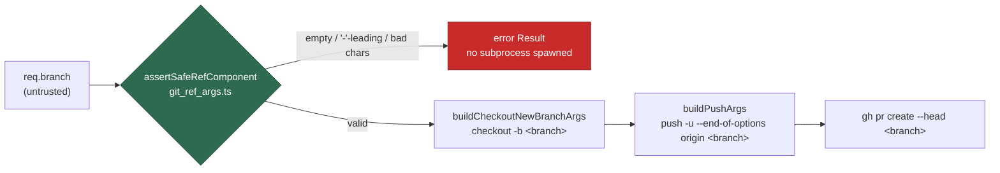

## Summary

`openCrossRepoFixPr()` built its `git checkout -b` and `git push -u origin` argv
arrays by hand from `req.branch`, validating only that the name was non-empty. A
dash-leading value — `--receive-pack=<cmd>` — reaching the push positional would
have been parsed by git as an option rather than a ref, which is remote command
execution with the worker's push credentials (CWE-88). The function is not wired
to a production caller today, so this was latent: the bug class the rest of the
tree is hardened against, waiting to be reachable.

The branch is now validated with `assertSafeRefComponent` from
`worker/deno/lib/git_ref_args.ts` **before any subprocess is spawned**, and both
argv arrays are built by the sanctioned builders (`buildCheckoutNewBranchArgs`,
`buildPushArgs`) — the same route every other git-ref call site in this codebase
takes.

The CI gate could not see the shape either, so both of its blind spots are
closed: `git_ref_argv_check.ts` anchored on the guarded verb sitting in the
array's _first_ slot, so an argv built for a generic runner
(`["git", "-C", dir, "push", …]`, where the binary occupies that slot) never
matched; and `req.branch` matched none of its untrusted-identifier patterns.

Closes #1548.

## Evidence

Backend/CLI change — no web interface to screenshot. The evidence is the
regression suite, run red against the unfixed code and green after the fix:

```text
# lib/cross_repo_fix.ts restored from 2499d80 (pre-fix), tests from this branch
FAILED | 0 passed | 3 failed | 30 filtered out (9ms)
  openCrossRepoFixPr - rejects a dash-leading branch before any command (Issue #1548)
  openCrossRepoFixPr - rejects a branch that is not a valid ref component (Issue #1548)
  openCrossRepoFixPr - git parses the branch as a ref, never as an option (Issue #1548)

# with the fix
ok | 3 passed | 0 failed | 30 filtered out (3ms)
```

Full gate: `./quality.sh` → `Result: PASSED (with skipped checks)` (the skip is
`config integration`, which needs a live config and is unrelated to this
change).

**Original trigger closed, no trivial bypass.** The attack input from the issue
— `branch = "--receive-pack=touch /tmp/pwned"` — is rejected at
`worker/deno/lib/cross_repo_fix.ts:514-521`, before the clone and before any git
subprocess exists, because `assertSafeRefComponent` refuses an empty or
dash-leading name and any name carrying whitespace, `~ ^ : ? * [ \` or `..`.
`req.branch` reaches git in exactly two places and both are now builder-built:
`checkout -b <branch>` (where `-b` consumes the next argv, so the name can never
be re-parsed as an option) and `push -u --end-of-options origin <branch>` (where
the separator makes every following argument a positional to git). There is no
third path — `req.branch` otherwise appears only as the value of
`gh pr create --head`, a flag-value slot, and in the default-branch comparison.
A near-miss bypass (a name git itself accepts but that carries a leading dash)
is impossible: git's own `check-ref-format` rejects the same set, so nothing
valid is refused and nothing dash-leading survives.



## Standards Review

<!-- vibe-standards-review inputs="diff+CODING-STANDARDS.md" -->

- **violation** — a code change owes a docs change: the new refusal path was not
  reflected in the operator manual — evidence: `docs/CROSS-REPO-FIX.md:74` —
  reason: fixed here; the `openCrossRepoFixPr` API entry now states the ref
  refusal, and the `vibe-cross-repo-pr` marker section states the `branch`
  attribute must be a valid ref component
- **violation** — "fake the external service, do not assert the request": the
  argv test pinned the request text (`--end-of-options` present, branch after
  it) — evidence: `worker/deno/tests/cross_repo_fix_test.ts:376` — reason: fixed
  here; the test now models git's own option-parsing rule (`parseGitPushArgv`)
  and asserts the decision git reaches, including that an option-shaped ref
  substituted into the produced argv is still parsed as a positional
- **violation** — the PR summary file was absent from the diff — evidence:
  `docs/archive/pr-summaries/pr-summary-1548.md` — reason: fixed here, this file
- **clean** — Australian English throughout; fail-loud (the validation error is
  re-surfaced as an error `Result`, nothing swallowed); DRY (both call sites
  delegate to the shared builders rather than duplicating validation); tests
  call real exported functions with data, no source-grepping; the four new cases
  are fast, parallel-safe and free of wall-clock assertions; no hidden paths or
  key material staged; the widened scanner run over the real tree reports 944
  files, 0 violations, and its pattern is linear on adversarial input (no ReDoS)

## Acceptance Criteria

<!-- vibe-spec-review inputs="diff+issue-body" -->

The issue states no `## Acceptance Criteria` section; the entries below are the
Spec reviewer's verdicts against the requirements in its "Suggested fix".

- **met** — route `req.branch` through the `git_ref_args.ts` helpers before the
  `checkout -b` call — evidence: `worker/deno/lib/cross_repo_fix.ts:513` and
  `:563` — reviewer: met
- **met** — route `req.branch` through the same helpers before the `push` call —
  evidence: `worker/deno/lib/cross_repo_fix.ts:614`
  (`buildPushArgs("origin", req.branch, { setUpstream: true })`) — reviewer: met
- **met** — match every other git-ref call site in the codebase — evidence:
  `worker/deno/lib/cross_repo_fix.ts:40-42` imports the shared builders; no
  hand-built ref argv remains in the module — reviewer: met
- **met** — run `deno task check` and the existing
  `tests/cross_repo_fix_test.ts` suite — evidence: full `./quality.sh` passed;
  `tests/cross_repo_fix_test.ts` 33 passed, 0 failed — reviewer: met
- **partial** — widen the CI gate so this call shape cannot bypass it —
  evidence: `worker/deno/lib/git_ref_argv_check.ts:89` (new
  `GIT_REF_ARGV_BINARY_HEAD_PATTERN`) and `:113` (`.branch` joins the untrusted
  identifiers), covered by
  `worker/deno/tests/git_ref_argv_check_test.ts::scanner - flags a binary-head argv built for a generic runner (Issue #1548)`
  — reviewer: missing — reason: the reviewer marked this missing because the
  issue named `git_spawn_chokepoint_check.ts` and that file is untouched;
  departed from deliberately — the CWE-88 gate for this class is
  `git_ref_argv_check.ts`, and it is widened here (replayed against the pre-fix
  file, it now flags both defect sites). Widening the _spawn_ chokepoint is the
  separate Issue #1214 timeout/journal invariant with a tree-wide blast radius,
  filed as follow-up #1553
- **unrequested** — `.branch` added to `GIT_REF_ARGV_UNTRUSTED_IDENTIFIER`,
  making any `<expr>.branch` in an unguarded verb argv a build failure —
  reviewer: unrequested — reason: without it the widened pattern still would not
  have caught `req.branch`, the exact identifier this issue is about; zero false
  positives across the tree (944 files, 0 violations)
- **unrequested** — new gate tests in
  `worker/deno/tests/git_ref_argv_check_test.ts` — reviewer: unrequested —
  reason: they cover the widened gate above; a gate change without tests is
  untested code

## Test Plan

Added to `worker/deno/tests/cross_repo_fix_test.ts`:

- `openCrossRepoFixPr - rejects a dash-leading branch before any command (Issue #1548)`
  — the issue's own attack input (`--receive-pack=touch /tmp/pwned`) returns an
  error `Result` and **no command is spawned at all**. Fails against the unfixed
  code (which pushed it) and passes after the fix.
- `openCrossRepoFixPr - rejects a branch that is not a valid ref component (Issue #1548)`
  — `fix/bad:refspec` is refused before any subprocess. Fails against the
  unfixed code, passes after the fix.
- `openCrossRepoFixPr - git parses the branch as a ref, never as an option (Issue #1548)`
  — parses the produced push argv with a model of git's own rule
  (`--end-of-options` terminates option parsing) and asserts the branch lands in
  the ref slot; substituting an option-shaped value into that argv still parses
  as a positional. Fails against the unfixed code (no separator, so the
  substituted value is an option), passes after the fix.

Added to `worker/deno/tests/git_ref_argv_check_test.ts`:

- `scanner - flags a binary-head argv built for a generic runner (Issue #1548)`
  — the pre-fix shape
  `["git", "-C", repoDir, "push", "-u", "origin", req.branch]` is now a gate
  violation.
- `scanner - a guarded binary-head argv is not a violation (Issue #1548)` — the
  builder-shaped argv, a non-ref verb (`add -A`), and a non-branch identifier
  stay clean.

Existing suites unchanged and passing; no test was removed or disabled.
