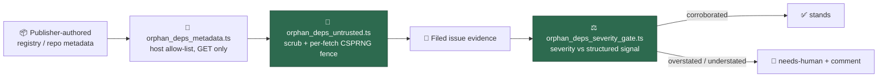

## Summary

The `orphan-deps` scan is the one idle-task template allowed to read live
third-party text mid-run, and that text was fenced by **prompt wording alone**.
The native pre-filer quoted a registry `deprecated` message and a declared
source-repo URL straight into a finding's `## Evidence`, so a forged
`---END UNTRUSTED …` boundary or a planted `<!-- finding-id: BP-… -->` reached
the filed GitHub issue verbatim — and the LLM half's severity verdict reached
`gh issue create` with nothing deterministic checking it.

This change gives that path the same **structural** boundary every other
untrusted-text path already gets from `prompt_delimiter.ts`, plus a
machine-checkable severity gate:

- **`worker/deno/lib/orphan_deps_untrusted.ts`** (new) — `fenceFetchedMetadata`
  scrubs delimiter/HTML-comment patterns and wraps a fetched document in a
  **per-fetch CSPRNG boundary**; `scrubMetadataValue` scrubs a single fetched
  field and collapses it onto one line. Both cap visibly
  (`… [truncated after N characters]`) — never a silent truncation.
- **`worker/deno/lib/orphan_deps_scanner.ts`** — every fetched value
  (`deprecated`, `sourceRepoUrl`, `lastPublishIso`, the extracted replacement)
  is now rendered through those helpers. `boundaryId` is injectable so tests pin
  the nonce; production mints a fresh one per finding.
- **`worker/deno/lib/orphan_deps_severity_gate.ts`** (new) — after a run files
  its findings, each one's `severity:<band>` is re-derived against the
  structured signals the worker can check. `severity:high` needs a cited
  registry `deprecated` / `yanked` flag or an archived source repository
  (**overstated** otherwise); a body citing one of those may not claim a weaker
  band (**understated** — the downgrade the issue's exploit sketch aims for).
  Citations **inside** an untrusted fence do not count, so an attacker cannot
  corroborate a severity with their own quoted text. Nothing is relabelled
  automatically: the finding gets `needs-human` **plus** an explanatory comment,
  and lookup/escalation failures surface in the close summary rather than
  reading as a pass.
- **`orphan_deps_template.ts`** — runs the gate over the newly-filed set and
  folds the result into the wrapper close summary.
- Docs + prompt updated: `docs/ORPHAN-DEPS-SCAN.md` gains the boundary and gate
  sections (with a Mermaid flow), and the prompt's Hard Constraint 7 now tells
  the model to fence its own excerpts and states that its severity is checked.

Closes #1549.

## Evidence

Backend/CLI change — no web interface to screenshot. Verified by tests:
`deno test` over the four affected suites (96 tests) and the full `./quality.sh`
gate.

```
=== Quality Check Summary ===
  completeness checks            PASSED
  markdownlint                   PASSED
  semgrep                        PASSED
  deno tests                     PASSED
  deno lint / type check / fmt   PASSED
Result: PASSED (with skipped checks)
```

Data flow after the change:



### Regression test and its linkage

Added
`worker/deno/tests/orphan_deps_untrusted_test.ts::classifyOrphan - scrubs an injected source-repo URL (Issue #1549)`,
which reproduces the flaw: it drives the real `classifyOrphan` with a
publisher-authored source-repo URL carrying a forged untrusted boundary and
asserts the forged marker never reaches the finding's evidence. It was observed
**failing against the unfixed scanner** (the URL was interpolated raw) and
**passing after the fix**.

Two siblings in the same file went red the same way against the unfixed code and
green after it — the injected-`deprecated`-message fence test and the
forged-`finding-id` test — so the reproduction covers the document fence as well
as the field scrub. Measured: 3 failed / 11 passed before the fix, 14 passed
after.

### Original trigger is closed, with no trivial bypass

The reported trigger is a package whose publisher-controlled metadata is read
while scanning a victim repo. That text now reaches a filed body only through
`fenceFetchedMetadata` / `scrubMetadataValue`, so:

- a forged closing boundary cannot end the fence — the nonce is minted per fetch
  from `crypto.getRandomValues` and is not in the attacker's document, and
  `sanitiseDelimiterPatterns` degrades any boundary-shaped text inside it;
- a planted `<!-- finding-id: … -->` cannot form — `neutraliseHtmlComments`
  breaks the comment sequences, so the dedup-poisoning variant is closed too;
- a multi-line field cannot break its line — control/format characters collapse
  to a space before interpolation;
- padding past the cap is not a bypass — truncation happens **before** the
  scrub, so a marker split by the cut is still neutralised, and the cut is
  rendered visibly;
- steering the verdict rather than the structure is caught by the severity gate,
  and steering _that_ by planting `archived: true` in the quoted text fails
  because `stripFencedUntrustedText` removes the fenced region first — including
  an unterminated fence, which is treated as running to end of body so omitting
  the closing marker is not an escape.

## Test Plan

- **Added** `worker/deno/tests/orphan_deps_untrusted_test.ts` (14 tests) — nonce
  freshness per fetch, forged closing marker, forged finding-id marker, visible
  truncation, single-line collapse, and the four `classifyOrphan` integration
  cases (injected `deprecated`, forged boundary, forged marker, injected
  source-repo URL) plus a benign-message case proving evidence still reads
  plainly.
- **Added** `worker/deno/tests/orphan_deps_severity_gate_test.ts` (14 tests) —
  fence stripping (complete and unterminated), strong-signal detection including
  the planted-inside-the-fence case, all four verdict statuses, and
  `verifyFiledOrphanSeverities` end to end: flag + comment + label, corroborated
  finding untouched, an unreadable issue recorded as a failure rather than a
  pass, and a failed escalation recorded rather than swallowed.
- **Modified** `worker/deno/tests/orphan_deps_template_test.ts` — the shared
  `gh` stub now answers the gate's `--json labels,body` read (defaulting to a
  corroborated finding so existing expectations hold), plus a new
  `runTask - an uncorroborated severity is flagged in the summary (Issue #1549)`.
- **Modified** `worker/deno/tests/unfenced_untrusted_text_test.ts` — the
  asserted trust-rule sentence list was **deliberately** updated (the file's own
  comment requires a deliberate edit rather than a quiet reword): the sentence
  claiming the prompt rule is the _only_ signal is replaced by the strengthened
  "fence it yourself before you quote it", and the severity-gate sentence is
  added. No test was removed or weakened.
- **Ran** `./quality.sh` — PASSED.
