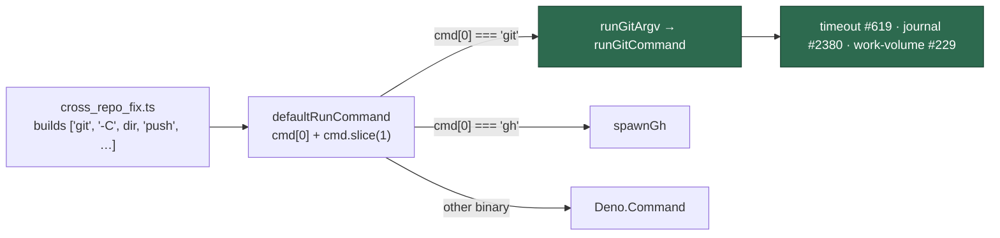

## Summary

`worker/deno/commands/resolve_cross_repo_dep.ts` supplied a fully generic
pass-through spawner — `new Deno.Command(cmd[0]!, { args: cmd.slice(1) })` — and
its callers hand it `git` argv built in `lib/cross_repo_fix.ts` (clone,
`checkout -b`, `add`, `commit`, `push`). Those `git` subprocesses ran outside
`runGitCommand` and therefore outside all three controls it owns: the
`AbortController` timeout (Issue #619), the git-mutation audit journal (Issue
#2380) and the work-volume fault detector (Issue #229).

The `git spawn chokepoint` gate could not see it. Its variable-binary rule only
fires when the **same module** names the binary in an argv literal, and the
string `git` never appears in `resolve_cross_repo_dep.ts` — the argv is built
elsewhere. The gate reported a clean tree.

Both halves are fixed. Closes #1553.

1. **`runGitArgv` in `lib/git_timeout.ts`** — the chokepoint now offers an
   adapter for a full argv whose head is the binary. It strips the `git` head,
   calls `runGitCommand`, and reports a `Result` error (a redaction refusal, a
   spawn failure) as an unsuccessful call carrying the message rather than
   swallowing it. Delegation is one line per runner, written once instead of
   five times.
2. **Five pass-through runners delegate `git`** — `resolve_cross_repo_dep.ts`
   (the reported case), `commands/process_add_repo.ts`,
   `lib/purge_stale_workflow_issues.ts`, `lib/untrusted_command_env.ts` and
   `setup/screenshot.ts`. Each already dispatched `gh` to `spawnGh` or spawned
   blind; `git` now takes the same route.
3. **The gate is widened** — `PASS_THROUGH_SPAWN_PATTERN` in
   `spawn_chokepoint_scan.ts` matches an argv-head spawn
   (`new Deno.Command(cmd[0]!, …)`), and `GIT_INDIRECT_SPAWN_RULES` opts in via
   `flagArgvHeadSpawn`. Such a spawn is a violation in any scanned module that
   does not import `git_timeout.ts`, whatever its argv literals say — because
   its callers live in other modules and no per-file scan can see them.

### Modules the widened gate turned red

Seven. Five were fixed by delegating (above). Four are recorded in
`GIT_PASS_THROUGH_KNOWN_GAPS` as false positives, each with its reason in the
doc comment — in every one the argv head is built inside the module from
literals, so no caller can make it `git`:

| Module                  | Why exempt                                                                                                                    |
| ----------------------- | ----------------------------------------------------------------------------------------------------------------------------- |
| `quality_gate_phase.ts` | Runs the **repository's** own command under `clearEnv` + the untrusted account (#571/#572); routing would drop that isolation |
| `quality_helpers.ts`    | Spawns a locally-built `timeout … bash -c <command>`; the head is `timeout`/`bash`                                            |
| `quality_gate.ts`       | Runs the gate's own tools (`deno`, `bash`, `find`); its `env` is a whole-environment replacement (#1098) the chokepoint lacks |
| `software_updates.ts`   | Runs `brew`/`claude`/`deno`/`npm`/`which` under a caller-supplied `AbortSignal`; `gh` is already delegated by name            |

The exemption switches off **only** the pass-through rule. A literal
`new Deno.Command("git", …)` or a `runWithTimeout("git", …)` in those files is
still a violation.

## Evidence

Backend/CLI change with no web interface, so there is nothing to screenshot. The
evidence is the test suite and the gate:

- `deno test tests/git_argv_chokepoint_routing_test.ts tests/git_spawn_chokepoint_check_test.ts`
  — 21 passed, 0 failed.
- `./quality.sh` — full gate **PASSED**, including `git spawn chokepoint`
  running the widened rule over the real tree.

The routing is proved behaviourally rather than by inspection. The chokepoint
refuses an unreadable `git commit -F <path>` message with a
`[GIT_MESSAGE_UNREDACTABLE]` marker **before** any subprocess starts (Issue
#1284). A runner that spawns `git` itself cannot produce that marker, so its
presence is proof the argv went through `runGitCommand`.

## Reproduction

- **symptom** — `git` argv handed to `resolve_cross_repo_dep.ts`'s
  `defaultRunCommand` was spawned directly, with no timeout, no audit-journal
  entry and no work-volume fault detection, and the `git spawn chokepoint`
  quality check reported the tree clean
- **status** — `verified` — both regression tests were observed failing against
  the unfixed code and passing after the fix. The routing test failed to compile
  (`defaultRunCommand` was not exported, `runGitArgv` did not exist — the spawn
  had no delegation to export); the gate tests failed with
  `[] != [".../passthrough.ts:2"]`, the gate declaring the bypass shape clean
- **regression test** —
  `worker/deno/tests/git_argv_chokepoint_routing_test.ts::resolve-cross-repo-dep defaultRunCommand - a git argv is routed through the chokepoint`
  and
  `worker/deno/tests/git_spawn_chokepoint_check_test.ts::scanContentForGitSpawn - flags an argv-head pass-through runner whose callers live elsewhere (Issue #1553)`

## Test Plan

Added `worker/deno/tests/git_argv_chokepoint_routing_test.ts`:

- `runGitArgv - drops the git head and runs the rest through the chokepoint`
- `runGitArgv - a non-zero git exit is reported as a failure`
- `runGitArgv - the chokepoint's message-redaction refusal is surfaced`
- `resolve-cross-repo-dep defaultRunCommand - a git argv is routed through the chokepoint`
- `resolve-cross-repo-dep defaultRunCommand - a non-git binary is still spawned directly`

Added to `worker/deno/tests/git_spawn_chokepoint_check_test.ts`:

- `flags an argv-head pass-through runner whose callers live elsewhere (Issue #1553)`
- `a pass-through runner that delegates git is compliant (Issue #1553)`
- `a spawn of a resolved binary is not a pass-through (Issue #1553)` — a
  module-resolved binary (`new Deno.Command(binary, …)`) is left to the narrower
  indirection rule
- `a pass-through runner in the scanned tree is caught (Issue #1553)` — the
  directory walk, against a real temporary tree

The pre-existing `the worker tree has no direct git spawns` test now runs the
widened rule over the real source tree, so it is the standing guard on the five
delegating runners. No existing test was removed or modified.

Re-run suites: `git_timeout_test.ts`, `cross_repo_fix_test.ts`,
`resolve_cross_repo_dep_test.ts`, `cross_repo_pr_handoff_test.ts`,
`spawn_chokepoint_scan_test.ts`, `spawn_chokepoint_indirection_1378_test.ts`,
`gh_spawn_chokepoint_check_test.ts`, `untrusted_command_env_test.ts`,
`purge_stale_workflow_issues_test.ts`, `process_add_repo_test.ts`,
`quality_gate_test.ts`, `setup_screenshot_test.ts` — all pass.

Docs: `docs/INTERNALS.md` gains the `runGitArgv` delegation rule and a Mermaid
diagram of the routing, next to the existing timeout-wrapper table.
