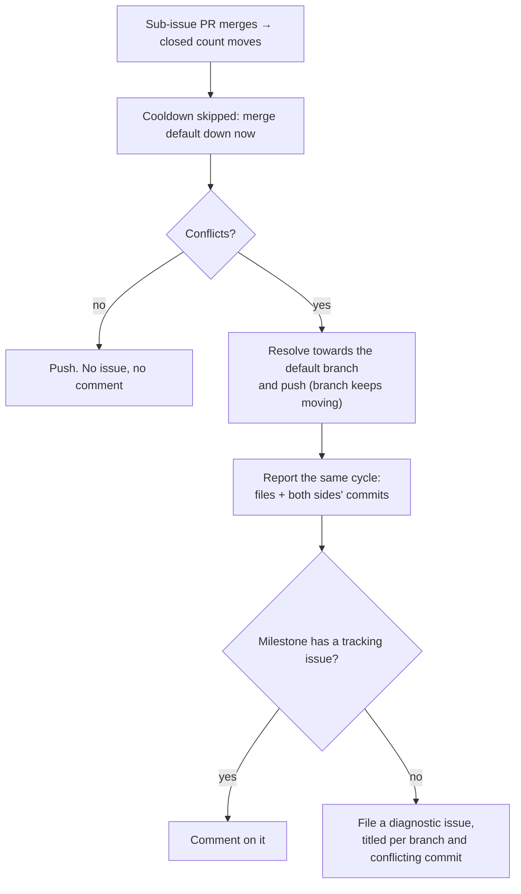

## Summary

A milestone branch closed its drift only on a cooldown boundary, and a merge
that conflicted was resolved towards the default branch **in silence** — so
the losing side of two independently evolved implementations surfaced days
later, at rollup, as a research project. Closes #1558.

Three changes:

1. **Cadence on closure.** A milestone whose REST `closed_issues` count has
   moved since the previous cycle — a sub-issue PR merged — skips the
   `milestone_sync_cooldown_seconds` guard and merges the default branch down
   now (`worker/deno/lib/milestone_branch_sync.ts`). The signal comes from the
   same cheap listing the Issue #1488 activity gate already fetches, so the
   extra cadence costs no additional API calls.
2. **The conflict travels with the outcome.** `syncMilestoneBranchWithDefault`
   now returns a `MilestoneSyncOutcome` carrying the conflicting files and the
   commit each side stood at, captured *before* `git merge --abort` discards
   them (`worker/deno/lib/git_pull.ts`,
   `worker/deno/lib/milestone_sync_conflict.ts`).
3. **Immediate escalation, naming both sides.** A conflicting merge still
   lands — the branch has to keep moving — but it is reported on that cycle,
   on the milestone's tracking issue or, where there is none, as a diagnostic
   issue titled per branch and per conflicting commit. The Issue #974 gate
   escalation and the Issue #4260 stuck-sync escalation now name both sides'
   commits too. A clean merge raises nothing.

The report is deduped on the conflicting default-branch commit
(`conflictEscalatedSha` in the streak file), so the same conflict reports once
and a conflict against a new commit reports again. Only a report that actually
went out is remembered — a failed escalation retries next cycle rather than
being marked done.

## Evidence

Backend/CLI change — no web interface to screenshot. Evidence is the test
suite below, run unattended, plus the full quality gate
(`./quality.sh < /dev/null` → `Result: PASSED (with skipped checks)`; the one
`SKIPPED` check is `config integration`, which is skipped on this host
independently of this change).

## Reproduction

- **symptom** — `main` was merged into a milestone branch only on a cooldown
  boundary, and a merge that conflicted was auto-resolved towards `main` and
  reported as a plain success: the branch's version of every conflicting file
  was replaced with no comment, no issue, and nothing naming either side's
  commits, so the loss surfaced at rollup time.
- **status** — `verified` — each regression test was observed failing against
  the unfixed code and passing after the fix. `milestone_sync_conflict_report_test.ts`
  and `milestone_sync_conflict_escalation_test.ts` failed against the pre-fix
  tree (the outcome carried no conflict at all). The cadence test was
  re-verified by removing `!milestone.closedCountChanged &&` from
  `worker/deno/lib/milestone_branch_sync.ts` and re-running: `FAILED | 1 passed
  | 1 failed`, green again once restored.
- **regression test** — `worker/deno/tests/milestone_sync_conflict_report_test.ts::syncMilestoneBranchWithDefault - a conflicting merge reports the files and both sides' commits (Issue #1558)`

## Acceptance Criteria

<!-- vibe-spec-review inputs="diff+issue-body" -->

- **partial** — While a milestone branch is open, `main` is merged into it automatically and repeatedly, not once at the end — evidence: `worker/deno/lib/milestone_branch_sync.ts:300,479`, `worker/deno/tests/milestone_sync_cadence_test.ts` — reviewer: partial — reason: the repeated merge-down already existed (priority 1.72 every cycle, `run_core_production_deps.ts:4467`, under a 3600 s cooldown), so the issue's premise that it "runs when the rollup is attempted" does not match this repo; this diff adds the after-each-sub-issue-PR trigger, but the hourly cooldown remains the floor for *`main`-side* movement, and a milestone with zero closed issues is still skipped entirely by the pre-existing #1488/#1786 gate.
- **met** — A clean merge is pushed without ceremony and without an issue — evidence: `worker/deno/tests/milestone_sync_conflict_escalation_test.ts::milestone sync - a clean merge raises nothing (Issue #1558)` — reviewer: met
- **met** — A merge that conflicts, or that fails the #974 tree check, escalates immediately rather than being retried silently until rollup — evidence: `worker/deno/lib/git_pull.ts:816` (captured before `merge --abort`), `worker/deno/lib/milestone_branch_sync.ts:543`, `worker/deno/tests/milestone_sync_conflict_escalation_test.ts::escalates on the first cycle` — reviewer: met — reason: the reviewer flagged, correctly, that the conflicting merge is still auto-resolved in `main`'s favour and pushed before the report goes out (Issue #605 behaviour, deliberately unchanged), so the escalation is a "check what was overwritten" notice rather than a block; blocking the merge would reintroduce the divergence this issue is about.
- **met** — The escalation names both sides' commits — evidence: `worker/deno/lib/milestone_sync_conflict.ts::describeBranchTips`/`resolveBranchTips`, wired into all three escalations; `worker/deno/tests/milestone_sync_conflict_test.ts::describeBranchTips - names each side, with or without a subject` — reviewer: met
- **unrequested** — both sides' commits added to the Issue #4260 stuck-sync escalation as well as the conflict and #974 gate escalations — evidence: `worker/deno/lib/milestone_branch_sync.ts` (`escalateSyncFailure`) — reviewer: unrequested — reason: kept; the acceptance criterion says "the escalation names both sides' commits" and a stuck sync is the escalation a reader most needs it on, at the cost of two `gh api` calls on an escalation that fires at most once per streak.
- **unrequested** — `docs/INTERNALS.md` and `docs/workflows/milestones.md` sections, Mermaid diagram and module-table row — evidence: `docs/INTERNALS.md:2933`, `docs/workflows/milestones.md:287` — reviewer: unrequested — reason: kept; the repo's "a code change owes a docs change" standard requires the changed cadence and the new module to be documented.

## Standards Review

<!-- vibe-standards-review inputs="diff+CODING-STANDARDS.md" -->

- **violation** — the new lib module was claimed by no sweep slice, failing `tests/lib_sweep_coverage_test.ts` — evidence: `docs/audits/lib-sweep-coverage.json:274` — reason: fixed here; `worker/deno/lib/milestone_sync_conflict.ts` registered in the slice beside the other milestone modules.
- **violation** — the cooldown row in the milestone operator manual no longer described the behaviour — evidence: `docs/workflows/milestones.md:287` — reason: fixed here; the row and the design notes now record the closure bypass and the conflict report.
- **violation** — silent fallback: an unreadable default-branch SHA became `""`, which never persisted as a dedup marker, so the same conflict would re-report every cycle — evidence: `worker/deno/lib/git_pull.ts:533`, `worker/deno/lib/milestone_branch_sync.ts:545` — reason: fixed here; the report falls back to a named `UNRESOLVED_SHA` so the side says it could not be read and the dedup still holds (`tests/milestone_sync_conflict_escalation_test.ts::a conflict whose commit could not be read is still reported once`).
- **violation** — bare `catch {}` swallowed every `gh api` failure in `resolveBranchTips` — evidence: `worker/deno/lib/milestone_sync_conflict.ts:105` — reason: fixed here; the lookup failure is logged through the caller's logger and the report says which side is degraded.
- **violation** — `buildConflict` was a wrapper with no behaviour (premature abstraction) — evidence: `worker/deno/lib/git_pull.ts:548` — reason: fixed here; the two call sites use object literals and the reasoning moved onto the interface.
- **violation** — the manual-resolution path reported the *aborted* first attempt's file list — evidence: `worker/deno/lib/git_pull.ts:937` — reason: fixed here; the report names `resolvedFiles`, the set the resolution actually operated on.
- **violation** — the module had no `tests/milestone_sync_conflict_test.ts` and `describeBranchTips` had no direct test — evidence: convention `lib/X.ts` → `tests/X_test.ts` — reason: fixed here; the pure unit tests were split into that file and `describeBranchTips` now has its own case.
- **clean** — Australian English throughout; fail-loud in the main path (a report is only marked sent when it went out); every new test calls real exported functions and asserts on results, with real git repositories for the git-side ones; happy/error/edge coverage on each new public function; no wall-clock sleeps or absolute timing assertions; no hidden or secret paths staged; Deno-native tooling only; the `Result<string>` → `Result<MilestoneSyncOutcome>` change carried through every caller and existing suite.

Known limitations, recorded rather than hidden: the closure signal is consumed
during discovery, so a closure whose merge-down was then skipped (branch
missing on the remote) or failed falls back to the ordinary cooldown; and the
ad hoc `sync-milestone-branches` command passes no `streakPath`, so a
recurring conflict re-reports per manual invocation — matching the existing
Issue #974 behaviour documented for that command.

## Test Plan

Added:

- `worker/deno/tests/milestone_sync_conflict_report_test.ts` — real git repos: a
  conflicting merge reports its files and both sides' commits; a clean merge
  reports no conflict.
- `worker/deno/tests/milestone_sync_conflict_escalation_test.ts` — escalates on
  the first cycle naming both sides; a clean merge raises nothing; the same
  conflict reports once while a new commit reports again; a milestone with no
  tracking issue gets a diagnostic issue; an unreadable commit still dedups.
- `worker/deno/tests/milestone_sync_conflict_test.ts` — the report module's own
  unit tests: comment contents, empty file list, tip resolution and its logged
  failure path, diagnostic titles.
- `worker/deno/tests/milestone_sync_cadence_test.ts` — a milestone that just
  closed an issue syncs despite the cooldown; an unchanged one still waits.

Modified (contract change only — `Result<string>` → `Result<MilestoneSyncOutcome>`,
so `result.value` became `result.value.message`; no test was removed or
weakened): `git_pull_conflict_test.ts`, `milestone_branch_selfheal_test.ts`,
`milestone_branch_sync_test.ts`, `milestone_sync_ancestry_test.ts`,
`milestone_sync_dirty_clone_test.ts`, `milestone_sync_merge_gate_test.ts`,
`milestone_sync_streak_test.ts`.

Full gate: `./quality.sh < /dev/null` → `Result: PASSED (with skipped checks)`.
