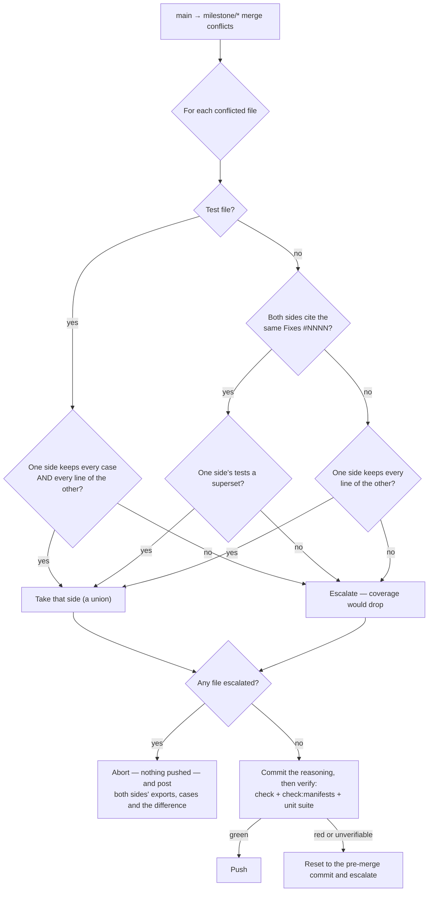

## Summary

A conflicted `main` → `milestone/*` sync had two moves, and both were wrong:
take the default branch's side wholesale (a decision nobody made, which
replaced the branch's version of every colliding file — test files included),
or hand the whole merge to a human days after both changes were written. The
sync now **triages** the conflict, resolves what is mechanical, verifies the
result the way a human's resolution would be verified, and escalates only what
genuinely needs judgement — with the analysis prepared. Closes #1559.

Three rules decide a conflicted file
(`worker/deno/lib/milestone_conflict_triage.ts` decides,
`worker/deno/lib/milestone_conflict_git.ts` reads the sides and applies the
decision):

1. **One side subsumes the other** — every line of the smaller side survives in
   the larger, so the larger is taken and nothing is lost. Checked first,
   because it needs no evidence about either side's tests.
2. **The same fix landed twice** — both sides' commits touching the file cite
   the same `Fixes #NNNN`, or carry this fleet's own `(Issue #N)` **subject**
   stamp. The side whose cases *for that issue* are a superset is kept, and the
   reason names what was dropped. Scoping to the cited issue is what makes the
   rule answerable: comparing every case either branch added compares two
   populations dominated by unrelated churn. Prose that merely mentions an
   issue number is not a claim to have fixed it, and is not read as one.
3. **Two designs for the same problem** — neither contains the other. The merge
   is **aborted** (nothing is pushed, the branch is exactly as it was) and the
   escalation carries both sides' exports, both sides' test names and the set
   difference between them.

One rule outranks all three: **no resolution may reduce test coverage**. A
conflicted test file is resolved by taking a side only when that side already
keeps every case *and* every line of the other. Otherwise it is merged as a
**union** — `git merge-file --union`, both sides' hunks kept — and the result
is checked case by case before it is staged; a union that would lose a case
escalates. Equal case names are not enough to take a side, because an assertion
changed inside a case with the same name is exactly the silent loss the issue
describes.

**Every automatic resolution is verified before it is pushed**
(`worker/deno/lib/milestone_resolution_gate.ts`): the merged tree must pass the
repository's own Issue #974 type check — reused, fallback and all, rather than
reimplemented — its `check:manifests` task and its unit suite (`test:unit`,
else `test`), inside one 15-minute budget so the sync cannot block the event
loop. A red tree is reset to the pre-merge commit and escalated with **both**
halves: what the verification said *and* both sides prepared. A tree with no
type check or no unit suite verified nothing and is refused the same way — a
resolution that cannot be verified is not a resolution. What was decided, and
why, is written on the merge commit and reported with the sync outcome; a
resolution the worker made and verified is a report, never a `needs-human`
issue.

Fail-loud throughout: a conflicted side git will not hand over is a refusal,
never "that side deleted the file", and test evidence that could not be read
decides nothing rather than reading as "neither side wrote a case".

### Business-logic change — three existing tests updated, none removed

The old behaviour (resolve every conflict towards the default branch and report
it afterwards) is what this issue replaces, so the three tests that pinned it
were updated to the new behaviour and the reasoning recorded in each:

- `tests/milestone_sync_ancestry_test.ts` — "a genuine content conflict still
  takes the default branch's side" became "a content conflict neither side
  contains is left for a human", plus a new sibling proving a *decidable*
  conflict still resolves and lands.
- `tests/milestone_sync_conflict_report_test.ts` — the `IndirectSpawnRules` vs
  `scanContentForVariableBinarySpawn` fixture is the issue's own case 3, so it
  now asserts the prepared escalation; a new sibling covers a resolvable
  conflict reporting `resolution: "auto"` and its decisions.
- `tests/milestone_sync_merge_gate_test.ts` — the Issue #974 "the gate also
  guards a conflict-resolved merge" fixture was made *decidable* (a superset
  conflict) so it still reaches the gate it is testing.

The Issue #1048 modify/delete rule is unchanged and still passes: a file the
default branch deleted stays deleted, and that rule is now read from
`merge_conflict_stages.ts` rather than restated.

## Evidence

Backend/CLI change — no web interface to screenshot. Evidence is the test suite
below, run unattended, plus the full quality gate
(`./quality.sh < /dev/null` → `Result: PASSED (with skipped checks)`; the one
`SKIPPED` check is `config integration`, skipped on this host independently of
this change).



What a resolved merge commit says (rendered from
`buildResolutionCommitMessage`):

```text
Merge 'main' into 'milestone/1559' — 1 conflict(s) resolved automatically

- `worker/deno/lib/spawn_runner.ts` — duplicate-fix, took the 'main' side: both
  sides fix #1264 — the same fix landed twice, and the default branch's
  implementation is kept because its tests are a superset of the other side's

Each resolution was verified before it was pushed: the merged tree passes the
repository's own check, its manifest check and its unit suite. No conflicted
test file was resolved by taking a side that drops cases (Issue #1559).
```

Docs updated in the same change: `docs/workflows/milestones.md` (new **Conflict
triage** section with the flowchart) and `docs/INTERNALS.md` (the sync section
and the module table).

## Acceptance Criteria

<!-- vibe-spec-review inputs="diff+issue-body" -->

- **met** — Cases 1 and 2 resolve without a human, with the reasoning recorded on the merge commit — evidence: `worker/deno/tests/milestone_sync_conflict_resolution_test.ts::syncMilestoneBranchWithDefault - the same fix landed twice resolves without a human, with the reasoning on the merge commit (Issue #1559)` — reviewer: partial — reason: the reviewer judged case 1 unreachable in production because the superset test pooled every case either branch added; it is now scoped to the issue both sides cite (`decideDuplicateFix`) and covered by `a duplicate fix is scoped to the issue both sides cite, not to unrelated churn`.
- **met** — Case 1 says what it dropped — evidence: `milestone_conflict_triage.ts::classifySourceFile` reason text, asserted by `case 1: both sides fix the same issue, the side whose cases for it are a superset wins` — reviewer: partial — reason: the reviewer found the reason named only the side kept; it now names the implementation dropped and the cases the kept side covers.
- **met** — Case 3 escalates with both sides' exports, both sides' test names, and the set difference between them — evidence: `worker/deno/tests/milestone_sync_conflict_analysis_escalation_test.ts::milestone sync - a case-3 conflict escalates on the first cycle with both sides' exports, cases and the difference (Issue #1559)` — reviewer: met
- **met** — Every automatic resolution is gated on a green tree; a red one is never pushed — evidence: `worker/deno/tests/milestone_sync_conflict_resolution_test.ts::syncMilestoneBranchWithDefault - a resolution nothing could verify is refused, not pushed (Issue #1559)`, which asserts `origin/milestone/*` is unchanged — reviewer: met
- **met** — A test file is never resolved by taking one side wholesale — evidence: `worker/deno/tests/milestone_sync_conflict_resolution_test.ts::syncMilestoneBranchWithDefault - a conflicted test file resolves as a union, never by taking one side (Issue #1559)` — reviewer: met — reason: the reviewer said "met (literal wording partial)" because a side is taken by `git checkout --ours/--theirs`; a side is now taken only when it already contains the other, and anything else is a union merge.
- **met** — A conflicted sync attempts resolution rather than escalating on sight, and escalates only case 3 — evidence: `worker/deno/tests/milestone_sync_conflict_escalation_test.ts::milestone sync - an automatically resolved conflict files no needs-human issue (Issue #1559)` — reviewer: partial — reason: the reviewer found an auto-resolved conflict still filed a `needs-human` diagnostic when the milestone had no tracking issue; it now logs the reasoning instead, and only an unresolvable conflict reaches a human.
- **met** — Verified with `deno task check` (the existing #974 gate), `check:manifests` and the full unit suite — evidence: `worker/deno/tests/milestone_resolution_gate_test.ts::verifyResolvedTree - runs the repo's type check, manifest check and unit suite` and `a failing Issue #974 type check fails the gate before anything else runs` — reviewer: partial — reason: the reviewer found the gate re-implemented the #974 check and so could skip it entirely (and could pass having run no tests); it now calls `checkMergedTree` itself and reports `skipped` when no unit suite ran.
- **met** — A resolution that cannot be verified is not a resolution — evidence: `git_pull.ts` maps a `skipped` verification to a refusal; `verifyResolvedTree - a tree the type check skipped is skipped, never passed` — reviewer: met
- **met** — Test-file conflicts resolve as a union, or they escalate — evidence: `milestone_conflict_git.ts::unionMergeConflictedFile`, asserted by `a conflicted test file resolves as a union, never by taking one side (Issue #1559)` and `a test file whose union would lose a case escalates instead (Issue #1559)` — reviewer: partial — reason: the reviewer was right that no union was ever constructed — a side was only taken when it already contained the other; a real `git merge-file --union` now runs and every case on both sides must survive it.
- **met** — When it escalates, the issue carries the prepared analysis, not just the compiler output — evidence: `MilestoneConflictEscalation.gateFailure` rendered by `buildConflictAnalysisComment`, asserted by `milestone_sync_merge_gate_test.ts::the gate also guards a conflict-resolved merge (Issue #974)` — reviewer: partial — reason: the reviewer found that a resolution the *gate* rejected escalated through the #974 path with raw task output only; that refusal now carries both halves.
- **unrequested** — a fourth automatic case, `incoming-delete`: a file the default branch deleted stays deleted — reviewer: unrequested — reason: it preserves the Issue #1048 rule the sync already had and its existing test; removing it would revive deleted code, which is the fault #1048 fixed.
- **unrequested** — `readTestEvidence`, which reads the cases each side wrote for the issues its commits cite — reviewer: unrequested — reason: the issue's own case-1 rule ("keep the side whose tests are a superset") cannot be answered from the conflicted files alone, because the branch writes its case in a file the default branch never touched.
- **unrequested** — a report comment for an automatic resolution (`resolution: "auto"`) — reviewer: unrequested — reason: it extends the Issue #1558 report the sync already posts, so a decision the worker made is visible; it files no issue and needs no human.
- **unrequested** — the `milestone_merge_gate.ts` split into `findProjectManifests` + `readManifestTasks` — reviewer: unrequested — reason: both gates must judge the same set of projects, and duplicating the walk would let them drift.
- **unrequested** — `docs/INTERNALS.md`, `docs/workflows/milestones.md` and `docs/audits/lib-sweep-coverage.json` — reviewer: unrequested — reason: this repo's standards require a code change to carry its docs change, and the sweep manifest must name every new lib module or `check:manifests` fails.

## Standards Review

<!-- vibe-standards-review inputs="diff+CODING-STANDARDS.md" -->

- **violation** — a side that could not be read was reported as "that side deleted the file", turning a transient git failure into a resolution nobody chose — evidence: `worker/deno/lib/git_pull.ts:996` (as reviewed) — reason: fixed here — `milestone_conflict_git.ts::readConflictedSides` reads the merge stages first and a stage that exists but will not read now fails the whole resolution.
- **violation** — unread test evidence was indistinguishable from "neither side's cases moved", so a duplicate fix could be resolved on evidence never gathered — evidence: `worker/deno/lib/git_pull.ts:952` (as reviewed) — reason: fixed here — `TestEvidence.complete` is false when git refused anything, and incomplete evidence decides nothing (`evidence git could not read decides nothing`).
- **violation** — the case-3 escalation reused `conflictEscalatedSha`, so a resolved-conflict report could silently suppress a needs-human escalation against the same commit — evidence: `worker/deno/lib/milestone_branch_sync.ts:626` (as reviewed) — reason: fixed here — the analysis escalation has its own `analysisEscalatedSha` key, as the #974 gate has its own flag.
- **violation** — the new `resolution === "auto"` branch of `buildConflictEscalationComment` had no test — evidence: `worker/deno/lib/milestone_sync_conflict.ts:179` — reason: fixed here — two cases added to `tests/milestone_sync_conflict_test.ts`.
- **violation** — a test asserted the contents of a constant rather than any behaviour — evidence: `worker/deno/tests/milestone_resolution_gate_test.ts:125` (as reviewed) — reason: fixed here — replaced by `resolutionTasksFor - the manifest check and one unit suite, most specific first`.
- **violation** — the same `git merge-base` invocation was computed twice per conflicted sync — evidence: `worker/deno/lib/git_pull.ts:896` and `:945` (as reviewed) — reason: fixed here — `readMergeBase` is called once and passed to both readers.
- **violation** — ~200 lines of milestone-conflict git plumbing were added to the already monolithic `git_pull.ts` — evidence: `worker/deno/lib/git_pull.ts:889-1120` (as reviewed) — reason: fixed here — moved to `worker/deno/lib/milestone_conflict_git.ts`; `git_pull.ts` is back below its pre-change size.
- **violation** — `resolutionGate` defaulted by testing function identity (`mergeGate === checkMergedTree`), a behaviour switch KISS asks to avoid — evidence: `worker/deno/lib/git_pull.ts:484` (as reviewed) — reason: fixed here — the resolution gate is now the strict gate composed from the injected one, with no identity test.
- **violation** — a dead fallback fabricated an empty `ConflictedFile` when a lookup missed, which would have produced a silently empty analysis — evidence: `worker/deno/lib/git_pull.ts:766` (as reviewed) — reason: fixed here — the analyses are built by filtering the sides that were actually read, so the impossible branch is gone.
- **violation** — up to three 15-minute tasks per project could run inside the sync loop the docs call best-effort — evidence: `worker/deno/lib/milestone_resolution_gate.ts:37` (as reviewed) — reason: fixed here — one `RESOLUTION_GATE_BUDGET_MS` across the whole verification, with each task given only what is left and exhaustion reported as a failure.
- **violation** — `milestone_conflict_triage.ts` mixes parsing, classification and two Markdown renderers in one 640-line module — evidence: `worker/deno/lib/milestone_conflict_triage.ts:1` — reason: stands — the renderers read the decision types they render, and splitting them into a third module would have them import the same types back; the git half was extracted instead, which is where the real size was.
- **violation** — a fixture teardown swallows its failure (`Deno.remove(...).catch(() => {})`) — evidence: `worker/deno/tests/milestone_sync_conflict_resolution_test.ts:109` — reason: stands — it matches the convention of every existing milestone sync fixture (`milestone_sync_conflict_report_test.ts`, `milestone_sync_ancestry_test.ts`); changing it here alone would be a lone deviation, and a failed temp-dir removal cannot mask a product fault.
- **clean** — Australian English throughout; Deno-native tooling only (`deno test`/`lint`/`fmt`/`check`, `@std/assert`, `Result<T>`); no hidden or credential paths staged; every commit cites `(Issue #1559)` and carries a `Vibe-Coder-Run-Id` trailer; no test deleted or commented out and the business-logic change documented; module↔test pairing for all three new modules; tests call real functions and drive real git repositories with no sleeps, no wall-clock thresholds and no ambient state; the Issue #1048 modify/delete rule and the Issue #4260 honest-failure paths preserved.

## Test Plan

New — `worker/deno/tests/milestone_conflict_triage_test.ts` (21 cases), over
the pure decision logic:

- `parseFixReferences - reads closing keywords, and only those`
- `parseStampedIssues - reads this fleet's '(Issue #N)' subject stamp, not body prose`
- `extractTestNames - finds Deno.test names in every shape the repo uses`
- `extractExports - names the exported symbols on a side`
- `isTestPath - test files are recognised by directory and by suffix`
- `isLineSuperset - true only when every line of the smaller side survives`
- `planConflictResolution - case 1: both sides fix the same issue, the side whose cases for it are a superset wins`
- `planConflictResolution - a duplicate fix is scoped to the issue both sides cite, not to unrelated churn`
- `planConflictResolution - a duplicate fix whose cases for that issue are incomparable escalates`
- `planConflictResolution - a duplicate fix neither side tested is not resolved on no evidence`
- `planConflictResolution - evidence git could not read decides nothing`
- `planConflictResolution - case 2: the side that keeps every line of the other is taken`
- `planConflictResolution - case 3: two designs for the same problem reach a human`
- `planConflictResolution - a test file is never resolved by taking a side that drops cases`
- `planConflictResolution - a test file resolves when one side is a genuine union of both`
- `planConflictResolution - a test file whose cases match but whose bodies differ is not decided by taking a side`
- `planConflictResolution - a file the default branch deleted stays deleted (Issue #1048)`
- `planConflictResolution - a deleted TEST file escalates rather than dropping its cases`
- `planConflictResolution - a file the milestone branch deleted and the default branch edited escalates`
- `buildResolutionCommitMessage - records the reasoning for every file it resolved`
- `buildConflictAnalysisComment - carries both sides' exports, test names and the difference`

New — `worker/deno/tests/milestone_resolution_gate_test.ts` (11 cases),
including `a failing Issue #974 type check fails the gate before anything else
runs`, `a tree with no unit suite is skipped: nothing ran the cases`, `a
verification that outruns its budget fails, it does not pass` and `each task is
given only the budget that is left`.

New — `worker/deno/tests/milestone_sync_conflict_resolution_test.ts` (real git
repositories throughout — bare remote, clone, both branches moved):

- `syncMilestoneBranchWithDefault - the same fix landed twice resolves without a human, with the reasoning on the merge commit (Issue #1559)`
- `syncMilestoneBranchWithDefault - a conflicted test file resolves as a union, never by taking one side (Issue #1559)`
- `syncMilestoneBranchWithDefault - a test file whose union would lose a case escalates instead (Issue #1559)`
- `syncMilestoneBranchWithDefault - a resolution nothing could verify is refused, not pushed (Issue #1559)`

New — `worker/deno/tests/milestone_sync_conflict_analysis_escalation_test.ts`:

- `milestone sync - a case-3 conflict escalates on the first cycle with both sides' exports, cases and the difference (Issue #1559)`
- `milestone sync - the same unresolvable conflict is reported once, a new one again (Issue #1559)`
- `milestone sync - without a streak file the analysis is logged, not repeated every cycle (Issue #1559)`

Added to existing suites:

- `milestone_sync_conflict_test.ts` — two cases over the `auto` report comment.
- `milestone_sync_conflict_escalation_test.ts` — `an automatically resolved
  conflict files no needs-human issue (Issue #1559)`.
- `milestone_sync_ancestry_test.ts` — `a conflict the default branch subsumes
  still resolves and lands (Issue #1559)`.
- `milestone_sync_conflict_report_test.ts` — `a resolvable conflict lands and
  reports what it decided (Issues #1558, #1559)`.

Updated — `milestone_sync_ancestry_test.ts`,
`milestone_sync_conflict_report_test.ts`, `milestone_sync_merge_gate_test.ts`
(see the business-logic note above).

Suite runs: `deno test tests/*milestone* tests/git_pull* tests/merge_*` →
**767 passed, 0 failed**; `deno task check:manifests` → PASSED;
`./quality.sh < /dev/null` → `Result: PASSED (with skipped checks)`.
