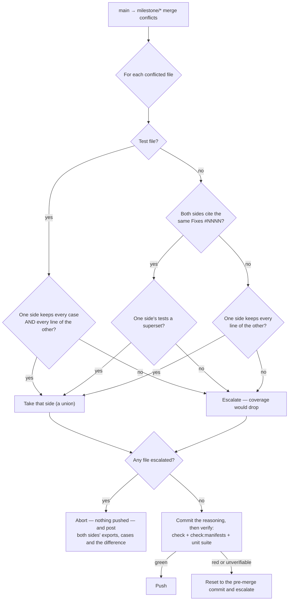

## Summary

A conflicted `main` → `milestone/*` sync had two moves, and both were wrong:
take the default branch's side wholesale (a decision nobody made, which
replaced the branch's version of every colliding file — test files included),
or hand the whole merge to a human days after both changes were written. The
sync now **triages** the conflict, resolves what is mechanical, verifies the
result the way a human's resolution would be verified, and escalates only what
genuinely needs judgement — with the analysis prepared. Closes #1559.

Three rules decide a conflicted file
(`worker/deno/lib/milestone_conflict_triage.ts`):

1. **The same fix landed twice** — both sides' commits touching the file cite
   the same `Fixes #NNNN` (or this fleet's own `(Issue #N)` stamp). The side
   whose tests are a superset is kept. That superset is measured across the
   conflicted test files **and** the cases each side added since the merge
   base, because the branch usually wrote its case in a file the default
   branch never touched.
2. **One side subsumes the other** — every line of the smaller side survives in
   the larger, so the larger is taken and nothing is lost.
3. **Two designs for the same problem** — neither contains the other. The merge
   is **aborted** (nothing is pushed, the branch is exactly as it was) and the
   escalation carries both sides' exports, both sides' test names and the set
   difference between them.

One rule outranks all three: **no resolution may reduce test coverage**. A
conflicted test file resolves only when one side is a genuine union of both —
every case *and* every line of the other side survives in it. Equal case names
are not enough, because an assertion changed inside a case with the same name
is exactly the silent loss the issue describes.

**Every automatic resolution is verified before it is pushed**
(`worker/deno/lib/milestone_resolution_gate.ts`): the merged tree must pass the
repository's own `check`, `check:manifests` and unit suite (`test:unit`, else
`test`). A red tree is reset to the pre-merge commit and escalated through the
existing Issue #974 path; a tree that defines none of those tasks is
*unverifiable* and is refused the same way — a resolution that cannot be
verified is not a resolution. What was decided, and why, is written on the
merge commit and reported with the sync outcome.

### Business-logic change — three existing tests updated, none removed

The old behaviour (resolve every conflict towards the default branch and report
it afterwards) is what this issue replaces, so the three tests that pinned it
were updated to the new behaviour and the reasoning recorded in each:

- `tests/milestone_sync_ancestry_test.ts` — "a genuine content conflict still
  takes the default branch's side" became "a content conflict neither side
  contains is left for a human", plus a new sibling proving a *decidable*
  conflict still resolves and lands.
- `tests/milestone_sync_conflict_report_test.ts` — the `IndirectSpawnRules` vs
  `scanContentForVariableBinarySpawn` fixture is the issue's own case 3, so it
  now asserts the prepared escalation; a new sibling covers a resolvable
  conflict reporting `resolution: "auto"` and its decisions.
- `tests/milestone_sync_merge_gate_test.ts` — the Issue #974 "the gate also
  guards a conflict-resolved merge" fixture was made *decidable* (a superset
  conflict) so it still reaches the gate it is testing.

The Issue #1048 modify/delete rule is unchanged and still passes: a file the
default branch deleted stays deleted, and that rule is now read from
`merge_conflict_stages.ts` rather than restated.

## Evidence

Backend/CLI change — no web interface to screenshot. Evidence is the test suite
below, run unattended, plus the full quality gate
(`./quality.sh < /dev/null` → `Result: PASSED (with skipped checks)`; the one
`SKIPPED` check is `config integration`, skipped on this host independently of
this change).



What a resolved merge commit says (rendered from
`buildResolutionCommitMessage`):

```text
Merge 'main' into 'milestone/1559' — 1 conflict(s) resolved automatically

- `worker/deno/lib/spawn_runner.ts` — duplicate-fix, took the 'main' side: both
  sides fix #1264 — the same fix landed twice, and the default branch's
  implementation is kept because its tests are a superset of the other side's

Each resolution was verified before it was pushed: the merged tree passes the
repository's own check, its manifest check and its unit suite. No conflicted
test file was resolved by taking a side that drops cases (Issue #1559).
```

Docs updated in the same change: `docs/workflows/milestones.md` (new **Conflict
triage** section with the flowchart) and `docs/INTERNALS.md` (the sync section
and the module table).

## Test Plan

New — `worker/deno/tests/milestone_conflict_triage_test.ts` (18 cases):

- `parseFixReferences - reads closing keywords and this fleet's own '(Issue #N)' stamp`
- `extractTestNames - finds Deno.test names in every shape the repo uses`
- `extractExports - names the exported symbols on a side`
- `isTestPath - test files are recognised by directory and by suffix`
- `isLineSuperset - true only when every line of the smaller side survives`
- `planConflictResolution - case 1: both sides fix the same issue, the side with the superset tests wins`
- `planConflictResolution - a duplicate fix whose test coverage is incomparable escalates`
- `planConflictResolution - case 2: the side that keeps every line of the other is taken`
- `planConflictResolution - case 3: two designs for the same problem reach a human`
- `planConflictResolution - a test file is never resolved by taking a side that drops cases`
- `planConflictResolution - a test file resolves when one side is a genuine union of both`
- `planConflictResolution - a test file whose cases match but whose bodies differ escalates`
- `planConflictResolution - a file the default branch deleted stays deleted (Issue #1048)`
- `planConflictResolution - a deleted TEST file escalates rather than dropping its cases`
- `planConflictResolution - a file the milestone branch deleted and the default branch edited escalates`
- `planConflictResolution - a duplicate fix is decided by the cases each side added, not only by the conflicted files`
- `buildResolutionCommitMessage - records the reasoning for every file it resolved`
- `buildConflictAnalysisComment - carries both sides' exports, test names and the difference`

New — `worker/deno/tests/milestone_resolution_gate_test.ts` (7 cases), covering
the three tasks running in order, the `test` fallback, a failing task, an
unrunnable task and an unverifiable tree reported `skipped` rather than passed.

New — `worker/deno/tests/milestone_sync_conflict_resolution_test.ts` (real git
repositories throughout):

- `syncMilestoneBranchWithDefault - the same fix landed twice resolves without a human, with the reasoning on the merge commit (Issue #1559)`
- `syncMilestoneBranchWithDefault - a test file is never resolved by taking one side wholesale (Issue #1559)`
- `syncMilestoneBranchWithDefault - a resolution nothing could verify is refused, not pushed (Issue #1559)`

New — `worker/deno/tests/milestone_sync_conflict_analysis_escalation_test.ts`:

- `milestone sync - a case-3 conflict escalates on the first cycle with both sides' exports, cases and the difference (Issue #1559)`
- `milestone sync - the same unresolvable conflict is reported once, a new one again (Issue #1559)`
- `milestone sync - without a streak file the analysis is logged, not repeated every cycle (Issue #1559)`

Updated — `milestone_sync_ancestry_test.ts`,
`milestone_sync_conflict_report_test.ts`, `milestone_sync_merge_gate_test.ts`
(see the business-logic note above).

Suite run: `deno test tests/*milestone* tests/git_pull*` → **528 passed, 0
failed**; `deno task check:manifests` → 595 passed; `./quality.sh` → PASSED.
