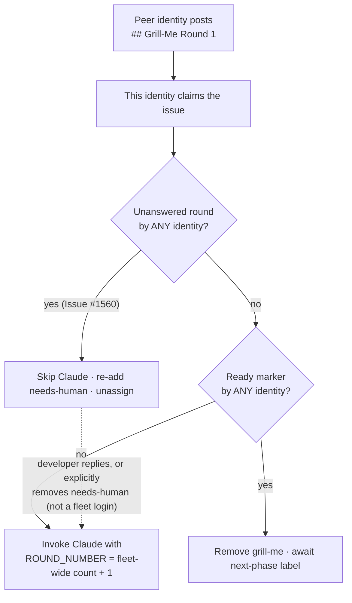

## Summary

The grill-me pre-Claude awaiting-reply gate was keyed to this worker's own
GitHub login, so a peer fleet identity's unanswered `## Grill-Me Round N` did
not stop a second identity claiming the issue and invoking Claude on it — one
wasted invocation per scan until the developer replied, with the unanswered
round (checkboxes pre-ticked by Claude itself) handed over as if it were
consent. The gate now uses the author-agnostic `hasGrillMeRoundAwaitingReply`,
and the round-counting helpers count markers from any fleet identity so
`ROUND_NUMBER` continues from the peer's round instead of restarting at 1.
Closes #1560.

## Evidence

Backend/CLI change — no web interface to screenshot. Verified by unit tests
(`worker/deno/tests/grill_me_processor_test.ts`, 97 passed) plus the full
`./quality.sh` gate.

What changed in `worker/deno/lib/grill_me_processor.ts`:

- **Pre-Claude gate (step 3b)** — `hasGrillMeRoundAwaitingReply(comments,
  githubUser)` replaces `isAwaitingDeveloperReply(comments, githubUser)`, so a
  peer's unanswered round prevents the invocation rather than being cleaned up
  after the fact by the Issue #3768 post-run check.
- **`countGrillMeRounds` / `findLatestWorkerRoundTimestamp` / `hasReadyMarkerBeenPosted`**
  are author-agnostic. The first two continue the round numbering across
  identities; the third keeps a peer's Ready marker on the Ready path instead
  of letting it fall into the awaiting-reply branch, which would have told the
  developer to "answer the questions in the latest grill-me round" when that
  round asked none.
- **Marker matching is line-anchored** (`carriesMarkerHeading`). Author-agnostic
  matching on a bare `includes()` would also match a round quoted by GitHub's
  "Quote reply" button, so a developer answering a round would have re-asserted
  it and stalled the issue on every scan.
- **The Issue #1878 override is preserved and hardened** — an explicit
  `needs-human` removal by a developer still means "proceed", but
  `isNonWorkerRemovalAfterRound` now excludes every fleet login
  (`resolveSuppressionExcludedLogins`: this host, `fleet_pr_authors`,
  `service_accounts` — deliberately not the human `allowed_authors`). Without
  that, a peer's `verifyOperationalLabels` strip would read as the developer's
  go-ahead and re-open the gate this issue closes.
- **`isAwaitingDeveloperReply` is removed** with its 8 unit tests. Its only
  production caller was the gate replaced here, and its behaviour is a strict
  subset of `hasGrillMeRoundAwaitingReply` (a true result from the old helper
  is always true under the new one). Documented here per the "existing tests
  are not removed silently" rule.

## Reproduction

- **symptom** — a peer identity's unanswered `## Grill-Me Round 1` did not stop
  the next identity invoking Claude on it (~$2.70 per scan), and that run was
  handed `ROUND_NUMBER=1` because the peer's round was not counted
- **status** — `verified` — both new `processGrillMe` tests were observed
  failing against the unfixed gate (`claudeInvoked` was `true`; `roundNumber`
  was `1` where `2` was expected) and passing after the fix
- **regression test** —
  `worker/deno/tests/grill_me_processor_test.ts::processGrillMe - skips Claude when a peer identity posted the unanswered round (Issue #1560)`

## Acceptance Criteria

<!-- vibe-spec-review inputs="diff+issue-body" -->

- **met** — gate on the author-agnostic check before invoking Claude, keeping
  the Issue #1878 explicit `needs-human` removal override — evidence:
  `worker/deno/lib/grill_me_processor.ts` step 3b and
  `isNonWorkerRemovalAfterRound`; tests `processGrillMe - skips Claude when a
  peer identity posted the unanswered round (Issue #1560)` and `processGrillMe -
  a peer identity's needs-human strip is not a developer signal (Issue #1560)` —
  reviewer: partial — reason: the reviewer saw the first revision, where the
  retained override still accepted a *peer worker's* label strip as consent;
  fixed here by excluding fleet logins from the override, with a test
- **met** — `countGrillMeRounds` counts round markers from any worker identity
  so `ROUND_NUMBER` continues from the peer's round — evidence:
  `worker/deno/tests/grill_me_processor_test.ts::processGrillMe - invokes Claude
  once the developer has replied to a peer identity's round (Issue #1560)`
  (asserts `roundNumber === 2` and `Round 2` in the prompt) — reviewer: partial
  — reason: the reviewer objected that author-*blind* matching let a quoted
  round inflate the count and that a peer Ready marker mis-routed; both are
  fixed here (line-anchored markers, fleet-wide `hasReadyMarkerBeenPosted`),
  each with a test
- **met** — a test where identity A posts Round 1, no human replies, and
  identity B's `processGrillMe` returns the awaiting-reply no-op without
  invoking Claude — evidence:
  `worker/deno/tests/grill_me_processor_test.ts::processGrillMe - skips Claude
  when a peer identity posted the unanswered round (Issue #1560)` — reviewer: met
- **unrequested** — `findLatestWorkerRoundTimestamp` and
  `hasReadyMarkerBeenPosted` made fleet-wide, marker matching line-anchored, and
  `isAwaitingDeveloperReply` removed — reviewer: unrequested — reason: each is
  required for the requested change to be correct — the timestamp lookup keeps
  the #1878 override alive for a peer's round, the Ready check stops a peer's
  Ready landing in the awaiting-reply branch, line anchoring stops a quote-reply
  stalling the issue, and the removed helper had no caller left
- **unrequested** — `docs/INTERNALS.md` bullet for the cross-identity gate, and
  the correction of the adjacent #3768 bullet — reviewer: unrequested — reason:
  the repo's "a code change owes a docs change" standard; the old bullet
  asserted the author-keyed behaviour this change removes

## Standards Review

<!-- vibe-standards-review inputs="diff+CODING-STANDARDS.md" -->

- **violation** — stale JSDoc: `hasGrillMeRoundAwaitingReply` still said
  `countGrillMeRounds` / `hasReadyMarkerBeenPosted` "only see comments authored
  by the current identity" — evidence:
  `worker/deno/lib/grill_me_processor.ts:513` — reason: rewritten in this diff
- **violation** — `docs/INTERNALS.md` #3768 bullet made the same stale claim,
  contradicting the new bullet two paragraphs below — evidence:
  `docs/INTERNALS.md:1282` — reason: corrected in this diff
- **violation** — dead `_githubUser` parameter kept "for call-site symmetry" on
  helpers that ignore it — evidence:
  `worker/deno/lib/grill_me_processor.ts:294` — reason: parameter dropped from
  `countGrillMeRounds`, `findLatestWorkerRoundTimestamp` and
  `hasReadyMarkerBeenPosted`; all call sites updated
- **violation** — a `pendingRoundIdentity` log field that re-ran a full scan for
  a diagnostic string and mislabelled it — evidence:
  `worker/deno/lib/grill_me_processor.ts:1102` — reason: removed
- **violation** — a peer's Ready marker fell into the awaiting-reply branch and
  escalated with "Round N is still waiting for your reply" when no questions
  were asked — evidence: `worker/deno/lib/grill_me_processor.ts:1081` — reason:
  `hasReadyMarkerBeenPosted` made fleet-wide so step 3 catches it; covered by
  `processGrillMe - a peer identity's Ready marker takes the Ready path (Issue #1560)`
- **violation** — a marker is plain text anyone can type, and the widened
  matching let a quoted marker shadow a genuine round timestamp — evidence:
  `worker/deno/lib/grill_me_processor.ts:592` — reason: markers must now head a
  line; a deliberately typed marker still only ever defers to a human (skip +
  `needs-human`), which is the fail-safe direction
- **violation** — `assert(fetchCallCount >= 2)` asserted an internal call count
  rather than behaviour — evidence:
  `worker/deno/tests/grill_me_processor_test.ts:1092` — reason: removed; the
  round-number and prompt assertions cover the path
- **clean** — Australian English throughout; commit carries the Issue #1560
  reference and the `Vibe-Coder-Run-Id` trailer; no hidden or credential paths
  staged; new tests are genuine unit tests through injected stubs with no
  sleeps, env mutation or wall-clock thresholds; the skip path stays fail-loud
  (explicit summary, `needs-human` re-added, worker unassigned)

## Test Plan

Added to `worker/deno/tests/grill_me_processor_test.ts`:

- `processGrillMe - skips Claude when a peer identity posted the unanswered round (Issue #1560)`
- `processGrillMe - invokes Claude once the developer has replied to a peer identity's round (Issue #1560)`
- `processGrillMe - a peer identity's needs-human strip is not a developer signal (Issue #1560)`
- `processGrillMe - a peer identity's Ready marker takes the Ready path (Issue #1560)`
- `countGrillMeRounds - counts a round posted by a peer worker identity (Issue #1560)`
- `countGrillMeRounds - counts rounds from this identity and a peer together (Issue #1560)`
- `countGrillMeRounds - a plain developer comment never counts (Issue #1560)`
- `countGrillMeRounds - ignores a round quoted in a developer reply (Issue #1560)`
- `hasGrillMeRoundAwaitingReply - false when the developer quote-replied to the round (Issue #1560)`
- `hasReadyMarkerBeenPosted - true when a peer worker identity posted Ready (Issue #1560)`
- `hasReadyMarkerBeenPosted - ignores a Ready marker quoted in a reply (Issue #1560)`
- `findLatestWorkerRoundTimestamp - finds a peer identity's round (Issue #1560)`
- `isNonWorkerRemovalAfterRound - false when a peer fleet identity removed the label (Issue #1560)`
- `isNonWorkerRemovalAfterRound - a maintainer's removal still counts with fleet logins supplied (Issue #1560)`

Changed (business logic changed, documented above):

- `countGrillMeRounds - ignores rounds posted by other authors` → now
  `counts a round posted by a peer worker identity (Issue #1560)`
- `hasReadyMarkerBeenPosted - ignores Ready marker posted by another author` →
  now `true when a peer worker identity posted Ready (Issue #1560)`
- Removed the 8 `isAwaitingDeveloperReply` tests with the helper they covered.
