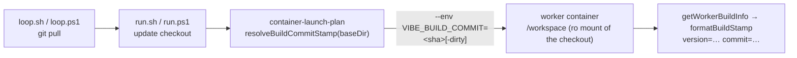

## Summary

`VIBE_BUILD_COMMIT` was read by `worker/deno/lib/worker_build_info.ts` but set
by nobody, so `commit=unknown` was not a degraded case — it was the only value
the build stamp could ever take, and no log line could say which code produced
it.

The container launch plan now resolves the checkout it is about to mount and
hands the commit to the container as `VIBE_BUILD_COMMIT`:

- `resolveBuildCommit()` runs `git rev-parse HEAD` plus `git status --porcelain`
  through the shared git chokepoint (`lib/git_timeout.ts`), returning a 40-hex
  sha, or `<sha>-dirty` when the checkout is not clean.
- `resolveBuildCommitStamp()` applies the fallback policy: an unstampable
  checkout logs the reason and degrades to `unknown`, so `unknown` now means a
  genuinely unstamped build.
- `formatBuildStamp()` keeps the `-dirty` marker through its 12-character
  truncation — a stamp that reads clean while modified code ran is worse than
  `unknown`.
- `buildCommit` is a **required** `ContainerLaunchInputs` field, so the wiring
  cannot be dropped silently the way the original read-but-never-set could.

Both launchers already execute the same plan (`run.sh` and `run.ps1` each
invoke `container-launch-plan` after updating the checkout), so the stamp
reaches Linux/macOS and Windows hosts from one place instead of two shells that
could drift. Closes #1572.

## Evidence

Backend/CLI change — no web interface to screenshot. The evidence is the tests
and the gate.

- `./quality.sh` — **PASSED** (all checks; `config integration` skipped as it
  is on this host), re-run after the final edit.
- `deno task test tests/worker_build_info_test.ts` — 18 passed.
- `deno task test tests/container_launch_test.ts` — 81 passed with
  `tests/worker_build_info_test.ts`.
- `deno task check:manifests` — 595 passed.
- `deno task test:run-mode` (launcher parity, run modes, containment plan) —
  291 passed, 42 ignored.

Where the stamp comes from, and why it is the launch plan rather than the image:

## Reproduction

The issue carries no `bug` label; this block is recorded anyway because the
fault was reproduced before the fix.

- **symptom** — every worker log line reported `commit=unknown`, because no
  launcher, Containerfile or workflow ever set `VIBE_BUILD_COMMIT`
- **status** — `verified` — with the `runArgs.push("--env",
  \`VIBE_BUILD_COMMIT=…\`)` line removed from `lib/container_launch.ts`, the new
  launch-plan test fails (`AssertionError: Values are not equal. -false +true`);
  it passes with the line restored
- **regression test** — `worker/deno/tests/container_launch_test.ts::buildContainerLaunchPlan - stamps the running build into the container (Issue #1572)`
  and `worker/deno/tests/worker_build_info_test.ts::resolveBuildCommit - the production path resolves this checkout to a real commit`

## Acceptance Criteria

<!-- vibe-spec-review inputs="diff+issue-body" -->

The issue states no `## Acceptance Criteria` section; the entries below answer
its "Suggested fix" and "Regression test" items, as judged by an independent
reviewer that saw only the diff and the issue body.

- **missing** — bake the commit into the image as a Containerfile build arg — reviewer: missing — reason: deliberate; the image carries no worker code (the checkout is bind-mounted read-only at `/workspace`, `worker/deno/lib/container_launch.ts:1004`) and its tag is content-derived from `container/`, so a baked commit would name code the run does not execute and would invalidate the image tag on every commit
- **partial** — resolve the commit in `run.sh` / `run.ps1` together (the parity rule) — evidence: `worker/deno/commands/container_launch_plan.ts:236` — reviewer: partial — reason: the reviewer called it "met in behaviour, partial in letter"; neither shell changed because both already execute the shared launch plan after updating the checkout, which makes parity structural rather than duplicated, but an auditor grepping the shells for `git rev-parse` finds nothing
- **met** — keep `unknown` as a fallback that means a genuinely unstamped build — evidence: `worker/deno/lib/worker_build_info.ts::resolveBuildCommitStamp` and `worker/deno/tests/worker_build_info_test.ts::resolveBuildCommitStamp - an unstampable checkout says why and stamps unknown` — reviewer: met
- **met** — a `dirty` marker when the staged tree has uncommitted changes — evidence: `worker/deno/tests/worker_build_info_test.ts::resolveBuildCommit - marks a modified checkout dirty` — reviewer: met — reason: the reviewer noted the first cut excluded untracked files; the diff now uses git's own definition of a clean tree, with `resolveBuildCommit - an untracked file is a dirty checkout too` covering it
- **partial** — a regression test that the production path yields a 40-hex SHA, so the wiring cannot be removed without failing — evidence: `worker/deno/tests/worker_build_info_test.ts::resolveBuildCommit - the production path resolves this checkout to a real commit` — reviewer: partial — reason: the resolver is proven against the real checkout and the plan's emit is proven, but `buildLaunchPlanForCommand` needs a container runtime and a staged config to run, so nothing catches that seam being *neutered* (as opposed to removed, which the required `buildCommit` field makes a type error)
- **unrequested** — the `VIBE_BUILD_COMMIT` note in `lib/vibe_env_registry.ts` and the stamp paragraph in `docs/DUPLICATE-PR-ROOT-CAUSE-3138.md` — reviewer: unrequested — reason: both documented the old "read but never set" behaviour and would have been wrong after this change; the standards require a docs change to ride with the code change
- **unrequested** — `buildCommit` made a required `ContainerLaunchInputs` field, which added one line to six test fixtures and a `buildCommit: "unknown"` to `lib/tabletop_container_runner.ts` — reviewer: unrequested — reason: it is the mechanism that satisfies "the wiring cannot be removed without failing"; the tabletop harness runs no worker claim, so an unstamped build there is accurate

## Standards Review

<!-- vibe-standards-review inputs="diff+CODING-STANDARDS.md" -->

- **violation** — `buildLaunchPlanForCommand` was modified with no test covering the happy or error path — evidence: `worker/deno/commands/container_launch_plan.ts:236` — reason: partly fixed here — the stamp policy (fallback, loud reason, malformed-stamp refusal) moved into `lib/worker_build_info.ts::resolveBuildCommitStamp` and is covered by two new tests, leaving one call in the command; the command itself needs a container runtime and a staged `.config.json` to execute, so it stays outside the unit suite
- **violation** — the `status.value.code !== 0` half of the refusal was untested — evidence: `worker/deno/lib/worker_build_info.ts` — reason: fixed here, `worker_build_info_test.ts::resolveBuildCommit - a failing status exit never stamps clean`
- **violation** — `BUILD_COMMIT_PATTERN` was exported from `lib/` for a test alone — evidence: `worker/deno/lib/worker_build_info.ts:31` — reason: fixed here, `resolveBuildCommitStamp` now re-checks the produced stamp against it before the value crosses into the container's environment
- **violation** — a unit test drives real `git` against the surrounding checkout — evidence: `worker/deno/tests/worker_build_info_test.ts` (`the production path resolves this checkout to a real commit`) — reason: it stands, and the test now says why: this is the regression test the issue asks for, and a checkout the launch plan cannot stamp is the defect itself rather than host flakiness; the call is read-only (`rev-parse`, `status`), mutates no shared state and needs no fixture repo
- **clean** — Australian English throughout; fail-loud error handling with no swallowed errors; git spawned only through the `runGitCommand` chokepoint; `--allow-run` already granted by both launchers; comments factually match `run.sh`/`run.ps1` ordering; no hidden paths staged; docs and the env registry updated alongside the code; `deno fmt`, `deno lint`, `check:manifests` clean; no new `lib/` module needing a sweep-slice claim; tests call real code rather than grepping source

## Test Plan

Added to `worker/deno/tests/worker_build_info_test.ts`:

- `resolveBuildCommit - stamps a clean checkout with its HEAD sha`
- `resolveBuildCommit - marks a modified checkout dirty`
- `resolveBuildCommit - an untracked file is a dirty checkout too`
- `resolveBuildCommit - reports why a non-repository cannot be stamped`
- `resolveBuildCommit - refuses output that is not a commit sha`
- `resolveBuildCommit - never claims clean when the worktree state is unreadable`
- `resolveBuildCommit - a failing status exit never stamps clean`
- `resolveBuildCommitStamp - hands the launch plan the resolved commit`
- `resolveBuildCommitStamp - an unstampable checkout says why and stamps unknown`
- `resolveBuildCommit - the production path resolves this checkout to a real commit`
- `formatBuildStamp - keeps the dirty marker when truncating`

Added to `worker/deno/tests/container_launch_test.ts`:

- `buildContainerLaunchPlan - stamps the running build into the container (Issue #1572)`

Fixtures updated (one `buildCommit` line each) in
`container_launch_test.ts`, `containment_docs_test.ts`,
`container_image_provider_set_test.ts`, `claude_token_isolation_test.ts`,
`multi_provider_credentials_test.ts`, `container_containment_test.ts` and
`container_extension_launch_test.ts`. No existing test was removed or disabled.
