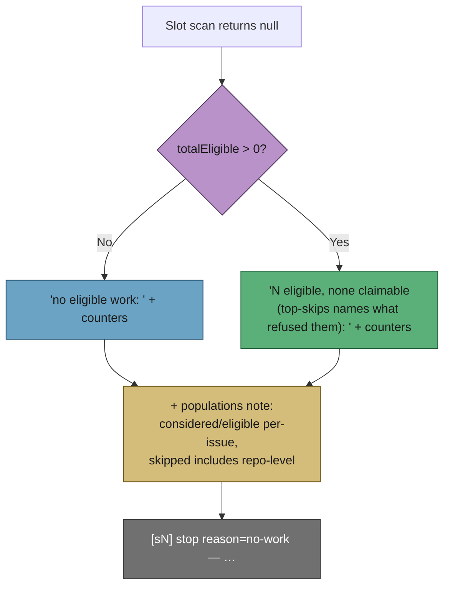

## Summary

The idle-slot stop line asserted "no eligible work" beside `eligible=3` in the
same breath. The two words measure different things — `eligible` is "passed the
per-issue filter", the stop is "nothing claimable now" — but the line said only
the first, so it read as a self-contradiction and cost a human an investigation
before it could be established as benign.

`formatScanOutcome()` (new, in `worker/deno/lib/issue_finder_logger.ts`) now
renders the _sentence_ around the counters that `formatScanSummary()` renders,
so the claim and the numbers cannot disagree:

- `eligible=0` →
  `no eligible work: considered=… eligible=0 skipped=… top-skips=…`
- `eligible>0` →
  `3 eligible, none claimable (top-skips names what refused them): considered=… eligible=3 skipped=… top-skips=…`

Both forms close with `SCAN_COUNT_POPULATIONS`, which states the second point
the issue raised: `considered`/`eligible` count **issues**, `skipped` counts
**skip decisions** including repo-level ones that never enter `considered`, so
the three need not sum — the arithmetic that sent the original investigation
looking for a counting bug that was not there. The `top-skips=(none)` fallback
is unchanged.

`run_core.ts` emits `formatScanOutcome()` at both slot sites (the
`stop
reason=no-work` retire and the re-scan line), and its "summary
unavailable" fallback still reads `no eligible work: scan summary unavailable`
so an absent summary is never silently reworded.

Closes #1573.

## Evidence

Backend/CLI diagnostics only — no web interface to screenshot. The evidence is
the rendered lines and the tests.

Before (unfixed, the line from the issue):

```
[s2] stop reason=no-work — no eligible work: considered=36 eligible=3 skipped=31 top-skips=needs-human=16,milestone-occupied=12,filtered-out=3; no sibling slot is running, …
```

After (`deno eval` against the built module):

```
[s2] stop reason=no-work — 3 eligible, none claimable (top-skips names what refused them): considered=36 eligible=3 skipped=31 top-skips=needs-human=16,milestone-occupied=12,filtered-out=3 (considered/eligible are per-issue; skipped counts skip decisions including repo-level ones, so the three need not sum); no sibling slot is running, so the pool drains and the cycle continues.

[s2] stop reason=no-work — no eligible work: considered=7 eligible=0 skipped=7 top-skips=cooldown=7 (considered/eligible are per-issue; skipped counts skip decisions including repo-level ones, so the three need not sum);
```



The regression test in `run_core_slot_pool_test.ts` was observed **failing**
against the unfixed `run_core.ts` (the old line hard-coded `no eligible work`
into every stop) and passing after the change. `./quality.sh` passed in full
after the final edit.

## Test Plan

Added — `worker/deno/tests/issue_finder_logger_test.ts`:

- `formatScanOutcome - never says 'no eligible work' when work was eligible (Issue #1573)`
  — the issue's stated regression test: the emitted text must not contain the
  phrase when `totalEligible > 0`.
- `formatScanOutcome - a genuinely empty scan still reads 'no eligible work' (Issue #1573)`.
- `formatScanOutcome - says the counts measure different populations (Issue #1573)`.
- `formatScanOutcome - keeps the (none) fallback when nothing was skipped (Issue #1573)`.
- `formatScanOutcome - a single eligible issue reads without a plural mismatch (Issue #1573)`.

Added — `worker/deno/tests/run_core_slot_pool_test.ts`:

- `slot pool - a stop line with eligible work never claims there was none (Issue #1573)`
  — drives a real pool cycle whose scan reports `eligible=3` and returns null,
  and asserts the emitted `stop reason=no-work` line carries
  `3 eligible, none claimable` and never the contradictory phrase.

Unchanged and still passing: the Issue #219 tests covering the counter fields
and the empty-scan line, plus `stream_scoped_slot_exclusion_1091_test.ts`,
`lane_scoped_worktree_test.ts` and `slot_idle_accounting_925_test.ts` (109
tests). No existing test was removed or weakened.

Docs updated: `docs/workflows/resilience-and-concurrency.md` (the slot-exit
section and its flowchart) and `docs/IDLE-TASK-FRAMEWORK.md` (the
`claimScanCompleted` description, which quoted the old phrase).
