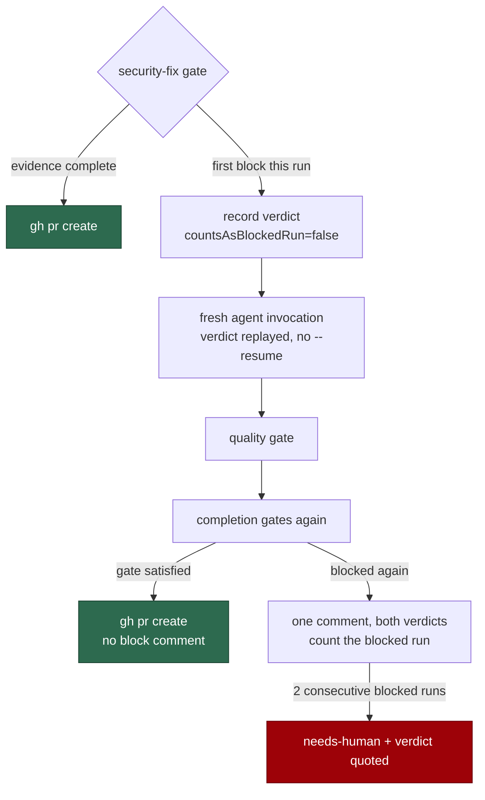

## Summary

A security-fix gate block ended the run: the completion phase returned
`failure`, no PR was raised, and the verdict reached the next attempt only
through host-local run state. One **false** block therefore cost a whole run —
issue #1385 lost three of them (~USD 10.50, 28 minutes) to a regex that could
not read a test name `deno fmt` had wrapped onto the line after `Deno.test(`,
with a correct branch every time.

The regex fault is already fixed (#1581). This change fixes the cost model
behind it:

- **The first block inside a run is recoverable.** The verdict is recorded, the
  log reads `security-fix gate block — retrying once in-run`, the agent is
  re-invoked **fresh** (never `--resume`) with the verdict replayed through the
  existing #4057 section, then the quality gate and the completion gates run
  again. `bump-deps` is not re-run. The retry always runs — it is never skipped
  on time-budget grounds.
- **A run that recovers raises its PR and posts no block comment.** A run
  blocked twice ends in `failure` as before, with **one** comment carrying both
  verdicts.
- **A `test-identifier-in-diff` block now says what the gate matched** — the
  test-declaration lines from the diff, capped at ten, scrubbed and code-fenced
  — in both the comment and the replayed verdict, so a false block is
  recognisable from the comment alone.
- **`blockCount` now counts blocked _runs_.** The in-run first block records its
  verdict with `countsAsBlockedRun: false` and charges the issue nothing. After
  two consecutive blocked runs the worker stops re-attempting: it applies
  `needs-human` through the guarded `escalateToHuman` chokepoint with the
  verdict quoted.

Closes #1575.

## Evidence

Backend/CLI only — no web interface to screenshot. The evidence is the test
suite below plus the full quality gate (`./quality.sh`), run after the final
edit: **PASSED** (config integration skipped, as always locally).

Before this change the same first block took the `B` path immediately — the run
ended, and only the next run saw the verdict.

## Acceptance Criteria

<!-- vibe-spec-review inputs="diff+issue-body" -->

The issue states no `## Acceptance Criteria` heading; the block below closes out
its "Accepted scope so far" list, judged by the Spec reviewer sub-agent.

- **met** — the #1581 regex fix is not touched — evidence:
  `worker/deno/lib/security_fix_gate.ts` changes are additive
  (`matchedTestDeclarations`, an optional second parameter);
  `evaluateSecurityFixGate` and `testDeclarationLines` are unchanged — reviewer:
  met
- **met** — a block is retried once in-run: verdict recorded, fresh invocation
  carrying the #4057 replay section, then the quality gate and the completion
  phase; bump-deps not re-run; a second block returns `failure` — evidence:
  `worker/deno/lib/security_fix_gate_retry.ts::recoverFromSecurityGateBlock`,
  `worker/deno/tests/completion_phase_security_gate_retry_test.ts::completion - a first gate block re-invokes the agent once and the PR is raised`
  — reviewer: met
- **met** — the retry is never skipped on time-budget grounds — evidence: no
  deadline or runway check on the recovery path in `security_fix_gate_retry.ts`
  — reviewer: met
- **met** — the log records `security-fix gate block — retrying once in-run` —
  evidence: `worker/deno/lib/security_fix_gate_retry.ts` (`logger.warn`, exact
  substring) — reviewer: met
- **met** — a recovered run posts no block comment; a run blocked twice posts
  one comment carrying both verdicts — evidence:
  `worker/deno/tests/completion_phase_security_gate_retry_test.ts::completion - a second block in the same run ends the run with one comment`
  — reviewer: met
- **met** — the comment and the replayed verdict list the matched declaration
  lines, capped at 10 — evidence:
  `worker/deno/tests/completion_phase_security_gate_retry_test.ts::completion - the block comment lists the declarations the gate matched`
  and
  `::matchedTestDeclarations - reports wrapped declarations and caps the list` —
  reviewer: met
- **met** — a blocked run is one ending in `failure` from the gate; the in-run
  first block does not count; the count is the host-local `blockCount`, cleared
  when the gate passes — evidence:
  `worker/deno/tests/security_fix_gate_feedback_test.ts::gate feedback - a verdict recorded for the in-run retry charges no blocked run`
  — reviewer: met
- **met** — after 2 consecutive blocked runs the worker adds `needs-human` with
  the verdict quoted and stops re-attempting — evidence:
  `worker/deno/tests/completion_phase_security_gate_retry_test.ts::completion - the second consecutive blocked run hands the issue to a human`
  — reviewer: met
- **met** — the three named tests exist — evidence:
  `worker/deno/tests/completion_phase_security_gate_retry_test.ts` (7 cases) —
  reviewer: met
- **unrequested** — the matched declarations are scrubbed and code-fenced rather
  than pasted raw — reviewer: unrequested — reason: they are agent-authored diff
  text reaching an issue comment and a prompt; the scrub is the repo's
  documented handling for untrusted text, and a code fence keeps it
  deterministic (the reviewer saw an earlier nonce-fenced version and objected
  to the randomness, which this replaces)
- **unrequested** — a gate block no longer takes the #1550 infrastructure retry
  — reviewer: unrequested — reason: re-running the same body against the same
  summary reproduces the verdict; the in-run retry is the recovery, so the two
  must not both fire
- **unrequested** — `readSecurityFixGateBlock` now accepts `blockCount: 0` —
  reviewer: unrequested — reason: a necessary consequence of counting blocked
  runs rather than blocks; zero is a legitimate count for a verdict awaiting its
  retry
- **unrequested** — `docs/security-fix-gate-feedback.md` and `docs/INTERNALS.md`
  are updated — reviewer: unrequested — reason: the standards require a docs
  change alongside a behaviour change; the sequence diagram would otherwise
  describe the old flow

## Standards Review

<!-- vibe-standards-review inputs="diff+CODING-STANDARDS.md" -->

- **violation** — the new `lib/` module was claimed by no sweep slice, failing
  `check:manifests` — evidence: `docs/audits/lib-sweep-coverage.json:143` —
  reason: fixed here; `security_fix_gate_retry.ts` is now claimed by the slice
  that holds `security_fix_gate_feedback.ts`
- **violation** — no per-module test for the new module — evidence:
  `worker/deno/tests/security_fix_gate_retry_test.ts` — reason: fixed here; six
  cases including the fail-loud error path of `buildSecurityFixGateBlockComment`
- **violation** — the 200-character truncation bound was declared twice —
  evidence: `worker/deno/lib/security_fix_gate.ts:277` — reason: fixed here;
  `MAX_DECLARATION_LINE_CHARS` is exported and the feedback store imports it
- **violation** — the untrusted-input bound (`sanitiseDeclarations`) and the
  loosened `blockCount` parse were untested — evidence:
  `worker/deno/lib/security_fix_gate_feedback.ts:120` — reason: fixed here;
  three cases cover over-long lines, a tampered non-array field and the zero
  round-trip
- **violation** — the orchestration was added to the already-monolithic
  completion phase while a purpose-built module sat beside it — evidence:
  `worker/deno/lib/phases/completion_phase.ts:452` — reason: fixed here;
  `recoverFromSecurityGateBlock`, the reporting and the persistence moved to
  `security_fix_gate_retry.ts`, leaving one call plus `runCompletionAttempt` in
  the phase
- **violation** — the comment-post `catch {}` discarded the error object —
  evidence: `worker/deno/lib/security_fix_gate_retry.ts:216` — reason: fixed
  here; the message is now logged
- **violation** — a retry invocation that could not be launched was charged as a
  blocked run, so a flaky CLI could spend the `needs-human` budget — evidence:
  `worker/deno/lib/security_fix_gate_retry.ts:288` — reason: fixed here; that
  path reports the block with `countsAsBlockedRun: false`, covered by
  `::completion - a retry that cannot be launched charges no blocked run`
- **violation** — a post-retry quality-gate failure returns without posting the
  gate comment — evidence: `worker/deno/lib/security_fix_gate_retry.ts:315` —
  reason: stands. The run then fails for a quality reason, which the quality
  gate reports on its own path with its own labels; the gate verdict is already
  persisted (uncounted) and is replayed into the next attempt, so nothing is
  lost
- **clean** — Australian English throughout the added lines; untrusted diff text
  bounded on write, on read and at render; tests drive real functions (the live
  `workOnIssueCompletion`) and assert observable outcomes, with no sleeps or
  source-grepping; fail-loud persistence with a loud warning and an in-memory
  fallback; no import cycle; commits carry `(Issue #1575)` and the run-id
  trailer; no hidden paths staged

## Test Plan

New — `worker/deno/tests/completion_phase_security_gate_retry_test.ts` (7 cases,
driving the live completion phase):

- a first block re-invokes the agent exactly once, re-runs the quality gate and
  raises the PR, posting no block comment and leaving no verdict behind;
- the retry prompt carries the replayed verdict and the matched declarations;
- a second block in the same run ends the run with one comment carrying both
  verdicts, and counts exactly one blocked run;
- the block comment lists the declarations the gate matched;
- the second consecutive blocked run adds `needs-human` with the verdict quoted;
- a retry that cannot be launched reports the block but charges no blocked run;
- `matchedTestDeclarations` reports a `deno fmt`-wrapped declaration and caps
  the list at ten.

New — `worker/deno/tests/security_fix_gate_retry_test.ts` (6 cases): the retry
prompt, the one- and two-verdict comments, the fail-loud empty-verdict throw,
the escalation threshold and the escalation text.

Extended — `worker/deno/tests/security_fix_gate_feedback_test.ts` (+4 cases):
blocked-run counting, declaration bounds on write and read, a tampered
`declarations` field, and the retry section listing the declarations.

All five behavioural completion-phase cases were observed failing against the
unfixed completion phase (the first block ended the run with zero
re-invocations) and passing after it. Existing suites are unchanged and pass:
`completion_phase_security_gate_test.ts`, `security_fix_gate_test.ts`,
`issue_worker*`, `prompt_builder*` (418 tests), and the full `./quality.sh`.
