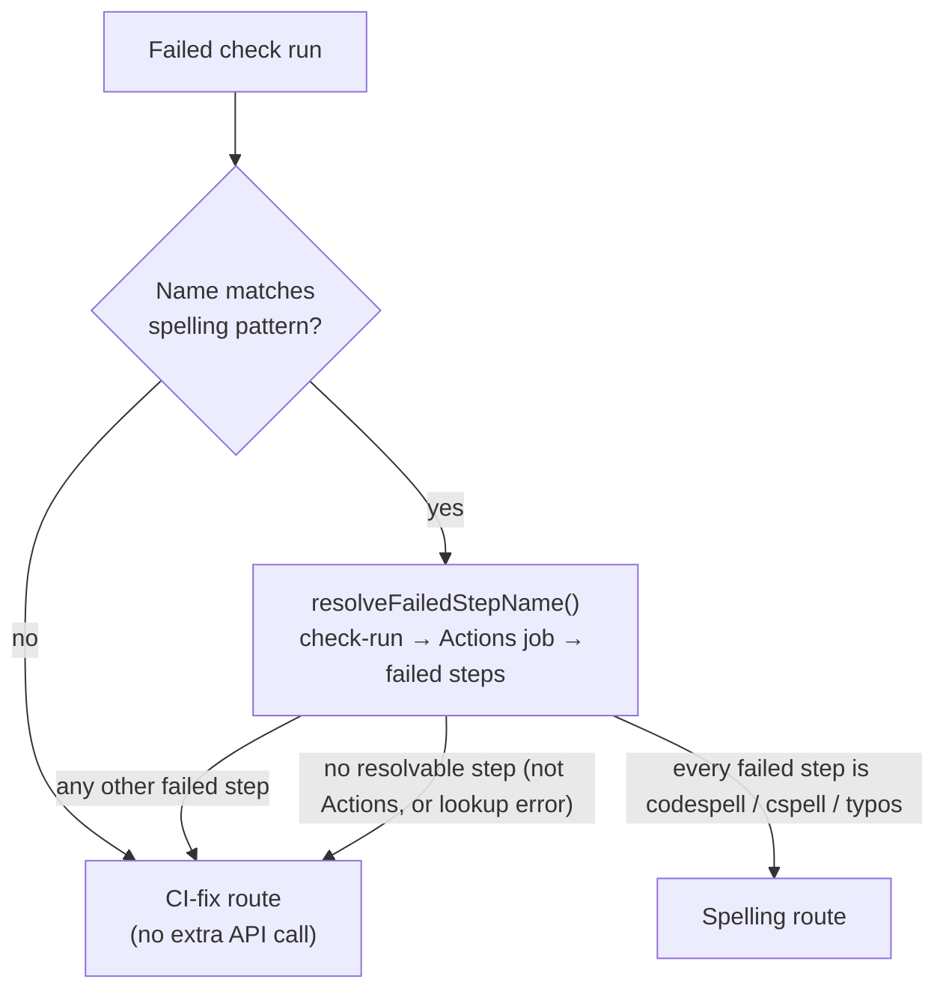

## Summary

A failing CI check was routed to the spelling fixer whenever the **job name**
contained `spell` — so NEAT-AI-core's bundled `Scripts & spelling` job sent its
failing `Run bats (tests/scripts)` step to the spelling processor, which found
no spelling annotations and posted "no changes needed" twice while the bats
failure (`not ok 263`) went unfixed.

Routing now reads the **step that actually failed**. `resolveCheckFixRoute()`
(`worker/deno/lib/pr_ci_checks.ts`) shortlists on the existing name pattern —
so checks with unrelated names keep today's zero-extra-call path — then
confirms with one job lookup: the spelling route is taken only when every
failed step is codespell, cspell or typos. Anything else, including a step that
cannot be resolved, goes to the generic CI-fix route, whose agent can fix
spelling too. The log summariser also gained a TAP `not ok N` failure marker so
a bats failure anchors the CI-fix excerpt instead of being trimmed away.

Closes #1579.

## Evidence

Backend/worker change — no web interface to screenshot. Verified by the Deno
test suite and the full `./quality.sh` gate (PASSED, one pre-existing
environment SKIP for `config integration`).



Command output (targeted run):

```text
deno test --allow-all tests/pr_ci_checks_test.ts \
  tests/github_actions_log_fetcher_test.ts tests/pr_maintenance_test.ts \
  tests/pr_uninvited_action_test.ts tests/pr_uninvited_action_drift_test.ts
ok | 156 passed | 0 failed
```

## Reproduction

- **symptom** — a `Scripts & spelling` job whose `Run bats (tests/scripts)`
  step failed (`not ok 263`) was handed to the spelling fixer, which posted
  "no changes needed" while the bats failure stayed red
- **status** — `verified` — with the routing reverted to the old name-based
  test, `findFailedPrChecks - a bats failure inside a 'Scripts & spelling' job
  is not a spelling job (Issue #1579)` and `findFailedCiChecks - a
  spelling-named check with no resolvable step goes to CI-fix (Issue #1579)`
  both failed; both pass with the fix in place
- **regression test** —
  `worker/deno/tests/pr_maintenance_test.ts::findFailedPrChecks - a bats failure inside a 'Scripts & spelling' job is not a spelling job (Issue #1579)`
  and its CI-route pair
  `worker/deno/tests/pr_maintenance_test.ts::findFailedCiChecks - that same bats failure reaches the CI-fix route (Issue #1579)`

## Acceptance Criteria

<!-- vibe-spec-review inputs="diff+issue-body" -->

- **met** — a failed check reaches the spelling fixer only when the failed
  step matches codespell/cspell/typos; any other failed step goes to the
  CI-fix route — evidence: `worker/deno/lib/pr_ci_checks.ts` (`resolveCheckFixRoute`),
  `worker/deno/tests/pr_ci_checks_test.ts::pr_ci_checks - a bats failure inside a spelling-named job routes to CI-fix (Issue #1579)`
  — reviewer: partial — reason: the reviewer saw the first commit, which read
  only the *first* failed step and so would still route a job failing in both
  codespell and bats to spelling; the follow-up commit routes on **every**
  failed step and adds
  `pr_ci_checks_test.ts::a job failing in both codespell and bats routes to CI-fix`
- **met** — a check with no resolvable failed step goes to CI-fix, never
  spelling, with the reason logged — evidence:
  `worker/deno/tests/pr_ci_checks_test.ts::pr_ci_checks - a failed job lookup routes to CI-fix and is reported loudly`
  — reviewer: met
- **met** — the step is resolved via `resolveActionsJobId()` plus one
  `gh api repos/{repo}/actions/jobs/{jobId}` call, and only for
  spelling-named checks — evidence:
  `worker/deno/lib/github_actions_log_fetcher.ts` (`resolveFailedStepName`),
  `worker/deno/tests/pr_ci_checks_test.ts::a non-spelling check name routes to CI-fix with no extra API call`
  — reviewer: met — reason: the reviewer noted the lookup is repeated once per
  scan (two scans) and runs before the retry-cap check; both are bounded to
  spelling-named failing checks and were left as-is to keep the two scans'
  routing decisions identical
- **met** — the log summariser gains a TAP `not ok N` marker with a unit
  test — evidence:
  `worker/deno/tests/github_actions_log_fetcher_test.ts::summariseActionsLog - anchors on a TAP 'not ok' line (Issue #1579)`
  — reviewer: met
- **met** — regression tests for the bats-step, codespell-step and
  failed-lookup cases — evidence: the three scan-level tests in
  `worker/deno/tests/pr_maintenance_test.ts` plus their unit-level pairs in
  `worker/deno/tests/pr_ci_checks_test.ts` — reviewer: met
- **met** — observable outcome: a bats failure in a spelling-shaped job
  produces a CI-fix run that sees the `not ok` line — evidence: the routing
  change in `worker/deno/lib/pr_maintenance.ts` plus the TAP marker feeding
  the untouched `summariseActionsLog` excerpt path — reviewer: met
- **met** — NEAT-AI-core's job is not split; the fix is worker-side only —
  evidence: the diff touches only `worker/deno/**` and `docs/**` — reviewer: met
- **unrequested** — existing scan/fixture tests were updated to serve the
  Actions job behind each check run — evidence:
  `worker/deno/tests/pr_maintenance_test.ts`,
  `worker/deno/tests/pr_uninvited_action_test.ts`,
  `worker/deno/tests/pr_uninvited_action_drift_test.ts` — reviewer:
  unrequested — reason: routing now reads the failed step, so a test that
  expects a check to reach the spelling processor has to say which step
  failed; no test was removed or weakened
- **unrequested** — `docs/INTERNALS.md`, `docs/workflows/ci-fix.md`,
  `pr-feedback.md` and `milestones.md` updated — evidence: those four files —
  reviewer: unrequested — reason: they documented the superseded name-based
  rule, which the standards reviewer flagged under "a code change owes a docs
  change"

## Standards Review

<!-- vibe-standards-review inputs="diff+CODING-STANDARDS.md" -->

- **violation** — `docs/workflows/pr-feedback.md` still described name-based
  spelling routing — evidence: `docs/workflows/pr-feedback.md:88`,
  `docs/workflows/pr-feedback.md:193` — reason: fixed here; `milestones.md:195`
  was corrected in the same pass
- **violation** — the PR summary file was absent — evidence:
  `docs/archive/pr-summaries/pr-summary-1579.md` — reason: fixed here, this file
- **violation** — a genuine `gh api` failure was folded into an `info` log on a
  normal route, and the logger was optional so it could vanish entirely —
  evidence: `worker/deno/lib/pr_ci_checks.ts` (`resolveCheckFixRoute`) — reason:
  fixed here — a lookup error now logs at `warn`, the routine non-Actions case
  at `info`, and `logger` is required
- **violation** — the new `resolveFailedStepName` had no test for its
  malformed-JSON error branch — evidence:
  `worker/deno/lib/github_actions_log_fetcher.ts` — reason: fixed here by
  `github_actions_log_fetcher_test.ts::resolveFailedStepName - a malformed job response is an error`
- **clean** — Australian English throughout; Deno-native tooling only; error
  handling follows the module's existing discriminated-union shape; tests call
  real functions and assert on returned decisions; no sleeps, wall-clock
  budgets or env mutation; no hidden paths staged; commits carry the issue
  reference and the run-id trailer

## Test Plan

Added:

- `worker/deno/tests/github_actions_log_fetcher_test.ts` — `resolveFailedStepName`
  happy path, no-failed-step, non-Actions check, failed lookup, malformed JSON;
  `summariseActionsLog` anchoring on a TAP `not ok` line.
- `worker/deno/tests/pr_ci_checks_test.ts` — `isSpellingStep`; routing for a
  non-spelling name (no API call), a bats step, a codespell step, a mixed
  codespell+bats failure, a failed lookup (warn) and a non-Actions check (info).
- `worker/deno/tests/pr_maintenance_test.ts` — scan-level regressions: the bats
  failure is skipped by `findFailedPrChecks` and returned by
  `findFailedCiChecks`; a codespell failure still reaches the spelling scan and
  is skipped by the CI scan; an unresolvable step goes to CI-fix.

Modified (business-logic change — routing input moved from job name to failed
step, so these stubs now serve the Actions job behind each check run; no test
was removed or weakened):

- `worker/deno/tests/pr_maintenance_test.ts` — `findFailedPrChecks - finds
  spelling check failure`, `findFailedCiChecks - finds CI failure excluding
  spelling`, and the sibling-fleet spelling test.
- `worker/deno/tests/pr_uninvited_action_test.ts`,
  `worker/deno/tests/pr_uninvited_action_drift_test.ts` — fixture `gh` now
  resolves a check run to its Actions job and failing step.
