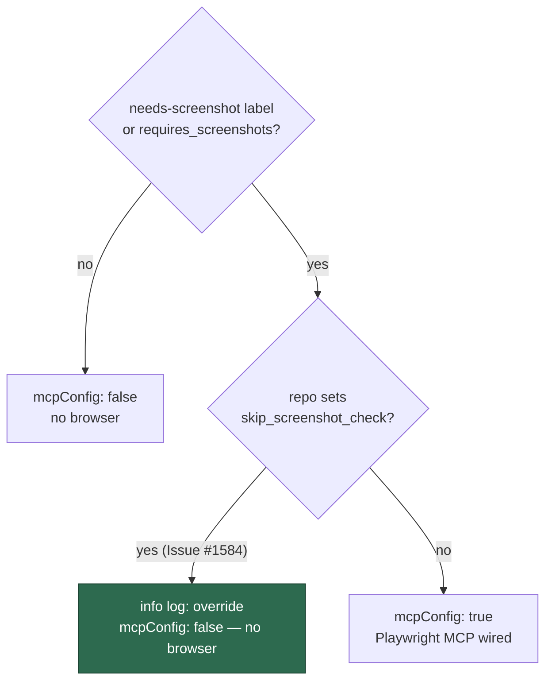

## Summary

Two changes, both about the Playwright MCP browser being started where it is not
proven and not wanted. Closes #1584.

1. **Probe Playwright on MCP-config PRs.** The `changes` job in
   `.github/workflows/container-build.yml` decided on a pull request whether to
   build the image — and so whether to run the "Drive the Playwright MCP server
   from the generated config" probe — from a `git diff --name-only` pathspec
   list of `container/**` and the workflow file. The MCP config the probe
   exercises is generated by `worker/deno/setup/screenshot.ts`, which matched no
   pathspec: Issue #1386 narrowed the server's `--allow-net` to a host allowlist,
   the `container` check passed in four seconds without a build, and `main`
   landed with every `browser_navigate` returning
   `NotCapable: Requires net access to "unix:/tmp/pw-…/browser@….sock"`. The
   generator and its unit test are now in the pathspec list, so such a PR pays
   the full build and drives the browser before it merges.
2. **No Playwright on skip-screenshot repositories.**
   `detectScreenshotRequired` decides both the prompt's screenshot instructions
   and — since Issue #192 — whether the run is handed the Playwright MCP server
   at all. It consulted only the `needs-screenshot` label and
   `requires_screenshots`, so a repository configured with the existing
   `skip_screenshot_check` still got Chromium and an outbound-HTTP tool for a
   prompt whose screenshot instructions had already been stripped. The skip flag
   now overrides both triggers at both call sites, and the override is logged
   once at info level naming the repository. No new config attribute.



## Evidence

Backend/CI change with no web interface to screenshot, so the evidence is test
output rather than an image.

The workflow filter is exercised against the **committed workflow**: the test
parses the `changes` job's `filter` step out of the YAML, takes its pathspecs,
and runs the real `git diff --name-only` with them over a throwaway repository.
Reverting the workflow hunk and re-running turns it red on the exact assertion:

```text
container-build PR filter builds on an MCP-config change (Issue #1584) ... FAILED
    at tests/container_build_probe_paths_test.ts:127:7
FAILED | 2 passed | 1 failed
```

With the hunk in place:

```text
container-build PR filter builds on an MCP-config change (Issue #1584) ... ok
container-build PR filter still skips an unrelated change (Issue #1584) ... ok
ok | 2 passed | 0 failed
```

`./quality.sh` passes (`Result: PASSED (with skipped checks)` — `config
integration` skips for want of credentials, as on `main`).

## Acceptance Criteria

<!-- vibe-spec-review inputs="diff+issue-body" -->

- **met** — Add `worker/deno/setup/screenshot.ts` and
  `worker/deno/tests/setup_screenshot_test.ts` to the pull-request path filter;
  either file alone yields `image=true`, a PR touching neither still yields
  `image=false` — evidence:
  `.github/workflows/container-build.yml:88-92`, and
  `worker/deno/tests/container_build_probe_paths_test.ts` runs the workflow's own
  pathspecs through real `git diff` for both directions — reviewer: met
- **met** — `detectScreenshotRequired` returns false when the repository's
  `skip_screenshot_check` is true, regardless of the `needs-screenshot` label or
  `requires_screenshots`, so both call sites pass `mcpConfig: false`; no new
  config attribute — evidence:
  `worker/deno/lib/execute_claude_phase.ts:399-431`, call sites at
  `worker/deno/lib/execute_claude_phase.ts:852` and
  `worker/deno/lib/phases/execute_phase.ts:326`;
  `worker/deno/tests/execute_claude_phase_test.ts::detectScreenshotRequired - skip_screenshot_check beats the needs-screenshot label`
  and `… beats requires_screenshots` — reviewer: met
- **met** — one info-level log line when the skip flag overrides the label or
  `requires_screenshots`, naming the repository — evidence:
  `worker/deno/tests/execute_claude_phase_test.ts::detectScreenshotRequired - logs the override once, naming the repository`,
  with the negative case `… - no override log when nothing was overridden` —
  reviewer: met
- **met** — `docs/CONFIGURATION.md` `skip_screenshot_check` and
  `requires_screenshots` rows state that the skip flag also disables the
  Playwright MCP browser and wins over both triggers — evidence:
  `docs/CONFIGURATION.md:3623-3624` and the guidance bullet at `:3661` —
  reviewer: met
- **unrequested** — `worker/deno/tests/container_build_probe_paths_test.ts`, a
  new test covering the workflow path filter — reviewer: unrequested — reason:
  the issue asked only for the workflow edit, but the repo's TDD standard
  requires a failing test first and this is the regression guard for the exact
  four-second pass that let the red `main` through; kept.
- **unrequested** — doc edits in `CODING-STANDARDS.md:595-600` and
  `docs/CONTAINER.md:253-258` — reviewer: unrequested — reason: both name the
  Issue #192 browser-wiring rule the diff changes, so "a code change owes a docs
  change" makes them part of this change; kept.

## Standards Review

<!-- vibe-standards-review inputs="diff+CODING-STANDARDS.md" -->

- **violation** — no PR summary under `docs/archive/pr-summaries/`, and a
  workflow/sequence change owes a Mermaid diagram — evidence:
  `docs/archive/pr-summaries/pr-summary-1584.md` (absent at review time) —
  reason: fixed here; this file, with the decision flowchart above.
- **violation** — a test asserting only that two files exist, which sources no
  module and calls no function — evidence:
  `worker/deno/tests/container_build_probe_paths_test.ts:155-160` (pre-fix) —
  reason: fixed; the standalone test is gone and the staleness check is now a
  precondition inside the behavioural case that runs `git diff`.
- **violation** — the pathspec list was located by `indexOf` over the raw
  workflow text, so a reformat would break it without a behavioural regression —
  evidence: `worker/deno/tests/container_build_probe_paths_test.ts:37-46`
  (pre-fix) — reason: fixed; the workflow is now parsed as YAML down to the
  `changes` job's `filter` step and only that step's script is read.
- **violation** — DRY: two near-identical 14-line `Deno.Command("git", …)`
  closures in one file — evidence:
  `worker/deno/tests/container_build_probe_paths_test.ts:53-67` and `:85-98`
  (pre-fix) — reason: fixed; one `git(cwd, ...args)` helper serves both.
- **violation** — KISS: the override log message was assembled from four
  concatenated ternaries purely for grammar — evidence:
  `worker/deno/lib/execute_claude_phase.ts:422-428` (pre-fix) — reason: fixed;
  the triggers that fired are collected into a list and joined.
- **clean** — Australian English throughout (no `-ize`/`behavior` forms); commit
  safety (the only hidden path staged is the allowlisted
  `.github/workflows/container-build.yml`); commit message references the issue
  and carries the `Vibe-Coder-Run-Id` trailer; the `detectScreenshotRequired`
  tests call the real exported function and assert the returned decision and the
  injected log sink, covering both boolean and string config forms plus the
  negative log path; no wall-clock sleeps, polls or timing thresholds; no
  parallel-unsafe process state; decision logic stays in `worker/deno/lib/`;
  every docs surface naming `requires_screenshots` or the Issue #192 wiring was
  updated in the same change.

## Test Plan

Added to `worker/deno/tests/execute_claude_phase_test.ts`:

- `detectScreenshotRequired - skip_screenshot_check beats the needs-screenshot label`
- `detectScreenshotRequired - skip_screenshot_check beats requires_screenshots`
- `detectScreenshotRequired - skip_screenshot_check as a string still overrides`
- `detectScreenshotRequired - logs the override once, naming the repository`
- `detectScreenshotRequired - no override log when nothing was overridden`

Added `worker/deno/tests/container_build_probe_paths_test.ts`:

- `container-build PR filter builds on an MCP-config change (Issue #1584)` —
  both watched paths, run through the workflow's own pathspecs with real `git
  diff`; red against the pre-change filter.
- `container-build PR filter still skips an unrelated change (Issue #1584)` — a
  docs-only change must not trigger the 11-minute build.

Existing tests unchanged; none removed or commented out. `./quality.sh` run in
full after the final edit.
