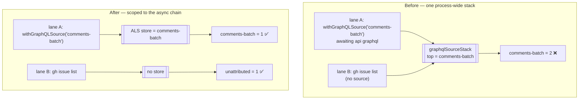

# GraphQL source attribution is async-scoped (Issue #1585)

## Summary

`worker/deno/lib/gh_call_metrics.ts` kept two attribution axes, and only the
priority axis was async-scoped. The GraphQL source axis read a process-wide
`state.graphqlSourceStack`, so while `comment_batch.ts` awaited its
`gh api graphql` spawn, any `gh issue list` or `gh pr view` issued by a lane
running beside it was credited to `comments-batch`.

This adds `graphqlSourceStorage` (an `AsyncLocalStorage<string>`) with
`withGraphQLSourceContext()` / `currentGraphQLSourceContext()`, mirroring
`withPriorityContext` / `currentPriorityContext` in the same file, and
reimplements `withGraphQLSource()` on top of it. `recordGhCall` now resolves
the source exactly as it resolves the priority — explicit stack top, else the
async-scoped store, else `"unattributed"` — so an explicit
`enterGraphQLSource()` keeps innermost-wins. All eight existing
`withGraphQLSource` call sites became concurrency-safe with no edit.

Closes #1585.



## Evidence

Backend/CLI telemetry change — no web interface to screenshot. Verified by
unit tests and the full quality gate.

```
$ deno test --allow-all tests/gh_call_metrics_test.ts
ok | 34 passed | 0 failed

$ ./quality.sh
Result: PASSED (with skipped checks)   # config integration skipped (no credentials)
```

### The 40-vs-23 finding

The parent (#1571) could not resolve why the attributed buckets summed to 40
while the `api-graphql` sub-command counter read 23 for the same cycle. Both
readings are now pinned down, in the code comment above `graphqlSourceStorage`
and in `docs/GH-API-OPTIMISATION.md`:

- **Summed over the named buckets only — cross-crediting explains it.** Every
  `withGraphQLSource` call site wraps exactly one `gh api graphql` spawn
  (`pr_linkage.ts:123`, `timeline_batch.ts:205`, `pr_branch_state.ts:239`,
  `fleet_pr_search.ts:324`, and the rest), so absent concurrency the named
  buckets sum to exactly the `api graphql` count. Cross-crediting is the only
  mechanism by which a named bucket can outgrow it, and this PR removes it.
- **Summed over all buckets including `unattributed` — no cross-crediting is
  needed.** Since Issue #1485 `graphqlBySource` counts every GraphQL-backed
  sub-command, while `bySubCommand["api graphql"]` counts only the explicit
  ones. The two measure different sets by design.

## Reproduction

- **symptom** — a `gh` call issued by one lane was credited to another lane's
  GraphQL source bucket, inflating `graphqlBySource` for the wrapped caller
- **status** — `verified` — the regression test was observed failing against
  the unfixed code (`comments-batch` read 3 instead of 1, absorbing the second
  lane's `issue list` and `pr view`) and passing after the fix
- **regression test** —
  `worker/deno/tests/gh_call_metrics_test.ts::gh_call_metrics - concurrent chains do not cross-credit GraphQL sources`

## Acceptance Criteria

<!-- vibe-spec-review inputs="diff+issue-body" -->

- **met** — two async chains interleaved on a deferred promise attribute
  independently; the unwrapped chain lands in `unattributed` — evidence:
  `worker/deno/tests/gh_call_metrics_test.ts::gh_call_metrics - concurrent chains do not cross-credit GraphQL sources`
  (asserts `unattributed === 2`) — reviewer: met
- **met** — a wrapped chain's own `api graphql` call still lands in its named
  bucket — evidence: the same test asserts `comments-batch === 1` and
  `graphqlTotal === 3` — reviewer: met
- **met** — a nested `enterGraphQLSource()` inside a wrapped chain still wins —
  evidence:
  `worker/deno/tests/gh_call_metrics_test.ts::gh_call_metrics - nested enterGraphQLSource still wins inside a wrapped chain`
  — reviewer: met — reason: the reviewer flagged the reverse nesting (an
  explicit source wrapping a `withGraphQLSource` chain) as changed — outer now
  wins. That follows from the resolution order the issue prescribes and the
  precedent of the priority axis; `enterGraphQLSource` has no production call
  site, so nothing depends on the old order. Recorded in the code comment
  rather than changed.
- **met** — no `withGraphQLSource` call site needed editing — evidence: the
  diff touches four files; the eight call sites (`comment_batch.ts:218`,
  `check_runs_batch.ts:265`, `timeline_batch.ts:205`, `pr_branch_state.ts:239`,
  `pr_linkage.ts:123`, `milestone_health.ts:259`, `issue_edit_actor.ts:142`,
  `fleet_pr_search.ts:324`) are unchanged — reviewer: met
- **met** — existing tests pass unchanged; `deno test`, `deno lint`,
  `deno fmt --check` green — evidence: 34/34 in
  `worker/deno/tests/gh_call_metrics_test.ts` with no existing case modified;
  full `./quality.sh` PASSED — reviewer: met
- **unrequested** — a paragraph added to `docs/GH-API-OPTIMISATION.md`
  describing the new attribution scope and the 40-vs-23 finding — reviewer:
  unrequested — reason: the repo standard "A Code Change Owes a Docs Change"
  requires the operator manual that documents the `graphql-calls:` line to
  match the changed attribution semantics.

## Standards Review

<!-- vibe-standards-review inputs="diff+CODING-STANDARDS.md" -->

- **violation** — the concurrency test hand-rolled an unbounded promise gate
  instead of the repo's `createRendezvous` helper ("Rendezvous, never sleep, to
  prove concurrency") — evidence:
  `worker/deno/tests/gh_call_metrics_test.ts:520` — reason: fixed here; the
  test now uses `createRendezvous(2)` from `tests/support/rendezvous.ts`, whose
  wait is bounded, so a lane that never arrives fails the assertion instead of
  hanging the suite.
- **violation** — no error-path test for the newly exported
  `withGraphQLSourceContext` ("Test coverage expectations") — evidence:
  `worker/deno/tests/gh_call_metrics_test.ts:562` — reason: fixed here; the
  test now also asserts a throwing `fn` propagates and unwinds the context.
- **violation** — `docs/archive/pr-summaries/pr-summary-1585.md` was missing —
  evidence: `docs/archive/pr-summaries/` — reason: fixed here; this file.
- **violation** — `withGraphQLSource` is now a one-line pass-through to
  `withGraphQLSourceContext`, and neither new export has a production caller
  (KISS / avoid over-engineering) — evidence:
  `worker/deno/lib/gh_call_metrics.ts:320` — reason: stands. The issue
  explicitly asks for both `withGraphQLSourceContext` and for
  `withGraphQLSource` to be reimplemented on top of it, precisely so the eight
  existing call sites need no edit; collapsing them would break that
  criterion and diverge from the priority axis it mirrors.
- **clean** — Australian English throughout; commit carries the issue
  reference and the `Vibe-Coder-Run-Id` trailer; new logic in Deno TypeScript
  under `worker/deno/lib/`; no existing test commented out or removed; tests
  call real functions and assert on `getGhCallMetrics()` snapshots rather than
  grepping source; no sleeps, wall-clock thresholds or spawned processes in
  the new tests; no catch-and-ignore (the removed `try/finally` is replaced by
  `AsyncLocalStorage.run`, which propagates the rejection); no hidden paths or
  credential files staged.

## Test Plan

Added to `worker/deno/tests/gh_call_metrics_test.ts`:

- `concurrent chains do not cross-credit GraphQL sources` — the regression
  test. Two lanes meet at a bounded `createRendezvous(2)`: one suspended inside
  `withGraphQLSource("comments-batch")`, one outside any source. Asserts
  `comments-batch === 1` and `unattributed === 2`. Fails against the unfixed
  code with `comments-batch === 3`.
- `nested enterGraphQLSource still wins inside a wrapped chain` — innermost-wins
  preserved: `timeline-batch === 1`, `comments-batch === 1`.
- `withGraphQLSourceContext scopes currentGraphQLSourceContext` — happy path
  (name normalisation, scope entered and left) and error path (a throwing `fn`
  propagates and unwinds the context).

Unchanged and still passing: all 31 pre-existing cases in the file, including
`withGraphQLSource pops on throw` and
`resetGhCallMetrics clears GraphQL counters and stack`.
