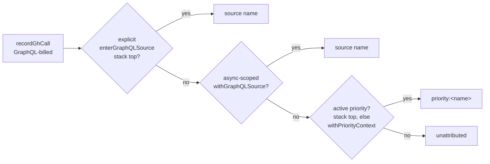

## Summary

`recordGhCall` attributed a GraphQL-billed `gh` call to the explicit GraphQL
source stack, else the async-scoped source context, else `unattributed`. Only
the eight batching modules that issue an explicit `gh api graphql` wrap
themselves in a source, so since Issue #1485 — when every `gh` sub-command
became GraphQL-billed — the bulk of the burn (`issue list`, `pr list`,
`issue view`) had no source and landed in `unattributed`, which was most of the
`graphql-calls:` line.

The source resolution now falls back to the active priority, which the same
function already resolves a few lines earlier for `byPriority`, emitted with a
`priority:` prefix so a derived bucket can never be confused with an explicit
one:



`unattributed` therefore becomes an anomaly signal — a pass running outside both
a source and a priority context — rather than the normal case. Closes #1586.

## Evidence

Backend telemetry only; there is no web interface to screenshot. The evidence is
the unit suite over `recordGhCall`'s resolution ladder:

```
$ deno test --allow-all tests/gh_call_metrics_test.ts
ok | 42 passed | 0 failed (66ms)
```

`./quality.sh` ran green on the first commit (all stages PASSED,
`config
integration` SKIPPED as usual). The later commits changed only comments,
one docs sentence and one added test; `deno fmt --check`, `deno lint`,
`deno check` and the affected test file were re-run green after each.

Sample line shape after the change:
`graphql-calls: 796 total, priority:issue-scanning=239, timeline-batch=26, …`

## Reproduction

- **symptom** — a cycle's `graphql-calls:` line credited ~95% of its total to
  `unattributed`, because the ordinary `issue list` / `pr list` / `issue view`
  traffic is never wrapped in a GraphQL source
- **status** — `verified` — the new ladder tests were observed failing against
  the unfixed code (5 failures, e.g. `priority:issue-scanning` absent and the
  bucket sum reading `unattributed=4`) and passing after the fix
- **regression test** —
  `worker/deno/tests/gh_call_metrics_test.ts::gh_call_metrics - GraphQL calls fall back to the active priority context`
  and
  `worker/deno/tests/gh_call_metrics_test.ts::gh_call_metrics - graphqlBySource sums exactly to graphqlTotal`

## Acceptance Criteria

<!-- vibe-spec-review inputs="diff+issue-body" -->

- **met** — a `gh issue list` inside `withPriorityContext("Issue Scanning")`
  with no GraphQL source lands in `priority:issue-scanning` — evidence:
  `worker/deno/tests/gh_call_metrics_test.ts::gh_call_metrics - GraphQL calls fall back to the active priority context`
  — reviewer: met
- **met** — an explicit `withGraphQLSource("timeline-batch")` still wins over an
  enclosing priority — evidence:
  `worker/deno/tests/gh_call_metrics_test.ts::gh_call_metrics - an explicit GraphQL source beats an enclosing priority`
  — reviewer: met
- **met** — a REST `gh api /repos/...` call contributes to neither
  `graphqlTotal` nor any bucket — evidence:
  `worker/deno/tests/gh_call_metrics_test.ts::gh_call_metrics - REST calls inside a priority context are not GraphQL`
  — reviewer: met
- **met** — `graphqlBySource` sums exactly to `graphqlTotal` over a mixed
  sequence — evidence:
  `worker/deno/tests/gh_call_metrics_test.ts::gh_call_metrics - graphqlBySource sums exactly to graphqlTotal`
  — reviewer: met
- **met** — a call with neither a source nor a priority still lands in
  `unattributed` — evidence:
  `worker/deno/tests/gh_call_metrics_test.ts::gh_call_metrics - a call with neither source nor priority stays unattributed`
  — reviewer: met
- **met** — `docs/GH-API-OPTIMISATION.md` and the two doc comments describe the
  new resolution order; `deno test` / `deno lint` / `deno fmt --check` green —
  evidence: `docs/GH-API-OPTIMISATION.md:362-419`,
  `worker/deno/lib/gh_call_metrics.ts:56-65` and `:536-545` — reviewer: met —
  reason: the reviewer noted the specific `graphql-calls:` paragraph the issue
  named was left intact with the four-step description appended below it; that
  sentence has since been amended to point at the resolution, so the paragraph
  itself now carries the change
- **unrequested** — test
  `gh_call_metrics - formatGraphQLSummary names derived priority buckets` —
  reviewer: unrequested — reason: asserts the rendered log line matches the
  example bucket shape the issue's summary gives; kept because it is the only
  check that the `priority:` prefix survives into operator-visible output
- **unrequested** — test
  `gh_call_metrics - GraphQL calls fall back to the explicit priority stack` —
  reviewer: unrequested — reason: covers the `enterPriority` half of step 3,
  which the issue's "What Needs to Be Done" specifies but its checkboxes name
  only the async half
- **unrequested** — test
  `gh_call_metrics - concurrent priority lanes do not cross-credit derived buckets`
  — reviewer: unrequested — reason: added after the Standards review; pins that
  the derived bucket inherits the priority axis's async scoping, the defect
  shape Issue #213 and Issue #1585 each had to fix on the other two axes

## Standards Review

<!-- vibe-standards-review inputs="diff+CODING-STANDARDS.md" -->

- **violation** — the PR summary file was absent — evidence:
  `docs/archive/pr-summaries/` — reason: fixed here; this file is it
- **violation** — the four-step resolution was restated in four places (DRY /
  comment economy) — evidence: `worker/deno/lib/gh_call_metrics.ts:86-91` —
  reason: fixed in commit `47e2cb7`; `recordGhCall` now holds the canonical
  statement and the constant's doc points at it
- **violation** — no concurrency test for the new derived bucket, which reads
  the process-wide priority stack before the async-scoped store — evidence:
  `worker/deno/tests/gh_call_metrics_test.ts:602` — reason: fixed in commit
  `47e2cb7` by adding
  `concurrent priority lanes do not cross-credit derived buckets`
- **violation** — the fail-loud regression detector `unattributed` provided (a
  batching module that forgot to wrap itself) is weakened, since such a call now
  lands in a `priority:` bucket — evidence:
  `worker/deno/lib/gh_call_metrics.ts:373` — reason: it stands. This trade-off
  is the issue's stated intent: an unattributable 95% is itself a dead detector.
  The `priority:` prefix keeps derived buckets distinguishable from explicit
  ones, so an unwrapped batching module is still visible as `priority:*` traffic
  where a named source was expected, and `unattributed` now flags the strictly
  worse case — a pass outside every context
- **clean** — Australian English throughout; tests call real exported functions
  and assert on returned snapshots (no source-text greps); unit-test shape with
  a bounded rendezvous rather than a sleep; scope limited to the three files on
  the change's own path; docs updated in the same commits; commit messages carry
  the issue reference and the `Vibe-Coder-Run-Id` trailer; no hidden or
  credential-shaped paths staged

## Test Plan

Added to `worker/deno/tests/gh_call_metrics_test.ts` (8 tests, all new):

- `GraphQL calls fall back to the active priority context` — async-scoped rung
- `GraphQL calls fall back to the explicit priority stack` — `enterPriority`
  rung
- `an explicit GraphQL source beats an enclosing priority` — both explicit and
  async source rungs win over a priority
- `REST calls inside a priority context are not GraphQL` — REST touches neither
  counter
- `a call with neither source nor priority stays unattributed` — the floor rung
- `graphqlBySource sums exactly to graphqlTotal` — the standing sum invariant
  over a mixed sequence
- `formatGraphQLSummary names derived priority buckets` — the prefix reaches the
  log line
- `concurrent priority lanes do not cross-credit derived buckets` — the derived
  bucket is async-scoped

No existing test was modified or removed.
