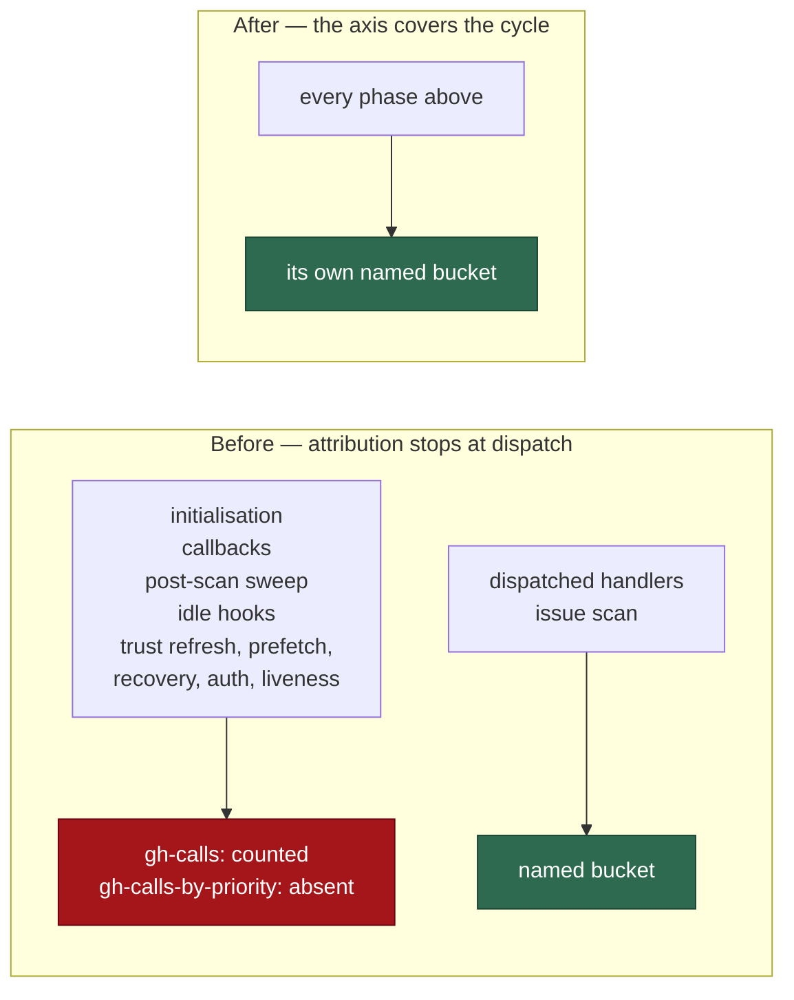

## Summary

The priority axis covered the dispatched handlers and the Priority 2 scan and
nothing else, so every other phase of the cycle issued `gh` calls that landed
in `gh-calls:` and in no `gh-calls-by-priority:` bucket at all. Each of those
phases now runs inside a named `withPriorityContext` block (async-scoped,
Issue #213 — never `enterPriority`/`exitPriority`), so the axis covers the
whole cycle. Closes #1587.

Wrapped, with the log token each yields:

| Phase | Context | Token |
| --- | --- | --- |
| `runInitialisation` | `"Initialisation"` | `initialisation` |
| `dispatchIssueCallbacks` | `"Issue Callbacks"` | `issue-callbacks` |
| `runPostScanAutoMerge` | `"Post-scan Auto-merge"` | `post-scan-auto-merge` |
| `runIdleWorkHooks` | `"Idle Work Hooks"` | `idle-work-hooks` |

The issue also asked for an audit of the outer run loop. It found five more
gh-issuing passes outside dispatch, all now wrapped: `refreshTrustedAuthors`
(`trust-refresh` — lists collaborators on every monitored repo),
`prefetchFleetOpenPrs` (`fleet-pr-prefetch` — one `gh search` per owner),
`recoverStaleAssignments` (`stale-assignment-recovery` — two GitHub-side
scans), `checkGhAuth` (`github-auth-check` — `gh auth status` spawns through
the recorded chokepoint on a health-cache miss) and `checkLivenessWindow`
(`liveness-guard` — the guard's `2 × repos` probes).

**Deliberately left bare:** `preflightGitHubRateLimit` and
`describeGraphqlQuota` read the quota itself, which GitHub does not charge —
the issue's own "quota probe that is free" case. Both also run after the
end-of-cycle summary is emitted, so a context would never reach an operator.
`runMaintenanceLane` is untouched: it dispatches through
`executePriorityHandler`, which already attributes each pass.

One behavioural consequence worth a reviewer's eye: `withPriorityContext` uses
`AsyncLocalStorage.run`, so the innermost context wins. Callbacks fired from a
scan slot now credit `issue-callbacks` rather than `issue-scanning`, and idle
hooks run inside a slot credit `idle-work-hooks`. That is the intended
sharpening, not double-counting — `recordGhCall` credits exactly one bucket,
which the dispatch control test asserts.

## Evidence

Backend/CLI change with no web interface to screenshot. The evidence is the
test suite below and the full gate.

`./quality.sh` — **PASSED** (deno tests, lint, type check, fmt, markdownlint,
mermaid, semgrep and the chokepoint audits all green; `config integration`
skipped by the gate itself, as it is on every run).

Where a `gh` call is credited, before and after:

## Reproduction

- **symptom** — a cycle phase outside priority dispatch (initialisation, the
  post-scan auto-merge sweep, the post-run issue callbacks, the idle work
  hooks) issues `gh` calls that are counted in `gh-calls:` but credited to no
  `gh-calls-by-priority:` bucket, leaving most of the cycle unattributed
- **status** — `verified` — the new tests were run against the unwrapped code
  and observed failing (`credited()` empty for initialisation, the sweep and
  the idle hooks; `issue-scanning` instead of `issue-callbacks` for the
  callbacks), then passing after each wrapper. Re-checked for the last two
  wraps by stashing `run_core.ts`: `github-auth-check` and `liveness-guard`
  went red while the dispatch control stayed green.
- **regression test** —
  `worker/deno/tests/run_core_cycle_phase_attribution_test.ts` (ten tests,
  one per wrapped phase plus the dispatch control)

## Acceptance Criteria

<!-- vibe-spec-review inputs="diff+issue-body" -->

- **met** — each newly wrapped phase attributes to its named context in
  `getGhCallMetrics().byPriority` with a stubbed dep that records a `gh` call
  — evidence: `worker/deno/tests/run_core_cycle_phase_attribution_test.ts`,
  ten tests, one per wrapped phase plus the dispatch control — reviewer:
  partial — reason: the reviewer saw the diff at its first commit, where the
  three audit wraps had no test; the five audited phases each gained one
  (`trust-refresh`, `fleet-pr-prefetch`, `stale-assignment-recovery`,
  `github-auth-check`, `liveness-guard`) in the second commit.
- **met** — `formatGhCallsByPrioritySummary()` names those phases in a cycle
  that ran them — evidence:
  `run_core_cycle_phase_attribution_test.ts::assertNamedInSummary`, asserted
  for `post-scan-auto-merge`, `idle-work-hooks` and `issue-callbacks` —
  reviewer: partial — reason: the reviewer correctly found `issue-callbacks`
  unasserted (now added) and correctly found that `initialisation` can never
  appear in a summary — it runs before the loop and `resetGhCallMetrics()`
  clears its counts at the top of the first iteration. That is pre-existing
  loop structure, not something this issue asked to change; initialisation's
  attribution is asserted directly against `byPriority` instead, and the
  reason is stated in the test file's header.
- **met** — `executePriorityHandler` and the issue-scan loop keep their
  existing attribution; no handler is double-counted — evidence: neither call
  site is touched by the diff; `run_core_cycle_phase_attribution_test.ts::a
  dispatched handler keeps its own name` asserts exactly one bucket
  (`milestone-completions`) for a dispatched handler — reviewer: met
- **met** — no phase acquires a context by way of
  `enterPriority`/`exitPriority` — evidence: all nine sites in
  `worker/deno/lib/run_core.ts` use `withPriorityContext`; those identifiers
  appear only in an explanatory comment — reviewer: met
- **met** — `deno test`, `deno lint` and `deno fmt --check` are green —
  evidence: full `./quality.sh` run after the final edit, PASSED — reviewer:
  met
- **unrequested** — the five extra wraps (`trust-refresh`,
  `fleet-pr-prefetch`, `stale-assignment-recovery`, `github-auth-check`,
  `liveness-guard`) — reviewer: unrequested — reason: not named in the issue,
  but required by its audit bullet ("either wrap it or note in the PR why it
  is deliberately left bare"); each is a confirmed gh-issuing pass, so wrapping
  is the outcome that bullet asks for, and each has a test.
- **unrequested** — the `gh-calls-by-priority:` section added to
  `docs/GH-API-OPTIMISATION.md` — reviewer: unrequested — reason: the change
  adds nine operator-visible bucket names to a line that document did not
  describe; the repo's "a code change owes a docs change" rule applies.

## Standards Review

<!-- vibe-standards-review inputs="diff+CODING-STANDARDS.md" -->

- **violation** — no `docs/archive/pr-summaries/pr-summary-1587.md` — evidence:
  absent at review time — reason: fixed here; this file is it, and it carries
  the bare-phase audit rationale the issue asked to be recorded in the PR.
- **violation** — `gh auth status` still un-contexted — evidence:
  `worker/deno/lib/run_core.ts:4936` — reason: fixed here, wrapped as
  `"GitHub Auth Check"`; the same pass wrapped `checkLivenessWindow`, which
  the Spec reviewer independently flagged.
- **violation** — three of the new attribution sites had no test — evidence:
  `worker/deno/lib/run_core.ts:4724`, `:4755`, `:5037` — reason: fixed here;
  all five audited phases now have a test, and reverting `run_core.ts` was
  observed turning the two newest red and leaving the dispatch control green.
- **violation** — docs owed for the `gh-calls-by-priority:` line — evidence:
  `docs/GH-API-OPTIMISATION.md` — reason: fixed here; a new subsection
  documents the line, its buckets, the innermost-wins consequence and the two
  probes left bare.
- **clean** — Australian English throughout; fail-loud preserved (the
  wrappers are transparent to throws and every existing `try`/`catch` +
  `logError` path is unchanged); `withPriorityContext` used everywhere, never
  `enterPriority`/`exitPriority`; the `async function` → `function` returning
  `Promise<T>` signature changes type-check clean; tests drive the real
  `runCoreLoop` with injected deps — no source-grepping, no wall-clock
  assertions, no spawned scripts; commit messages carry the
  `Vibe-Coder-Run-Id` trailer; no hidden paths or credential files staged;
  all new logic in `worker/deno/`.

## Test Plan

Added `worker/deno/tests/run_core_cycle_phase_attribution_test.ts` — ten
tests, each driving the real `runCoreLoop` with an injected dep that issues a
recorded `gh` call and snapshots `getGhCallMetrics().byPriority` at that
instant (the loop resets the counters each iteration, so the snapshot has to
be taken in-flight):

- `initialisation credits its own bucket`
- `the post-scan sweep credits its own bucket` — plus its summary line
- `post-run issue callbacks credit their own bucket` — plus its summary line
- `the idle work hooks credit their own bucket` — plus its summary line
- `a dispatched handler keeps its own name` — the control: exactly one bucket
  (`milestone-completions`), never a second name from a phase wrapper
- one per audited phase: `trust-refresh`, `fleet-pr-prefetch`,
  `stale-assignment-recovery`, `github-auth-check`, `liveness-guard`

Every test was observed failing against the unwrapped code and passing after
the wrapper. No existing test was modified or removed; the 326 tests across
`tests/run_core*.ts`, `tests/gh_call_metrics_test.ts` and
`tests/idle_task_end_to_end_test.ts` stay green, as does the full gate.
