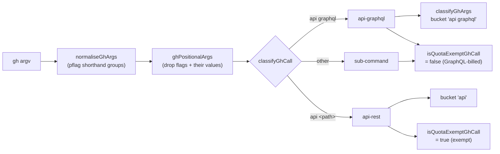

## Summary

`classifyGhArgs` (`worker/deno/lib/gh_call_metrics.ts`) and
`isQuotaExemptGhCall` (`worker/deno/lib/primary_quota_latch.ts`) each decided
independently whether a `gh` invocation was an `api graphql` call, and parsed
argv differently:

- `classifyGhArgs` treated any token starting with `-` as a flag, so the
  **value** of a value-taking flag was read as the next positional —
  `["api", "-f", "query=…", "graphql"]` bucketed as `"api"`.
- `isQuotaExemptGhCall` required `args[0] === "api"` with no flag skipping at
  all, then tested `args.includes("graphql")`, which matched the token
  anywhere in argv — including as a flag value.

So the `api-graphql=` bucket of the `gh-calls:` line and the GraphQL
attribution that shares the latch predicate answered slightly different
questions and could not be reconciled.

Both now derive from one flag-aware classifier, `classifyGhCall` in the new
`worker/deno/lib/gh_argv.ts`, which skips flags *and the values of
value-taking flags* before reading the endpoint token. It sits in its own leaf
module because `gh_call_metrics.ts` already imports from
`primary_quota_latch.ts`, so a helper in the former would invert that
direction. argv is first run through the repo's existing pflag normaliser
(`normaliseGhArgs`, `gh_flag_parser.ts`), and shorthand groups are then read
the way pflag reads them, so neither `gh api -iXPOST graphql` nor
`gh api -iq .data graphql` can hide the endpoint token behind a flag value;
no third argv parser was added.

The latch stays conservative in the safe direction: only a positively
classified REST `gh api <path>` is exempt, so anything the classifier cannot
place as REST is still GraphQL-billed and short-circuited.



`docs/GH-API-OPTIMISATION.md` now documents the relationship between the two
telemetry lines: `graphql-calls: N total` counts every GraphQL-billed
sub-command, `api-graphql=` is the subset that is an explicit `gh api
graphql`, the explicitly-sourced buckets should sum to `api-graphql` because
every `withGraphQLSource` call site wraps exactly one `api graphql` spawn, and
what each direction of a divergence would mean. Closes #1588.

## Evidence

Backend telemetry only — no web interface to screenshot. The evidence is the
unit suite over both classifiers:

```
$ deno test --allow-all tests/gh_argv_test.ts tests/gh_call_metrics_test.ts \
    tests/primary_quota_latch_test.ts
ok | 58 passed | 0 failed (90ms)
```

The three classifier rules are mutation-verified, not merely covered — with
the long-flag skip removed 3 tests fail, with the shorthand-group value
removed 6 fail, and with the `api graphql` rule stubbed to `api-rest` 19 fail.

`./quality.sh` ran green after the final edit (every stage PASSED, `config
integration` SKIPPED as usual — no `.config.json` in the worktree).

Every production `gh api graphql` call site spells the canonical
`["api", "graphql", "-f", "query=…"]` (`check_runs_batch.ts:267`,
`comment_batch.ts:220`, `github_status.ts:304`, `pr_branch_state.ts:241`,
`timeline_batch.ts:207`), so no live call changes classification; the fix
removes the divergence itself and the latent shapes that would reopen it.

## Reproduction

- **symptom** — `classifyGhArgs` and `isQuotaExemptGhCall` disagreed about what
  an `api graphql` invocation is, so the `api-graphql=` bucket could not be
  reconciled with the GraphQL attribution that shares the latch predicate:
  `["api", "-f", "query=…", "graphql"]` bucketed as `"api"` while the latch
  billed it as GraphQL
- **status** — `verified` — the table-driven agreement test was observed
  failing against the unfixed code (the bucket assertion for that argv row,
  `tests/gh_call_metrics_test.ts:812`) and passing after the fix
- **regression test** —
  `worker/deno/tests/gh_call_metrics_test.ts::gh_call_metrics - classifyGhArgs and isQuotaExemptGhCall agree on every argv shape`

## Test Plan

- Added `worker/deno/tests/gh_argv_test.ts` — `ghPositionalArgs` (flag values,
  `--flag=value`, boolean flags, pflag shorthand groups, `--` terminator,
  empty/flag-only argv), `classifyGhCall` over every kind, and
  `isApiGraphQLCall`.
- Added to `worker/deno/tests/gh_call_metrics_test.ts` (each row carries the
  expected bucket as a literal, so neither function can excuse the other):
  - `classifyGhArgs and isQuotaExemptGhCall agree on every argv shape` — the
    table-driven agreement test over the argv rows the issue names plus the
    shorthand-group and leading-global-flag shapes.
  - `the api-graphql bucket equals the recorded api graphql calls` — over a
    recorded mixed sequence, cross-checked against the rows' literal buckets,
    which owe nothing to the code under test.
  - A row in `classifyGhArgs skips leading flags` for
    `["issue", "--repo", "o/r", "list"]`, which used to bucket as `issue o/r`.
- Added `worker/deno/tests/primary_quota_latch_test.ts::isQuotaExemptGhCall -
  the endpoint token decides, not a flag value (Issue #1588)`; the existing
  latch tests are unchanged and pass.

## Acceptance Criteria

<!-- vibe-spec-review inputs="diff+issue-body" -->

- **met** — a table-driven test over representative argv shapes asserts
  `classifyGhArgs` and `isQuotaExemptGhCall` agree on every row — evidence:
  `worker/deno/tests/gh_call_metrics_test.ts::gh_call_metrics - classifyGhArgs and isQuotaExemptGhCall agree on every argv shape`
  — reviewer: met — reason: the reviewer confirmed all five argv shapes the
  issue names are rows and the expected values are hand-written literals
- **met** — a REST path or flag value containing the word `graphql` is not
  counted as a GraphQL call by either function — evidence: rows 8–12 of
  `GH_ARGV_ROWS` and
  `worker/deno/tests/primary_quota_latch_test.ts::isQuotaExemptGhCall - the endpoint token decides, not a flag value (Issue #1588)`
  — reviewer: met
- **met** — over a recorded mixed sequence the `bySubCommand["api graphql"]`
  bucket equals the shared classifier's count — evidence:
  `worker/deno/tests/gh_call_metrics_test.ts::gh_call_metrics - the api-graphql bucket equals the recorded api graphql calls`
  — reviewer: met — reason: the reviewer mutation-verified this test fails on a
  classifier regression; its expectation has since been re-sourced from the
  rows' literal buckets so no term in it comes from the code under test
- **met** — the primary-quota latch still short-circuits every non-REST `gh`
  invocation; existing `primary_quota_latch` tests pass unchanged — evidence:
  `worker/deno/lib/gh_argv.ts:74-95` (`shorthandTakesNextToken`) and
  `worker/deno/tests/gh_argv_test.ts::gh_argv - ghPositionalArgs reads pflag shorthand groups`
  — reviewer: partial — reason: the reviewer found a real residue after its
  first round — a shorthand group whose value letter is outside
  `normaliseGhArgs`'s `{R,l,X,f,F}` (`gh api -iq .data graphql`) still read as
  REST. Departed from `partial` because that class was closed after the review
  by reading shorthand groups with pflag's own rule; the five shapes it
  executed now all classify `api-graphql`, and removing the handling fails 6
  tests
- **met** — `docs/GH-API-OPTIMISATION.md` documents the relationship between
  the two counters; `deno test`, `deno lint`, `deno fmt --check` green —
  evidence: `docs/GH-API-OPTIMISATION.md:375-425`, full `./quality.sh` green —
  reviewer: met — reason: the reviewer noted the docs' absolute "cannot escape"
  claim overstated the code; that sentence now states what the code actually
  guarantees (the flag list would have to gain a false entry, not miss one)
- **unrequested** — `ghCallKindOf` is exported alongside `classifyGhCall` —
  reviewer: unrequested — reason: added after the Standards review so
  `classifyGhArgs`, which already has the positionals, does not parse argv a
  second time on the hot path; it keeps the `api graphql` rule in one place
- **unrequested** — the four-way `GhCallKind` union, including `"sub-command"`
  and `"unknown"` — reviewer: unrequested — reason: the latch needs "not
  positively REST" as its own state rather than a negation, which is what
  keeps the conservative direction explicit at the call site
- **unrequested** — `--` end-of-flags handling — reviewer: unrequested —
  reason: three lines of pflag fidelity in a parser whose whole purpose is to
  find positionals; leaving it out would misread the token after `--`
- **unrequested** — value-taking flags beyond the issue's list (`--cache`,
  `--preview`, `--hostname`) — reviewer: unrequested — reason: they are the
  remaining value-taking `gh api` and global flags, and a missing entry is
  exactly what lets a real GraphQL call be classified as REST
- **unrequested** — the `normaliseGhArgs` dependency and its docs paragraph —
  reviewer: unrequested — reason: added in response to the Spec review, which
  found `gh api -iXPOST graphql` escaping the latch; reusing the repo's pflag
  normaliser avoids a third argv parser
- **unrequested** — new test file `worker/deno/tests/gh_argv_test.ts` —
  reviewer: unrequested — reason: the repo pairs each `lib/` module with its
  own test file, and the agreement coverage the issue asked for still lives in
  the two existing files
- **unrequested** — the `worker/deno/lib/gh_argv.ts` entry in
  `docs/audits/lib-sweep-coverage.json` — reviewer: unrequested — reason:
  compulsory, not optional: `tests/lib_sweep_coverage_test.ts` fails any new
  `lib/` module that no sweep slice claims
- **unrequested** — the `classifyGhArgs` restructure changes
  `["issue", "--repo", "o/r", "list"]` from `"issue o/r"` to `"issue list"` —
  reviewer: unrequested — reason: an unavoidable consequence of the flag-aware
  parse the issue asked for, and the old label was wrong; now covered by a test
  row

## Standards Review

<!-- vibe-standards-review inputs="diff+CODING-STANDARDS.md" -->

- **violation** — `docs/archive/pr-summaries/pr-summary-1588.md` was untracked,
  so the diff shipped without it — evidence:
  `docs/archive/pr-summaries/pr-summary-1588.md` — reason: fixed here; the file
  is committed with the change
- **violation** — the mixed-sequence test's "independent cross-check" used
  `classifyGhArgs(argv).startsWith("api")`, which is the code under test, and
  compared counts rather than rows — evidence:
  `worker/deno/tests/gh_call_metrics_test.ts:840` — reason: fixed; every row
  now carries its expected bucket as a literal, the agreement test asserts it
  per row, and the sequence test's expectation is built from those literals
- **violation** — `isApiGraphQLCall` had no production caller and existed only
  to be tested — evidence: `worker/deno/lib/gh_argv.ts:133` — reason: fixed;
  the export is removed and the tests call `classifyGhCall` directly
- **violation** — `classifyGhArgs` parsed argv twice per call (once for the
  positionals, once inside `classifyGhCall`), on the hot path of every `gh`
  spawn — evidence: `worker/deno/lib/gh_call_metrics.ts:191,199` — reason:
  fixed; `ghCallKindOf` takes the positionals the caller already has
- **violation** — an unreachable `if (token === undefined) break;` that would
  silently truncate the positional list — evidence:
  `worker/deno/lib/gh_argv.ts:85` — reason: fixed; the index is narrowed with
  `!` as `gh_flag_parser.ts:130` already does
- **violation** — `VALUE_TAKING_FLAGS` is a second source of truth for "which
  `gh` flags take a value" beside `GH_VALUE_SHORTHANDS` — evidence:
  `worker/deno/lib/gh_argv.ts:43` — reason: stands, and is now documented as
  deliberate: the two sets have opposite fail-safe directions (ending a group
  walk too late is fail-closed there; treating a boolean letter as
  value-taking would swallow the endpoint token here), so merging them would
  reopen the escape this issue closes
- **clean** — Australian English throughout; fail-loud/fail-closed asymmetry in
  `isQuotaExemptGhCall` (only a positively classified `api-rest` is exempt);
  all new tests call real functions with no sleeps, clocks or spawns; module ↔
  test pairing and sweep registration; commit safety (no hidden paths, both
  commits reference Issue #1588 with a run-id trailer); docs-follow-code, with
  the load-bearing claim verified against all eight `withGraphQLSource` call
  sites; secure coding — argv classification only, no spawn, no interpolation
