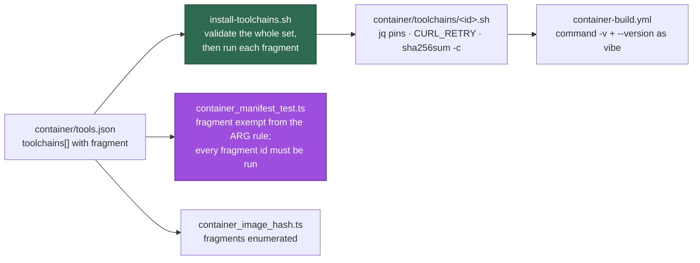

# The fetch-and-extract toolchains move into manifest-driven fragments

## Summary

The comment-stripped `container/Containerfile` was 51 bytes below the
15,000-byte cap that `worker/deno/lib/containerfile_strip.ts` enforces, and the
sibling sub-issues of #1574 each need to add a toolchain. Every one of those
costs two or three `ARG` lines and a `RUN` block, because
`findContainerfileViolations` requires the Containerfile to restate each
manifest pin as `ARG`s — so there was no room left to add anything.

The four fetch-verify-extract toolchains — `shellcheck`, `actionlint`,
`cargo-deny` and `rust` — now live in their own fragments, exactly as the
coding-agent providers already do. Each `container/toolchains/<id>.sh` reads its
pinned version and per-architecture SHA-256 out of `container/tools.json` with
`jq` rather than having them restated as build arguments, and
`container/install-toolchains.sh` validates a requested id set in full before
running a single fragment. The Containerfile names ids instead of pins.

No pin changed and nothing the image contains changed: `container/tools.json`
differs only by `versionArg` becoming `fragment` on those four entries. `node`,
`npm`, `markdownlint-cli2` and `semgrep` keep their existing `ARG`/`RUN` steps —
Node's layer must precede the provider layer, and the npm- and pip-installed
tools are not fetch-and-extract.

The exemption is only safe while something else proves each fragment is real,
so `findToolchainInstallViolations` requires the Containerfile to copy
`toolchains/*.sh` and to name **every** fragment-bearing id in some
`install-toolchains.sh` run. A pinned toolchain the build never installs is a
violation — absence of a failure is not success.

Closes #1594.

## Evidence

Container-build and CLI change with no web interface to screenshot. The evidence
is the byte count, the mutation checks and the test suites below.

**The comment-stripped Containerfile: 14,949 → 11,017 bytes**, against a
`CONTAINERFILE_SIZE_CAP_BYTES` of 15,000 — **3,983 bytes of headroom**, up from
51. Measured by running `stripContainerfile` over the committed definition at
this commit and at the milestone base.

Layer order is preserved, so the least-to-most-churn caching is unchanged:

| Step | Before | After |
| --- | --- | --- |
| static analysers | `RUN` fetching shellcheck + actionlint + cargo-deny | `RUN … install-toolchains.sh shellcheck,actionlint,cargo-deny` |
| `markdownlint-cli2` | npm `RUN` | unchanged, still between the two |
| Rust | its own `RUN` | `RUN … install-toolchains.sh rust`, then the copies are removed |

**The gates were checked by mutation, not by assumption.** Each mutation was
applied to the committed files, observed failing, then reverted:

| Mutation | Result |
| --- | --- |
| Drop `install-toolchains.sh rust` from the Containerfile | `container/ - the committed toolchain layer is fragment-driven and pinned` FAILED — `Containerfile never installs toolchain "rust": container/tools.json pins it with toolchains/rust.sh, so the image would ship without cargo` |
| Give `rust` both `versionArg` and `fragment` | `container/tools.json: toolchains[6] must carry exactly one of "versionArg" … or "fragment" …` |
| Give `actionlint` neither | `container/tools.json: toolchains[1] must carry exactly one of "versionArg" … or "fragment" …` |
| Add an unenumerated `container/toolchains/*.sh` | `container/ - every committed container file is enumerated` FAILED — a fragment absent from `CONTAINER_IMAGE_INPUTS` cannot silently leave the image tag unchanged |

`./quality.sh` PASSED (21 checks; `config integration` SKIPPED, as it is
without a deployment config). `shellcheck` is clean over
`container/install-toolchains.sh` and all four fragments.

## Acceptance Criteria

<!-- vibe-spec-review inputs="diff+issue-body" -->

- **met** — Every pin in `container/tools.json` is unchanged; every toolchain command still resolves at its pinned version — evidence: `container/tools.json` differs only by the description string and four `versionArg` → `fragment` swaps (every version and sha256 byte-identical); the reviewer diffed all four fragments against the original `RUN` bodies and found the asset URLs, architecture keys and install flags identical; `.github/workflows/container-build.yml` is untouched and drives its checks from `tools.json` — reviewer: met — reason: not build-verified, as no container runtime is available in this environment.
- **met** — The comment-stripped Containerfile is at least 3,000 bytes under `CONTAINERFILE_SIZE_CAP_BYTES`; the byte count is recorded in the PR summary — evidence: 11,017 bytes against the 15,000 cap = **3,983 bytes of headroom**, up from 51; recorded in the Evidence section above — reviewer: met
- **met** — A `fragment` no `install-toolchains.sh` run names fails `container_manifest_test.ts`; both or neither of `versionArg`/`fragment` fails `parseContainerManifest` — evidence: `worker/deno/tests/container_manifest_test.ts::findToolchainInstallViolations - reports a pinned toolchain no run installs`, the exactly-one-of cases, and the real-tree assertion `container/ - the committed toolchain layer is fragment-driven and pinned`; all three confirmed by mutating the committed files and watching them fail — reviewer: met
- **met** — `install_toolchains_test.ts` covers the happy path, each error path and the empty set; `container_image_hash_test.ts` passes with the new files enumerated — evidence: `worker/deno/tests/install_toolchains_test.ts` (15 tests) and `worker/deno/tests/container_image_hash_test.ts` (36 tests) — reviewer: met
- **met** — `./quality.sh` passes; the Docker and Podman builds in `container-build.yml` pass — evidence: full gate PASSED (21 checks; `config integration` SKIPPED, as it is without a deployment config) — reviewer: partial — reason: the reviewer read a working tree in which `supply_chain_gate_test.ts` failed on a stale `docs/audits/dependency-inventory.md`. That was a real defect of mine and is fixed here by regenerating the inventory rather than hand-editing it; the gate now passes end to end. The container builds remain unverified locally — no container runtime here — so CI is the first place they run.
- **unrequested** — `findToolchainInstallViolations` also requires each fragment to verify with `sha256sum -c`, to pipe nothing into a shell, to restate no pinned version, and to carry the `${CURL_RETRY}` policy — reviewer: unrequested — reason: moving the fetches out of the Containerfile removed them from that file's existing retry-policy and checksum rules, so without these the move would have quietly *weakened* the gate; mirrors `findProviderInstallViolations`.
- **unrequested** — a reverse check that every id named in an `install-toolchains.sh` run is pinned with a `fragment` — reviewer: unrequested — reason: the other half of the same invariant; without it a typo in a `RUN` would install nothing and pass.
- **unrequested** — `parseContainerManifest` requires `fragment` to be exactly `toolchains/<id>.sh` — reviewer: unrequested — reason: the installer selects the fragment by id, so any other value would be unreachable; mirrors the provider rule.
- **unrequested** — `container/install-toolchains.sh` pre-checks that the manifest is readable JSON with a `toolchains[]` array — reviewer: unrequested — reason: added in response to the standards review; without it invalid JSON was reported as "not pinned with a fragment", pointing the reader at the wrong file. Covered by `install-toolchains - an unreadable manifest is reported as such, not as an unpinned id`.
- **unrequested** — `container/toolchains/rust.sh` resolves its three checksums into variables via a `checksum_for` wrapper that names a missing key — reviewer: unrequested — reason: added in response to the standards review, and a genuine correctness fix rather than cosmetics; see Standards Review below.
- **unrequested** — `worker/deno/tests/container_manifest_test.ts::container/ - every committed fragment is a selectable toolchain id` — reviewer: unrequested — reason: `install-toolchains.sh` lists the fragment directory to report the available ids, so a non-conforming filename there would be unselectable; mirrors the provider suite.
- **unrequested** — `worker/deno/lib/integration_test_manifest.ts` classifies the new suite as an integration test — reviewer: unrequested — reason: consequential, not optional; the suite spawns a real repository script, which is what that manifest records.
- **unrequested** — `docs/audits/dependency-inventory.md` line references refreshed — reviewer: unrequested — reason: consequential; the Containerfile header edit shifted the `FROM` lines and `supply_chain_gate_test.ts` fails on a stale inventory. Regenerated with `supply-chain-gate --write-inventory`, not hand-edited.
- **unrequested** — `docs/CONTAINER.md` "Two consequences worth knowing" → "Three" — reviewer: unrequested — reason: a pre-existing off-by-one the reviewer flagged as unrelated; it is one word inside a paragraph this change already rewrites, so correcting it in place was cheaper than leaving a known error behind.

## Standards Review

<!-- vibe-standards-review inputs="diff+CODING-STANDARDS.md" -->

- **violation** — `container/toolchains/rust.sh` resolved its three component checksums in *argument* position, where a command substitution does not trip `set -e`, so a missing pin passed `jq`'s literal `null` to the installer and surfaced far away as an unformatted-checksum error naming no pin — evidence: `container/toolchains/rust.sh:80` (pre-fix) — reason: **fixed here**. The pins are resolved into variables first and `checksum_for` names the key it could not resolve. Verified red-then-green: against the pre-fix fragment the new test fails with `sha256sum: … No such file or directory` *after* a download; after the fix it aborts with `pins no sha256 for "clippy_arm64"` and never calls `curl`. Covered by `worker/deno/tests/install_toolchains_test.ts::container/toolchains/rust.sh - a missing component pin aborts before downloading`.
- **violation** — `docs/audits/dependency-inventory.md` carried wrong Containerfile line references — evidence: `docs/audits/dependency-inventory.md:26-27` — reason: **fixed here**, by regenerating with `supply-chain-gate --write-inventory`. Two details of the finding were wrong and worth recording: the generator records the **`FROM`** line (18/20), not the `ARG` line (15/16) the reviewer proposed, and the table *is* enforced — `supply_chain_gate_test.ts::the real repository tree passes with no findings` fails on drift. Hand-editing it, which both the earlier commit and my first attempt did, is the actual root cause.
- **violation** — a bare `catch {}` in the test helper made `installed = []` — the assertion nine error cases rely on — true for *any* read failure, not just a missing log — evidence: `worker/deno/tests/install_toolchains_test.ts:99` — reason: **fixed here**; narrowed to `Deno.errors.NotFound` and re-throwing the rest.
- **violation** — `container/install-toolchains.sh` reported an unparseable manifest, or a missing `jq`, as `Toolchain "<id>" is not pinned with a fragment` — evidence: `container/install-toolchains.sh:102` — reason: **fixed here** with an up-front readability check and its own message; the fault still exited non-zero before, so this was a diagnosis defect rather than a silent pass.
- **violation** — `docs/CONTAINER-IMAGE.md` claimed the installer copies are removed by "the last run"; the removal is in the Rust run, which is the third of twelve — evidence: `docs/CONTAINER-IMAGE.md:55` — reason: **fixed here**; reworded to name the Rust run.
- **violation** — a unit test that only lists a directory sat in a file registered as an integration suite, excluding it from the unit gate — evidence: `worker/deno/tests/install_toolchains_test.ts:300` — reason: **fixed here**; moved to `worker/deno/tests/container_manifest_test.ts`, where it runs in the unit pass.
- **violation** — new commentary added to the Containerfile directly beneath the line reserving commentary for `docs/CONTAINER-IMAGE.md`, and repeated across seven surfaces — evidence: `container/Containerfile:11` — reason: **partially fixed**; condensed from four lines to three and reduced to a pointer at where a toolchain or provider goes. The issue explicitly asked for a header update, and a "where things live" pointer is navigation rather than rationale, so it stands in reduced form. Comments are stripped before the size check, so this costs no headroom.
- **violation** — `container/install-toolchains.sh` duplicates ~90 lines of decision logic from `container/install-providers.sh` (the id split, trim, regex, duplicate detector and two-phase validate-then-install loop) — evidence: `container/install-toolchains.sh:37-124` — reason: **stands**. De-duplicating means extracting a shared shell library and rewriting the provider installer against it, which is a refactor of adjacent working code that this issue did not ask for. Recorded here rather than folded in silently.
- **violation** — the four fragments repeat a ~28-line skeleton, and the new selectable-id test forecloses a shared `_common.sh` — evidence: `container/toolchains/shellcheck.sh:21-53` and siblings — reason: **stands**. The flat one-file-per-id layout is the contract `install-toolchains.sh` relies on to enumerate available ids, so the test encodes a real invariant rather than an accident; a shared helper would need to live outside `container/toolchains/`. Same scope argument as above.
- **violation** — six new copies of an "Australian English spelling throughout (behaviour, organisation)" header in files containing neither word — evidence: `container/install-toolchains.sh:24` and siblings — reason: **stands**; it is the established convention in `container/install-providers.sh:20`, and diverging from it in this change alone would be inconsistent. Flagged as token economy only.
- **clean** — Australian English throughout (no `behavior|organiz|analyz|favor|defense|catalog` hits in new prose or code); every fragment fetches over HTTPS from the pinned upstream and verifies with `sha256sum -c -` *before* installing, with nothing piped to a shell; ids are validated against `^[a-z][a-z0-9-]*$` before any path is built and every `jq` query passes the id via `--arg`, never interpolation (`../rust`, `rust.sh`, `cargo deny` and `Rust` are all covered by tests); `set -euo pipefail` in all five new scripts with the bash 3.2-safe `${ids[@]+"${ids[@]}"}` guard; `shellcheck` clean on all five; the tests spawn the real scripts and assert on exit codes, stderr and an order log rather than grepping source text; the `versionArg` optional-field change is type-safe at every call site.

## Test Plan

- **Added** `worker/deno/tests/install_toolchains_test.ts` — 13 tests driving
  the real `container/install-toolchains.sh` against fixture fragments in a
  temporary directory: requested order, single-id set, whitespace tolerance,
  the manifest path reaching each fragment, unknown id, an id the manifest does
  not pin, a missing manifest, duplicate id, empty set, missing argument,
  malformed id, a fragment that fails, and that every committed fragment is a
  selectable id. Registered in `INTEGRATION_TEST_FILES`.
- **Added** to `worker/deno/tests/container_manifest_test.ts` — the fragment
  exemption from the `ARG` rule, the never-run-toolchain violation, an id no
  fragment pins, a Containerfile that never copies the fragments, a missing /
  unverified / self-pinned fragment, and
  `container/ - the committed toolchain layer is fragment-driven and pinned`,
  which runs the real Containerfile and manifest through
  `findToolchainInstallViolations`.
- **Added** to `worker/deno/tests/container_image_hash_test.ts` —
  `container/ - every pinned toolchain fragment is enumerated`, and the
  "every committed container file is enumerated" walk now covers
  `container/toolchains`.
- **Added after the standards review**:
  `install_toolchains_test.ts::container/toolchains/rust.sh - a missing
  component pin aborts before downloading` (observed failing against the
  pre-fix fragment, which downloaded first and died naming no pin) and
  `install_toolchains_test.ts::install-toolchains - an unreadable manifest is
  reported as such, not as an unpinned id`.
- **Moved**: `container/ - every committed fragment is a selectable toolchain
  id` from the integration suite into `container_manifest_test.ts`, so it runs
  in the unit gate.
- **Unchanged and passing**: `container/ - the image supplies every
  monitored-repo toolchain command` and the rest of the container suites.
