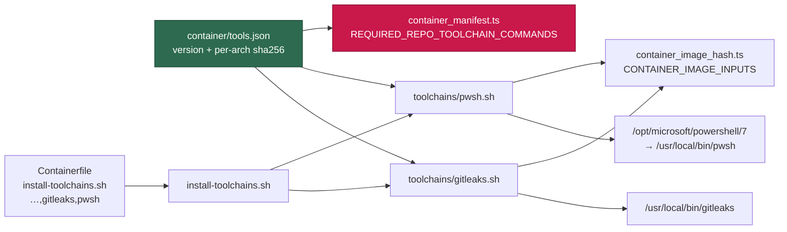

# gitleaks and PowerShell 7 are baked into the image as pinned toolchains

## Summary

Two more monitored-repository toolchains are now part of the image definition,
each a pinned, per-architecture, checksum-verified fragment:

- **`gitleaks` 8.30.1** — GRQ-AutoTrader and NEAT-AI-Explore both enforce a
  secret scan in CI and neither drives it from a `quality.sh` (GRQ-AutoTrader
  has none), so an agent working either repository previously met the scan's
  findings only after the PR was open. The amd64 digest is deliberately the
  one the gitleaks CLI fallback pins in both that scan and this repository's
  own `.github/workflows/gitleaks.yml`; the half that can be checked here is
  checked — a new manifest test fails the gate when the pin and that workflow
  drift apart.
- **`pwsh` 7.6.5** — the interpreter this repository's `.ps1` launcher suites
  need. It is the one user-directed exception to "the gate runs it and CI
  enforces it": the local gate excludes those suites (Issue #971,
  `worker/deno/tests/pwsh_suites_outside_the_gate_test.ts`) but
  `.github/workflows/validate-scripts.yml` fails loud without PowerShell and
  runs them. Wiring them into the local gate is separate work. No apt step —
  the runtime libraries the .NET host needs (`libicu76`, `libssl3t64`,
  `libstdc++6`, `libgssapi-krb5-2`) are already in the digest-pinned base.

Both are enumerated in `REQUIRED_REPO_TOOLCHAIN_COMMANDS` and in
`CONTAINER_IMAGE_INPUTS`, so dropping either from `container/tools.json` fails
the gate, and the supply-chain inventory records both pins.

Closes #1596.



## Evidence

Backend/CLI change — no web interface to screenshot. Both fragments were run
end to end on the running image (arm64) with the committed manifest as their
only source of pins, against sandboxed install paths, so the download, the
checksum verification, the extraction and the version assertion are all
observed rather than assumed:

```text
[gitleaks] Installing 8.30.1 for arm64
/tmp/tmp.AvQ1JG7Ss4/gitleaks.tar.gz: OK
[gitleaks] Installed gitleaks 8.30.1

[pwsh] Installing 7.6.5 for arm64
/tmp/tmp.QchiE8gSLf/powershell.tar.gz: OK
[pwsh] Installed PowerShell 7.6.5
```

`container/install-toolchains.sh gitleaks` was run over the committed manifest
as well, so the id resolves through the installer's validation and not just
the fragment.

**Every pinned digest was verified against the upstream artefact itself**, not
only against the release's checksums file — each file was downloaded and
`sha256sum`-ed on this host:

| Artefact | Digest |
| -------- | ------ |
| `gitleaks_8.30.1_linux_x64.tar.gz` | `551f6fc83ea457d62a0d98237cbad105af8d557003051f41f3e7ca7b3f2470eb` |
| `gitleaks_8.30.1_linux_arm64.tar.gz` | `e4a487ee7ccd7d3a7f7ec08657610aa3606637dab924210b3aee62570fb4b080` |
| `powershell-7.6.5-linux-x64.tar.gz` | `b34ab3b19acac1d3d4d0d3cfdb02acf62f457b0b6a962ff008132033f7566844` |
| `powershell-7.6.5-linux-arm64.tar.gz` | `ed4084f215d8bce2edd23aa7cb1f1e7b0818e41363a635a22065d2701b6141df` |

Each matches its release checksums file entry (`gitleaks_8.30.1_checksums.txt`,
PowerShell's `hashes.sha256`), and the gitleaks amd64 digest equals the
`GITLEAKS_SHA256` pinned by the CLI fallback in GRQ-AutoTrader's secret scan
and in this repository's own `.github/workflows/gitleaks.yml`.

Behaviour proved on the running image, as the unprivileged user:

```text
gitleaks --version           → gitleaks version 8.30.1        (exit 0)
gitleaks dir <planted AKIA…> → WRN leaks found: 1             (exit 1)
gitleaks dir <clean dir>     → INF no leaks found             (exit 0)
pwsh --version               → PowerShell 7.6.5               (exit 0)
pwsh -NoProfile -NonInteractive -Command 'exit 3'             (exit 3)
```

Stripped Containerfile: **11,102 bytes** against a `CONTAINERFILE_SIZE_CAP_BYTES`
of 15,000. `./quality.sh` passes (21 checks; `config integration` SKIPPED for
the absent `.config.json`, as on every run here).

### Outstanding — the CI probe step could not be pushed

The `.github/workflows/container-build.yml` probe step the issue asks for is
written, `actionlint`-clean, workflow-hygiene-clean and rehearsed against the
real binaries — but it is **not in this branch**. This worker's token carries
`admin:public_key, gist, read:org, repo, user`, and GitHub refuses any push
that updates a workflow file without the `workflow` scope:

```text
! [remote rejected] refusing to allow an OAuth App to create or update workflow
  `.github/workflows/container-build.yml` without `workflow` scope
```

That is the documented `token-scope` condition in
[docs/SETUP.md](../../SETUP.md) — the fix is `gh auth refresh -s workflow` on
the worker account, which only a human can do. The step is recorded here so it
is not lost: insert it immediately before `Verify every installed
coding-agent provider` in `.github/workflows/container-build.yml`.

```yaml
      - name: Probe gitleaks and PowerShell inside the image
        if: env.IMAGE_CHANGED == 'true'
        run: |
          set -euo pipefail
          echo "=== gitleaks + pwsh run, not merely present (Issue #1596) ==="
          # A version string only proves a file exists. These run both tools
          # as the image's default non-root user: gitleaks must report a
          # planted secret (exit 1) and pass a clean tree (exit 0), and pwsh
          # must return the exit code its script asked for, which is what
          # proves the .NET runtime starts on the base image's libraries.
          docker run --rm --entrypoint bash "${IMAGE}" -c '
            set -euo pipefail
            work="$(mktemp -d)"
            mkdir -p "${work}/dirty" "${work}/clean"
            # Written from two halves so the credential shape exists only
            # inside the container, never as a literal in this file.
            printf "%s%s\n" "AKIAIMNO" "JVGFDXXXE4OA" > "${work}/dirty/token.txt"
            printf "no credentials here\n" > "${work}/clean/ok.txt"
            if gitleaks dir --no-banner "${work}/dirty"; then
              echo "FAILED: gitleaks exited 0 over a directory holding a secret" >&2
              exit 1
            fi
            gitleaks dir --no-banner "${work}/clean"
            pwsh -NoProfile -NonInteractive -Command "exit 3" && status=0 || status=$?
            if [ "${status}" -ne 3 ]; then
              echo "FAILED: pwsh exit-code probe returned ${status}, expected 3" >&2
              exit 1
            fi
            echo "gitleaks flags a planted secret and passes a clean tree; pwsh returned 3"
          ' < /dev/null
```

The generic toolchain verification already in `container-build.yml` covers the
weaker half of that criterion without any change: it asserts, for **every**
manifest toolchain, that each declared command resolves on the image PATH as
the non-root `vibe` user and that `<versionCommand> --version` reports the pin
— so `gitleaks` and `pwsh` are checked in CI the moment this merges.

## Acceptance Criteria

<!-- vibe-spec-review inputs="diff+issue-body" -->

- **partial** — `gitleaks --version` and `pwsh --version` exit 0 and report the pins inside the image as the `vibe` user; `container-build.yml` toolchain verification **and the probe step** pass — evidence: `container/toolchains/gitleaks.sh`, `container/toolchains/pwsh.sh` (both run on the image, output above), and the existing generic verification loop in `.github/workflows/container-build.yml` which iterates every `.toolchains[]` entry as the non-root user — reviewer: partial — reason: the probe step is written and rehearsed but absent from the branch; the worker token lacks the `workflow` scope, so a human applies the block quoted under **Outstanding** above.
- **met** — removing either toolchain from `tools.json` fails `container_manifest_test.ts` via `REQUIRED_REPO_TOOLCHAIN_COMMANDS` — evidence: `worker/deno/tests/container_manifest_test.ts::container/ - the image supplies every monitored-repo toolchain command`; the reviewer deleted the `pwsh` entry and observed the failure — reviewer: met
- **met** — both architectures pinned in `tools.json`; the arm64 digest verified against the upstream checksums file and quoted in the PR summary — evidence: `container/tools.json` plus the digest table above, each digest recomputed from the downloaded artefact — reviewer: met
- **met** — stripped Containerfile under `CONTAINERFILE_SIZE_CAP_BYTES`; `./quality.sh` passes — evidence: 11,102 / 15,000 bytes via `strip-containerfile`; full gate PASSED after the final edit — reviewer: met
- **unrequested** — `chmod -R a+rX "${INSTALL_DIR}"` in `container/toolchains/pwsh.sh` — reviewer: unrequested — reason: the issue asked only for `chmod a+x .../pwsh`; the two unprivileged accounts must traverse and read the whole tree to run the launcher suites, so the tree-wide read bit is kept, matching the `chmod -R a+rX /opt/semgrep` precedent.
- **unrequested** — `docs/CONTAINER-IMAGE.md` and `docs/audits/dependency-inventory.md` edits — reviewer: unrequested — reason: both are traceable to "grep `docs/` for other surfaces listing image toolchains"; the inventory rows are additionally forced by the supply-chain gate, which failed on staleness until they were written.
- **unrequested** — the two `assert(REQUIRED_REPO_TOOLCHAIN_COMMANDS.includes(…))` lines — reviewer: unrequested — reason: they copy the pre-existing `semgrep` line in the same test and name the criterion; the enforcement that actually fails is `findMissingRuntimeTools` above them.
- **unrequested** — `worker/deno/tests/container_manifest_test.ts::the gitleaks pin matches the CI workflow's CLI fallback` and the reworded manifest note — reviewer: unrequested — reason: added after the Standards reviewer showed the note claimed an invariant nothing enforced; the test ties the manifest pin to `.github/workflows/gitleaks.yml`, following the `SEMGREP_IMAGE_TAG` precedent.

## Standards Review

<!-- vibe-standards-review inputs="diff+CODING-STANDARDS.md" -->

- **violation** — `docs/CONTAINER.md` described a CI probe step the branch does not contain, asserting a guarantee that does not hold — evidence: `docs/CONTAINER.md:155` (as reviewed) — reason: fixed here; the sentence was removed, and the step now lives only under **Outstanding** above, described as not yet applied.
- **violation** — the manifest note claimed the image and GRQ-AutoTrader's workflow "cannot diverge" with nothing enforcing it, against DRY and fail-loud — evidence: `container/tools.json` gitleaks `notes` — reason: fixed here; the claim is narrowed to what is checkable and `container_manifest_test.ts` now fails the gate when the manifest pin and this repo's own `.github/workflows/gitleaks.yml` pins drift apart.
- **violation** — `pwsh.sh` matched the version with an exact `case` where every sibling fragment uses a substring glob — evidence: `container/toolchains/pwsh.sh:82` — reason: fixed here; it now matches `*"PowerShell ${version}"*`, so an extra banner line cannot fail the build while a wrong version still does.
- **violation** — this repository also runs gitleaks on every PR, so the note calling it CI-only for the other two repositories was incomplete — evidence: `.github/workflows/gitleaks.yml:98` pins the same version and digest — reason: fixed here; the note and `docs/CONTAINER.md` now name this repo's own workflow as the second holder of the digest. `repos` still lists exactly the two repositories the issue named, because that field drives "remove this toolchain when the repo leaves the fleet" and this repo's pin is enforced by the new test instead.
- **violation** — `stSoftwareAU/GRQ-AutoTrader` is a private repository named directly in this public one, against `docs/PRIVATE-REPO-REFERENCE-AUDIT-SCAN.md` — evidence: `container/tools.json` gitleaks `repos`, `container/toolchains/gitleaks.sh:6`, `docs/CONTAINER.md:80` — reason: it stands. The issue specifies that exact slug for `repos` and names the repository in its own public body; paths *into* that repository were removed in this round, so what remains is the slug the issue directs. A private-repo-reference audit finding is the right place to alias it fleet-wide, not this change.
- **violation** — the PR summary was missing — evidence: `docs/archive/pr-summaries/` — reason: fixed here; this file.
- **clean** — Australian English throughout the added lines (`artefact`, `behaviour`, `organisation`); fail-loud behaviour in both fragments (`set -euo pipefail`, `jq -er`, unknown-architecture abort, `sha256sum -c -`, an installed-binary version assertion that aborts the build); no hidden, key or credential paths staged; per-architecture SHA-256 pinned and verified before install with no `curl | sh` and no network fallback; `${CURL_RETRY}` carried with the documented `SC2086` waiver; the fragments follow `container/toolchains/actionlint.sh` line for line rather than inventing an abstraction; both fragments enumerated in `CONTAINER_IMAGE_INPUTS`; the docs surfaces updated alongside the code; commit messages carry the issue reference and the `Vibe-Coder-Run-Id` trailer.

## Test Plan

- `worker/deno/tests/container_manifest_test.ts` — the existing
  "the image supplies every monitored-repo toolchain command" test now asserts
  `gitleaks` and `pwsh` are in `REQUIRED_REPO_TOOLCHAIN_COMMANDS`, and
  `findMissingRuntimeTools` resolves both against the committed manifest.
  Written first: it failed with `AssertionError` before the manifest entries
  existed.
- `worker/deno/tests/container_image_hash_test.ts` — unchanged, but its
  committed-files check is what forces the two new fragments into
  `CONTAINER_IMAGE_INPUTS`; both fragment paths are now enumerated.
- `worker/deno/tests/container_manifest_test.ts` —
  `findToolchainInstallViolations` covers the new fragments: each verifies a
  checksum, carries `${CURL_RETRY}`, pipes nothing into a shell, restates no
  version, and is named by an `install-toolchains.sh` run.
- `worker/deno/tests/supply_chain_gate_test.ts` — the inventory-staleness
  finding caught the missing rows; `docs/audits/dependency-inventory.md` was
  regenerated with `supply-chain-gate --write-inventory`.
- Full `./quality.sh`: PASSED.
