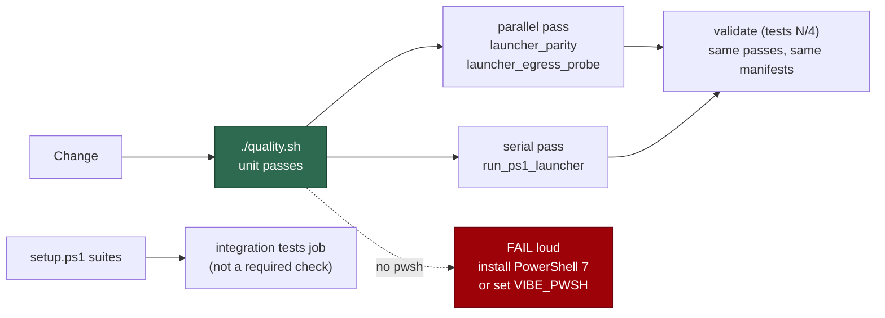

# Run the `run.ps1` launcher suites in the local quality gate

## Summary

The three suites that drive `run.ps1` — the Windows containment boundary — were
excluded from the local gate because they need an interpreter the gate could not
count on (Issue #907, measured in #971). Issue #1596 baked PowerShell 7 into the
container image, so that reason is gone: the suites now run in the gate's unit
passes, and a host without `pwsh` fails the gate loudly instead of letting them
report "ignored" while the gate reports green. Closes #1598.

- `IN_GATE_SCRIPT_SUITES` (`worker/deno/lib/integration_test_manifest.ts`) names
  the three, each with a reason and its measured cost. The classifier still
  calls them integration tests; the entry decides only **where** they run.
- `worker/deno/tests/pwsh_suites_in_the_gate_test.ts` replaces
  `pwsh_suites_outside_the_gate_test.ts`. It reads the suites that drive
  `run.ps1` off the tree, so the exclusion returning fails it even if the
  manifest entry that named the suite goes with it.
- CI is unchanged as enforcement: `validate-scripts.yml` still fails loud
  without `pwsh`. The required `validate (tests N/4)` shards run the same unit
  passes, so a runner without PowerShell fails them on
  `pwsh_suites_in_the_gate_test.ts` itself — the workflow file is deliberately
  untouched, because this run's token has no `workflow` scope and the test is
  the stronger enforcement anyway.
- The `setup.ps1` suites stay integration tests. Two of their cases fail inside
  the image because the suite inherits the ambient `CONFIG_PATH`; that is
  stSoftwareAU/VibeCoder#1656.

## Evidence

Backend/CLI change — no web interface to screenshot. Measured inside the worker
container image (PowerShell 7.6.5 at `/usr/local/bin/pwsh`):

| Command | Result |
| --- | --- |
| `deno test tests/run_ps1_launcher_test.ts` | 39 passed, 0 failed (1m14s) |
| `deno test --parallel tests/launcher_parity_test.ts tests/launcher_egress_probe_test.ts` | 31 passed, 0 failed (14s) |
| the gate's serial pass, as `unitTestPasses` builds it | 102 passed, 0 failed, 1 ignored (1m34s) |
| `./quality.sh < /dev/null` | `Result: PASSED (with skipped checks)` — `deno tests PASSED` |
| `deno task check:manifests` | 613 passed, 0 failed |

The gate's own passes now carry them — `unitTestPasses` reports 32 excluded
integration suites where it reported 35, the serial pass names
`tests/run_ps1_launcher_test.ts`, and no pass ignores the other two.

Red-capable, both criteria, before/after:

- Re-adding `tests/run_ps1_launcher_test.ts` to `INTEGRATION_TEST_FILES` **and**
  deleting its `IN_GATE_SCRIPT_SUITES` entry → `pwsh suites - every run.ps1
  suite is in the gate` and `pwsh suites - the manifest names exactly those
  suites` both FAIL; restoring both → all 5 pass.
- `env -u VIBE_PWSH PATH=/usr/bin:/bin deno test tests/pwsh_suites_in_the_gate_test.ts`
  → `pwsh suites - a host without PowerShell fails the gate` FAILS with the
  remedy message; with `pwsh` on `PATH` it passes.

## Acceptance Criteria

<!-- vibe-spec-review inputs="diff+issue-body" -->

- **met** — `./quality.sh` inside the container runs the three `.ps1` suites and
  they pass — evidence: the table above; `serialPassFiles()` yields
  `tests/run_ps1_launcher_test.ts` and the parallel pass no longer ignores the
  other two (`worker/deno/lib/unit_test_passes.ts:211-217`) — reviewer: met
- **met** — a host without `pwsh` fails loud in the gate rather than skipping
  the suites — evidence:
  `worker/deno/tests/pwsh_suites_in_the_gate_test.ts::pwsh suites - a host without PowerShell fails the gate (Issue #1598)`,
  observed failing with `PATH=/usr/bin:/bin` — reviewer: met
- **partial** — remove the `--ignore` exclusion of *the PowerShell suites* and
  let `tests/support/pwsh.ts` resolve the image's `/usr/local/bin/pwsh` —
  evidence: `worker/deno/lib/integration_test_manifest.ts:97-143` — reviewer:
  partial — reason: only the three `run.ps1` suites moved, matching the issue
  title and its "three `.ps1` suites" criterion; `setup_ps1_test.ts` and
  `host_config_path_test.ts` stay excluded because two of their cases fail
  inside the image on an inherited `CONFIG_PATH` (filed as
  stSoftwareAU/VibeCoder#1656). The resolver needed no change — it already
  resolves `pwsh` on `PATH`, which is the image's symlink.
- **met** — replace `pwsh_suites_outside_the_gate_test.ts` so the gate's own
  test asserts the suites are inside the gate — evidence:
  `worker/deno/tests/pwsh_suites_in_the_gate_test.ts:94` — reviewer: partial —
  reason: the reviewer found the first version circular (every assertion keyed
  off `IN_GATE_SCRIPT_SUITES`, so deleting the entry and re-excluding the file
  together stayed green). Correct, and fixed in commit `56a6ed80`: the suite set
  is now read off the tree, and that escape was observed failing.
- **met** — keep `validate-scripts.yml` as the CI enforcement and note the
  change wherever the exclusion is documented — evidence:
  `.github/workflows/validate-scripts.yml` unchanged, `CODING-STANDARDS.md:210-330`,
  `CONTRIBUTING.md:103`, `docs/CONTAINER.md:128`, `container/tools.json`,
  `worker/deno/lib/pr_check_contexts.ts`, `.github/scripts/deno-test-shard.sh` —
  reviewer: met
- **unrequested** — `IN_GATE_SCRIPT_SUITES` as a reason-carrying third
  placement, plus its conformance tests — reviewer: unrequested — reason: the
  repo's classifier fails any script-driving file that is in neither existing
  list, so removing the three from `INTEGRATION_TEST_FILES` with no third
  placement fails `integration_test_manifest_test.ts`. The reason and cost are
  what make the exception reviewable.
- **unrequested** — a `pwsh` availability step was added to the
  `validate (tests N/4)` shard job and then removed — reviewer: unrequested —
  reason: the reviewer was right that the issue asked only to *keep*
  `validate-scripts.yml`, and the push confirmed it: this run's token carries no
  `workflow` scope. The shards enforce the prerequisite through
  `pwsh_suites_in_the_gate_test.ts`, which fails loud in the same job, so
  nothing is lost.
- **unrequested** — rewriting `unit_test_passes_test.ts`'s Issue #940 overlap
  guard onto injected lists — reviewer: unrequested — reason: that test asserted
  `both.length > 0` against the real manifests, and `run_ps1_launcher_test.ts`
  was the last file in both; leaving it would fail the gate. The property it
  guards is preserved, now on injected lists.
- **unrequested** — carve-out wording in `prompts/test_audit/prompt.md`,
  `prompts/best_practices/buckets/typescript.md`, `docs/TEST-AUDIT-SCAN.md` and
  `DESIGN-PRINCIPLES.md` — reviewer: unrequested — reason: both scans are silent
  only for files "on the integration-test manifest", so without this the audit
  would file these three deliberately-placed suites as slow-unit-test findings
  and propose undoing #1598 on every scan. The wording is generic (a declared
  script-driving suite), not VibeCoder-specific.

## Standards Review

<!-- vibe-standards-review inputs="diff+CODING-STANDARDS.md" -->

- **violation** — the unit-test definition still said a unit test needs "no
  PowerShell" and that a spawned script is always a check-13 finding, which the
  gate now contradicts — evidence: `CODING-STANDARDS.md:210-221` — reason: fixed
  here; the definition now says the classifier decides what a file is and the
  exception decides only where it runs.
- **violation** — the recorded reason claimed the three were only covered by a
  non-required job; `deno task test:run-mode` already ran two of them in the
  required `validate (container)` / `validate (no-runtime)` legs — evidence:
  `worker/deno/lib/integration_test_manifest.ts:110-112` — reason: fixed here;
  the entry now states what CI already covered and that the buy is a pre-push
  verdict from the same gate.
- **violation** — `container/tools.json` still named the deleted
  `pwsh_suites_outside_the_gate_test.ts` and called the local gate's exclusion
  current — evidence: `container/tools.json:175` — reason: fixed here.
- **violation** — the `integration tests` exemption reason said requiring the
  job "would put a provisioned PowerShell between every change and its merge",
  which the required shards now do — evidence:
  `worker/deno/lib/pr_check_contexts.ts:66-73` — reason: fixed here.
- **violation** — the shard script's header said the integration suites "now run
  in the `integration tests` job", true of all but three — evidence:
  `.github/scripts/deno-test-shard.sh:12-19` — reason: fixed here; it now names
  the exception and the test that fails the shard when `pwsh` is absent.
- **violation** — the `test-audit` check-13 and best-practices check-26
  carve-outs named only the integration manifest, so both scans would re-file
  this decision as a finding — evidence: `docs/TEST-AUDIT-SCAN.md:130`,
  `prompts/test_audit/prompt.md:655-658`,
  `prompts/best_practices/buckets/typescript.md:285-288` — reason: fixed here,
  with generic wording.
- **violation** — DRY: the same "in-gate entry is not excluded" assertion in two
  files — evidence: `worker/deno/tests/integration_test_manifest_test.ts:76-90`
  — reason: fixed here; the manifest test keeps one placement-clash case, and
  the tree-derived `--ignore` assertion lives only in
  `pwsh_suites_in_the_gate_test.ts`.
- **violation** — tests that read other files' source text (`drivesPowerShell`,
  `assert(source.includes("pwsh"))`) and a new documentation-keyword assertion —
  evidence: `worker/deno/tests/pwsh_suites_in_the_gate_test.ts:66`,
  `worker/deno/tests/test_category_definitions_test.ts:187` — reason: stands.
  Both shapes pre-date this change and are the repository's own design for
  totality checks over the test tree and for the doc-consistency suite
  (`test_category_definitions_test.ts` exists to pin that prose); replacing them
  is a separate change, and dropping the pin would let the documented gate drift
  from the real one.
- **violation** — `docs/archive/pr-summaries/pr-summary-1598.md` was missing —
  evidence: this file — reason: fixed here; it was written after the diff the
  reviewer read.
- **clean** — Australian English throughout; fail-loud (the skip became a loud
  failure with a named remedy); commit safety (only allowlisted `.github/**` hidden paths staged, no
  credentials, no `git add -f`, no `--no-verify`); `Vibe-Coder-Run-Id` trailer
  and issue reference on both commits; parallel-safety (the two suites entering
  the parallel pass mutate no process state, `run_ps1_launcher_test.ts` stays in
  `WALL_CLOCK_TEST_FILES`); no benchmark disguised as a test; no absolute
  wall-clock threshold added; cost claims match measurement.

## Test Plan

- Added `worker/deno/tests/pwsh_suites_in_the_gate_test.ts` (replaces
  `pwsh_suites_outside_the_gate_test.ts`): the `run.ps1` suites are in the
  gate's path and in its manifest, a host without PowerShell fails the gate,
  every other pwsh suite is placed deliberately, and naming an interpreter is
  still not driving one.
- Extended `worker/deno/tests/integration_test_manifest_test.ts`: an in-gate
  entry carries no second placement, is still claimed by the classifier, and
  gives a reason; the "missing from every list" check now spans all three lists.
- Modified `worker/deno/tests/unit_test_passes_test.ts` — the Issue #940 overlap
  guard now drives `serialPassFiles` with injected lists, because the real
  manifests no longer overlap (documented in the test's own comment).
- Comment-only update to `worker/deno/tests/test_shard_plan_test.ts`; pinned
  prose updated in `worker/deno/tests/test_category_definitions_test.ts`.
- Ran: the three suites individually and as the gate runs them, the manifest and
  workflow suites, `deno task check:manifests`, and `./quality.sh` — all green.
