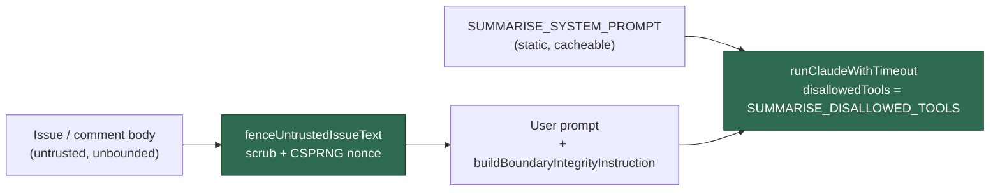

## Summary

`summariseLargeContent` handed an issue or comment body — untrusted text by
definition — straight to the model with none of the boundary machinery every
other prompt builder uses, and with the broadest possible tool grant.
`buildSummariseUserPrompt` interpolated `content` between bare `---` markers (no
nonce, no delimiter scrub, no integrity instruction), and the invocation passed
`disallowedTools: []`; because `buildClaudeCliArgs` always adds
`--dangerously-skip-permissions`, an empty deny list gave a text-in/text-out
task the same Bash/Write/Edit grant as the coding loop.

Both halves are fixed:

- **Fencing** — `buildSummariseUserPrompt(content, boundaryId?)` now routes the
  content through `fenceUntrustedIssueText` (delimiter scrub, HTML-comment
  neutralisation, per-render CSPRNG nonce) and appends
  `buildBoundaryIntegrityInstruction(id, ["the content to summarise"])`, exactly
  as `clarity_assessment.ts` and the other builders do. The optional
  `boundaryId` is a test seam only and is discarded unless it is a well-formed
  nonce (`isBoundaryId`), so no caller can weaken the fence with a guessable
  marker.
- **Least privilege** — the new exported `SUMMARISE_DISALLOWED_TOOLS` mirrors
  `SECURITY_SCAN_DISALLOWED_TOOLS` and additionally denies `Bash`, `Task`,
  `WebFetch` and `WebSearch`, none of which summarisation needs.
  `summariseLargeContent` passes that list instead of `[]`.

`SUMMARISE_SYSTEM_PROMPT` is untouched, so the cacheable static prefix from
Issue #2395 still carries no nonce and no dynamic content.

Closes #1607.

## Evidence

Backend/CLI change with no web interface to screenshot. Evidence is the test
run: the six new assertions were observed failing against the unfixed builder
and passing after the fix (commands and output below), and `./quality.sh` passed
in full (`Result: PASSED (with skipped checks)` — the only skip is the
pre-existing `config integration` check, which needs a live config).

Red, against the unfixed `claude_runner.ts` restored from `HEAD~1` (the constant
stubbed to `[]` only so the module could load):

```
summarise prompt - fences the content behind a boundary nonce (Issue #1607) => FAILED
summarise prompt - neutralises forged delimiters in the content (Issue #1607) => FAILED
summarise prompt - mints a fresh nonce per invocation (Issue #1607) => FAILED
summarise prompt - discards a malformed boundary id (Issue #1607) => FAILED
SUMMARISE_DISALLOWED_TOOLS - denies every write and execute tool (Issue #1607) => FAILED
summariseLargeContent - fences the content it sends to the model (Issue #1607) => FAILED
FAILED | 1 passed | 6 failed
```

Green, after the fix:

```
deno test --allow-all tests/claude_runner_test.ts --filter "1607"
ok | 7 passed | 0 failed | 37 filtered out
```

Where the untrusted text now travels:



### Original trigger closed, no trivial bypass

The trigger in the issue —
`claude-runner --operation summarise-large-content --content "<body>"` (or
`--file-path`) — reaches the model only through `buildSummariseUserPrompt`,
which is now the single chokepoint: every byte of `content` passes through
`fenceUntrustedIssueText`, so delimiter-shaped and HTML-comment-shaped forgeries
are rewritten to inert fullwidth forms before they are wrapped in a boundary
whose 12-hex-character nonce is minted per render from `crypto.getRandomValues`
and cannot be observed by the attacker who wrote the body. The obvious bypass —
supplying the nonce so the fence becomes forgeable — is closed by the
`isBoundaryId` gate, which discards anything that is not a well-formed hex nonce
and mints a fresh one; and a caller who _guesses_ correctly gains nothing,
because the scrub runs over the content regardless of which id is in use. The
second half of the trigger is closed independently of the prompt: even if a
crafted body did persuade the model to act, the phase now runs with `Bash`,
`Write`, `Edit`, `MultiEdit`, `NotebookEdit`, `Task`, `WebFetch` and `WebSearch`
on the deny list passed to `--disallowed-tools`, so there is no file-write,
shell-execution, sub-agent or network capability left to reach.

## Test Plan

Added to `worker/deno/tests/claude_runner_test.ts` (all six fail against the
unfixed code and pass after the fix):

- `worker/deno/tests/claude_runner_test.ts::summarise prompt - fences the content behind a boundary nonce (Issue #1607)`
  — the fence markers and the integrity instruction naming the nonce are
  present.
- `worker/deno/tests/claude_runner_test.ts::summarise prompt - neutralises forged delimiters in the content (Issue #1607)`
  — the regression test for the reported flaw: a body carrying a forged
  `---END UNTRUSTED …---`, a forged `<<<ISSUE_BODY_END_…>>>` and a worker-parsed
  HTML comment leaves exactly one genuine closing marker and no usable forgery.
- `worker/deno/tests/claude_runner_test.ts::summarise prompt - mints a fresh nonce per invocation (Issue #1607)`
- `worker/deno/tests/claude_runner_test.ts::summarise prompt - discards a malformed boundary id (Issue #1607)`
- `worker/deno/tests/claude_runner_test.ts::SUMMARISE_DISALLOWED_TOOLS - denies every write and execute tool (Issue #1607)`
- `worker/deno/tests/claude_runner_test.ts::summariseLargeContent - runs with the restricted tool set (Issue #1607)`
- `worker/deno/tests/claude_runner_test.ts::summariseLargeContent - fences the content it sends to the model (Issue #1607)`

Modified (documented, not removed):
`summarise prompt - user prompt is deterministic for a given input (Issue #2395)`
now pins the boundary id. The user prompt necessarily carries a per-invocation
nonce after this change, so byte-stability is asserted for a fixed nonce; the
cache-prefix stability that test protects lives in `SUMMARISE_SYSTEM_PROMPT`,
which is unchanged and still asserted to carry no dynamic content.

Docs: `SECURITY.md` gains a bullet under "No unfenced path to the model"
recording this path and its new tool grant.
