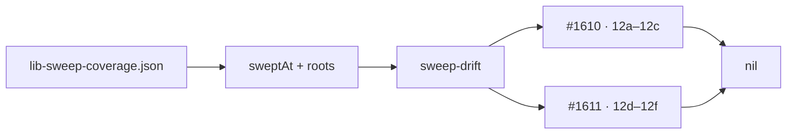

# PR summary — Issues #1609, #1610, #1611

## Summary

Give the sweep coverage ledger a `sweptAt` commit per slice, partition
`commands/` and `setup/` as chunks 13 and 14, and add a `sweep-drift`
report so a later overflow scan can regenerate the unread list instead
of re-declaring a thousand already-recorded modules.

Then re-read the 12a–12f delta that report printed at
`00c1d95924a0adf7eaf419219ade7283b3e11480`. Both halves came back
empty: every added module and every modified hunk was read, skipped
with a documented reason, or marked swept by the #1608 run. No
`security` issue was filed because no finding survived Phase 3.

Closes #1609.
Closes #1610.
Closes #1611.

## What changed

- Ledger schema: `root` becomes `roots` covering `worker/deno/lib`,
  `worker/deno/commands` and `worker/deno/setup`. Every slice carries a
  40-hex `sweptAt`. `parseCoverageLedger` fails loud naming the field
  when either is missing or malformed.
- Chunks 13 (#1218 commands) and 14 (#1220 setup) claim every non-test
  module under those trees, including the new `sweep_drift.ts`.
- `driftSince` intersects each slice with `git diff --name-only
  --diff-filter=A|M <sweptAt> HEAD` via an injected runner. A non-zero
  git exit throws with stderr. Drift is a report, not a CI gate.
- Command `sweep-drift` prints one block per slice (counts + paths).
- Written records
  `docs/audits/security-sweep-1610-lib-delta-12a-12c.md` and
  `docs/audits/security-sweep-1611-lib-delta-12d-12f.md`. Slices
  12a–12f point at those records with `sweptAt` set to the generation
  commit, not the commit that contains this prose.
- `docs/SECURITY-SCAN.md` Overflow rollover now names `sweep-drift`.

## Security properties

- The coverage gate still fails on a missing, stale or double-claimed
  module; adding `sweptAt` / `roots` does not weaken `diffCoverage`.
- Small-slice honesty still requires the written record to name every
  claimed path (12f names `gh_body_file_io.ts` and `gh_timeout.ts`).
- The 12a–12f delta is an explicit nil. `alert_feeds/` modules 12c owns
  (`code_scanning_alerts.ts`, `dependabot_alerts.ts`) have no change
  since #1216. The sixteen idle-task templates 12d owns are named; only
  `orphan_deps_template.ts` drifted.

## Tests

- `worker/deno/tests/lib_sweep_coverage_test.ts` — parse failures for
  missing `sweptAt` / `roots`; partition across all three roots;
  `driftSince` happy path, empty diff, and git-failure-with-stderr.
- `worker/deno/tests/sweep_drift_command_test.ts` — format, collect,
  registered name.

## Out of scope

#1612 (commands / setup delta) and #1613 (export-as-exfiltration) stay
on the milestone; they were not taken here.
