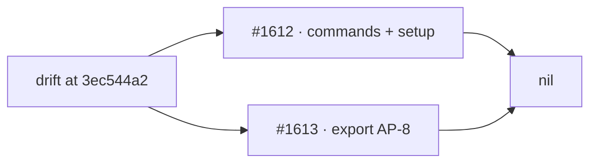

# PR summary — Issues #1612, #1613

## Summary

Re-read the `commands/` and `setup/` delta that `sweep-drift` printed
at `3ec544a22e5a43264e7576aab425919e6b8f3b8a`, and trace the export
pipeline as an AP-8 exfiltration candidate. Both halves came back
empty: every drifted module was read, and every export hop stayed on
the local filesystem. No `security` issue was filed because no finding
survived Phase 3. The threat-model AP-8 row is unchanged.

Closes #1612.
Closes #1613.

## What changed

- Written record
  `docs/audits/security-sweep-1612-commands-setup-delta.md`. Slice 13
  (1 added, 10 modified) and slice 14 (2 added, 17 modified) each
  carry a per-path disposition and explicit nil.
- Written record
  `docs/audits/security-sweep-1613-export-exfiltration.md`. Eight
  named modules plus `commands/export_links.ts`, with `file:line`
  hops and four refuted attack cases.
- Ledger slices 13 and 14 now point at the #1612 record and carry
  `sweptAt: 3ec544a22e5a43264e7576aab425919e6b8f3b8a` — the commit
  the list was generated from, not the later commit that contains
  this prose.

## Security properties

- Commands hunks since #1218 are hardening (git/gh chokepoint,
  default-branch cache out of the working tree, ignored-path clean,
  PR processor `workRoot`, image-injection observation).
- Setup hunks since #1220 close the previously filed SEC-1220 items
  they touch (`setup_command_runner.ts` for #1259; MCP containment
  on `screenshot.ts`).
- Export never reaches `write_repo_allowlist.ts`. #1265 / #1412 /
  #1266 already cover the historical scrub-gate gaps and are not
  re-filed.

## Tests

- `worker/deno/tests/lib_sweep_coverage_test.ts` — ledger parse and
  the updated slice 13 / 14 `sweptAt` / `ledger` fields.

## Out of scope

`docs/THREAT-MODEL.md` AP-8 is not edited. Export is not a GitHub
write to another repository.
