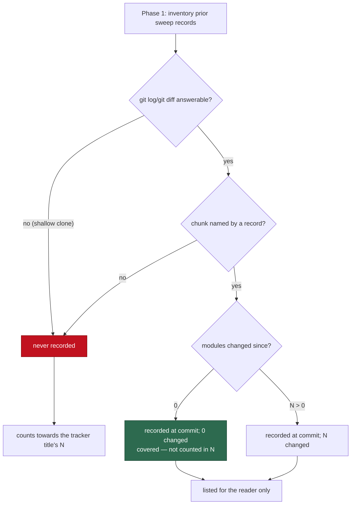

# Security scan: consult prior sweep records before declaring a chunk "not reached"

## Summary

`prompts/security_scan/prompt.md` had no way to see what an earlier bounded
sweep already covered — it read prior state only through the suppressed and
known-open finding lists the worker substitutes. So the #1608 run re-declared
roughly a thousand already-recorded modules "not reached" and filed a tracker
over trees that already have audit records.

Four edits close that loop, all in the prompt plus its operator manual:

1. **Phase 1 inventories prior sweep records** — `docs/audits/security-sweep-*.md`,
   a sweep coverage ledger, and closed `security-scan-overflow` issues. Each
   record is dated with `git log -1 --format=%H -- <record>` and compared with
   `git diff --name-only <commit> HEAD -- <tree>`; a module a record names and
   that diff does not is *previously swept*. Phase 1 also confirms every path
   the chunk plan names with `ls`, because #1608 planned
   `worker/deno/lib/pr_manager.ts`, which does not exist.
2. **The "No code execution" rule names `git log` and `git diff`** as read-only
   inspection, so the new step does not contradict the constraint that governs
   it.
3. **The Phase 2 stopping rule drops previously-swept-and-unchanged chunks
   first**, and a chunk whose every module is previously swept is not "not
   reached" — it is covered by that record at that commit.
4. **The Phase 4 tracker separates the two states.** `## Chunks not reached`
   lists each chunk as `— never recorded` or
   `— recorded in <record path> at <commit>; N modules changed since`, and the
   title's `N` counts only the never-recorded chunks.

The shallow-clone case fails loud rather than clean: the worker's clones are
`--depth=1`, so `git log -1` on a record can return empty and the diff can fail
with `fatal: bad object`. Either outcome falls to **never recorded**, never to
"recorded, unchanged" — an unanswerable history must not book an unswept tree
as audited.

Closes #1614.

## Evidence

Backend/prompt-template change with no web interface to screenshot. The
verification is the test suite: `worker/deno/tests/security_scan_house_vocabulary_test.ts`
loads the template through the real `loadPrompt` (not by reading the file
directly), so an edit that drops any of these clauses fails in CI.

```
$ deno test --allow-read --allow-env tests/security_scan_house_vocabulary_test.ts
ok | 14 passed | 0 failed (28ms)

$ ./quality.sh
Result: PASSED (with skipped checks)   # config integration skipped — needs worker config
```

How a chunk now reaches one of the two tracker line shapes:



## Acceptance Criteria

<!-- vibe-spec-review inputs="diff+issue-body" -->

- **met** — the prompt carries the Phase 1 item, the permitted-tool extension,
  the stopping-rule ordering, and the two tracker line shapes — evidence:
  `prompts/security_scan/prompt.md:230` (inventory item), `:81` (permitted
  tools), `:326` (stopping rule), `:1818-1819` (line shapes) — reviewer: met
- **met** — `docs/SECURITY-SCAN.md` documents both line shapes and the new
  playbook row — evidence: `docs/SECURITY-SCAN.md:697-699` (shapes), `:912`
  (playbook row) — reviewer: partial — reason: the reviewer saw the diff before
  commit `784c7481` and correctly flagged that the paragraph above the new one
  still promised a tracker for *any* unswept chunk and described the section as
  number/name/band only; that paragraph was reconciled in `784c7481`, which is
  why the status differs from its verdict
- **met** — the new assertions pass, and `deno test`, `deno lint`,
  `deno fmt --check` and markdown lint pass — evidence:
  `worker/deno/tests/security_scan_house_vocabulary_test.ts::security_scan - Phase 1 inventories prior sweep records (Issue #1614)`
  plus three siblings; full `./quality.sh` run after the final edit —
  reviewer: met
- **unrequested** — the tracker is not filed at all when every unswept chunk is
  recorded (`N` is zero) — evidence: `prompts/security_scan/prompt.md:1836` —
  reviewer: unrequested — reason: the issue asks only that `N` count
  never-recorded chunks, but a tracker whose `N` is zero is exactly the
  "re-filing trackers over trees that already have records" its Summary sets out
  to stop; kept, and stated explicitly so the boundary is visible
- **unrequested** — two extra prompt assertions beyond the two the issue names
  (`git log`/`git diff` permitted-tool wording, and the stopping-rule ordering)
  — evidence:
  `worker/deno/tests/security_scan_house_vocabulary_test.ts:395-420` —
  reviewer: unrequested — reason: acceptance criterion 1 governs four clauses,
  so pinning only two of them would leave half the criterion untested
- **unrequested** — the shallow-clone fail-loud rule and its assertion —
  evidence: `prompts/security_scan/prompt.md:243-249` — reviewer: unrequested —
  reason: raised by the Standards reviewer, not the issue; without it the new
  stopping rule silently books an unswept tree as audited on the worker's own
  `--depth=1` clones, which is the failure this issue exists to remove
- **unrequested** — one extra sentence in the playbook row ("a recorded chunk
  with a non-zero count needs only its changed modules re-swept") — evidence:
  `docs/SECURITY-SCAN.md:912` — reviewer: unrequested — reason: the issue's row
  covers `never recorded` and `recorded and unchanged`; the third state the two
  line shapes can produce would otherwise have no operator instruction

## Standards Review

<!-- vibe-standards-review inputs="diff+CODING-STANDARDS.md" -->

- **violation** — Never Fail Silently: `git log -1 --format=%H` and the
  follow-up `git diff` are unanswerable on the worker's `--depth=1` clones, and
  the step prescribed nothing for an empty commit or `fatal: bad object`, so an
  unswept tree would book as "recorded … 0 modules changed since" — evidence:
  `prompts/security_scan/prompt.md:236-238` — reason: fixed in `88e6667e`; both
  failures now fall to never-recorded, pinned by the
  `cannot answer means never recorded` assertion
- **violation** — vague qualitative wording where a concrete path exists: "a
  sweep coverage ledger (whatever file the repo keeps its swept-module list
  in)" — evidence: `prompts/security_scan/prompt.md:233` — reason: fixed in
  `88e6667e`; the prompt now names `docs/audits/lib-sweep-coverage.json` for
  this repository while keeping the generic clause, because the template runs
  against every monitored repo and most have no ledger
- **violation** — DRY: `worker/deno/lib/lib_sweep_coverage.ts` already computes
  the swept/unswept answer for this repo's `worker/deno/lib` tree — evidence:
  `prompts/security_scan/prompt.md:230-243` — reason: stands, deliberately. The
  prompt runs inside a scan of an arbitrary monitored repository and cannot call
  a Vibe Coder Deno module; the issue requires wording that "must work on
  repositories with no ledger". The ledger is now named as this repo's instance
  of the general rule, which is the closest the template can get to one source
- **violation** — the `ls` chunk-plan confirmation is unrelated to consulting
  prior sweep records — evidence: `prompts/security_scan/prompt.md:286-290` —
  reason: stands. The reviewer saw only the diff; the issue explicitly asks for
  it ("Also require an `ls` confirmation of every path the chunk plan names"),
  and it is now pinned by an assertion, which the reviewer noted it was not
- **violation** — tests assert on prose phrases, which TDD guidance discourages
  — evidence:
  `worker/deno/tests/security_scan_house_vocabulary_test.ts:376, 397, 401` —
  reason: stands. The artefact under test *is* a prompt template: there is no
  executable surface behind it, the assertions run through the real `loadPrompt`
  rather than reading the file, and the issue's own Failure Detection section
  requires exactly this check. This matches the established Issue #837 pattern
  in the same file
- **clean** — Australian English throughout (`artefact`, `rigour`, `behaviour`);
  no hidden or credential path staged; tests are self-contained, parallel-safe,
  and free of sleeps or wall-clock assertions; the prompt was edited in place
  rather than versioned to a `vN.md`; docs updated alongside the prompt in the
  same change; the new table row keeps MD055/MD056 column shape

## Test Plan

All four tests are new in
`worker/deno/tests/security_scan_house_vocabulary_test.ts`, and each was
observed failing against the unedited prompt before the template was changed:

- `security_scan - Phase 1 inventories prior sweep records (Issue #1614)` — the
  inventory item, all three record sources, both git commands, the
  "previously swept" definition, the repo-agnostic escape clause, the
  shallow-clone fail-loud rule, and the `ls` path confirmation.
- `security_scan - permits git log and git diff as read-only inspection (Issue #1614)`
  — the Hard Constraint 2 permitted-tool list names both commands and says why.
- `security_scan - the stopping rule drops previously swept chunks first (Issue #1614)`
  — the drop ordering and the `covered by <record> at <commit>` verdict.
- `security_scan - the overflow tracker separates never-recorded from recorded chunks (Issue #1614)`
  — both `## Chunks not reached` line shapes and the title's `N` semantics.

The ten pre-existing Issue #837 tests in the same file were left untouched and
still pass; one of them caught a reflow that split the attribution-footer
citation across a line, which was corrected rather than the test relaxed.
