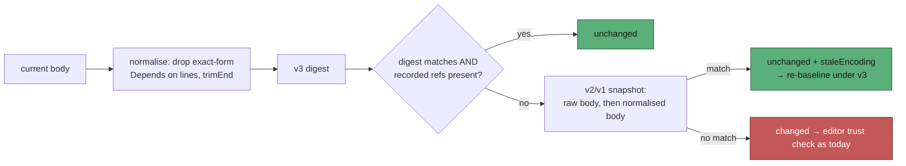

## Summary

The blocked-deferral path appends `Depends on owner/repo#N` to an approved issue
body as the fleet login, and the modified-after-approval gate judged that an
untrusted edit on every scan — the 7 Sep storm of
`[SECURITY] [ISSUE_MODIFIED_AFTER_APPROVAL]` lines on NEAT-AI-core#593. The
fleet login must stay untrusted (a compromised agent runs as it), so the
tolerance lives in **what is hashed**, not in who is trusted.

`content-approval/v3` signs the body with whole lines of exactly the form
`Depends on owner/repo#N` / `Depends on #N` removed, so adding one verifies as
`unchanged` whoever made the edit. The refs present at capture are recorded on
the snapshot as `dependsOn`, so _removing_ one is still `changed`. Snapshots
stamped `v2` (or unstamped) are re-checked against the normalised body under
their own stored encoding, returning the existing `staleEncoding` signal — so
each host migrates on its next scan with no fleet-wide re-baseline. Closes
#1616.

## Evidence

Backend/CLI change with no web interface to screenshot. The evidence is the test
suite and the quality gate:

- `deno test tests/content_approval_depends_on_test.ts` — 15 passed
- `deno test tests/work_on_content_integrity_depends_on_test.ts` — 1 passed (the
  gate-level regression test; observed failing against the unfixed tracker with
  `verdict: "blocked", reason: "content-modified-after-approval"`)
- `./quality.sh` — **PASSED**: deno tests, lint, type check, fmt, semgrep,
  markdownlint, mermaid and every chokepoint check
- Full `deno test --allow-all` — 20117 passed. The 40 failures in
  `setup_provider_credential_flow_test.ts` / `setup_workdir_reminder_test.ts`
  are pre-existing container-environment noise (`CONFIG_PATH` set in the run
  environment); with `env -u CONFIG_PATH` those two files pass 22/22, and the
  gate itself reports them PASSED

## Reproduction

- **symptom** — the worker's own blocked-deferral edit appended
  `Depends on stSoftwareAU/NEAT-AI#3978` to an approved body as `stservice`, so
  every subsequent scan judged the issue modified after approval, logged
  `[SECURITY] [ISSUE_MODIFIED_AFTER_APPROVAL]` and blocked the issue
- **status** — `verified` — the regression test was observed failing against the
  unfixed tracker
  (`{verdict: "blocked", reason:
  "content-modified-after-approval"}`) and
  passing after the fix
- **regression test** —
  `worker/deno/tests/work_on_content_integrity_depends_on_test.ts::work_on_content_integrity - the worker's own deferral edit proceeds without an editor lookup (Issue #1616)`

## Acceptance Criteria

<!-- vibe-spec-review inputs="diff+issue-body" -->

- **met** — v3 snapshot, body then gains `Depends on stSoftwareAU/NEAT-AI#3978`, `Depends on #12`, or the same on a CRLF body → `unchanged` — evidence: `worker/deno/tests/content_approval_depends_on_test.ts::an appended cross-repo deferral line verifies as unchanged`, `::an appended same-repo deferral line verifies as unchanged`, `::a CRLF body still verifies once deferred` — reviewer: met
- **met** — any other added/removed/altered text, a changed title, a non-exact form, a line inside a code fence, or a removed recorded line → `changed` — evidence: `worker/deno/tests/content_approval_depends_on_test.ts::any other edit is still changed`, `::removing a recorded deferral line is changed`, `::deleting one of two identical recorded lines is changed` — reviewer: partial — reason: the reviewer found three holes; two are fixed in this diff (a duplicate recorded ref could mask one deletion — refs are now counted, not set-matched; and the v2 migration gap below), and the third stands by design: a `trimEnd()`-only difference now verifies as `unchanged`, which the issue mandates (`re-join, then trimEnd()`), and an exact-form line added inside an already-approved code fence is the residual risk the issue accepts and `docs/THREAT-MODEL.md` C10 now records
- **met** — a `content-approval/v2` snapshot with only an appended `Depends on` line → `{unchanged, staleEncoding: "content-approval/v2"}`; any other change → `changed`; an unstamped snapshot still verifies; re-capture writes v3 with `dependsOn` — evidence: `worker/deno/tests/content_approval_depends_on_test.ts::a v2 snapshot with an appended deferral line verifies as stale-encoding unchanged`, `::a v2 snapshot with any other change is still changed`, `::an unstamped snapshot with an appended deferral line still verifies`, `::re-capturing after a stale match writes a v3 snapshot with the refs`, `::a v2 baseline whose body ended in a newline still migrates` — reviewer: partial — reason: the reviewer proved the migration fallback missed the exact field case (a pre-v3 baseline whose GitHub body ended in `\n` or `\r\n`, which `recordDependencyInBody`'s `trimEnd()` destroys); `legacyApprovedBodyCandidates` now tries the endings the append ate, with a test per ending, so the criterion is met as of this diff
- **met** — gate-level regression test: baseline captured, body gains the deferral line, edit attributed to `stservice` → `{verdict: "proceed"}`, no `userContentEdits` graphql, no comment POST, no label add, no `ISSUE_MODIFIED_AFTER_APPROVAL` logged; fails against the unfixed tracker — evidence: `worker/deno/tests/work_on_content_integrity_depends_on_test.ts::the worker's own deferral edit proceeds without an editor lookup` — reviewer: met — reason: the reviewer independently reverted the tracker to `HEAD~1` and observed the test fail with `blocked`/`content-modified-after-approval`
- **met** — `content_approval_encoding_test.ts` and `work_on_content_integrity_encoding_test.ts` stay green — evidence: both pass; see the Test Plan for the assertions retargeted at `CURRENT_CONTENT_HASH_ENCODING` — reviewer: partial — reason: the reviewer notes they pass only after being edited. That is mechanically unavoidable: the issue mandates bumping `CURRENT_CONTENT_HASH_ENCODING` to v3, and those two files pinned "current == v2". No assertion was weakened — the v2 digest pin is kept alongside a new v3 pin
- **met** — `deno fmt --check`, `deno lint`, `deno check`, `deno test` pass in `worker/deno` — evidence: `./quality.sh` reports PASSED for deno tests, lint, type check and fmt (plus semgrep, markdownlint, mermaid and every chokepoint check) — reviewer: partial — reason: the reviewer saw 40 failures in the full `deno test -A` run and could not confirm they were pre-existing; they are — both files (`setup_provider_credential_flow_test.ts`, `setup_workdir_reminder_test.ts`) fail on `CONFIG_PATH` being set in this container and pass 22/22 under `env -u CONFIG_PATH`
- **met** — item 5 of the candidate-filter list in `docs/workflows/issue-processing.md` describes the tolerance and its stale "the label is removed" wording is corrected — evidence: `docs/workflows/issue-processing.md:206-208` — reviewer: met
- **met** — the C10 row of `docs/THREAT-MODEL.md` gains the residual-risk sentence — evidence: `docs/THREAT-MODEL.md` C10 row — reviewer: met
- **unrequested** — two fixtures in `work_on_content_integrity_self_mismatch_test.ts` changed from a trailing-CRLF-only difference to a real text difference — reviewer: unrequested — reason: `trimEnd()` (mandated by the issue) makes a trailing-newline-only difference verify as `unchanged`, so those fixtures no longer produced the mismatch the #3964 path needs; the fixtures differ by real text instead, and the path is still exercised
- **unrequested** — the pinned-digest test in `content_approval_tracker_test.ts` gains a v3 pin beside the existing v2 one — reviewer: unrequested — reason: the encoding bump requires it; pinning only v2 would leave the new capture encoding unpinned
- **unrequested** — `extractApprovalDependsOnRefs` is exported, where the issue named only `normaliseBodyForApproval` — reviewer: unrequested — reason: the ref list is what `dependsOn` records and what the removal check compares, so it is tested directly rather than through the digest
- **unrequested** — `SECURITY.md` updated (the v3 tag, what the digest covers, the tolerance) — reviewer: unrequested — reason: not named in the issue, but the Standards reviewer flagged it as stale on three lines; a code change owes a docs change

## Standards Review

<!-- vibe-standards-review inputs="diff+CODING-STANDARDS.md" -->

- **violation** — `SECURITY.md` left stale by the encoding bump: it stated the digest covers title and body under a `content-approval/v2` tag, that capture writes v2, and that unstamped snapshots are checked under "both" known encodings — evidence: `SECURITY.md:1148`, `SECURITY.md:1152`, `SECURITY.md:1154` — reason: fixed in this diff (commit `7bb712e7`), which corrects all three and adds a **Dependency lines are outside the digest** bullet
- **violation** — no `docs/archive/pr-summaries/pr-summary-1616.md` existed when the reviewer ran — evidence: the reviewer's `git diff --stat` over the first two commits — reason: fixed — this file is the deliverable, and it carries `Closes #1616` and the regression-test linkage
- **clean** — Australian English throughout the added lines (`normalise`, `behaviour`, `re-baseline`; no American spellings found); tests call real exported functions and assert on results, with no source-grepping; no wall-clock budgets, sleeps or retry loops; existing tests neither deleted nor commented out, and the v2 digest pin kept alongside the new v3 pin; no swallowed errors (unknown encodings still block, a missing recorded ref still yields `changed`); commit hygiene — issue number in the subject, `Vibe-Coder-Run-Id` trailer, no hidden paths staged; `deno fmt --check`, `deno lint` and the manifest checks clean; Deno-native tooling only, no Node tooling added

## Test Plan

Added:

- `worker/deno/tests/content_approval_depends_on_test.ts` (15 tests) —
  normalisation of the exact form and rejection of every wider form; ref
  extraction; appended cross-repo, same-repo and CRLF deferral lines verifying
  `unchanged`; capture stamping v3 and recording `dependsOn`; added, removed and
  altered text, a changed title, a non-exact form and a code-fenced line all
  `changed`; removal and substitution of a recorded ref `changed`; v2 and
  unstamped snapshots returning `staleEncoding`; a v2 snapshot whose approved
  body already carried the line not blessed on removal; re-capture after a stale
  match writing v3 with `dependsOn`
- `worker/deno/tests/work_on_content_integrity_depends_on_test.ts` (1 test) —
  the gate-level regression: baseline captured, body gains the deferral line,
  GraphQL edit history attributing it to `stservice` (not on `allowedAuthors`) →
  `resolveContentIntegrity` returns `{verdict: "proceed"}` with no
  `userContentEdits` query, no comment POST, no label add and no
  `ISSUE_MODIFIED_AFTER_APPROVAL` line logged

Modified (business-logic change: the capture encoding moved from v2 to v3, so
tests that pinned "current == v2" now pin the current encoding):

- `content_approval_encoding_test.ts` — the default-encoding test now asserts
  default == `CURRENT_CONTENT_HASH_ENCODING` **and** that v3 and v2 differ; the
  capture-stamp test asserts `CURRENT_CONTENT_HASH_ENCODING`
- `content_approval_tracker_test.ts` — the pinned-digest test keeps the v2 pin
  (now passed explicitly, since v2 snapshots are still verified under it) and
  adds a v3 pin
- `work_on_content_integrity_encoding_test.ts` — the re-baseline assertions
  target `CURRENT_CONTENT_HASH_ENCODING`
- `work_on_content_integrity_self_mismatch_test.ts` — the two #3964 fixtures
  used a trailing-CRLF-only difference to manufacture a digest mismatch, which
  v3's `trimEnd()` now normalises away; the fixtures differ by real text
  instead, so the self-mismatch path is still exercised

Docs: `docs/workflows/issue-processing.md` (candidate-filter item 5 — the
tolerance, plus the stale "the label is removed" wording corrected to the
`needs-human`-only behaviour that has been in force since #3964),
`docs/THREAT-MODEL.md` (C10 residual risk), `SECURITY.md` (the v3 digest and
what it covers).
