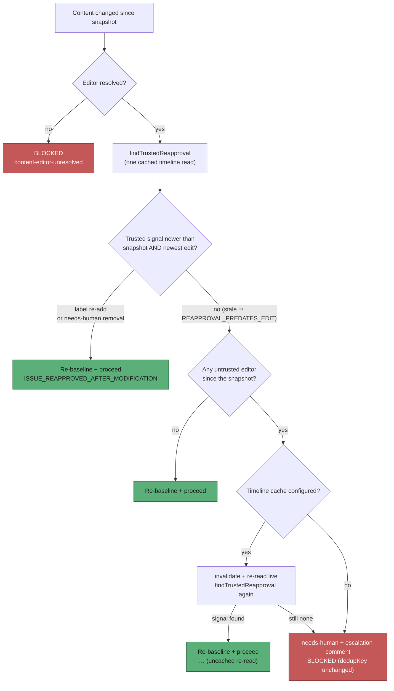

# Content-approval gate: a trusted `needs-human` removal re-approves, and the block path re-reads the timeline uncached

## Summary

The content-approval gate's escalation comment tells a human to remove
`needs-human`, but the gate honoured only an approval-label re-add — so the
label was re-added on the very next scan and the instruction did nothing.
Separately, the re-approval scan is served by the file-backed timeline cache
(300 s TTL), which can hide a re-approval that landed minutes ago: on 8 Sep
`nleck` re-added `work-on` on NEAT-AI-core#593 at 01:46:51 and a host still
blocked at 01:53:34.

Both are fixed in `resolveContentIntegrity`:

- **A trusted human's `needs-human` removal now counts as re-approval.** It is
  held to the same timing rule as a label re-add (newer than both the snapshot
  and the newest recorded edit), and the remover must be a trusted author who is
  **not** a fleet login (`service_accounts` / `fleet_pr_authors`) — a removal
  made by the fleet is label maintenance, not review.
- **The block path re-reads the timeline uncached once.** When a cache is
  configured and no re-approval was found, the gate invalidates that issue's
  entry and evaluates both signals once more against a live read, logging
  `[SECURITY] [ISSUE_REAPPROVED_AFTER_MODIFICATION] … (uncached re-read)` when
  one turns up. With no cache the first read was already live, so nothing is
  re-read; the pass paths cost no extra call at all.

Both questions are answered from **one** timeline fetch: `issue_query.ts` now
exports `lastAddInfoFromTimeline` and a matching `lastRemoveInfoFromTimeline`
(extracted from `getLabelLastRemoveInfo`, whose behaviour is unchanged).

Closes #1617.



## Evidence

Backend-only change — no web interface to screenshot. The evidence is the test
suite, run against the unfixed and the fixed gate.

Against the **unfixed** gate (new tests only), 5 of 9 failed:

```text
FAILED | 4 passed | 5 failed (35ms)
```

After the fix, the new suite and every neighbouring suite pass:

```text
deno test tests/work_on_content_integrity_needs_human_reapproval_test.ts
ok | 9 passed | 0 failed (20ms)

deno test tests/work_on_content_integrity_*.ts tests/pickup_content_integrity_test.ts \
          tests/issue_query_remove_info_test.ts tests/timeline_cache*_test.ts
ok | 92 passed | 0 failed (2s)
```

The full repository gate is green (`./quality.sh`): `Result: PASSED (with
skipped checks)` — the only skip is the pre-existing `config integration`
check.

## Reproduction

- **symptom** — an issue edited after approval stayed blocked after a trusted
  human did exactly what the escalation comment asked (removed `needs-human`),
  and a `work-on` re-add made minutes earlier was invisible behind the 300 s
  timeline cache (NEAT-AI-core#593: re-add 01:46:51, block 01:53:34)
- **status** — `verified` — both regression tests were observed failing against
  the unfixed gate (`FAILED | 4 passed | 5 failed`) and passing after the fix
- **regression test** —
  `worker/deno/tests/work_on_content_integrity_needs_human_reapproval_test.ts::work_on_content_integrity - a trusted needs-human removal newer than the edit re-approves (Issue #1617)`
  and `::work_on_content_integrity - a stale cached timeline cannot hide a trusted re-approval (Issue #1617)`

## Acceptance Criteria

<!-- vibe-spec-review inputs="diff+issue-body" -->

- **met** — regression test: untrusted edit at T0, `unlabeled needs-human` by a trusted login at T2 > T0 → proceed, snapshot re-captured, no comment POST, no label add, log contains `ISSUE_REAPPROVED_AFTER_MODIFICATION`; fails against the unfixed gate — evidence: `worker/deno/tests/work_on_content_integrity_needs_human_reapproval_test.ts::a trusted needs-human removal newer than the edit re-approves` — reviewer: met
- **met** — removal at T2 < T0, by an untrusted login, or by a login in `serviceAccounts`/`fleetPrAuthors` → blocked, escalation comment posted — evidence: same file, the stale / untrusted / `stservice`+`fleetbot` cases (the fleet logins are also on `allowedAuthors`, so the fleet exclusion is what refuses them) — reviewer: met
- **met** — untrusted edit at T3 > T2 after a counted removal → blocked with a fresh comment (new `dedupKey`) — evidence: same file, `::an untrusted edit after a counted removal blocks with a fresh comment` — reviewer: met — reason: the reviewer noted the test asserts the fresh comment rather than the `dedupKey` string; the key is derived from the edit timestamp and is covered by the untouched dedup test
- **met** — stale-cache test: pre-seeded `TimelineCache` lacking the trusted `work-on` re-add while `ghFn` returns one containing it → proceed, log contains `(uncached re-read)`, timeline endpoint requested exactly once — evidence: same file, `::a stale cached timeline cannot hide a trusted re-approval` — reviewer: met
- **met** — pass-path: `unchanged` content, or a cached read that already shows re-approval, requests the timeline at most once and never after invalidation — evidence: same file, `::unchanged content never reads the timeline` (0 calls) and `::a cached re-approval is honoured without a second read` (0 calls) — reviewer: met
- **met** — block-path: an uncached re-read that still finds no re-approval blocks exactly as before; `work_on_content_integrity_escalation_dedup_test.ts` and `issue_query_remove_info_test.ts` stay green unmodified — evidence: same file, `::an uncached re-read that finds nothing still blocks`; the reviewer independently ran the three suites (26 passed, 0 failed) and confirmed neither named file is touched by the diff — reviewer: met
- **met** — `deno fmt --check`, `deno lint`, `deno check`, `deno test` pass in `worker/deno` — evidence: full `./quality.sh` run after the final edit, `Result: PASSED` — reviewer: met — reason: the reviewer ran fmt/lint/check and the four relevant test files but not the full suite; the full gate was run here and passed
- **unrequested** — the `[ISSUE_REAPPROVED_AFTER_MODIFICATION]` / `[REAPPROVAL_PREDATES_EDIT]` prose was generalised (`` `work-on` re-added by `alice` `` rather than `Trusted author alice re-added work-on`) — reviewer: unrequested — reason: one message must now describe two signals; the greppable `[SECURITY] [MARKER]` prefixes are byte-for-byte unchanged, which is what logs are scraped on
- **unrequested** — a `warnOnStale` flag suppresses the stale warning on the second (uncached) evaluation — reviewer: unrequested — reason: without it every blocked scan logs the same stale signal twice; the trade is that a stale signal visible only on the live re-read is not warned about, which does not change any verdict
- **unrequested** — the stale warning loops over the signals, so a pass can emit up to two `[REAPPROVAL_PREDATES_EDIT]` lines — reviewer: unrequested — reason: there are now two signals and either can be stale; naming both is the honest log
- **unrequested** — `resolveFleetMaintenanceAuthorSet` hoisted out of the escalation call site into one `fleetAuthors` const — reviewer: unrequested — reason: the re-approval scan and the comment-dedup path need the identical set; computing it twice from the same config is the duplication the standards forbid. Same value, no behavioural change

Residual risk the reviewer named, prescribed by the issue rather than introduced
here: `githubUser: ""` excludes *this host's own* login from `fleetAuthors`
(the login is not on `WorkerConfig`, and the adjacent dedup call has always been
built the same way), so a host whose login is on `allowed_authors` but absent
from `service_accounts` / `fleet_pr_authors` would have its own label removals
read as human re-approval. Fixing that means plumbing the host login into
`WorkerConfig`, which is outside this issue.

## Standards Review

<!-- vibe-standards-review inputs="diff+CODING-STANDARDS.md" -->

- **violation** — no `docs/archive/pr-summaries/pr-summary-1617.md` — evidence: `docs/archive/pr-summaries/` (absent at review time) — reason: fixed here; this file is it
- **violation** — `SECURITY.md` still stated that a label re-add is the *only* signal that clears an untrusted edit — evidence: `SECURITY.md:1128` and `:1133` — reason: fixed in this diff; both the two-signal rule and the uncached re-read are now documented in the TOCTOU section
- **violation** — `docs/USAGE.md` "To resume work" told a human to remove `needs-human` without saying that, for content-approval escalations, the removal is now the re-approval — evidence: `docs/USAGE.md:389` — reason: fixed in this diff with a note naming the trusted-non-fleet and post-dates-the-edit conditions
- **violation (minor)** — the block path invalidates and re-reads even when the first read was already a cache miss (hence already live), because `fetchTimelineWithCache` reports no hit/miss — evidence: `worker/deno/lib/work_on_content_integrity.ts:805-812` — reason: stands. The issue prescribes this shape verbatim, distinguishing the two would need a hit/miss signal threaded through a shared helper, and the cost is bounded to one extra read per scan of an issue that is about to be escalated. The docs line now says so explicitly
- **clean** — Australian English throughout; DRY (fleet set hoisted, `lastRemoveInfoFromTimeline` extracted as the mirror of `lastAddInfoFromTimeline`, one `reBaselineOnReapproval` closure for both call sites); fail-loud (a null timeline fails *closed*, no catch-and-ignore, both outcomes emit greppable `[SECURITY]` markers); test quality (drives `verifyWorkOnContentIntegrity` end to end with a faked `gh` and in-memory fs, asserts verdicts and side effects, no source greps, no sleeps or wall-clock budgets, tmpdir cleaned in `finally`); commit safety (no hidden paths staged, `Issue #1617` referenced, `Vibe-Coder-Run-Id` trailer present); Deno conventions (typed discriminated union, `@std/assert` only, `buildDefaultWorkerConfig` reused)

## Test Plan

Added `worker/deno/tests/work_on_content_integrity_needs_human_reapproval_test.ts`
(9 tests, all driving `verifyWorkOnContentIntegrity` end to end):

- a trusted `needs-human` removal newer than the edit re-approves — proceed,
  snapshot re-captured, no comment, no label add, marker logged
- a removal older than the edit does not re-approve — blocked, comment posted
- a removal by an untrusted login does not re-approve
- a removal by a fleet login (`stservice`, `fleetbot`, both also on
  `allowedAuthors`) does not re-approve
- an untrusted edit after a counted removal blocks again with its own comment
- a stale cached timeline cannot hide a trusted re-approval — proceed,
  `(uncached re-read)` logged, exactly one live timeline read
- unchanged content never reads the timeline (0 calls)
- a cached re-approval is honoured without a second read (0 calls)
- an uncached re-read that finds nothing still blocks — `needs-human` added,
  one comment, exactly one live read

Unmodified and still green: `work_on_content_integrity_escalation_dedup_test.ts`,
`work_on_content_integrity_reapproval_test.ts`,
`work_on_content_integrity_reapproval_edit_order_test.ts`,
`issue_query_remove_info_test.ts`, `timeline_cache_test.ts`,
`pickup_content_integrity_test.ts` (92 passed across the group).
