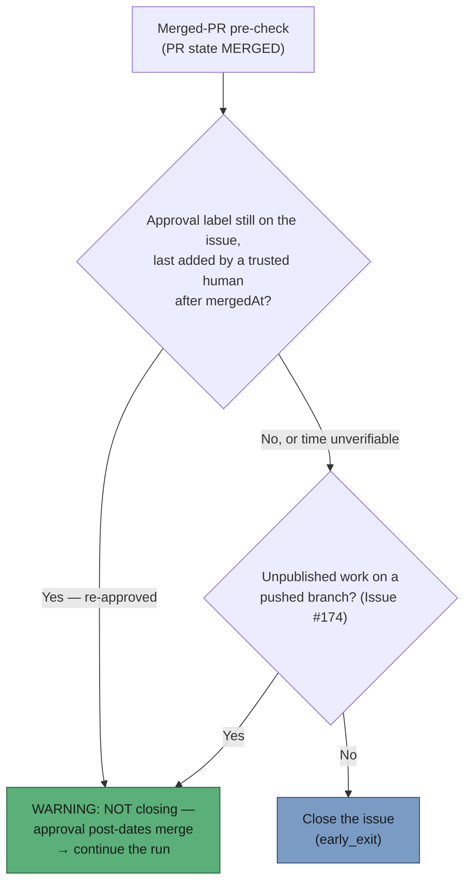

# Merged-PR pre-check: do not close an issue re-approved after the merge

## Summary

The merged-PR pre-check closed any issue whose linked PR is `MERGED`, even when
a trusted human had re-approved the issue *after* that merge. #1562 was grilled
to Ready and given `top-priority` at 00:21; at 00:41 the pre-check found PR
#1567 — matched only by the issue number in its title — merged at 22:49 the
night before, and closed it. Re-opening by hand achieved nothing, because the
pre-check runs on every claim.

`workOnIssueMergedPrPrecheck` now reads `state,mergedAt` from `gh pr view` and,
on `MERGED`, checks whether an approval label **still on the issue**
(`config.issueLabels` plus `config.workOnLabel`) was last added by a trusted
author after the merge. Trusted means `allowed_authors` minus the fleet's own
push-capable logins — a label the fleet applied is maintenance, not review. When
one qualifies, the phase logs a single
`Merged PR pre-check: NOT closing — approval post-dates merge` line naming the
issue, PR, label, adder and both timestamps, and returns `continue` so the run
works the re-approved scope. An unverifiable approval time — no or unparseable
`mergedAt`, a timeline read that fails or exceeds the page cap — is stated at
`WARNING` and keeps today's close.

Closes #1618.

## Evidence

Backend-only change, no web interface to screenshot. Evidence is the test suite:
`deno test tests/merged_pr_precheck_reapproval_test.ts
tests/merged_pr_precheck_phase_test.ts` → **19 passed, 0 failed**, and the full
`./quality.sh` gate passes.

## Reproduction

- **symptom** — an issue re-approved with `top-priority` after its linked PR
  merged was closed by the pre-check on every claim, so the re-approved
  remaining scope was never worked
- **status** — `verified` — the new tests were run against the unfixed phase
  (`git show e66588e:…/merged_pr_precheck_phase.ts`) and failed 4/8 with
  `status: "early_exit"` and `closeAttempted: true`; they pass after the fix.
  The beyond-page-1 test was separately verified red by reverting only the
  `fetchCompleteTimeline` seam back to `fetchTimelineWithCache`.
- **regression test** —
  `worker/deno/tests/merged_pr_precheck_reapproval_test.ts::merged-pr-precheck - does not close when a trusted top-priority add post-dates the merge`

## Acceptance Criteria

<!-- vibe-spec-review inputs="diff+issue-body" -->

- **met** — Trusted `top-priority` add after `mergedAt`, label present in
  `ctx.issueLabels` → `{ status: "continue" }`, no `issue close` call, warn line
  naming issue, PR, label, adder and both timestamps — evidence:
  `worker/deno/lib/phases/merged_pr_precheck_phase.ts:150-168`,
  `worker/deno/tests/merged_pr_precheck_reapproval_test.ts::does not close when a trusted top-priority add post-dates the merge`
  — reviewer: met
- **met** — Same for `work-on` — evidence: the approval set is
  `[...config.issueLabels, config.workOnLabel]` deduped and filtered by
  `ctx.issueLabels`;
  `worker/deno/tests/merged_pr_precheck_reapproval_test.ts::does not close when a trusted work-on add post-dates the merge`
  — reviewer: met
- **met** — Add before `mergedAt`, add by an untrusted or fleet login, or label
  absent from `ctx.issueLabels` → close and `early_exit` exactly as today —
  evidence: the three guards in `findPostMergeApproval` and the four
  `closes as before …` tests — reviewer: met
- **met** — Timeline lookup throws, or `mergedAt` is missing/unparseable → close
  as today, warning logged — evidence: `a timeline lookup error warns and still
  closes`, `a missing mergedAt warns and still closes`, and
  `an unparseable mergedAt warns and still closes` — reviewer: met — reason: the
  reviewer noted the non-empty unparseable string was untested; a test for it
  was added after the review
- **met** — `worker/deno/tests/merged_pr_precheck_phase_test.ts` stays green —
  evidence: 9/9 pass unchanged; its `makeContext` carries no approval labels, so
  the new check short-circuits before any timeline read — reviewer: met
- **met** — `deno fmt --check`, `deno lint`, `deno check`, `deno test` pass in
  `worker/deno` — evidence: full `./quality.sh` run after the final edit, all
  stages PASSED — reviewer: met — reason: the reviewer verified fmt/lint/check
  and a targeted test sweep but could not run the whole suite inside its cap;
  the full gate was run here and passed
- **unrequested** — the re-approval check sits ahead of the Issue #174
  stranded-branch guard and the orphaned-merge self-heal, so a re-approved issue
  whose merge is orphaned no longer raises the rollup PR on that claim —
  reviewer: unrequested — reason: the issue asked for the skip "before the
  close", and this is the same placement the existing #174 guard already uses;
  the rollup repair still runs on the next claim once the re-approved run's own
  PR merges
- **unrequested** — the docs paragraph also names the Issue #174 guard, which
  the issue did not ask to document — reviewer: unrequested — reason: one line
  of context so the reader knows two guards, not one, sit ahead of the close;
  reverting it would leave the new sentence "two guards" unexplained

## Standards Review

<!-- vibe-standards-review inputs="diff+CODING-STANDARDS.md" -->

- **violation** — the close/no-close decision read only timeline page 1, so on a
  busy issue (>100 events) the newest approval falls off the page and the issue
  is closed silently — evidence:
  `worker/deno/lib/phases/merged_pr_precheck_phase.ts:332` (pre-fix) — reason:
  fixed here — switched to `fetchCompleteTimeline`, the documented seam for a
  decision that depends on the genuinely most-recent event, with a throw or page
  cap falling to the same `WARNING`-and-close fail-safe; covered by
  `an approval beyond timeline page 1 still skips the close`
- **violation** — the JSDoc fail-safe contract and the module header did not
  mention the truncation case or the widened `--json state,mergedAt` read —
  evidence: `worker/deno/lib/phases/merged_pr_precheck_phase.ts:12` and `:289`
  — reason: fixed here, both updated in the same commit
- **violation** — `docs/archive/pr-summaries/pr-summary-1618.md` absent —
  evidence: `docs/archive/pr-summaries/` — reason: fixed here, this file
- **violation** — the #1562 narrative is retold in the phase header, the inline
  comment, the `findPostMergeApproval` JSDoc, the test header and the workflow
  doc — evidence:
  `worker/deno/lib/phases/merged_pr_precheck_phase.ts:144-149` — reason: stands.
  Each telling carries the detail its own reader needs (why the phase exists,
  why the check sits at that line, why the fixture times are what they are); the
  doc is the one authoritative telling and the code points at the issue number.
- **clean** — Australian English throughout; unit tests are parallel-safe with
  no sleeps, spawned processes or wall-clock assertions; the gh fake models
  gh's own `--json` projection so a pre-check that stops requesting `mergedAt`
  goes red on its own; no hidden or credential paths staged; failures are
  logged loud and never swallowed into a silent skip; `isAuthorTrusted` and
  `resolveFleetMaintenanceAuthorSet` reused rather than re-implemented; labels
  read from config, not hardcoded.

## Test Plan

Added `worker/deno/tests/merged_pr_precheck_reapproval_test.ts` — 10 tests:

- trusted `top-priority` add after the merge → `continue`, no close, full warn
  context
- trusted `work-on` add after the merge → `continue`
- add before the merge → `early_exit` and close, as today
- add by an untrusted login → close
- add by a fleet login (a service account also on `allowed_authors`) → close
- approval label no longer on the issue → close, and no timeline read at all
- timeline lookup throws → warn, close
- `mergedAt` absent from the PR view → warn, close
- `mergedAt` unparseable (`"last Tuesday"`) → warn, close
- approval on timeline page 2 behind a full page 1 → `continue` (locks in the
  exhaustive read; red against the page-1 seam)

`worker/deno/tests/merged_pr_precheck_phase_test.ts` is unchanged and still
passes 9/9. `./quality.sh` passes end to end.
