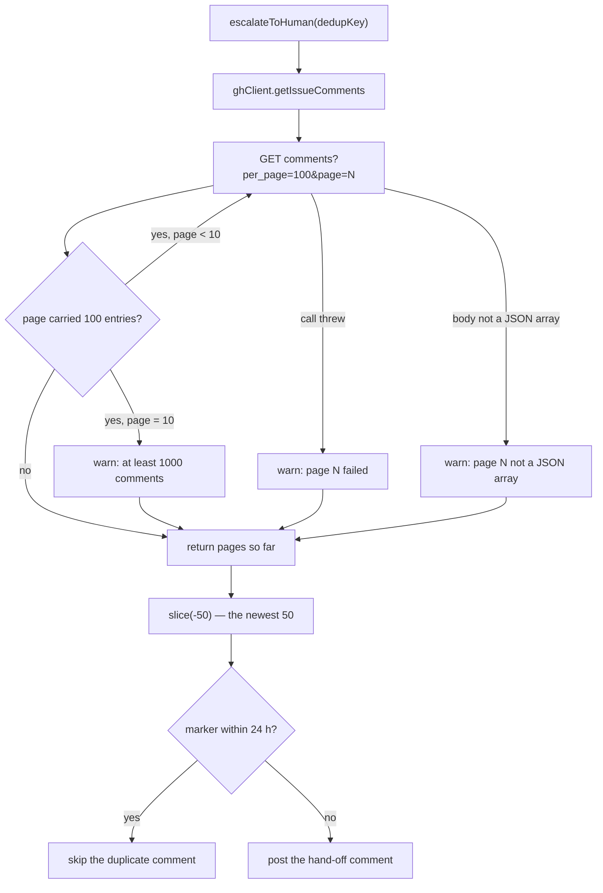

## Summary

`createGhEscalationClient().getIssueComments` asked the REST list endpoint with
no `per_page`, so GitHub answered with its default — the **oldest 30** comments.
`escalateToHuman` scans the tail of what that read returns for its own
`<!-- needs-human-escalation: … -->` marker, so on a busy thread the marker it
had just written was never fetched and the escalation was posted again. On
NEAT-AI-core#593 (46 comments, marker in comment 47) that produced the 01:53:35
/ 01:55:05 duplicate pair.

The shim now pages: `comments?per_page=100&page=N` from page 1, continuing while
a page comes back full, capped at 10 pages (1 000 comments), concatenated
oldest-first so the helper's `comments.slice(-50)` tail still scans the newest
50. `sort`/`direction` are not used — GitHub ignores them on this endpoint
(checked live against NEAT-AI-core#593 on 2026-09-08: the same ascending order
came back with and without them).

Three things can cut the read short, and each degrades to a partial scan — the
shim's long-standing best-effort contract — but none of them silently: a page
that fails, a page whose body is not a JSON array, and a thread that outruns the
cap all warn. The loop decides "full page" on how many entries the page carried,
not on how many survived parsing, so one unparseable entry cannot make a full
page look short and stop the scan mid-thread.

Closes #1619.

## Evidence

Backend-only change to a gh CLI shim — there is no web interface to screenshot.
The evidence is the test run:

- `deno test tests/gh_escalation_client_test.ts tests/gh_escalation_client_dedup_paging_test.ts`
  — 17 passed, 0 failed.
- Against the **unfixed** shim
  (`git checkout <base> -- worker/deno/lib/gh_escalation_client.ts`),
  `tests/gh_escalation_client_dedup_paging_test.ts` fails on
  `escalateToHuman - the paged shim finds a dedup marker in comment 47`
  (`dedupSkipped` false, expected true); it passes with the fix restored.
- `./quality.sh` — PASSED (all checks; `config integration` skipped as it is in
  this environment).

## Reproduction

- **symptom** — on an issue with more than 30 comments, `escalateToHuman` could
  not see the dedup marker it had itself written and posted a second identical
  hand-off comment (NEAT-AI-core#593, 90 seconds apart)
- **status** — `verified` — the regression test was observed failing against the
  unfixed shim (base `worker/deno/lib/gh_escalation_client.ts` restored, marker
  in comment 47 missed) and passing after the fix
- **regression test** —
  `worker/deno/tests/gh_escalation_client_dedup_paging_test.ts::escalateToHuman - the paged shim finds a dedup marker in comment 47`

## Acceptance Criteria

<!-- vibe-spec-review inputs="diff+issue-body" -->

- **met** — `gh_escalation_client_test.ts`: the request path carries
  `per_page=100`; a 100-item page is followed by a `page=2` request; a short
  page stops paging; the returned list is oldest-first across pages — evidence:
  `worker/deno/tests/gh_escalation_client_test.ts::getIssueComments - follows a full page with a page=2 request`
  and `::getIssueComments - a short first page stops paging` — reviewer: met
- **met** — end-to-end dedup test: a `ghFn` serving 47 comments (30 un-paged, 47
  with `per_page=100`) with the marker in comment 47 → `escalateToHuman` skips
  the duplicate; the unfixed shape posts one — evidence:
  `worker/deno/tests/gh_escalation_client_dedup_paging_test.ts::escalateToHuman - the paged shim finds a dedup marker in comment 47`
  and
  `::escalateToHuman - the un-paged read misses comment 47 and posts a duplicate`
  — reviewer: met
- **met** —
  `worker/deno/tests/work_on_content_integrity_escalation_dedup_test.ts` stays
  green — evidence: run in this session, 2 passed — reviewer: met
- **met** — `deno fmt --check`, `deno lint`, `deno check`, `deno test` pass in
  `worker/deno` — evidence: `./quality.sh` PASSED after the final edit —
  reviewer: partial — reason: the reviewer saw the full suite still running and
  could verify only a subset; the whole gate, including `deno test`, was run
  here and passed
- **met** — page from page 1 at `per_page=100` while a page returns 100, capped
  at 10 pages / 1 000 comments, concatenated oldest-first; a page failure
  returns what was fetched so far — evidence:
  `worker/deno/lib/gh_escalation_client.ts` `getIssueComments` — reviewer:
  partial — reason: the reviewer found the loop testing the _parsed_ count, so
  one dropped entry made a full page look short; fixed in commit `5ba0043` by
  paging on the page's raw entry count, covered by
  `::getIssueComments - a full page carrying an unparseable entry still pages on`
- **met** — do not rely on `direction=desc` — evidence:
  `worker/deno/lib/gh_escalation_client.ts` header comment;
  `buildIssueCommentsPageArgs` emits only `per_page`/`page` — reviewer: met
- **met** — update the shim's header comment and the `dedupKey` /
  `additionalDedupMarkers` JSDoc to state the window — evidence:
  `worker/deno/lib/gh_escalation_client.ts` header;
  `worker/deno/lib/needs_human_escalation.ts` `dedupKey` JSDoc — reviewer: met
- **met** — docs: update the `🤝 Worker escalation via needs-human` dedup-window
  text — evidence: `docs/workflows/issue-processing.md` "Comment dedup"
  paragraph — reviewer: met
- **unrequested** — a `warn` sink parameter on `createGhEscalationClient`, and
  warnings on the three short-read paths (page failure, non-array page, page
  cap) — reviewer: unrequested — reason: the issue asks only for paging, but
  "Never Fail Silently" forbids a truncated read that reports nothing; the sink
  is an injected seam so callers can capture it, and the default redacts before
  writing
- **unrequested** — the "Comment dedup" paragraph is net-new prose rather than
  an edit; the section did not previously describe the window — reviewer:
  unrequested — reason: the issue makes the docs edit conditional on that text
  existing, and "a code change owes a docs change" leaves the window
  undocumented otherwise

## Standards Review

<!-- vibe-standards-review inputs="diff+CODING-STANDARDS.md" -->

- **violation** — Never Fail Silently: a page whose body was not a JSON array
  parsed to nothing and ended the loop as if it were the last page — evidence:
  `worker/deno/lib/gh_escalation_client.ts` `getIssueComments` — reason: fixed
  in commit `1f6bd90`; that path now warns and returns the pages already
  fetched, covered by
  `::getIssueComments - a mid-thread page that is not a JSON array is reported`
- **violation** — the default `warn` sink wrote raw `gh` error text to
  `console.warn`, bypassing the redaction every structured sink applies —
  evidence: `worker/deno/lib/gh_escalation_client.ts` `createGhEscalationClient`
  — reason: fixed in commit `1f6bd90`; the default now writes
  `redactSecrets(message)`
- **violation** — a code change owes a docs change: the `dedupKey` JSDoc stated
  one client's page cap, but `escalateToHuman` is also called with the full
  `github.ts` client — evidence: `worker/deno/lib/needs_human_escalation.ts`
  `dedupKey` JSDoc — reason: fixed in commit `1f6bd90`; the JSDoc now states the
  contract placed on `ghClient` and names both clients' caps
- **violation** — DRY: a second bounded comment pager beside
  `issue_comment_pages.ts`, with a second cap (10 pages vs 20) for the same
  endpoint — evidence: `worker/deno/lib/gh_escalation_client.ts`
  `MAX_DEDUP_COMMENT_PAGES` — reason: stands, and is documented at the constant.
  `fetchIssueCommentPages` **throws** on a failed page and at the cap, which
  would lose the whole escalation rather than the marker; this shim's contract
  is best effort, and the issue specifies the 10-page cap. The shared
  `buildIssueCommentsPageArgs`/`COMMENTS_PER_PAGE` are reused, so the request
  shape has one source of truth
- **violation** — test quality: `makeUnpagedClient` asserts against a
  hand-written un-paged read rather than shipped code — evidence:
  `worker/deno/tests/gh_escalation_client_dedup_paging_test.ts` — reason:
  stands; the issue's acceptance criteria require "the same test against the
  unfixed shim posts a duplicate", and once the fix lands the old shape can only
  exist as a control. The first case in the same file is the real regression
  test and does fail against the unfixed shim
- **clean** — Australian English throughout; no wall-clock sleeps, polling or
  subprocesses in the new tests; no source-text grepping — the tests call
  `createGhEscalationClient` and `escalateToHuman` for real; commit safety (no
  hidden or credential-shaped paths staged); happy-path, short-page, cap and
  failure coverage; file sizes small, no new `lib/` module; the operator doc
  updated in the same change

## Test Plan

- `worker/deno/tests/gh_escalation_client_test.ts` — added: `page=2` follow-up
  on a full page with the exact `per_page=100` paths asserted; a short first
  page stops after one call; the 10-page cap truncates and warns; a failing
  later page returns the pages already fetched and warns; a mid-thread non-array
  page is reported; a full page carrying an entry the parser drops still pages
  on.
- `worker/deno/tests/gh_escalation_client_dedup_paging_test.ts` — added:
  end-to-end through the real `escalateToHuman` against a 47-comment issue whose
  marker sits in comment 47 — the paged shim dedups, the un-paged control posts
  the duplicate.
- `worker/deno/tests/work_on_content_integrity_escalation_dedup_test.ts` —
  unchanged, re-run green.
- Full gate: `./quality.sh` PASSED.
