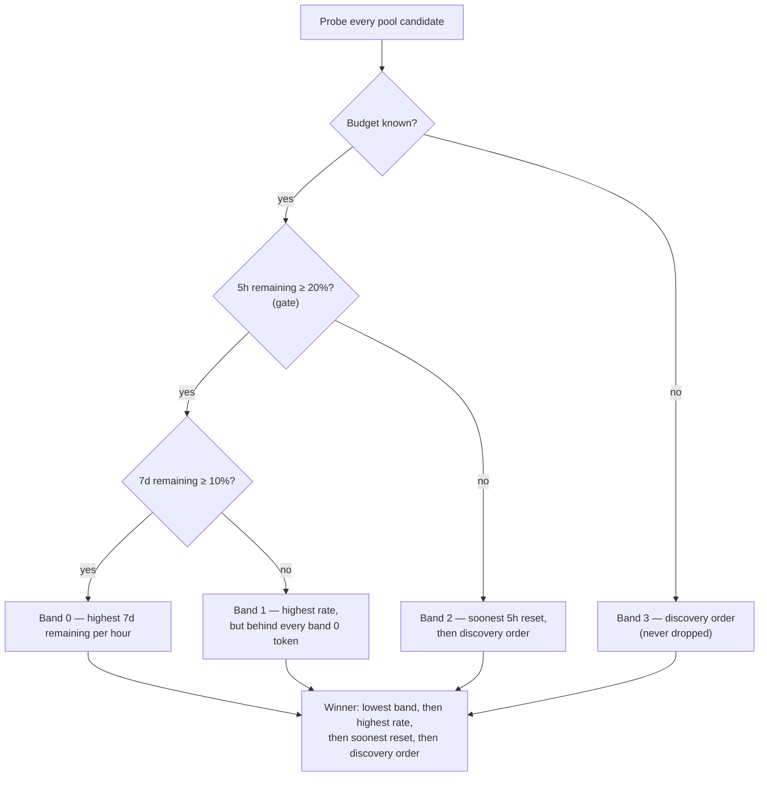

# Rank Claude pool tokens by remaining budget per hour (Issue #1623)

## Summary

Claude token selection ranked the pool by the **largest remaining share** of
each token's most constrained window, so a subscription with 20% of its week
left that resets in six hours lost to one with 90% left over six and a half
days — and the first token's budget lapsed unused. This replaces that with the
two-step rule the issue asks for: the five-hour window is a **gate**, and the
seven-day window sets the **rate**. Use it or lose it. Closes #1623.

- **Gate** — a token still holding at least 20% of its five-hour window (less
  than 80% used) passes; every passing token ranks ahead of every failing one.
  The threshold is a fixed exported constant,
  `CLAUDE_FIVE_HOUR_GATE_MAX_USED`, not an environment variable. It is stated
  as usage rather than as the remaining share it complements, because that is
  the comparison the gate makes: at exactly 20% left the token has used exactly
  80% and fails, which no `remaining >= 0.2` spelling gets right on both sides
  of the boundary.
- **Rate** — passing tokens are ordered by seven-day remaining share divided by
  the hours until that window resets, highest first. A response that reported
  no seven-day window is ranked on the window it did report.
- **Floor** — a passing token under 10% of its seven-day window
  (`CLAUDE_SEVEN_DAY_LOW_REMAINING`) ranks behind every passing token above the
  floor whatever its rate, is ordered among its peers by rate, and still beats
  every gate failure.
- **Gate failures** are ordered by the soonest five-hour reset, so the token
  that refills first is the one chosen when nothing can be spent now.
- Unchanged: a reset already in the past counts as a **full** window (now in
  both windows, scored over the window's nominal length rather than a negative
  number); an unknown budget ranks last and is never dropped; with every budget
  unknown the discovery order decides; selection still happens once per worker
  start.

## Evidence

Backend/CLI change with no web interface, so there is nothing to screenshot.
The evidence is the test suite and the local quality gate.

- `deno test tests/claude_token_selection_test.ts` — 27 passed, 0 failed.
- `./quality.sh` — **PASSED** in 4m53s. The one skipped check is
  `config integration`, skipped because no `.config.json` exists in this
  worktree (`quality_gate.ts:954`), not because of anything in this change.
  Everything else ran: semgrep, markdownlint, mermaid, deno
  lint/type-check/fmt and the full Deno test suite.

The ranking, end to end:



Example of the new startup log (from `docs/SETUP.md`):

```text
[SECURITY] claude token candidate provider-2 (#2): five_hour=88.0% resets=2026-09-05T02:00:00.000Z seven_day=22.0% resets=2026-09-05T09:00:00.000Z rate=2.03%/h gate=pass
[SECURITY] claude token candidate provider (#1): five_hour=91.0% resets=2026-09-05T01:00:00.000Z seven_day=75.0% resets=2026-09-11T05:00:00.000Z rate=0.50%/h gate=pass
[SECURITY] claude token selected provider-2 (#2) of 3: highest-remaining-per-hour rate=2.03%/h remaining=22.0% resets=2026-09-05T09:00:00.000Z
```

## Acceptance Criteria

<!-- vibe-spec-review inputs="diff+issue-body" -->

- **met** — the five-hour gate: a token passes when its five-hour usage is under the threshold, and every passing token ranks ahead of every failing one — evidence: `worker/deno/lib/claude_token_selection.ts` (`passesFiveHourGate`, `band`, `compareCandidates`), `worker/deno/tests/claude_token_selection_test.ts::ranking gates on the five-hour window before it looks at the rate (Issue #1623)` — reviewer: met
- **met** — the gate threshold is a fixed exported constant with no environment variable, and its value is stated in `docs/SETUP.md` — evidence: `worker/deno/lib/claude_token_selection.ts` (`CLAUDE_FIVE_HOUR_GATE_MAX_USED = 0.8`), `docs/SETUP.md` rule 2 — reviewer: met — reason: the reviewer saw the constant as `CLAUDE_FIVE_HOUR_GATE_MIN_REMAINING = 0.2`; it was renamed to the usage form after its review, for the boundary reason in the `partial` entry below
- **met** — passing tokens ranked by seven-day remaining share divided by hours until the seven-day reset, highest first — evidence: `worker/deno/tests/claude_token_selection_test.ts::ranking prefers 20% that expires in six hours over 90% that lasts six and a half days (Issue #1623)` — reviewer: met
- **met** — a reset already in the past still counts as a full window, in both windows — evidence: `worker/deno/tests/claude_token_selection_test.ts::ranking treats a reset that has already passed as a full window (Issue #919)` and `::ranking scores an elapsed seven-day window over its nominal 168 hours (Issue #1623)` — reviewer: met
- **met** — a passing token under 10% of its seven-day window ranks behind every passing token at or above 10%; sub-10% tokens are ordered by rate and still beat gate failures — evidence: `worker/deno/tests/claude_token_selection_test.ts::ranking puts a passing token under 10% of its seven-day window behind every passing token above it (Issue #1623)` and `::ranking orders two sub-10% tokens by rate and still ahead of a gate failure (Issue #1623)` — reviewer: met
- **met** — gate-failing tokens ordered by soonest five-hour reset, then discovery order — evidence: `worker/deno/tests/claude_token_selection_test.ts::ranking orders gate-failing tokens by the soonest five-hour reset (Issue #1623)` — reviewer: met
- **met** — the startup log prints both windows' remaining share and reset time plus the rate in percent per hour, and the selected line names the reason code — evidence: `worker/deno/tests/claude_token_selection_test.ts::the decision log names every candidate then the winner and its reason (Issue #1623)` — reviewer: met
- **met** — the reason codes are extended to name the gate and the rate rule — evidence: `worker/deno/lib/claude_token_selection.ts` (`ClaudeTokenSelectionReason`), `docs/SETUP.md` reason-code table — reviewer: met — reason: the reviewer confirmed no other file in the repo referenced the two removed codes
- **met** — unknown budgets still rank last and are never dropped; all-unknown falls back to discovery order — evidence: pre-existing `worker/deno/tests/claude_token_selection_test.ts::ranking puts an unknown budget behind every known one without dropping it (Issue #919)` and `::ranking falls back to discovery order when every budget is unknown (Issue #919)`, both unchanged and passing — reviewer: met
- **met** — `docs/SETUP.md` ("Which Claude token a run uses", the reason-code table, "The windows are not synchronised") and the `docs/CONTAINER.md` one-liner updated — evidence: `docs/SETUP.md`, `docs/CONTAINER.md:1584` — reviewer: met
- **met** — a test for the user's 20%-in-6h versus 90%-in-6.5-days example — evidence: `worker/deno/tests/claude_token_selection_test.ts::ranking prefers 20% that expires in six hours over 90% that lasts six and a half days (Issue #1623)` — reviewer: met
- **met** — a test for a token at 80% five-hour usage ranking behind one at 79% — evidence: `worker/deno/tests/claude_token_selection_test.ts::ranking puts a token at 80% of its five-hour window behind one at 79% (Issue #1623)` and `::the gate reads the utilisation the probe actually reports (Issue #1623)` — reviewer: partial — reason: the reviewer showed the test passed on a floating-point artefact (`1 - 0.80` is `0.199999…`), not on the gate, and that at an exact 20% the `>= 0.2` gate let the 80% token through; the gate was re-expressed as `used < 80%` and the test now asserts both sides of the boundary exactly, so the criterion is met after that fix
- **met** — tests for the extended log lines and reason codes — evidence: `worker/deno/tests/claude_token_selection_test.ts::the decision log prints both windows and the rate for a token reporting both (Issue #1623)` — reviewer: met
- **unrequested** — `RankedClaudeToken.remainingFraction` / `resetAt` / `windowElapsed` now describe the rate window rather than the probe's most-constrained window, so the `selected` line's `remaining=` reports the seven-day figure — reviewer: unrequested — reason: unavoidable once ranking is done on the rate window; the candidate lines above it still print both windows, and a gate-failing winner's line now carries its five-hour figure too
- **unrequested** — `WINDOW_HOURS`, the nominal 5h/168h divisor used when a window's reset has already passed — reviewer: unrequested — reason: the rate rule needs some divisor for a rolled-over window and the issue named none; dividing by a negative interval was the only alternative
- **unrequested** — `CLAUDE_SEVEN_DAY_LOW_REMAINING` is exported as well as the gate constant — reviewer: unrequested — reason: the issue mandated only the gate threshold be exported, but the 10% floor is quoted in `docs/SETUP.md` on the same footing, so it is named the same way
- **unrequested** — `reportedWindows` synthesises a one-element list from the headline figures for a known budget with an empty `windows` array — reviewer: unrequested — reason: the reviewer flagged it as uncovered defensive code; it is now covered by `::ranking falls back to the headline figure for a budget carrying no window list (Issue #1623)` rather than removed, because the type permits that shape and silently demoting such a token to "unmeasured" would be a fail-silent

## Standards Review

<!-- vibe-standards-review inputs="diff+CODING-STANDARDS.md" -->

- **violation** — `highest-remaining-per-hour` claimed to be the best rate of every gate-passing candidate, which is false for a winner that beat a sub-10% token with a higher rate — evidence: `worker/deno/lib/claude_token_selection.ts` (`ClaudeTokenSelectionReason`), `docs/SETUP.md` reason-code table — reason: fixed here; both now define the code as the best rate among candidates above the seven-day floor, and say the floor is applied before the rate
- **violation** — `docs/SETUP.md` described `rate=` as the seven-day rate only, contradicting the implemented fallback for a response that reports no seven-day window — evidence: `docs/SETUP.md` (log-format paragraph) — reason: fixed here; the paragraph now names the fallback
- **violation** — the two operator-visible fallbacks (no five-hour window passes the gate; no seven-day window is ranked on the window reported) were stated only in the module comment — evidence: `docs/SETUP.md` rules 2 and 3 — reason: fixed here; both are now on the operator surface
- **violation** — the test file's own header still documented the superseded rules — evidence: `worker/deno/tests/claude_token_selection_test.ts:14` — reason: fixed here; the header now states the gate, the rate and the floor, and says which cases were rewritten
- **violation** — `claude_pool_budget.ts` and `container_restart_backoff.ts` still asserted that worker start "takes the most-remaining token" — evidence: `worker/deno/lib/claude_pool_budget.ts:5`, `worker/deno/lib/container_restart_backoff.ts:1294` — reason: fixed here; both now describe the per-hour ranking, and the backoff comment says a spent token fails the gate rather than "ranks last"
- **violation** — the `selected` line for a gate-failure win printed only the rate window, never the five-hour reset the decision was actually made on — evidence: `worker/deno/lib/claude_token_selection.ts` (`formatClaudeTokenSelectionLog`) — reason: fixed here, and pinned by the exact-text assertion in `::the decision log prints both windows and the rate for a token reporting both (Issue #1623)`
- **violation** — `remainingFraction` / `resetAt` / `windowElapsed` duplicate `rateWindow`'s three fields (DRY) — evidence: `worker/deno/lib/claude_token_selection.ts` (`RankedClaudeToken`) — reason: stands, documented rather than removed: they are derived in one place (`rankingView`), never set independently, and they keep the interface `#919`'s tests and the log formatter already use
- **violation** — the nominal 168-hour divisor for an elapsed seven-day window had no test — evidence: `worker/deno/lib/claude_token_selection.ts` (`WINDOW_HOURS`) — reason: fixed here by `::ranking scores an elapsed seven-day window over its nominal 168 hours (Issue #1623)`
- **violation** — float equality on `ratePerHour` makes `equal-remaining-per-hour-soonest-reset` and `tied-discovery-order` effectively unreachable in production (KISS) — evidence: `worker/deno/lib/claude_token_selection.ts` (`compareCandidates`) — reason: stands; they are last-resort tie-breaks whose only job is to make the sort total and deterministic, and an epsilon comparison would add a second threshold to justify for no operator-visible gain
- **clean** — Australian English throughout; `deno fmt`/`lint`/`check` clean; every test calls the real functions and asserts on returned values (no source-grepping); no test removed or disabled (16 → 27 cases); injected clock and `fetch`, so no sleeps, no network, no process-wide state; no token value reaches the log; the commit carries the issue reference and the run-id trailer; no hidden or credential-shaped path staged

## Test Plan

`worker/deno/tests/claude_token_selection_test.ts` — added:

- `ranking prefers 20% that expires in six hours over 90% that lasts six and a
  half days (Issue #1623)` — the user's own example.
- `ranking gates on the five-hour window before it looks at the rate`.
- `ranking puts a token at 80% of its five-hour window behind one at 79%`.
- `ranking puts a passing token under 10% of its seven-day window behind every
  passing token above it`.
- `ranking orders two sub-10% tokens by rate and still ahead of a gate failure`.
- `ranking orders gate-failing tokens by the soonest five-hour reset`.
- `ranking breaks an equal rate towards the soonest reset`.
- `the decision log prints both windows and the rate for a token reporting both`
  — including the `selected` line for a gate failure, which carries the
  five-hour reset the choice was made on.
- `the gate reads the utilisation the probe actually reports` — 80% and 79%
  utilisation as the probe delivers them (`1 - u`, which is not exact) still
  land on the right side of the gate.
- `ranking scores an elapsed seven-day window over its nominal 168 hours`.
- `ranking falls back to the headline figure for a budget carrying no window
  list`.

Modified — **business-logic change, documented here as required**: the ranking
rule itself changed, so three existing tests assert the new outcome rather than
the old one. None was deleted or disabled.

- `ranking returns the token with the most remaining budget …` → `… per hour of
  its own window`: same three candidates, but the winner is now the token whose
  44% expires in four hours rather than the one holding 81% over five days.
- `ranking breaks a tie on remaining budget towards the soonest reset` →
  `ranking spends equal headroom that expires soonest first`: same inputs and
  same winner; the reason code is now `highest-remaining-per-hour`, because
  equal shares over unequal windows are no longer a tie.
- `the decision log names every candidate then the winner and its reason`: same
  ordering, new line format (both windows, the rate, `gate=pass|fail`) and the
  new reason code.

Unchanged and still passing: the unknown-budget ordering, the all-unknown
discovery-order fallback, the elapsed-window rule, the complete-tie rule, and
every selector test (no probe under two candidates, concurrency, decide-once,
all-probes-failed, and no token value reaching the log).
