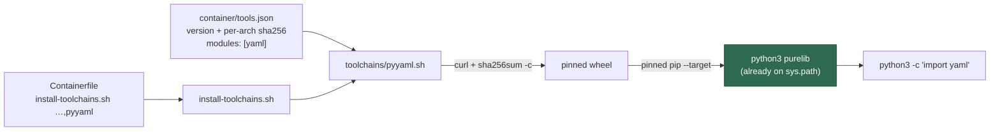

# PyYAML is baked into the image as a library toolchain

## Summary

NEAT-AI-core's workflow-assertion BATS suites parse workflow YAML with an
inline `python3` script that imports PyYAML. With `bats-core` in the image
(Issue #1595) those suites execute here rather than skipping, and 31 of their
tests failed with `ModuleNotFoundError: No module named 'yaml'` because
`python3 -c "import yaml"` had nothing to import.

The image now installs PyYAML 6.0.3 as a pinned toolchain. PyYAML ships no
console script, so the manifest gains a second toolchain surface: a toolchain
declares the `commands` it puts on the PATH, the Python `modules` it makes
importable, or both. The codespell pattern could not transfer unchanged —
the consumer is the image's own interpreter, which would never see a
`/opt/<tool>` virtualenv — so `container/toolchains/pyyaml.sh` installs the
pinned, checksum-verified wheel with the pinned pip using `pip --target` into
the directory `sysconfig.get_path("purelib")` reports: the interpreter's own
admin install location, already on its `sys.path`. `--target` is also what
keeps the PEP 668 externally-managed system environment untouched, and
virtualenvs created later (semgrep's, codespell's) do not inherit that
directory, so nothing here shadows their pinned dependencies.

The pinning invariant holds: an exact version and a committed per-architecture
SHA-256 in `container/tools.json`, both wheels fetched by pinned
`files.pythonhosted.org` URL under the build's shared `${CURL_RETRY}` policy
and verified with `sha256sum -c` before pip sees them, and `--no-deps
--only-binary=:all:` so nothing is resolved from the index at build time
(PyYAML declares no runtime dependencies).

Closes #1628.

## Evidence

Backend/CLI change — no web interface to screenshot. The evidence is the
fragment run and the suites it unblocks, both measured in the container this
run executed in (arm64, Debian trixie, python3 3.13.5).

### The fragment, run end to end

`purelib` was redirected to a temporary directory (the run is unprivileged and
cannot write `/usr/local`); everything else is the committed fragment, the
committed pins and the build's real `${CURL_RETRY}` / `${PIP_RETRY}` values:

```text
[pyyaml] Installing 6.0.3 for cp313 into /tmp/tmp.Pot8fQ4AaE/site with pip 26.2.1
/tmp/tmp.SM7TX0X3br/pip-26.2.1-py3-none-any.whl: OK
/tmp/tmp.SM7TX0X3br/pyyaml-6.0.3-cp313-cp313-manylinux2014_aarch64.manylinux_2_17_aarch64.manylinux_2_28_aarch64.whl: OK
[pyyaml] Installed yaml 6.0.3
```

The trailing line is the fragment's own fail-loud check: it imports every
module the manifest declares and compares the reported version with the pin.

### The failures the issue reported

A fresh clone of `stSoftwareAU/NEAT-AI-core`, the 16 `tests/scripts` suites
that import PyYAML (112 tests), run with the image's pinned bats 1.14.0:

| Run                                    | ok  | not ok | `No module named 'yaml'` | skipped for PyYAML |
| -------------------------------------- | --- | ------ | ------------------------ | ------------------ |
| Before — the image as it stands         | 30  | 82     | 31                       | 10                 |
| After — with the fragment's PyYAML      | 112 | 0      | 0                        | 0                  |

31 is exactly the count the issue reported. The one remaining skip in the
"after" run is `cargo-cyclonedx not installed`, unrelated to this issue.

### Outstanding — one block a human with `workflow` scope must apply

`.github/workflows/container-build.yml`'s toolchain verification step cannot
verify a library toolchain: its inline `jq` reads `.commands` on every entry,
so it stops at the first entry without one. The replacement block is written,
rehearsed (`commands: verified 12 of 12`, `modules: verified 1 of 1`, with
`actionlint` clean) — and unpushable, because the worker's `gh` token has
scopes `admin:public_key, gist, read:org, repo, user` and GitHub rejects a
push touching `.github/workflows/**` without `workflow`:

```text
! [remote rejected] ... (refusing to allow an OAuth App to create or update
  workflow `.github/workflows/container-build.yml` without `workflow` scope)
```

It is recorded verbatim in stSoftwareAU/VibeCoder#1705. Until it lands, the
`pyyaml` entry is deliberately the **last** `toolchains[]` entry, which is
what keeps this honest:

- all 12 command toolchains are emitted before `jq` stops, so **none of them
  loses CI verification** — verified by running the workflow's own jq against
  the committed manifest;
- the library toolchain is verified by the **image build itself** —
  `container/toolchains/pyyaml.sh` imports every module the manifest declares
  and compares the reported version with the pin, so a broken install fails
  the build rather than the check after it;
- the placement constraint is recorded in the `pyyaml` entry's own `notes`, and
  #1705 says to drop that note once the block lands.

### How a library toolchain reaches the image



## Acceptance Criteria

<!-- vibe-spec-review inputs="diff+issue-body" -->

- **met** — a pinned PyYAML reaches the image and is interpreter-visible, so
  `python3 -c "import yaml"` works — evidence: `container/toolchains/pyyaml.sh`
  installs with `pip --target` into `sysconfig.get_path("purelib")`, and the
  16 NEAT-AI-core suites that import PyYAML went from 82 failures to 0 —
  reviewer: met
- **met** — the mechanism is a `toolchains[]` entry with a
  `container/toolchains/<id>.sh` fragment — evidence:
  `container/tools.json` (`"fragment": "toolchains/pyyaml.sh"`),
  `worker/deno/lib/container_image_hash.ts:91` — reviewer: met
- **met** — an interpreter-visible install rather than a `/opt/<tool>` venv
  with a console-script symlink — evidence: no venv or symlink in
  `container/toolchains/pyyaml.sh`; `--target` also opts the install out of
  pip's PEP 668 externally-managed check — reviewer: met
- **met** — exact version, committed SHA-256, nothing resolved from the index
  at build time — evidence: `container/tools.json` pins 6.0.3 with a per-
  architecture digest the reviewer checked against PyPI's cp313 manylinux
  wheels; the fragment fetches by pinned URL, runs `sha256sum -c`, and
  installs `--no-deps --only-binary=:all:` from the local file —
  reviewer: met
- **partial** — the built image's own CI step verifies the new toolchain —
  evidence: `container/toolchains/pyyaml.sh` verifies at build time (import +
  version equality), so a broken install fails the image build —
  reviewer: met — reason: departure recorded. The reviewer saw the diff while
  it still carried the `container-build.yml` module loop and judged it met;
  that block was withheld because the worker's token has no `workflow` scope,
  so the outside-in CI check is `partial` until
  stSoftwareAU/VibeCoder#1705 lands
- **unrequested** — `REQUIRED_REPO_TOOLCHAIN_MODULES` and
  `findMissingRuntimePythonModules` in
  `worker/deno/lib/container_manifest.ts` — reviewer: unrequested — reason:
  the module counterpart of the existing
  `REQUIRED_REPO_TOOLCHAIN_COMMANDS`/`findMissingRuntimeTools` pair; it is
  what makes "the image supplies `yaml`" a gate-checked invariant rather than
  a pin anyone can quietly drop, and it is kept
- **unrequested** — module-name validation in two layers
  (`PYTHON_MODULE_RE` in the parser, the regex guard in the fragment) —
  reviewer: unrequested — reason: the names are interpolated into a
  `python3 -c`, so a doctored manifest must not reach the interpreter; kept as
  defence in depth

## Standards Review

<!-- vibe-standards-review inputs="diff+CODING-STANDARDS.md" -->

- **violation** — two verification loops could report green having verified
  nothing: the command loop filtered rows out, and the library loop's `jq` ran
  in a process substitution, so an errored or empty query would run the body
  zero times and still exit 0 — evidence:
  `.github/workflows/container-build.yml:223` (as it stood in commit
  `1954f29`) — reason: fixed, then **withheld from this PR** — the worker's
  token carries no `workflow` scope, so GitHub rejects any push touching
  `.github/workflows/**`. The finished block is recorded verbatim in
  stSoftwareAU/VibeCoder#1705 for a human to apply, and this branch leaves the
  workflow untouched. See **Outstanding** below for what that costs today
- **violation** — the fragment's new "names no module" abort shipped with no
  test, out of pattern with its four other covered abort paths — evidence:
  `container/toolchains/pyyaml.sh:76` — reason: fixed here;
  `container/toolchains/pyyaml.sh - a manifest naming no module aborts before
  downloading` covers it, and the jq is now `-r` over `(.modules // [])[]` so
  the named error is what fires. Mutation-checked: removing the guard turns
  the test red
- **violation** — the changed `findToolchainInstallViolations` message branch
  (`?? toolchain.versionModule`) was never executed by a test — evidence:
  `worker/deno/lib/container_manifest.ts:939` — reason: fixed here;
  `findToolchainInstallViolations - names the module a library toolchain the
  build never installs would be missing`. Mutation-checked
- **violation** — `mapfile < <(jq …)` could not fail the fragment, since
  `set -e` does not see a process substitution's exit status — evidence:
  `container/toolchains/pyyaml.sh` as of commit `f09367b` — reason: fixed in
  `525c59b`, before either reviewer reported; the list is now read in
  command-substitution position with an explicit empty-list guard, which also
  drops the bash 4 dependency
- **clean** — Australian English throughout the added lines; `deno fmt`,
  `deno lint`, `deno check`, `markdownlint-cli2` and
  `shellcheck container/toolchains/pyyaml.sh` all clean; the new fragment
  tests are correctly classified as integration tests
  (`worker/deno/lib/integration_test_manifest.ts`); no `Deno.env.set`,
  `Deno.chdir`, sleeps or wall-clock thresholds, and no source-grepping
  tests; every doc surface a new toolchain owes is updated in the same change
  (`docs/CONTAINER.md`, `docs/CONTAINER-IMAGE.md`, the regenerated
  `docs/audits/dependency-inventory.md`, the `tools.json` description); the
  fragment is registered in `CONTAINER_IMAGE_INPUTS`; both commits reference
  Issue #1628 and carry a `Vibe-Coder-Run-Id` trailer; no hidden paths or key
  material staged

Two reviewer observations were left alone deliberately.
`chmod -R a+rX "${site}"` recurses the whole purelib directory rather than the
installed names: the base image ships that directory empty, so the recursion
covers exactly what this fragment put there, and a comment now says so.
`worker/deno/lib/gate_skip_drift_scanner.ts:524` still keys its "baked tool"
detection off `commands` only, so a gate line skipped over a missing *module*
would not be recognised as covered — that is a real gap, and it is outside
this issue's scope rather than fixed here.

## Test Plan

Added — `worker/deno/tests/container_manifest_test.ts`:

- `parseContainerManifest - parses a toolchain that installs a module, not a command`
- `parseContainerManifest - rejects a toolchain that installs neither a command nor a module`
- `parseContainerManifest - rejects a module toolchain that reports no version`
- `parseContainerManifest - rejects a versionModule the toolchain does not install`
- `parseContainerManifest - rejects a module name python could not import`
- `parseContainerManifest - rejects a versionCommand on a toolchain that installs no command`
- `findMissingRuntimePythonModules - a toolchain module counts as supplied`
- `findMissingRuntimePythonModules - a command-only toolchain supplies no module`
- `container/ - the image supplies every monitored-repo Python module` — the
  standing invariant: dropping the PyYAML pin from `container/tools.json`
  fails the gate, exactly as dropping `bats` or `codespell` does

Added — `worker/deno/tests/install_toolchains_test.ts` (each executes the real
fragment against a doctored manifest and a recording `curl` stub):

- `container/toolchains/pyyaml.sh - a missing pin aborts before downloading`
- `container/toolchains/pyyaml.sh - an unpinned pip installer aborts before downloading`
- `container/toolchains/pyyaml.sh - a module name python could not import aborts`
- `container/toolchains/pyyaml.sh - a tampered download aborts before installing`

Mutation-checked: removing the module-name guard turns the third red, and
resolving the digest without `jq -e` turns the first red.

Updated — `container/ - every committed toolchain names the repositories it
exists for` now accepts a toolchain that reports its version from a module
rather than a command. No test was removed or disabled.

Gates: `./quality.sh` PASSED in full (4m13s; `config integration` SKIPPED as
it is on this host without a deployment config).
