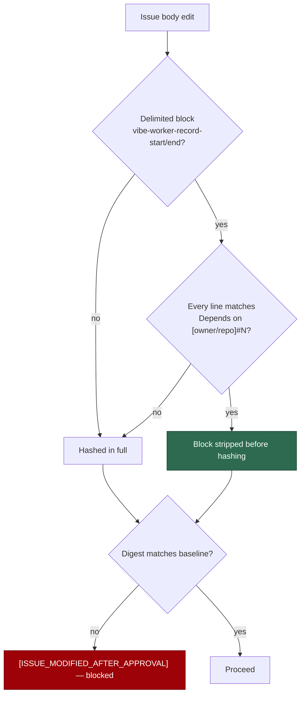

## Summary

The worker's deferral bookkeeping write appended `Depends on owner/repo#N` to
an approved issue body, and the content-approval gate read the fleet's own
routine write as *content changed after approval*. PR #1567 capped the
resulting escalation to one comment per edit; the collision itself remained.

This takes option **(1)** from the issue — scope the exemption to the **edit**,
not the author. The deferral now writes its line inside a delimited,
machine-owned block, and the gate strips that block (and the exact separator
written with it) before hashing. Exempting the worker's *login* was rejected
for the reason the issue gives: a compromised agent runs as exactly that login.

Closes #1631.

## Evidence

Backend/CLI change — no web interface to screenshot. Verified by tests:

- `worker/deno/tests/content_approval_deferral_edit_test.ts` drives the real
  `deferBlockedIssue` against a real approval store, so the fix is exercised
  end to end rather than at the string level.
- `./quality.sh` PASSED after the final edit (config integration skipped: no
  `.config.json` in the container).

Why this keeps the gate author-blind:

Nothing in the decision reads an author, so a compromised agent gains nothing:
the only text that can ever be hidden from the digest is a dependency line,
whose sole effect is to make the dependency gate **skip** the issue — a denial,
never a path to processing unapproved content.

## Test Plan

Added `worker/deno/tests/content_approval_deferral_edit_test.ts` (5 tests):

- **a deferral body edit leaves the baseline verified** — the regression test.
  Observed **failing** against the unfixed code (`changed`) and passing after
  the fix.
- a second deferral extends the same block and still verifies (also red before
  the fix).
- an edit outside the block is still reported `changed`.
- prose smuggled inside the delimiters is still reported `changed`.
- an unterminated block is not exempt.

Added `worker/deno/tests/worker_record_block_test.ts` (9 tests): stripping is
the byte-exact inverse of writing (so a baseline captured before any block
existed still verifies), the dependency gate still parses the recorded line,
upsert de-duplicates and never writes into a hand-written block, only the
`Depends on [owner/repo]#N` grammar is machine-owned, and CRLF bodies strip
cleanly.

Also updated: `SECURITY.md`, `DESIGN-PRINCIPLES.md` and
`docs/workflows/issue-processing.md` describe the edit-scoped exemption, and
`docs/audits/security-sweep-1631-worker-record-block.md` (slice 12h in
`docs/audits/lib-sweep-coverage.json`) is the security sweep of the new module.
