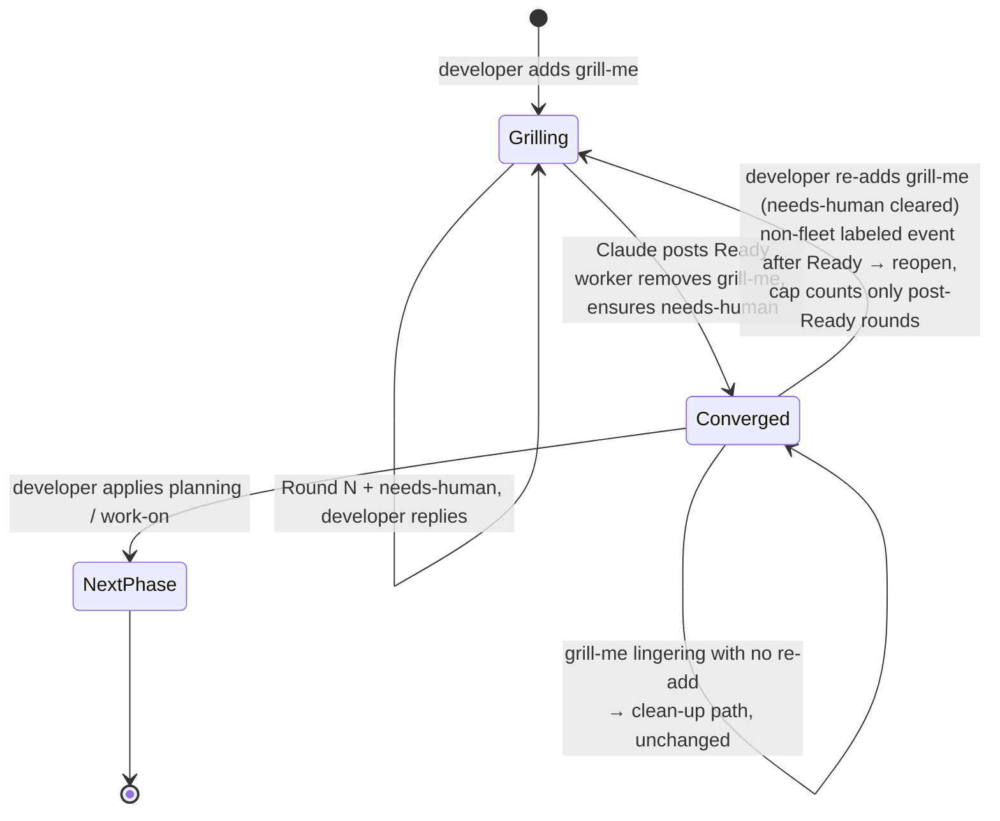

## Summary

Two worker defects left issues stuck on `needs-human` after a developer had
re-labelled them. Both are fixed here. Closes #1634.

**1. A Ready comment permanently ended grilling.** Once
`## Grill-Me — Ready for Next Phase` existed, every later `grill-me` re-add was
skipped as "Ready already posted": the worker stripped `grill-me` back off and
re-applied `needs-human`, so grilling could never be reopened
(GRQ-AutoTrader#13 flipped back at 04:40 and 07:43 UTC after re-adds at 04:10
and 07:24). The processor now reads the issue timeline for the newest
`labeled grill-me` event; when a non-fleet actor applied it after the latest
Ready comment, grilling reopens and the next round is posted. Without such an
event — or when the timeline cannot be read — the clean-up path runs exactly as
before, with a warning.

**2. The blocked-deferral parser recorded the wrong issue.** It took the first
issue reference anywhere in the `## Blocked:` section, so a run whose prose
named the *cause* (#588) and whose closing line declared the *dependency*
(`Depends on #591`) was deferred on #588 — observed on NEAT-AI-core#592. The
parser now prefers the reference on a `Depends on` / `Blocked by` line, falling
back to the first reference only when the run declares none.

Supporting changes the reopen requires:

- The safety cap counts only rounds posted since the latest Ready comment
  (`countGrillMeRoundsSince`), so a reopened grilling gets the full
  `maxGrillMeRounds` again. The round heading still continues the issue-wide
  numbering.
- "A Ready marker was posted" becomes a **count** comparison at the race guard
  and the post-Claude convergence check, so the inherited Ready comment is not
  mistaken for a fresh convergence — which would otherwise strip `grill-me`
  the moment Round N+1 was posted.
- The awaiting-reply gate (Issue #1876) re-arms as soon as the reopened
  grilling posts its own round: a re-add buys one round, not an unanswered run
  to the cap.
- The reopen lookup uses the **exhaustive** `getLabelLastAddInfoComplete`, not
  the page-1 `getLabelLastAddInfo`. A page-1 read returns the *oldest* 100
  timeline events, so on the long grillings this feature targets the
  developer's fresh re-add falls outside the slice and the bug survives.

## Evidence

Backend/CLI change — no web interface to screenshot. Verified by test:
`deno test tests/grill_me_processor_test.ts tests/blocked_outcome_test.ts` →
**130 passed, 0 failed**. Full gate: `./quality.sh` → **PASSED** (config
integration skipped, as it is on this host).

## Reproduction

- **symptom** — after a developer re-added `grill-me` to an issue carrying a
  Ready comment, the worker removed the label again and re-applied
  `needs-human`, so grilling could never be reopened; separately, a blocked run
  declaring `Depends on #591` had `Depends on #588` written into the issue body
- **status** — `verified` — each regression test was observed failing against
  the unfixed code and passing after the fix. The three `blocked_outcome` tests
  go red with `lib/blocked_outcome.ts` reverted to `origin/main`; the reopen and
  cap tests go red with the `!reopened` gate and the `countGrillMeRoundsSince`
  cap disabled respectively (each verified in isolation, so neither test passes
  for the other's reason)
- **regression test** —
  `worker/deno/tests/grill_me_processor_test.ts::processGrillMe - a developer's grill-me re-add after Ready starts a fresh round (Issue #1634)`
  and
  `worker/deno/tests/blocked_outcome_test.ts::detectBlockedOutcome prefers the reference on the Depends on line`

## Acceptance Criteria

<!-- vibe-spec-review inputs="diff+issue-body" -->

- **partial** — Re-applying `grill-me` to an issue that already has a Ready
  comment starts a fresh round: the worker invokes Claude, posts
  `## Grill-Me Round N+1` built from the existing Understanding block, and adds
  no `needs-human` — evidence: `worker/deno/lib/grill_me_processor.ts:1122`,
  `prompts/grill-me/prompt.md:35`,
  `worker/deno/tests/grill_me_processor_test.ts::processGrillMe - a developer's grill-me re-add after Ready starts a fresh round (Issue #1634)`
  — reviewer: partial — reason: the reopen and the round are implemented, but
  the "adds no `needs-human`" clause is a deliberate departure. The issue's
  settled fact "the round itself never touches `needs-human`" does not hold in
  this codebase — step 9 has added it after every round since #1693/#2209 — and
  suppressing it would not stick: the awaiting-reply branch re-adds it on the
  very next scan, so the round would lose its turn signal and gain a churn
  cycle. A reopened round is a round like any other. The *reopen path itself*
  adds no `needs-human` and removes no `grill-me`, which is the defect the
  issue reported.
- **met** — A reopen is recognised only when the timeline holds a
  `labeled grill-me` event whose actor is not a fleet identity and whose
  timestamp is later than the latest Ready comment; without one the clean-up
  path runs unchanged, and a timeline lookup failure also takes the clean-up
  path and logs a warning — evidence:
  `worker/deno/lib/grill_me_processor.ts:790` (`isNonWorkerLabelAddAfter`),
  `:1144` and `:1168` (both warnings),
  `worker/deno/tests/grill_me_processor_test.ts::processGrillMe - a lingering grill-me with no re-add still takes the clean-up path (Issue #1634)`
  — reviewer: met
- **met** — After a reopen the safety cap counts only rounds posted after the
  latest Ready comment, so a reopened grilling gets the full
  `maxGrillMeRounds` again; the posted round heading still continues the
  issue-wide numbering — evidence:
  `worker/deno/lib/grill_me_processor.ts:594` (`countGrillMeRoundsSince`),
  `worker/deno/tests/grill_me_processor_test.ts::processGrillMe - the safety cap counts only post-Ready rounds (Issue #1634)`
  — reviewer: met
- **met** — The blocked-deferral parser records the reference on a
  `Depends on` / `Blocked by` line inside the section, falling back to the
  first reference only when no such line exists; a section mentioning #588 in
  prose and ending `Depends on #591` writes `Depends on #591` — evidence:
  `worker/deno/lib/blocked_outcome.ts:67`, `:168`, `:230`,
  `worker/deno/tests/blocked_outcome_test.ts::detectBlockedOutcome prefers the reference on the Depends on line`
  — reviewer: met
- **partial** — Regression tests: reopen-invokes-Claude, lingering-clean-up,
  post-Ready cap, and prose-then-`Depends on` → #591 — evidence: all four
  present in
  `worker/deno/tests/grill_me_processor_test.ts` and
  `worker/deno/tests/blocked_outcome_test.ts` — reviewer: partial — reason: the
  reopen test cannot assert "no `needs-human` added" because that behaviour is
  the documented departure above; it asserts instead that `grill-me` survives,
  `labelsSwapped` is false, and the Ready clean-up escalation never posts.
- **met** — Docs updated in the same change: `docs/workflows/grill-me.md`,
  `docs/workflows/label-flows.md`, `prompts/grill-me/prompt.md` say that
  re-adding `grill-me` (with `needs-human` cleared) reopens grilling and resets
  the cap — evidence: `docs/workflows/grill-me.md:454`,
  `docs/workflows/label-flows.md:51`, `prompts/grill-me/prompt.md:35` —
  reviewer: met
- **unrequested** — The prompt and the run summary are shown the cap in the
  same scale as the round number (`effectiveMaxRounds`), so a reopened grilling
  reads `Round cap: 6` / `Round 4/6` rather than `Round 4/3` — evidence:
  `worker/deno/lib/grill_me_processor.ts:1578`, `:1991` — reviewer: unrequested
  — reason: the prompt decides when to converge with
  `ROUND_NUMBER >= MAX_ROUNDS`. Left in the configured scale, the first
  reopened round already reads as "out of budget" and converges immediately,
  which would defeat the cap reset the issue asked for.
- **unrequested** — The awaiting-reply gate re-arms once the reopened grilling
  posts its own round (`reopenSupersedesLatestRound`, `laterTimestamp`) —
  evidence: `worker/deno/lib/grill_me_processor.ts:698`, `:1292`,
  `worker/deno/tests/grill_me_processor_test.ts::processGrillMe - a reopened grilling still waits for the developer's reply (Issue #1634)`
  — reviewer: unrequested — reason: without it the reopen bypasses the Issue
  #1876 loop protection for the whole reopened grilling, so this change would
  have introduced a new defect while fixing the reported one.
- **unrequested** — `docs/INTERNALS.md` updated alongside the three doc files
  the issue named — evidence: `docs/INTERNALS.md:1310` — reason: it stated that
  `hasReadyMarkerBeenPosted` decides the Ready path, which this change makes
  conditional; a code change owes a docs change on every surface that names the
  behaviour.
- **unrequested** — Four extra `blocked_outcome` tests beyond the one specified
  (cross-repo declaration, `Blocked by` variant, no-declaration fallback,
  declaration naming only itself) — evidence:
  `worker/deno/tests/blocked_outcome_test.ts` — reviewer: unrequested — reason:
  the new precedence rule has four reachable branches; the specified test covers
  one of them.
- **unrequested** — Behaviour-neutral refactors: one `carriesRoundMarker`
  predicate behind the three round scanners, `hasReadyMarkerBeenPosted`
  delegating to `countReadyMarkers`, and the `fleetLogins` hoist shared with the
  Issue #1878 call site — evidence:
  `worker/deno/lib/grill_me_processor.ts:322`, `:530`, `:1127` — reviewer:
  unrequested — reason: this change added a third Ready scanner and a second
  fleet-login resolution; folding them into one each keeps the drift-prone
  duplication from growing.

## Standards Review

<!-- vibe-standards-review inputs="diff+CODING-STANDARDS.md" -->

- **violation** — Smaller-files preference (CODING-STANDARDS.md:30-32):
  `grill_me_processor.ts` grew 1795 → 2064 lines with no module split, and the
  marker scanners and label predicates are self-contained pure functions —
  evidence: `worker/deno/lib/grill_me_processor.ts:304`, `:698` — reason:
  stands. Splitting the processor is a separate refactor touching every
  importer and the command re-exports; doing it inside a bug fix would bury the
  behavioural change. Two in-file helpers (`carriesRoundMarker`,
  `laterTimestamp`) were extracted to keep the added code from compounding it.
- **violation** — Page-1 timeline read used for a decision the worker mutates
  on (fail-loud, CODING-STANDARDS.md:52-56): a truncated page reads identically
  to "nobody reopened" — evidence:
  `worker/deno/lib/grill_me_processor.ts:1138` — reason: fixed in this diff.
  Switched to the exhaustive `getLabelLastAddInfoComplete`, the variant
  documented for callers that mutate on the answer, with a regression test
  driving a two-page timeline.
- **violation** — Documented edge branches and the `{{MAX_ROUNDS}}`
  substitution untested (CODING-STANDARDS.md:185-188) — evidence:
  `worker/deno/tests/grill_me_processor_test.ts:3858`, `:3922`, `:4200` —
  reason: fixed in this diff. Added the unparseable-timestamp cases for
  `countGrillMeRoundsSince` and `isNonWorkerLabelAddAfter`, and the cap test
  now asserts the rendered prompt and the run summary.
- **violation** — Doc inaccuracies introduced or left by this change
  (CODING-STANDARDS.md:576-582): "Two details worth knowing" introducing three
  bullets, and `docs/INTERNALS.md` still naming `hasReadyMarkerBeenPosted` as
  the Ready-path decider — evidence: `docs/workflows/grill-me.md:464`,
  `docs/INTERNALS.md:1310` — reason: both fixed in this diff.
- **violation** — DRY (CODING-STANDARDS.md:28): three Ready-marker scanners and
  a duplicated round-marker predicate — evidence:
  `worker/deno/lib/grill_me_processor.ts:530`, `:322` — reason: fixed in this
  diff; one predicate now backs all three round scanners and
  `hasReadyMarkerBeenPosted` delegates to `countReadyMarkers`.
- **clean** — Australian English throughout the new code, comments and docs
  (the only US-shaped tokens are the backticked GitHub event name `labeled` and
  Mermaid's `color:` property); Deno-native tooling only, `deno fmt`/`lint`/
  `check` and `check:manifests` clean; every new test behavioural — real
  functions, injected timeline JSON and comments, no source grepping, no sleeps,
  no wall-clock thresholds, parallel-safe; fail-loud error handling — the
  timeline `try/catch` warns and falls back to the pre-existing clean-up path,
  and the `addInfo === null` case is logged separately, with no swallowed
  exception; commit safety — no hidden or credential-shaped path staged, no
  `git add -f`, no `--no-verify`, every commit carrying `Issue #1634` and a
  `Vibe-Coder-Run-Id` trailer; secure coding — `semgrep` clean, both regexes
  line-anchored with no nested quantifiers, all new log output routed through
  `redactSecrets`, and the reopen actor classified with `isFleetAuthor` behind
  the discovery-time allowlist for `grill-me`.

## Test Plan

`worker/deno/tests/grill_me_processor_test.ts` — added:

- `countReadyMarkers`, `findLatestReadyMarkerTimestamp`,
  `countGrillMeRoundsSince` (including unparseable cutoff and unparseable
  comment timestamp) and `isNonWorkerLabelAddAfter` (developer re-add, fleet
  re-add, pre-Ready add, unparseable timestamp, null inputs) — unit coverage
  for every branch of the new helpers.
- `processGrillMe - a developer's grill-me re-add after Ready starts a fresh
  round (Issue #1634)` — the reported failure: Claude is invoked, Round N+1 is
  posted, `grill-me` survives and the Ready clean-up escalation never runs.
- `processGrillMe - a lingering grill-me with no re-add still takes the
  clean-up path (Issue #1634)` — the unchanged path.
- `processGrillMe - the safety cap counts only post-Ready rounds (Issue #1634)`
  — cap 3 with three pre-Ready rounds still grills, heading continues at
  Round 4, and the prompt and summary carry the reset cap.
- `processGrillMe - a reopened grilling still waits for the developer's reply
  (Issue #1634)` — the re-add buys one round, not a run to the cap.
- `processGrillMe - the reopen survives a timeline longer than one page
  (Issue #1634)` — a full page 1 of noise ending in the stale pre-Ready add,
  with the real re-add on page 2.

`worker/deno/tests/blocked_outcome_test.ts` — added the prose-then-
`Depends on` case returning #591, plus the cross-repo declaration, the
`Blocked by` spelling, the no-declaration fallback, and a declaration naming
only the issue being worked.
