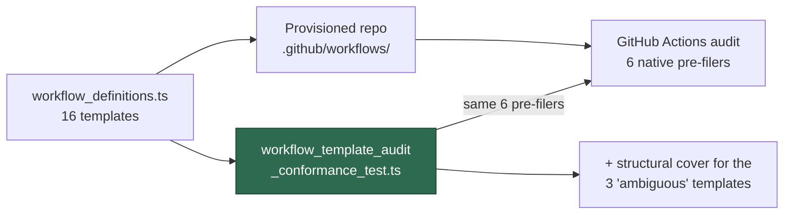

## Summary

The workflows the Vibe Coder provisions into monitored repositories were
immediately flagged by its **own** GitHub Actions audit, so a freshly set-up
repo accrued a pile of audit issues against YAML the fleet itself had written.
Only the gitleaks template (Issue #594) had ever been shaped to the audit's
bar.

Every template in `worker/deno/lib/workflow_definitions.ts` is now hardened to
that bar, and a conformance test runs the audit's own native pre-filers over
the rendered templates so the two cannot drift apart. Closes #1639.

What changed in each emitted template:

- `pull_request` targets listed explicitly as `[Develop, main, milestone/*]` —
  a GitHub `*` never matches a `/`, so the old `["*"]` silently skipped every
  `milestone/<slug>` PR, the dominant merge path in this fleet.
- `persist-credentials: false` on every read-only `actions/checkout`. The two
  dependency-update templates keep the credential, with an inline comment,
  because `peter-evans/create-pull-request` pushes with it.
- A `concurrency:` group of `${{ github.workflow }}-${{ github.ref }}` with
  `cancel-in-progress: true` (audit check #4).
- `timeout-minutes:` on every job — 10 for scan/quality, 20 for the
  dependency-update jobs that open a PR (audit check #5).
- The markdown-lint template installs `markdownlint-cli2@0.23.2` with
  `--ignore-scripts` and drops its `push:` trigger.

The three shared rules are also added to the "CI Hardening Defaults" in
`prompts/workflow_setup/prompt.md`, the second (agent-driven) provisioning
path, so both paths emit the same shape.

Existing repositories are **not** retrofitted here — per repository isolation,
the audit's per-repo issues remain the fix path for already-provisioned
workflows.

## Evidence

Backend/CLI change with no web interface, so no screenshot applies. The
evidence is the conformance test running the audit's real scanners over the
real templates.



Before the template changes, the new test went red with the exact findings the
audit would have filed against a freshly provisioned repo — 10
`BP-PERSIST-CREDS-*`, 7 `BP-MILESTONE-FILTER-*`, 1 `BP-CI-INSTALL-PIN-npm-…`
and 1 `BP-TRIGGER-markdown-lint`. After the changes all twelve tests pass:

```text
ok | 12 passed | 0 failed (23ms)
```

The green is not vacuous. Reverting only the shellcheck template to
`branches: ["*"]` plus a `push:` trigger turns the two structural tests red
(`10 passed | 2 failed`), and the tree was restored clean afterwards.

Full gate: `./quality.sh` → `Result: PASSED (with skipped checks)` (the
`config integration` skip is pre-existing and environmental).

## Acceptance Criteria

<!-- vibe-spec-review inputs="diff+issue-body" -->

The issue states its criteria under "Accepted scope so far" rather than an
`## Acceptance Criteria` heading; they are answered here as criteria.

- **met** — all templates hardened, gitleaks re-checked not rewritten — evidence: `worker/deno/lib/workflow_definitions.ts` (gitleaks spec untouched by the diff, and included in the conformance inputs) — reviewer: met — reason: the reviewer noted the catalogue holds 15 specs, not 16; the issue miscounted (4 universal + 3 Rust + 2 Deno + 3 Node + 2 Java + 1 Bash), of which 13 are workflows and 2 are Dependabot configs
- **met** — every `pull_request` template lists `[Develop, main, milestone/*]` — evidence: `worker/deno/lib/workflow_definitions.ts:41`, `workflow_template_audit_conformance_test.ts::no pull_request branch filter skips milestone PRs` — reviewer: met
- **met** — credential persistence disabled on every checkout that does not push — evidence: `worker/deno/lib/workflow_definitions.ts:77-81`; the two `create-pull-request` jobs keep it with a comment — reviewer: met
- **met** — `concurrency:` group and per-job `timeout-minutes` (10/20) — evidence: `worker/deno/lib/workflow_definitions.ts:48-67`, `workflow_template_audit_conformance_test.ts::every job declares its category's timeout-minutes` — reviewer: met
- **met** — markdown-lint pins `markdownlint-cli2` and drops `push:` — evidence: `worker/deno/lib/workflow_definitions.ts:90`, `workflow_template_audit_conformance_test.ts::the markdownlint-cli2 pin matches the fleet's pin` — reviewer: met
- **met** — conformance test runs the six pre-filers over every rendered template, no per-template hand assertions — evidence: `worker/deno/tests/workflow_template_audit_conformance_test.ts` — reviewer: partial — reason: the reviewer proved that `scanMilestoneBranchFilters` and `scanWorkflowTriggers` only act on `test`/`high` workflows, so dependency-review, java-dependency-check and shellcheck escaped them; commit `6d1e925` adds catalogue-wide structural cover for both rules (still loops, not per-template expectations) and the same mutation now fails the suite
- **met** — the `workflow_setup` prompt gains the same rules — evidence: `prompts/workflow_setup/prompt.md` items 9–11 — reviewer: met
- **met** — existing repositories are not retrofitted — evidence: the diff touches only templates, the prompt, docs and tests; no cross-repo mechanism — reviewer: met
- **unrequested** — `--ignore-scripts` on the markdownlint install — evidence: `worker/deno/lib/workflow_definitions.ts` markdown-lint template — reviewer: unrequested — reason: the issue asked only for a version pin; kept because it matches this repo's own `.github/workflows/markdown-lint.yml`, so the emitted template and the reference workflow stay identical
- **unrequested** — the `docs/EXTENDING.md` section and Mermaid diagram — evidence: `docs/EXTENDING.md` — reviewer: unrequested — reason: required by the standards' "a code change owes a docs change" rule; the file already documented the markdown-lint trigger this change removed
- **unrequested** — the "non-workflow specs are exactly the Dependabot configs" guard test and the `markdownlint-cli2` pin-match test — evidence: `worker/deno/tests/workflow_template_audit_conformance_test.ts` — reviewer: unrequested — reason: the first stops a future `jobs:`-less spec silently escaping all six scans; the second was added after the Standards reviewer flagged the new version constant as an unenforced fourth copy

Two consequences of the mandated shape, recorded rather than changed: a
monitored repo whose default branch is neither `Develop` nor `main` (e.g.
`master`) now gets no PR gating from these templates, and
`cancel-in-progress: true` applies to the scheduled dependency-update
workflows too. Both follow directly from the accepted scope.

## Standards Review

<!-- vibe-standards-review inputs="diff+CODING-STANDARDS.md" -->

- **violation** — no `docs/archive/pr-summaries/pr-summary-1639.md` — evidence: `docs/archive/pr-summaries/` — reason: fixed here; this file is the summary
- **violation** — `MARKDOWNLINT_CLI2_VERSION` is a fourth copy of a version held in `container/tools.json`, this repo's own workflow and the dependency inventory, guarded only by a comment — evidence: `worker/deno/lib/workflow_definitions.ts:90` — reason: fixed in `6d1e925` — a test now asserts the emitted pin equals the `container/tools.json` pin, so drift fails the gate
- **violation** — new prompt items 9 and 10 repeated, near verbatim, rationale prose already in the same file's Gitleaks reference section — evidence: `prompts/workflow_setup/prompt.md:193-205` — reason: fixed in `6d1e925` — both now state the rule and cross-reference the existing explanation
- **violation** — `docs/EXTENDING.md` claimed an exact pin on *every* `run:` install, but `cargo install cargo-audit` / `cargo-edit` are unpinned — evidence: `docs/EXTENDING.md` hardening bullet list — reason: fixed in `6d1e925` — the claim is scoped to the npm/npx/gem installs the pre-filer actually covers. Pinning cargo installs is outside this issue and no scanner covers it
- **violation** — `docs/EXTENDING.md` said "the same three rules" under a five-bullet list — evidence: `docs/EXTENDING.md` closing paragraph — reason: fixed in `6d1e925` — the sentence now names the rules the prompt actually gained
- **violation** — the first commit subject carried the issue number only in the body — evidence: commit `e3bb618` — reason: stands; rewriting a pushed commit's history is the more costly option, and the trailer plus `Refs #1639` keep it traceable. The follow-up commit `6d1e925` carries `(Issue #1639)` in the subject
- **clean** — Australian English throughout; no grep-the-source tests (the conformance test renders real specs into real `WorkflowFile` values and calls the production scanners); the one existing test whose expectation changed was inverted in place with a comment, not deleted; no hidden or credential paths staged; `deno fmt`/`deno lint`/`deno check` and `deno task check:manifests` pass; docs updated alongside the code; the emitted markdown-lint template now matches this repo's own workflow, so no template/own-workflow drift was introduced

## Test Plan

Added `worker/deno/tests/workflow_template_audit_conformance_test.ts` — 12
tests, all looping over the whole `WORKFLOW_SPECS` catalogue:

- six tests running the audit's native pre-filers over every rendered
  template: `scanCheckoutPersistCredentials`, `scanMilestoneBranchFilters`,
  `scanActionPins`, `scanCiInstallPins`, `scanWorkflowPermissions`,
  `scanWorkflowTriggers` (the last against both `Develop` and `main` as the
  default branch);
- `the non-workflow specs are exactly the Dependabot configs` — a new
  `jobs:`-less spec cannot silently escape those six;
- `the markdownlint-cli2 pin matches the fleet's pin` — ties the emitted pin
  to `container/tools.json`;
- `every pull_request filter covers milestone branches` and
  `no template triggers on push` — catalogue-wide cover for the three
  templates the classifier rates `ambiguous`, which two of the pre-filers
  skip;
- `every workflow declares a cancelling concurrency group` and
  `every job declares its category's timeout-minutes` — audit checks #4 and
  #5, which have no native pre-filer.

Modified `worker/deno/tests/workflow_definitions_test.ts` — the assertion that
the markdown-lint spec triggers on `push` is **inverted, not removed**, with an
in-place comment recording the deliberate behaviour change. Dropping the
post-merge re-run of a required check is the point of the fix, so the old
expectation is now the regression.

Unchanged and still passing: `worker/deno/tests/gitleaks_template_conformance_test.ts`
(8 tests) confirms the gitleaks template was re-checked, not rewritten.
