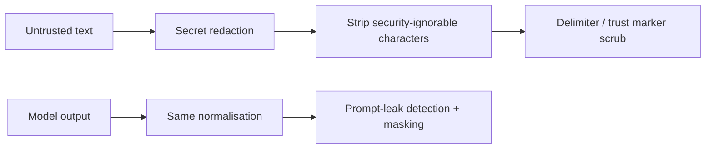

# PR summary — Issue #1649

## Summary

Close the zero-width/format-character bypass in the prompt trust-boundary
scrubber and prompt-leak backstop.

Untrusted GitHub text could interleave invisible Unicode format characters such
as U+200B ZERO WIDTH SPACE through `BOUNDARY_`, `[TRUSTED]` or `author=`. The
literal marker regexes then saw different byte sequences and left the forged
trust vocabulary intact.

This change introduces one shared normalisation helper that removes Unicode
format characters, Unicode line/paragraph separators, and non-document control
characters while preserving tab, CR and LF. Both inbound prompt sanitisation
and outbound prompt-leak detection/redaction use that same canonical form.

## Security properties

- Zero-width-interleaved `BOUNDARY_`, `TRUSTED` and `author=` forms are reduced
  to their canonical ASCII form before the existing scrub rules run.
- The prompt-leak detector sees the same canonical form, so a leaked boundary
  marker cannot evade detection with the same technique.
- Ordinary tab and CR/LF document structure is preserved.
- No trust-marker rule is relaxed; this is preprocessing before the existing
  rules.

## Tests

Added `worker/deno/tests/prompt_zero_width_security_test.ts` covering:

- zero-width-interleaved boundary, trust label and author-tag forgeries;
- prompt-leak detection/redaction of a zero-width-obfuscated boundary marker;
- preservation of tab/CR/LF document structure;
- Unicode line/paragraph separators embedded inside marker vocabulary.

Local gate on the CI-fix commit: `deno task test` on the #1649 regressions
and sweep-coverage tests, `deno task lint`, `deno task check`, and
`deno task check:manifests`.
