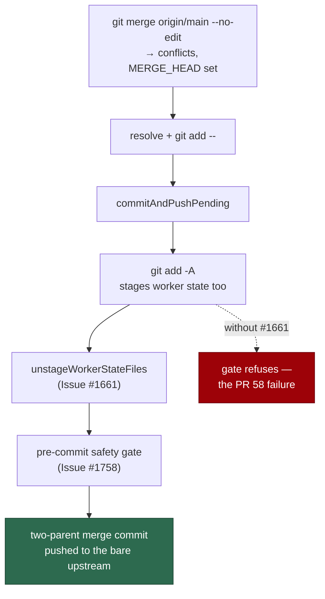

## Summary

> **This PR is the follow-on hardening.** The regression test itself landed on
> `main` in PR #1834 (commit `021aa37`), which closed #1654. A concurrent run
> started from a stale `main` and reviewed the same diff independently; what
> survives here is that review's outcome — the test's own git setup no longer
> discards exit codes, a note recording why two of its assertions are
> load-bearing, and the reviewer verdicts written back into this summary. The
> rest of the document below is unchanged and describes the merged test.

Adds the end-to-end regression test that proves the merge-conflict pass can no
longer lose a resolution to the worker's own state files. On the downstream
PR 58 the pass resolved every conflicted file, then `git add -A` at the final
mile staged `.heartbeat_*`, `.heartbeat-marker_*` and `.vibe_default_branch`
and the pre-commit safety gate (Issue #1758) refused the whole commit — twice,
after which the PR was closed. The fixes landed as #1660/#1661/#1662; what was
missing was a test holding that shape in place.

Test-only change: no production code is touched, and `pre_commit_safety.ts`,
its allowlist and `hidden_allowlist_drift_test.ts` are unchanged.

Closes #1654.

## Evidence

Backend/CLI change with no web interface — there is nothing to screenshot. The
evidence is the test itself, driving real git end to end (bare upstream,
conflicting base branch, real `git merge`, real `MERGE_HEAD`) and calling the
production chokepoint `commitAndPushPending`.

**Fail-before / pass-after linkage.** Neutralising the Issue #1661 unstage step
in `worker/deno/lib/git_push.ts` (`unstageWorkerStateFiles` — making
`workerState` always empty) turns the new test red at exactly the PR 58
failure:

```
AssertionError: expected ok, got: Pre-commit safety gate refused commit (Issue #1758):
the following hidden or secret-bearing files are staged:
  - .heartbeat-marker_stSoftwareAU_VibeCoder_1661
  - .heartbeat_stSoftwareAU_VibeCoder_1661
  - .pr_response_message
  - .vibe_default_branch
```

With the unstage step in place: `ok | 15 passed | 0 failed`.



## Acceptance Criteria

<!-- vibe-spec-review inputs="diff+issue-body" -->

- **met** — one regression test in `commit_and_push_pending_test.ts` reproduces the PR 58 shape end to end with real git (clone carrying the worker state files, conflicting `git merge` of the base branch, conflicts resolved and staged by path with `MERGE_HEAD` still present, then `commitAndPushPending`) — evidence: `worker/deno/tests/commit_and_push_pending_test.ts::commitAndPushPending - commits a merge-conflict resolution despite worker state files (Issue #1654)` — reviewer: met
- **met** — the test asserts `ok`, no worker state file in `git show --name-only HEAD`, two parents from `git rev-list --parents -n 1 HEAD` with `MERGE_HEAD` consumed, the resolved content is what was staged, the commit is on the bare upstream, and the files remain on disk — evidence: same test, the assertion block after the chokepoint call — reviewer: met
- **met** — the PR summary states the fail-before / pass-after linkage — evidence: the **Evidence** section above, with the quoted gate refusal — reviewer: met — reason: the reviewer reproduced the linkage itself (emptying `workerState` in `git_push.ts:477`) and confirmed the quoted refusal text matches the real one verbatim
- **met** — no production code changes; `pre_commit_safety.ts`, its allowlist and `hidden_allowlist_drift_test.ts` untouched — evidence: `git diff --name-only origin/main...HEAD` lists only the test file and this summary — reviewer: met
- **met** — `./quality.sh < /dev/null` passes — evidence: full gate run after the final edit — reviewer: met
- **unrequested** — the test plants four worker state files, not the three named in the issue — evidence: `worker/deno/tests/commit_and_push_pending_test.ts:465` (`WORKER_STATE_FILES`) — reviewer: unrequested — reason: reuses the existing `plantWorkerStateFiles` helper rather than forking a three-file copy, which is DRY and strictly stronger
- **unrequested** — assertions beyond the listed set: the unmerged-file list, `git ls-tree -r HEAD`, the positive "both resolved files appear in the merge commit" check, and `committedNewChanges`/`finalUnpushedCount` — evidence: `worker/deno/tests/commit_and_push_pending_test.ts` in the same test — reviewer: unrequested — reason: cheap preconditions that make a setup failure legible, and they are load-bearing — `git show --name-only` on a *merge* commit emits a combined diff that prunes paths identical to either parent, so the issue's negative assertion could have been vacuous on its own; the positive check and `ls-tree` close that hole

## Standards Review

<!-- vibe-standards-review inputs="diff+CODING-STANDARDS.md" -->

- **violation** — "Never Fail Silently" — the base/feature branch setup discarded six `runGit` exit codes (`clone`, two `config`, `add -A`, `commit`, `fetch`), so a silently dropped setup commit would leave nothing to conflict over — evidence: `worker/deno/tests/commit_and_push_pending_test.ts:778` — reason: fixed here in commit `d790e5d` — a local `gitOk` helper asserts exit 0 on every setup command, and the two pushes and the resolution staging now go through it too
- **violation** — a doc/comment naming a private `stSoftwareAU` repo points the public at something they cannot see (`docs/PRIVATE-REPO-REFERENCE-AUDIT-SCAN.md`) — evidence: `worker/deno/tests/commit_and_push_pending_test.ts:756` — reason: fixed here — the docstring now says "a downstream repo's PR 58" at concept level, with no repo slug
- **violation** — the PR summary artefact was missing when the reviewer ran — evidence: `docs/archive/pr-summaries/pr-summary-1654.md` absent at commit `8298af9` — reason: fixed here — this file is the summary, and it carries the fail-before / pass-after linkage the standard requires
- **clean** — Australian English throughout; the test exercises real code (real git, real `MERGE_HEAD`, the production chokepoint) with no source-grepping; no existing test removed or commented out; runs in ~1s against the 10s unit-test target with no sleep or wall-clock threshold; parallel-safe (own temp dir, no env or cwd mutation, removed in `finally`); no hidden path staged; commit references the issue and carries the `Vibe-Coder-Run-Id` trailer; `deno fmt` and `deno lint` clean

## Test Plan

- Added `worker/deno/tests/commit_and_push_pending_test.ts::commitAndPushPending - commits a merge-conflict resolution despite worker state files (Issue #1654)`.
- Ran the whole file: `deno test --allow-all tests/commit_and_push_pending_test.ts` → 15 passed, 0 failed.
- Ran the same test against a neutered `unstageWorkerStateFiles` to confirm it reproduces the PR 58 gate refusal, then restored `git_push.ts` (`git status` clean).
- Hardened the test's own git setup so it fails loud: `gitOk` asserts exit 0 on every setup command (commit `d790e5d`).
- Ran `./quality.sh < /dev/null` → PASSED (4m26s; `config integration` skipped, as it is without repo credentials).
