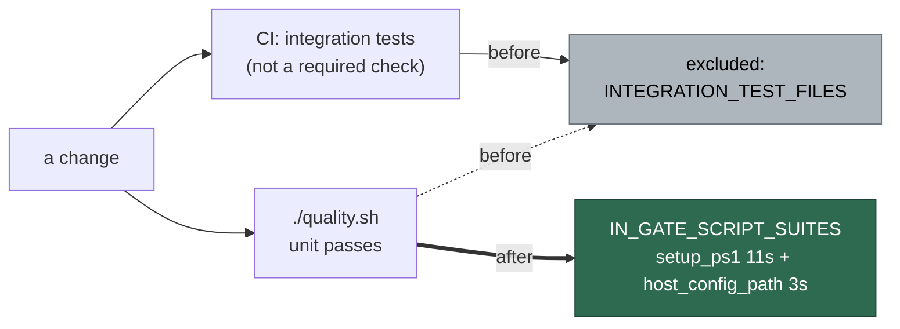

# Issue #1656 — setup_ps1_test.ts stops inheriting the ambient CONFIG_PATH

## Summary

Two cases in `worker/deno/tests/setup_ps1_test.ts` spawned `setup.ps1` with
`env: { ...Deno.env.toObject(), CONFIG_FILE: configPath }`. The container
exports `CONFIG_PATH=/home/vibe/.vibe-coder/run-config/.config.json`, so the
child saw two config variables naming different files, `setup.ps1:92` rightly
refused the run, and both cases failed inside the image for a reason no change
of their own could affect.

Both now build the child's environment from the repository's existing
allowlist (`buildUntrustedCommandEnv`) and spawn with `clearEnv: true`. The
built environment carries `PATH`, `HOME` and `DENO_DIR` — everything the
`deno run … setup_cli.ts` passthrough needs — and neither `CONFIG_FILE` nor
`CONFIG_PATH` is on the allowlist, so the only config file the child can
resolve is the fixture's.

With the suite green inside the image, both suites move into
`IN_GATE_SCRIPT_SUITES` with a reason and a measured cost:
`tests/setup_ps1_test.ts` (11s) and `tests/host_config_path_test.ts` (3s).
That is the same call Issue #1598 made for the `run.ps1` suites — the
prerequisite (`pwsh` in the image, #1596) is met, the only thing keeping this
one out was the leak fixed here, and what the 14s buys is the Windows
onboarding path (the drift #672 was about) and the `CONFIG_FILE` /
`CONFIG_PATH` rule this bug came from, verified before the push rather than
only in CI's `integration tests` job, which deliberately cannot block a merge.

Closes #1656.

## Evidence

Backend/CLI change — no web interface to screenshot. The evidence is the
suite, run inside the worker container image (PowerShell 7.6.5,
`/usr/local/bin/pwsh`) with `CONFIG_PATH` set in the ambient environment.

Before, on the unfixed code:

```text
$ deno test --no-check --allow-all tests/setup_ps1_test.ts --filter "Issue #672"
FAILED | 1 passed | 2 failed | 23 filtered out (673ms)

error: AssertionError: Values are not equal: Exception: setup.ps1:92
  CONFIG_FILE and CONFIG_PATH are both set and name different files:
  CONFIG_FILE=/tmp/vibe-ps1-repos-c5a12306a4cbf0f5/.config.json,
  CONFIG_PATH=/home/vibe/.vibe-coder/run-config/.config.json.
```

After:

```text
$ deno test --no-check --allow-all tests/setup_ps1_test.ts
ok | 27 passed | 0 failed (11s)

$ deno test --no-check --allow-all tests/host_config_path_test.ts
ok | 10 passed | 0 failed (2s)
```

`./quality.sh` — PASSED (4m30s; `config integration` SKIPPED, as on `main`).

Where the two suites run, before and after:



## Reproduction

- **symptom** — inside the container image, `deno test tests/setup_ps1_test.ts`
  reported `24 passed | 2 failed`: the `-ListRepos` and `-AddRepo` cases died
  on `CONFIG_FILE and CONFIG_PATH are both set and name different files`
- **status** — `verified` — the two cases were observed failing against the
  unfixed code with the image's ambient `CONFIG_PATH` set (output above), and
  passing after the fix in the same environment
- **regression test** —
  `worker/deno/tests/setup_ps1_test.ts::setup.ps1 - -ListRepos ignores the caller's own CONFIG_PATH (Issue #1656)`,
  plus the two pre-existing Issue #672 cases the fix repairs

## Acceptance Criteria

<!-- vibe-spec-review inputs="diff+issue-body" -->

- **met** — `deno test tests/setup_ps1_test.ts` passes inside the container
  image with `CONFIG_PATH` set in the ambient environment — evidence:
  `worker/deno/tests/setup_ps1_test.ts:545` (`setupCliEnv`) and the run above,
  `27 passed | 0 failed` — reviewer: met
- **met** — the placement decision for both suites is recorded in the manifest
  with a reason — evidence:
  `worker/deno/lib/integration_test_manifest.ts` — both removed from
  `INTEGRATION_TEST_FILES` and added to `IN_GATE_SCRIPT_SUITES` with a reason
  and a measured cost (11s / 3s) — reviewer: met
- **unrequested** — prose updated in `CODING-STANDARDS.md`, `CONTRIBUTING.md`,
  `docs/CONTAINER.md`, `lib/container_manifest.ts`, `lib/unit_test_passes.ts`,
  `lib/pr_check_contexts.ts` and two `validate-scripts.yml` comments —
  reviewer: unrequested — reason: each asserted "the `setup.ps1` suites stay
  excluded" or named "the three `run.ps1` suites", which the placement
  decision falsifies; a code change owes the docs change in the same diff
- **unrequested** — the assertion in
  `tests/pwsh_suites_in_the_gate_test.ts` that the manifest names *exactly*
  the `run.ps1` suites, relaxed to two subset checks — reviewer: unrequested —
  reason: an equality assertion no non-`run.ps1` entry can satisfy; the
  replacement keeps both directions (every `run.ps1` suite is named, every
  named file really starts an interpreter)

Departures recorded: the Spec reviewer returned `met` on both criteria and
raised three findings under question 3 rather than downgrading a verdict. All
three are fixed in this diff — the regression case now asserts on the built
environment directly rather than claiming a host-independent guarantee it did
not make, and the two false claims about
`.github/workflows/validate-scripts.yml` still covering PowerShell suites are
corrected (after this change no PowerShell suite is left to CI alone).

## Standards Review

<!-- vibe-standards-review inputs="diff+CODING-STANDARDS.md" -->

- **violation** — no `docs/archive/pr-summaries/pr-summary-1656.md` —
  evidence: `docs/archive/pr-summaries/pr-summary-1656.md` — reason: this
  file; written after the reviewed commit and committed here
- **violation** — hand-wrapped Markdown not matched — evidence:
  `docs/CONTAINER.md:136`, `CONTRIBUTING.md:105` — reason: rewrapped to the
  surrounding ~78-column wrapping in this diff
- **violation** — stale CI comment a code change owes a docs change —
  evidence: `.github/workflows/validate-scripts.yml:482` — reason: the shard
  job's comment claimed no `pwsh` suite runs there; corrected, along with the
  integration job's PowerShell step message, which named suites that no longer
  run in it
- **minor** — a 90-column JSDoc line — evidence:
  `worker/deno/lib/integration_test_manifest.ts:109` — reason: rewrapped
- **clean** — classification machinery matches the `run.ps1` precedent
  (reason + measured cost, removed from the exclusion list); claimed costs
  re-measured in the image; no `Deno.env.set`/`Deno.chdir` added, so both
  suites stay parallel-safe; no test removed or commented out; new assertions
  carry messages naming the offending files; Australian English throughout;
  commit carries the issue reference and the run-id trailer

## Test Plan

- Added
  `worker/deno/tests/setup_ps1_test.ts::setup.ps1 - -ListRepos ignores the caller's own CONFIG_PATH (Issue #1656)`
  — a conflicting `CONFIG_PATH` and a `GH_TOKEN` go into the builder's source;
  neither reaches the child, and the real `-ListRepos` run still lists the
  repository from the fixture config.
- Repaired the two pre-existing cases,
  `setup.ps1 - -ListRepos prints the repositories rather than swallowing them (Issue #672)`
  and
  `setup.ps1 - -AddRepo and -RemoveRepo edit the config and set the exit code (Issue #672)`.
- Relaxed
  `worker/deno/tests/pwsh_suites_in_the_gate_test.ts::pwsh suites - the manifest names every one of them (Issue #1598)`
  from an equality to two subset assertions, so a non-`run.ps1` in-gate suite
  is legal while an unnamed `run.ps1` suite and a phantom entry both still
  fail.
- Ran: the two moved suites, `pwsh_suites_in_the_gate_test.ts`,
  `integration_test_manifest_test.ts`, `test_category_definitions_test.ts`,
  `unit_test_passes_test.ts`, `parallel_safety_cap_test.ts`,
  `container_manifest_test.ts`, `pr_check_contexts_test.ts` — all green — and
  the full `./quality.sh`.
