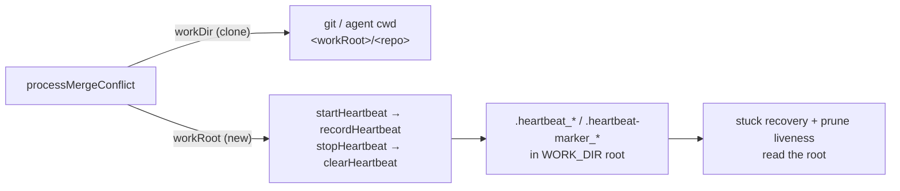

# Merge-conflict pass records its heartbeat in the work root

## Summary

The merge-conflict pass handed `startHeartbeat` the **clone** it resolves the
conflict in, so `.heartbeat_<repo>_<pr>` and `.heartbeat-marker_<repo>_<pr>`
were written into that checkout — dirtying the tree the merge is about to push
and hiding the PR's heartbeat from stuck recovery and the prune liveness check,
both of which read the `WORK_DIR` root.

`MergeConflictProcessorDeps` now carries a required `workRoot: string`,
documented as the `WORK_DIR` root where heartbeat and marker state live — never
a clone — and that is what `startHeartbeat` receives. `workDir` keeps meaning
the clone for every git and agent `cwd`. The root is passed explicitly rather
than derived from `dirname(workDir)`, because a lane worktree sits at
`<workRoot>/worktrees/<lane>/<repo>` where `dirname` names the lane.
`stopHeartbeat` reuses the same options object, so the final `clearHeartbeat`
follows the root too.

Closes #1660.

## Evidence

Backend change with no web interface to screenshot. Evidence is the test run:

- `deno test worker/deno/tests/pr_merge_conflict_processor_test.ts` — 33 passed.
- `deno test worker/deno/tests/merge_conflict_intent_processor_test.ts` plus the
  above — 47 passed.
- `./quality.sh < /dev/null` — `Result: PASSED (with skipped checks)`; the one
  skip is the pre-existing `config integration` check, which needs a live
  config.

## Reproduction

- **symptom** — a merge-conflict run wrote `.heartbeat_*` and
  `.heartbeat-marker_*` into the repo clone instead of the work root, dirtying
  the tree and leaving the PR heartbeat invisible to the readers of the root
- **status** — `verified` — with the processor still passing
  `processorDeps.workDir`, the new test failed with
  `Actual ["/tmp/vibe-merge-conflict-…"] / Expected ["/tmp/vibe-work-root-…"]`;
  after pointing `startHeartbeat` at `processorDeps.workRoot` it passes
- **regression test** —
  `worker/deno/tests/pr_merge_conflict_processor_test.ts::processMergeConflict - the heartbeat state lands in the work root, not the clone (Issue #1660)`

## Acceptance Criteria

<!-- vibe-spec-review inputs="diff+issue-body" -->

- **met** — `recordHeartbeat` and `clearHeartbeat` are called with the work
  root; a recording `recordFn` writes under the root and the clone gains no
  `.heartbeat_*` / `.heartbeat-marker_*` — evidence:
  `worker/deno/lib/pr_merge_conflict_processor.ts:670`,
  `worker/deno/lib/run_core_production_deps.ts:2150`, and
  `worker/deno/tests/pr_merge_conflict_processor_test.ts::processMergeConflict - the heartbeat state lands in the work root, not the clone (Issue #1660)`
  — reviewer: met
- **met** — the new test fails against the unfixed processor and passes after
  the fix, and the PR summary states that linkage — evidence: the
  `## Reproduction` block above records the observed red
  (`Actual
  /tmp/vibe-merge-conflict-…`) and the green after the fix; the
  reviewer reproduced the same red by reverting the line — reviewer: partial —
  reason: the reviewer saw only the diff and the commit body, where the linkage
  was not yet written; it is stated here, which is where the criterion asks for
  it
- **met** — `worker/deno/lib/pre_commit_safety.ts`,
  `REQUIRED_GITIGNORE_PATTERNS` in `worker/deno/lib/gitignore_enforcer.ts` and
  `worker/deno/tests/hidden_allowlist_drift_test.ts` are untouched — evidence:
  `git diff --name-only` lists only the two lib files and the two test files —
  reviewer: met
- **met** — `./quality.sh < /dev/null` passes — evidence: full gate run after
  the final edit, `Result: PASSED (with skipped checks)` — reviewer: missing —
  reason: the reviewers ran against the first commit, which missed a caller and
  broke `deno check`; that caller
  (`worker/deno/tests/merge_conflict_intent_processor_test.ts:263`) was updated
  in response and the gate now passes
- **unrequested** — the injected `recordFn` also writes and asserts
  `markerStateFilePath`, and `runProcessor` gained a `crashHandling` override —
  reviewer: unrequested — reason: the marker file is named by the criterion's
  own `.heartbeat-marker_*` clause, and the override is the seam that lets the
  test observe which directory the pass hands the recorder

## Standards Review

<!-- vibe-standards-review inputs="diff+CODING-STANDARDS.md" -->

- **violation** — the required `workRoot` broke the whole-repo `deno check`: a
  third construction site of `MergeConflictProcessorDeps` was not updated —
  evidence: `worker/deno/tests/merge_conflict_intent_processor_test.ts:295`
  (pre-fix) — reason: fixed here, the helper now makes its own work-root temp
  dir and passes it; `deno check '**/*.ts'` and the full gate pass
- **violation** — no `docs/archive/pr-summaries/pr-summary-1660.md` existed —
  evidence: absent from the tree at review time — reason: fixed here, this file
- **violation** (minor, KISS) — redundant conditional spread of the
  `crashHandling` override, which `createMockDeps` already spreads — evidence:
  `worker/deno/tests/pr_merge_conflict_processor_test.ts:358` (pre-fix) —
  reason: simplified to a plain `crashHandling: opts?.crashHandling`
- **clean** — Australian English throughout; `deno fmt`, `deno lint` and
  `deno check` clean on the changed files; the new test calls
  `processMergeConflict` for real and asserts on side effects (no source
  grepping); it is self-contained, parallel-safe and fast (~12 ms), with its own
  temp dirs rather than ambient `WORK_DIR`; no hidden paths staged; no fail-
  silent path added; no published doc names the changed signature, so no docs
  change is owed

## Test Plan

- Added
  `worker/deno/tests/pr_merge_conflict_processor_test.ts::processMergeConflict - the heartbeat state lands in the work root, not the clone (Issue #1660)`
  — an injected `recordFn` writes the real `heartbeatFilePath` and
  `markerStateFilePath` off whichever directory the pass hands it; the test
  asserts both `recordHeartbeat` and `clearHeartbeat` saw the work root, stats
  both files under the root, and scans the clone's top level for strays.
- Updated the `runProcessor` helper to create a separate work root and a clone,
  and to accept a `crashHandling` override.
- Updated `worker/deno/tests/merge_conflict_intent_processor_test.ts` to pass
  the new required field (its own work-root temp dir).
