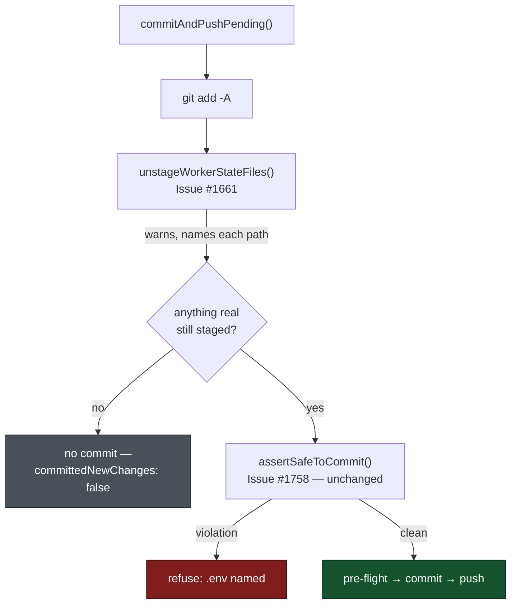

# Unstage worker-owned state files before the pre-commit gate

## Summary

`commitAndPushPending()` stages everything with `git add -A`, so any of the
worker's own state files sitting in the clone — `.heartbeat_<owner>_<repo>_<n>`,
`.heartbeat-marker_<owner>_<repo>_<n>`, `.vibe_default_branch` — went into the
index and the pre-commit safety gate (Issue #1758) refused the **whole** commit.
A genuine merge-conflict resolution was lost over a file the worker itself
dropped there.

This stages with intent instead. A new `worker/deno/lib/worker_state_paths.ts`
defines the three shapes and one strict matcher; the chokepoint unstages
matching paths **between** `git add -A` and `assertSafeToCommit()`, warning by
name for each one. The gate never sees them and is left completely unchanged —
`.env`, `credentials.json` and every other hidden or secret-bearing path are
still refused with the identical #1758 message, and the allowlist does not grow.
When everything pending was worker state, the index is empty afterwards, so no
commit is attempted and the result reports that honestly rather than failing on
git's "nothing added to commit".

`heartbeat_storage.ts` now builds its paths from the same two prefix constants,
so the writers and the matcher cannot drift apart.

Closes #1661.

## Evidence

Backend-only change — no web interface to screenshot. The evidence is the test
suite: three chokepoint tests driving a real git clone against a real bare
upstream, plus the matcher's own unit tests.

Gate: `./quality.sh < /dev/null` — **PASSED** (`config integration` skipped, as
it is on every run without live credentials).

## Reproduction

- **symptom** — a clone carrying the worker's own `.heartbeat_*`,
  `.heartbeat-marker_*` and `.vibe_default_branch` files could not commit at
  all: `git add -A` staged them and the #1758 gate refused the entire commit,
  naming all three, so the real change never landed.
- **status** — `verified` — all three new chokepoint tests were run against the
  unfixed `commitAndPushPending` and failed with
  `Pre-commit safety gate refused commit (Issue #1758): … .heartbeat-marker_…,
  .heartbeat_…, .vibe_default_branch`, then passed after the fix
  (`ok | 12 passed | 0 failed`).
- **regression test** —
  `worker/deno/tests/commit_and_push_pending_test.ts::commitAndPushPending - unstages worker state files and still commits the real change (Issue #1661)`

## Acceptance Criteria

<!-- vibe-spec-review inputs="diff+issue-body" -->

- **met** — a commit from a clone carrying all three worker state files
  succeeds and contains none of them; a warning names each unstaged path —
  evidence: `worker/deno/tests/commit_and_push_pending_test.ts::commitAndPushPending - unstages worker state files and still commits the real change (Issue #1661)`
  — reviewer: met
- **met** — a genuinely hidden or secret-bearing staged file is still refused
  with the unchanged #1758 message — evidence:
  `worker/deno/tests/commit_and_push_pending_test.ts::commitAndPushPending - still refuses a staged secret when worker state is present (Issue #1661)`
  — reviewer: met
- **met** — `hidden_allowlist_drift_test.ts` and `pre_commit_safety_test.ts`
  pass unchanged; the allowlist does not grow — evidence: neither those tests
  nor `pre_commit_safety.ts` / `ALLOWED_HIDDEN_PATHS` /
  `REQUIRED_GITIGNORE_PATTERNS` appear in the diff; the reviewer ran all three
  suites, 57 passed — reviewer: met
- **met** — test (a) fails against the unfixed `commitAndPushPending` and
  passes after; the PR summary states that linkage — evidence: the reviewer
  restored `git_push.ts` to `61f2723` and watched all three new tests fail with
  the #1758 refusal, then pass with the fix; the linkage is stated in the
  `## Reproduction` block above — reviewer: partial — reason: the reviewer
  verified the behavioural half but saw the linkage only in an untracked
  summary file, so it was not yet in the diff it reviewed; this file is
  committed in the same PR, which closes that half.
- **met** — `./quality.sh < /dev/null` passes — evidence: run to completion
  after the final edit, `Result: PASSED (with skipped checks)` — reviewer: met
- **unrequested** — `docs/audits/security-sweep-1661-worker-state-paths.md` and
  sweep slice `12j` in `docs/audits/lib-sweep-coverage.json` —
  reviewer: unrequested — reason: not asked for, but forced —
  `lib_sweep_coverage_test.ts` fails for any new `worker/deno/lib/` module until
  it is claimed by a slice with a written record; the reviewer reverted the JSON
  and confirmed the failure.
- **unrequested** — the `docs/CONFIGURATION.md` pre-flight diagram and prose —
  reviewer: unrequested — reason: raised by the Standards reviewer, not the
  issue; that diagram describes this exact chokepoint sequence and was left
  stale by the new step, which the "a code change owes a docs change" standard
  forbids.
- **unrequested** — `docs/MERGE.md` and `SECURITY.md` carry a short paragraph
  each where the issue asked for "one line" — reviewer: unrequested —
  reason: volume only; the content is what the issue asked for, in the two
  places it named.

The reviewer also noted that `UnstageWorkerStateResult.unstaged` was populated
but never read — dead output, removed in `8fc04d6`'s follow-up commit. Its
remaining note stands: nothing in the diff *tests* `git reset --` on an unborn
`HEAD`; that was confirmed by hand (git 2.47.3, exit 0, other paths left
staged) and recorded as a comment at `worker/deno/lib/git_push.ts:479`, because
reaching an unborn HEAD through this chokepoint would need a repo with no
commits and no upstream to push to.

## Standards Review

<!-- vibe-standards-review inputs="diff+CODING-STANDARDS.md" -->

- **violation** — DRY: the test suite re-implemented the shared `console.warn`
  capture helper — evidence: `worker/deno/tests/commit_and_push_pending_test.ts:473`
  — reason: fixed here; the suite now imports `capturingWarningsAsync` from
  `tests/support/warnings.ts` and the local copy is gone.
- **violation** — a code change owes a docs change: the pre-flight chokepoint's
  Mermaid sequence and its prose still showed `git add -A → assertSafeToCommit()`
  with no unstaging step and no skip branch — evidence:
  `docs/CONFIGURATION.md:3727` — reason: fixed here; the diagram now shows the
  unstage step and the "nothing real staged → no commit" branch, and the prose
  says pre-flight is skipped in that case.
- **violation** — a comment described the branch it was not annotating (it read
  as the "nothing to commit" case while sitting on the `remainingStaged > 0`
  guard) — evidence: `worker/deno/lib/git_push.ts:614` — reason: fixed here;
  reworded to describe the guard it sits on.
- **violation** — the PR summary file was absent — evidence:
  `docs/archive/pr-summaries/pr-summary-1661.md` — reason: fixed here; this file.
- **clean** — Australian English throughout; Deno-native tooling only, no Node
  files added; module/test pairing for the new module; happy-path, error-path
  and edge-case coverage on both new surfaces; tests call real code against a
  real git repo with no source-text greps; no wall-clock assertions, sleeps or
  ambient host state; parallel-safe (the `console.warn` swap is restored in
  `finally`); fail-loud (a non-zero `git reset` is converted to an explicit
  error, never swallowed); `ALLOWED_HIDDEN_PATHS`, `FORBIDDEN_STAGED_PATTERNS`
  and `REQUIRED_GITIGNORE_PATTERNS` genuinely untouched; commit messages carry
  the issue reference and the `Vibe-Coder-Run-Id` trailer.

The reviewer also raised two non-blocking notes: `git diff --cached` now runs
twice per commit (the unstage pass, then the gate re-reading the changed index —
one extra subprocess, and re-reading is required for correctness), and the
error-path `git reset --` discards its exit code exactly as the two pre-existing
sibling calls beside it do, with an error returned regardless. Both stand.

## Test Plan

Added `worker/deno/tests/worker_state_paths_test.ts`:

- `isWorkerStatePath - matches the worker's own state files` — the three shapes,
  including repo names carrying dashes and dots.
- `isWorkerStatePath - matches the paths the writers actually produce` — calls
  the real `heartbeatFilePath` / `markerStateFilePath` and matches their output,
  so the writers and the matcher cannot drift apart.
- `isWorkerStatePath - rejects nested, truncated and unrelated paths` — nested
  (`.heartbeat_x_1/notes.txt`, `foo/.vibe_default_branch`), truncated
  (`.heartbeat_x`, `.heartbeat_x_`, `.heartbeat_x_12a`), near-misses
  (`.vibe_default_branch.bak`), secrets (`.env`, `credentials.json`), the empty
  string, `.`/`..`, and non-ASCII (`.heartbeat_ownér_repo_1`, Arabic-Indic
  digits).

Added to `worker/deno/tests/commit_and_push_pending_test.ts` (each drives the
real chokepoint against a real clone of a real bare upstream):

- `commitAndPushPending - unstages worker state files and still commits the real change (Issue #1661)`
  — all three files untracked and unignored plus a real change: result `ok`,
  `git show --name-only HEAD` lists `feature.txt` and none of the three, all
  three still on disk, and a warning names each unstaged path. **This is the
  test that fails against the unfixed `commitAndPushPending` and passes after.**
- `commitAndPushPending - still refuses a staged secret when worker state is present (Issue #1661)`
  — the same clone plus `.env`: still refused with the unchanged
  `Issue #1758` message naming `.env` and naming none of the three, and nothing
  pushed.
- `commitAndPushPending - makes no commit when only worker state is pending (Issue #1661)`
  — nothing but the three files: `ok`, `committedNewChanges: false`,
  `commitsPushed: 0`, HEAD unmoved, index empty, files still on disk.

Unchanged and still passing: `pre_commit_safety_test.ts` (17),
`hidden_allowlist_drift_test.ts` (5), the heartbeat suites (50), and
`lib_sweep_coverage_test.ts` after registering the new module as sweep slice 12j
with its written record.
