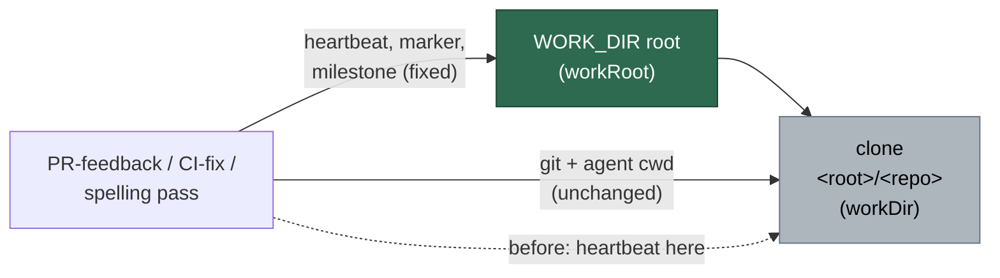

# Point the PR-feedback, CI-fix and spelling heartbeats at the work root

## Summary

The PR-feedback, CI-fix and spelling passes each handed `startHeartbeat` the
**clone** `setupRepo` returns, so `.heartbeat_*` and `.heartbeat-marker_*` were
written into the repo checkout — dirtying the tree the pass then commits, and
hiding the PR heartbeat from stuck recovery (`stuck_recovery.ts:463,1034`) and
the prune liveness check, both of which read the work root. The CI pass pointed
`crashHandling.recordMilestone` at the clone for the same reason.

Each processor's deps now carry a required `workRoot` — the same field name and
shape the merge-conflict pass took in #1660 — and the heartbeat, marker and
(CI) milestone calls use it. `workDir` stays the clone for every git and agent
`cwd`. The `?? Deno.env.get("WORK_DIR") ?? "/tmp"` fallbacks that fed the
heartbeat are gone: a missing root is now a type error at every construction
site rather than state quietly landing in `/tmp`.

Closes #1662.

### Spelling pass — production does pass the clone

The issue asked to check the spelling processor's production wiring and fix it
here only if production passes the clone there too. It does, at two sites:
`run_core_production_deps.ts:1677` (`processSpellingFailure` receives
`workDir: repoWorkDir` from `setupRepo` at line 1643) and
`commands/pr_spelling_processor.ts:176`. It is therefore fixed in this PR.

The issue's line map named two `processCiFailure` call sites in
`run_core_production_deps.ts`; there is one (now line 1781). The site at
~1660-1674 is `processSpellingFailure`. The three wiring edits here are the
three sites the issue meant.

## Evidence

Backend change with no web interface to screenshot. The evidence is the three
regression tests below, each observed failing against the unfixed processor,
plus the full gate:

- `./quality.sh < /dev/null` — **PASSED** (all checks; `config integration`
  skipped by the gate itself, as on the base branch).
- `deno test` across the 17 affected suites — 141 passed, 0 failed.

## Reproduction

- **symptom** — a PR-feedback, CI-fix or spelling run wrote `.heartbeat_<repo>_<pr>`
  and `.heartbeat-marker_<repo>_<pr>` into the repo clone instead of the work
  root, so the files dirtied the tree the pass commits and stuck recovery and
  the prune liveness check — which read the root — never saw the heartbeat.
- **status** — `verified` — each regression test was observed failing against
  the unfixed processor (with the heartbeat pointed back at
  `processorDeps.workDir ?? "/tmp"`, the assertion reports the clone temp dir
  where the work-root temp dir was expected) and passing after the fix. The CI
  case was additionally checked with only `recordMilestone` reverted, and still
  fails — the milestone assertion is independently sensitive.
- **regression test** —
  `worker/deno/tests/pr_feedback_processor_test.ts::processPrFeedback - the heartbeat state lands in the work root, not the clone (Issue #1662)`,
  `worker/deno/tests/pr_ci_processor_test.ts::processCiFailure - the heartbeat and milestone state land in the work root, not the clone (Issue #1662)`,
  `worker/deno/tests/pr_spelling_processor_test.ts::processSpellingFailure - the heartbeat state lands in the work root, not the clone (Issue #1662)`

## Acceptance Criteria

<!-- vibe-spec-review inputs="diff+issue-body" -->

- **met** — PR-feedback and CI-fix runs call `recordHeartbeat`, `clearHeartbeat`
  and (CI) `recordMilestone` with the work root; the clone gains no
  `.heartbeat_*` / `.heartbeat-marker_*` — evidence: `worker/deno/lib/pr_feedback_processor.ts:343`,
  `worker/deno/lib/pr_ci_processor.ts:532` and `:588`,
  `worker/deno/lib/pr_spelling_processor.ts:216`, wired at
  `worker/deno/lib/run_core_production_deps.ts:1575,1680,1781` and
  `worker/deno/commands/pr_{ci,feedback,spelling}_processor.ts`; each test
  asserts the clone holds no stray state — reviewer: met
- **met** — each new test fails against the unfixed processor and passes after;
  the PR summary states that linkage — evidence: the `## Reproduction` block
  above states it, per test — reviewer: partial — reason: the reviewer saw the
  diff before this summary file existed and marked the linkage statement
  absent; it is present here, and the fail-before behaviour was re-verified by
  hand-reverting each fix
- **met** — gate, allowlist and `hidden_allowlist_drift_test.ts` untouched —
  evidence: `git diff --name-only` lists only the 7 source files, 17 test files
  and 2 new test modules; nothing matching `allowlist|gate|quality|hidden` —
  reviewer: met
- **met** — `./quality.sh < /dev/null` passes — evidence: full gate run after the
  final edit, `Result: PASSED` — reviewer: missing — reason: the reviewer had
  the diff only and could not run the gate; it was run here and passed
- **unrequested** — the spelling processor and its wiring
  (`worker/deno/lib/pr_spelling_processor.ts`, `run_core_production_deps.ts:1680`,
  `commands/pr_spelling_processor.ts`) — reviewer: unrequested — reason: the
  issue made it conditional on production passing the clone there, which it
  does (see above), so the condition is satisfied rather than exceeded
- **unrequested** — the three `worker/deno/commands/pr_*_processor.ts` entry
  points — reviewer: unrequested — reason: a second production path that also
  passes the clone as `workDir`; a required `workRoot` cannot compile without
  them, and leaving them on the old fallback would keep the bug alive on the
  CLI route
- **unrequested** — `worker/deno/tests/support/heartbeat_placement.ts` and its
  test — reviewer: unrequested — reason: the recorder stub and stray scan are
  needed by all three suites, so they are written once rather than three times;
  the helper carries its own tests so an always-empty scan cannot silently pass
  the suites
- **unrequested** — a `workRoot` line added to the existing deps literals in 13
  other test files — reviewer: unrequested — reason: compile fallout from the
  required field; no assertion or behaviour changed in any of them

## Standards Review

<!-- vibe-standards-review inputs="diff+CODING-STANDARDS.md" -->

- **violation** — the PR summary file was missing — evidence:
  `docs/archive/pr-summaries/pr-summary-1662.md` — reason: fixed here; this file
  is that summary
- **violation** — the wiring comment claimed "heartbeat, marker and milestone"
  at the PR-feedback and spelling sites, neither of which records milestones —
  evidence: `worker/deno/lib/run_core_production_deps.ts:1573` and `:1678` —
  reason: fixed in this diff; the two now say "heartbeat and marker", and the CI
  command wrapper's comment gained the milestone it does record
- **violation** — `heartbeatStrays`' non-empty branch was never exercised, so a
  helper that always returned `[]` would keep all three suites green — evidence:
  `worker/deno/tests/support/heartbeat_placement.ts:55` — reason: fixed in this
  diff by `worker/deno/tests/heartbeat_placement_test.ts`, which asserts the scan
  finds planted state, ignores unrelated files, and reports none when there is
  none
- **clean** — Australian English throughout; fail-loud improved (a required
  `workRoot` replaces the `/tmp` fallback, and the awaited initial record still
  returns early on failure); tests drive the real processors and assert on
  observable placement rather than grepping source; new tests create and remove
  their own temp dirs with no env or cwd mutation; no hidden paths staged; the
  `workRoot` JSDoc matches the #1660 precedent rather than drifting from it

### Noted, not fixed here

Both reviewers flagged a pre-existing bug in the same files: `repoDir` for
`readRepoContext` is built as `<workDir>/<repoName>` while production passes the
clone, so it resolves to `<root>/<repo>/<repo>` and `CLAUDE.md`/`AGENTS.md` is
silently never injected — on all four PR-kind passes, including merge-conflict.
It is outside this issue's scope (heartbeat placement) and is filed as #1673
with the affected lines and a fail-loud note.

## Test Plan

Added:

- `worker/deno/tests/pr_feedback_processor_test.ts` — "the heartbeat state lands
  in the work root, not the clone (Issue #1662)": drives `processPrFeedback` with
  separate clone and work-root temp dirs and a recorder that writes the same two
  state files the real one does; asserts both `recordHeartbeat` and
  `clearHeartbeat` were handed the root, the files exist under it, and the clone
  holds no stray state.
- `worker/deno/tests/pr_ci_processor_test.ts` — the same for `processCiFailure`,
  plus every `recordMilestone` call being handed the root.
- `worker/deno/tests/pr_spelling_processor_test.ts` — the same for
  `processSpellingFailure`.
- `worker/deno/tests/heartbeat_placement_test.ts` — three cases covering the new
  shared helper: the scan names planted heartbeat and marker files, ignores
  unrelated files, reports none for a clean directory, and the recorder stub
  records the directory it was given.

Modified: a `workRoot` line added to the processor-deps literals in 13 existing
suites (compile fallout from the required field — no assertions changed).
