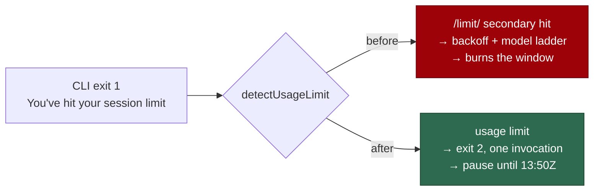

# Recognise the CLI's "session limit" wording as a subscription usage limit

## Summary

The Claude CLI now refuses with `You've hit your session limit · resets 1:50pm
(UTC)`. `USAGE_LIMIT_RE` in `worker/deno/lib/claude_executor.ts` only accepted
`your (usage )?limit`, so that line fell through to the secondary rate-limit
pattern (`/limit/`) and drove the short-backoff-plus-model-fallback ladder
against an already-exhausted subscription window, while the cycle health check
reported it as unrecognised output.

Extending the alternative to `your (usage |session )?limit` classifies the line
as a usage limit everywhere the detector is consulted — `detectUsageLimit`,
`summariseHealthFailure`, and the terminal usage-limit branch in
`runClaudeWithRetry` — so the run stops spending, carries the parsed reset, and
writes the durable pause signal instead of retrying. Every existing alternative
is preserved. Closes #1665.

## Evidence

Backend/CLI change with no web interface to screenshot. The evidence is the
test run: the three suites named below were run against the unfixed regex (4
failures) and after the fix (28 passed, 0 failed), and `./quality.sh` passed in
full (`config integration` skipped — environment-gated, unrelated).



## Reproduction

- **symptom** — the CLI's `You've hit your session limit · resets 1:50pm (UTC)`
  refusal was not recognised as a subscription usage limit, so the run walked
  the short-backoff / model-fallback ladder and the health check called it
  unrecognised output
- **status** — `verified` — the three new cases were observed failing against
  the unfixed `USAGE_LIMIT_RE` (`detectUsageLimit` returned `false`,
  `summariseHealthFailure` returned a non-`usage-limit` category, the runner
  case failed) and passing after the one-token regex change
- **regression test** —
  `worker/deno/tests/usage_limit_detection_test.ts::usage limit - the CLI's 'session limit' line is a usage limit, not the rate-limit ladder (Issue #1665)`

## Acceptance Criteria

<!-- vibe-spec-review inputs="diff+issue-body" -->

- **met** — the line, in a CLI exit-1 tail, yields `detectUsageLimit === true`
  and is not a primary rate-limit match — evidence:
  `worker/deno/tests/usage_limit_detection_test.ts::usage limit - the CLI's 'session limit' line is a usage limit, not the rate-limit ladder (Issue #1665)`
  — reviewer: met
- **met** — `summariseHealthFailure(1, line, "")` returns
  `category: "usage-limit"` — evidence:
  `worker/deno/tests/claude_health_message_test.ts::summariseHealthFailure - the CLI's 'session limit' line on stdout is a usage limit, not unrecognised output (Issue #1665)`
  — reviewer: met
- **met** — `runClaudeWithRetry` returns `exitCode: 2` after exactly one
  invocation, `usageLimit.resetEpochMs` reading 13:50 UTC, no `RATE_LIMIT`
  security-log line — evidence:
  `worker/deno/tests/claude_runner_usage_limit_test.ts::runClaudeWithRetry - the CLI's 'session limit' refusal is terminal with its reset carried (Issue #1665)`
  — reviewer: met
- **met** — existing usage-limit and rate-limit tests still pass; the
  repository quality gate passes — evidence: 28 passed / 0 failed across the
  three suites, and `./quality.sh` reported `PASSED` — reviewer: met
- **partial** — the runner test pins the
  `Claude usage limit reached (subscription window)` wording named in the "What
  Needs to Be Done" bullet — evidence:
  `worker/deno/tests/claude_runner_usage_limit_test.ts` (`errors` capture) —
  reviewer: partial — reason: the reviewer saw the diff before that assertion
  was added; it was added in response and now asserts the literal string.
- **unrequested** — `docs/TROUBLESHOOTING.md` paragraph reflow around the added
  phrase — reviewer: unrequested — reason: the added phrasing pushed the bullet
  past the file's ~76-column wrap, so the surrounding lines rewrap; no content
  change.
- **unrequested** — the four-line comment above `USAGE_LIMIT_RE` recording why
  `session limit` was added — reviewer: unrequested — reason: the constant's
  doc comment already explains each alternative; leaving the new one
  unexplained would break that pattern.
- **unrequested** — `withUsageLimitStub` now routes the stub message through
  the existing `posixSingleQuote` — reviewer: unrequested — reason: the new
  fixture contains an apostrophe (`You've`), which would otherwise break the
  stub's single-quoted `printf`.
- **unrequested** — the extra positive assertion that a `USAGE_LIMIT` security
  tag *is* emitted, and the capturing logger that observes it — reviewer:
  unrequested — reason: asserting only the absence of `RATE_LIMIT` would pass
  if no branch ran at all; the positive tag makes the negative meaningful.

## Standards Review

<!-- vibe-standards-review inputs="diff+CODING-STANDARDS.md" -->

- **violation** — the PR summary required by CODING-STANDARDS.md was absent
  from the diff — evidence: `docs/archive/pr-summaries/pr-summary-1665.md` —
  reason: fixed here; this file is the summary.
- **violation** — DRY: the test added a local shell quoter byte-identical to
  `posixSingleQuote` — evidence:
  `worker/deno/tests/claude_runner_usage_limit_test.ts:30` (as reviewed) —
  reason: fixed in this diff; the helper now imports
  `posixSingleQuote` from `worker/deno/lib/shell_quote.ts`.
- **violation** — redundant non-null assertion after an `assert()` that already
  narrows — evidence: `worker/deno/tests/claude_runner_usage_limit_test.ts:223`
  (as reviewed) — reason: fixed in this diff; the `!` was removed.
- **violation** — the explicit-zone parse test is tagged `(Issue #1665)` but
  stays green against the unfixed regex, so it is not a regression test —
  evidence: `worker/deno/tests/usage_limit_detection_test.ts:92` — reason:
  stands. The issue explicitly asked to "confirm `parseUsageLimitReset`
  resolves `resets 1:50pm (UTC)` … add a test pinning it if none does"; it is a
  requested pin on pre-existing behaviour, not a claimed regression, and the
  three cases above are the regression coverage.
- **clean** — Australian English throughout; single source of truth for the
  detector (all four consumers route through `detectUsageLimit`); the only doc
  enumerating the vocabulary was updated; tests call real functions with an
  injected `fakeClock()` and a named temp `workDir`, no sleeps and no ambient
  env; commit messages carry the issue reference and the
  `Vibe-Coder-Run-Id` trailer.

## Test Plan

- `worker/deno/tests/usage_limit_detection_test.ts` — the exact CLI line added
  to the recognised-vocabulary fixture list; a case asserting
  `detectUsageLimit === true` with `detectRateLimit(...).isPrimary === false`;
  a case pinning `resets 1:50pm (UTC)` to 13:50 UTC with a non-UTC host zone.
- `worker/deno/tests/claude_health_message_test.ts` — the line as stdout with
  exit 1 → `category === "usage-limit"` and the message naming the evidence.
- `worker/deno/tests/claude_runner_usage_limit_test.ts` — a stub CLI exiting 1
  with the line → `exitCode: 2`, exactly one invocation (no model fallback),
  `usageLimit.resetEpochMs` reading 13:50 UTC, a `USAGE_LIMIT` and no
  `RATE_LIMIT` security tag, and the
  `Claude usage limit reached (subscription window)` error logged.

Run with:

```bash
cd worker/deno && deno test --allow-all \
  tests/usage_limit_detection_test.ts \
  tests/claude_health_message_test.ts \
  tests/claude_runner_usage_limit_test.ts < /dev/null
```
