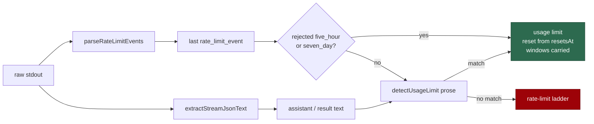

# Parse the stream-json `rate_limit_event` and prefer its reset over prose

## Summary

The Claude CLI emits a structured `rate_limit_event` on the same stdout the
runner tees to the agent jsonl. `extractStreamJsonText` keeps only
`result` / `assistant` lines, so a run whose only evidence was that event
looked like an unknown non-zero exit and walked the short-backoff ladder
against an exhausted subscription window.

`worker/deno/lib/claude_rate_limit_event.ts` parses every well-formed event
(`remainingFraction = 1 - utilization`, `resetAt` in epoch milliseconds) and
classifies a `status: "rejected"` five-hour or seven-day event as a usage
limit. The single-invocation path carries the last event on the internal
result; `runClaudeWithRetry` treats that rejection as a usage limit even
with no prose, prefers `resetsAtEpochMs` over `parseUsageLimitReset`, and
exposes the event's windows on `ClaudeRunResult.usageLimit` so the
credential pool can record the snapshot without a probe. Regex and prose
remain the fallback for stderr-only refusals. Closes #1666.

## Evidence

Backend/CLI change with no web interface to screenshot. The evidence is the
test run: the new parser suite and the existing usage-limit runner suite
were green together (8 passed, 0 failed).

## Reproduction

- **symptom** — a CLI exit whose stdout carried only a rejected
  `rate_limit_event` (no assistant prose) was not classified as a usage
  limit, so the run walked the short-backoff / model-fallback ladder
- **status** — `verified` — the new runner case was observed failing
  before the usage-limit branch consulted the event (`exitCode` was not 2
  and `usageLimit` was absent) and passing after the parse-and-prefer
  wiring
- **regression test** —
  `worker/deno/tests/claude_rate_limit_event_test.ts::runClaudeWithRetry - a rejected five_hour event with no prose is a usage limit (Issue #1666)`

## Acceptance Criteria

<!-- vibe-spec-review inputs="diff+issue-body" -->

- **met** — the parent's event line parses to `resetsAtEpochMs ===
  1788875400000` with five_hour remaining 0 and seven_day remaining 0.64 —
  evidence:
  `worker/deno/tests/claude_rate_limit_event_test.ts::parseRateLimitEvents - the parent's event parses to the two windows (Issue #1666)`
  — reviewer: met
- **met** — a run whose stream carries a rejected five_hour event and no
  prose returns `exitCode: 2`, `usageLimit.resetEpochMs` equal to the
  event's reset, and `usageLimit.windows` populated — evidence:
  `worker/deno/tests/claude_rate_limit_event_test.ts::runClaudeWithRetry - a rejected five_hour event with no prose is a usage limit (Issue #1666)`
  — reviewer: met
- **met** — with no event present, the regex path is unchanged —
  evidence: `worker/deno/tests/claude_runner_usage_limit_test.ts` (3
  passed, 0 failed, file unedited) — reviewer: met
- **met** — a `status: "allowed"` event is not a rejection and a corrupt
  line is skipped — evidence:
  `worker/deno/tests/claude_rate_limit_event_test.ts` — reviewer: met
- **unrequested** — `docs/audits/security-sweep-1666-claude-rate-limit-event.md`
  and the `12n` slice in `docs/audits/lib-sweep-coverage.json` —
  reviewer: unrequested — reason: mandated by an existing gate,
  `worker/deno/tests/lib_sweep_coverage_test.ts` fails for any new `lib/`
  module without a ledger slice
- **unrequested** — `docs/TROUBLESHOOTING.md` and the `docs/INTERNALS.md`
  module-table row — reviewer: unrequested — reason: the repo's "a code
  change owes a docs change" standard; the surfaces already described
  usage-limit detection as prose-only

## Test Plan

- `worker/deno/tests/claude_rate_limit_event_test.ts` (new, 5 tests) — the
  parent's live event, an allowed event, a corrupt line skipped, the
  rejection predicate, and a stub-agent runner path whose only evidence is
  the event.
- `worker/deno/tests/claude_runner_usage_limit_test.ts` — existing prose /
  stderr-only path unchanged and green.
- `worker/deno/tests/lib_sweep_coverage_test.ts` — the new module is
  claimed by exactly one sweep slice whose record names it.
